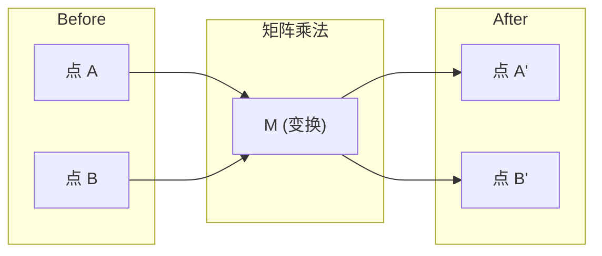
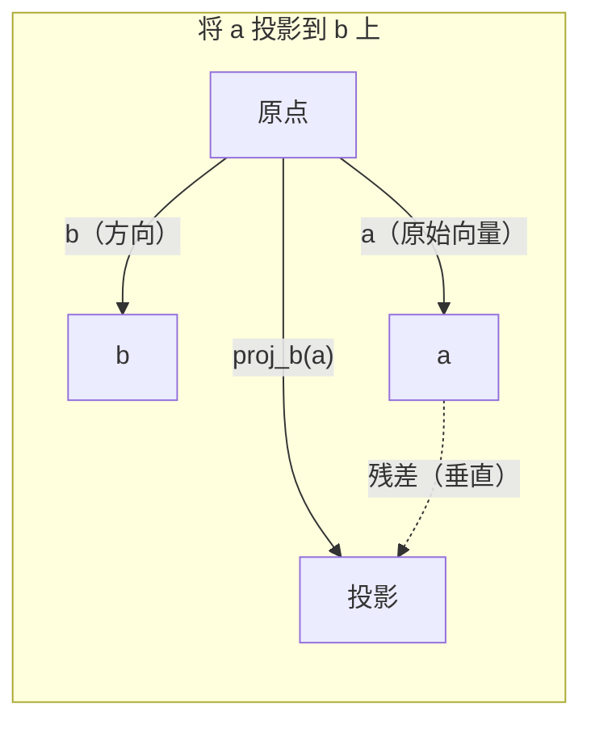

# 线性代数直觉（Linear Algebra Intuition）

> 每个AI模型都只是穿了一件漂亮外衣的矩阵运算。

**类型：** 学习
**语言：** Python, Julia
**前置要求：** 阶段 0
**预计时间：** ~60 分钟

## 学习目标（Learning Objectives）

- 用 Python 从零实现向量和矩阵运算（加法、点积、矩阵乘法）
- 从几何角度解释点积（Dot Product）、投影（Projection）和 Gram-Schmidt 过程的作用
- 通过行化简（Row Reduction）判断线性无关性（Linear Independence）、秩（Rank）和基（Basis）
- 将线性代数概念与AI应用联系起来：嵌入（Embedding）、注意力分数（Attention Scores）和 LoRA

## 问题

翻开任何一篇机器学习论文，在第一页你就会看到向量、矩阵、点积和变换。如果没有线性代数直觉，这些就只是符号而已。但有了它，你就能看清神经网络实际上在做什么——在空间中移动点。

你不需要成为数学家。你只需要理解这些运算的几何含义，然后自己动手编码实现。

## 概念（The Concept）

### 向量就是点（和方向）

向量就是一串数字。但这些数字是有含义的——它们是空间中的坐标。

**2D 向量 [3, 2]：**

| x | y | 点（Point） |
|---|---|-------|
| 3 | 2 | 该向量从原点 (0,0) 指向平面上的 (3, 2) |

该向量的长度为 $\sqrt{3^2 + 2^2} = \sqrt{13}$，指向右上方。

在AI中，向量表示一切：
- 一个词 → 一个包含 768 个数字的向量（它在嵌入空间中的"含义"）
- 一张图片 → 一个包含数百万个像素值的向量
- 一个用户 → 一个偏好向量

### 矩阵就是变换

一个矩阵将一个向量变换为另一个向量。它可以旋转、缩放、拉伸或投影。



在AI中，矩阵就是模型本身：
- 神经网络权重 → 将输入变换为输出的矩阵
- 注意力分数 → 决定关注什么的矩阵
- 嵌入矩阵 → 将单词映射为向量的矩阵

### 点积衡量相似度

两个向量的点积告诉你它们有多相似。

$$
a \cdot b = a_1 \times b_1 + a_2 \times b_2 + \cdots + a_n \times b_n
$$

- 方向相同：$a \cdot b > 0$（相似）
- 垂直：$a \cdot b = 0$（不相关）
- 方向相反：$a \cdot b < 0$（相反）

这正是搜索引擎、推荐系统和 RAG 的工作原理——找到点积高的向量。

### 线性无关（Linear Independence）

如果集合中没有向量可以表示为其他向量的组合，则这些向量线性无关。如果 $v_1, v_2, v_3$ 线性无关，它们张成一个三维空间。如果其中之一是其他向量的组合，它们只能张成一个平面。

为什么这对AI至关重要：你的特征矩阵（Feature Matrix）应该具有线性无关的列。如果两个特征完全相关（线性相关），模型无法区分它们的效果。这会导致回归中的多重共线性（Multicollinearity）——权重矩阵变得不稳定，微小的输入变化会产生剧烈的输出波动。

**具体示例：**

```
v1 = [1, 0, 0]
v2 = [0, 1, 0]
v3 = [2, 1, 0]   # v3 = 2*v1 + v2，是前两个向量的线性组合
```

$v_1$ 和 $v_2$ 线性无关——没有一个可以表示为另一个的标量倍或组合。但 $v_3 = 2v_1 + v_2$，所以 $\{v_1, v_2, v_3\}$ 是一个线性相关集。这三个向量都位于 xy 平面内。无论如何组合它们，都无法到达 $[0, 0, 1]$。你有三个向量，却只有两个维度的自由度。

在数据集中：如果特征 3 = 2 × 特征 1 + 特征 2，添加特征 3 不会给模型带来任何新信息。更糟的是，它会使正规方程（Normal Equations）奇异——权重不存在唯一解。

### 基（Basis）与秩（Rank）

基是张成全空间的最小线性无关向量集。基向量的个数就是空间的维度。

三维空间的标准基是 $\{[1,0,0], [0,1,0], [0,0,1]\}$。但三维空间中的任意三个线性无关向量都可以构成一个有效的基。基的选择就是坐标系的选择。

矩阵的秩 = 线性无关的列数 = 线性无关的行数。如果秩 $<$ `min(行, 列)`，则矩阵是欠秩（Rank-Deficient）的。这意味着：
- 系统有无穷多解（或无解）
- 变换过程中信息丢失
- 矩阵不可逆

| 情况 | 秩 | 对机器学习（ML）的意义 |
|-----------|------|---------------------|
| 满秩（rank = min(m, n)） | 最大值 | 存在唯一的最小二乘解。模型条件良好。 |
| 欠秩（rank < min(m, n)） | 低于最大值 | 特征冗余。存在无穷多个权重解。需要正则化（Regularization）。 |
| 秩 1 | 1 | 每一列都是一个向量的缩放副本。所有数据位于一条直线上。 |
| 近似欠秩（奇异值很小） | 数值上为低秩 | 矩阵病态。微小的输入噪声会导致巨大的输出变化。需要使用 SVD 截断或岭回归（Ridge Regression）。 |

### 投影（Projection）

将向量 $a$ 投影到向量 $b$ 上，得到 $a$ 在 $b$ 方向上的分量：

$$
\text{proj}_b(a) = \frac{a \cdot b}{b \cdot b} \cdot b
$$

残差 ($a - \text{proj}_b(a)$) 垂直于 $b$。这种正交分解（Orthogonal Decomposition）是最小二乘拟合的基础。

投影在机器学习中无处不在：
- 线性回归（Linear Regression）最小化观测值到列空间的距离——解本身就是一个投影
- 主成分分析（PCA）将数据投影到最大方差方向
- Transformer 中的注意力机制计算查询（Query）对键（Key）的投影



**示例：** $a = [3, 4], b = [1, 0]$

$$
\text{proj}_b(a) = \frac{3 \times 1 + 4 \times 0}{1 \times 1 + 0 \times 0} \cdot [1, 0] = 3 \cdot [1, 0] = [3, 0]
$$

投影丢弃了 y 分量。这就是最简单形式的降维（Dimensionality Reduction）——舍弃你不关心的方向。

### Gram-Schmidt 过程

将任意一组线性无关向量转换为标准正交基（Orthonormal Basis）。标准正交意味着每个向量长度为 1，且每对向量相互垂直。

算法步骤：
1. 取第一个向量，归一化
2. 取第二个向量，减去它在第一个向量上的投影，归一化
3. 取第三个向量，减去它在之前所有向量上的投影，归一化
4. 对剩余向量重复

输入：$v_1, v_2, v_3, \ldots$（线性无关）

$$
\begin{aligned}
u_1 &= v_1 / |v_1| \\[15pt]
w_2 &= v_2 - (v_2 \cdot u_1) \cdot u_1 \\
u_2 &= w_2 / |w_2| \\[15pt]
w_3 &= v_3 - (v_3 \cdot u_1) \cdot u_1 - (v_3 \cdot u_2) \cdot u_2 \\
u_3 &= w_3 / |w_3|
\end{aligned}
$$

输出：$u_1, u_2, u_3, \ldots$（标准正交基）

这就是 QR 分解的内部原理。Q 是标准正交基，R 记录投影系数。QR 分解用于：
- 求解线性方程组（比高斯消元更稳定）
- 计算特征值（QR 算法）
- 最小二乘回归（标准的数值计算方法）

## 动手实现（Build It）

### 第 1 步：从零实现向量（Python）

```python
class Vector:
    def __init__(self, components):
        # 将输入元素转换为列表，并记录向量的维度
        self.components = list(components)
        self.dim = len(self.components)

    def __add__(self, other):
        # 向量加法：对应分量分别相加，几何上对应平移操作
        return Vector([a + b for a, b in zip(self.components, other.components)])

    def __sub__(self, other):
        # 向量减法：对应分量相减，结果是从 other 指向 self 的向量
        return Vector([a - b for a, b in zip(self.components, other.components)])

    def dot(self, other):
        # 点积：对应分量相乘后求和——衡量两个向量在方向上的对齐程度
        return sum(a * b for a, b in zip(self.components, other.components))

    def magnitude(self):
        # 向量长度（L2 范数）：sqrt(x1^2 + x2^2 + ...)，即从原点到点的距离
        return sum(x**2 for x in self.components) ** 0.5

    def normalize(self):
        # 归一化：除以长度得到单位向量，保留方向而去掉尺度信息
        mag = self.magnitude()
        return Vector([x / mag for x in self.components])

    def cosine_similarity(self, other):
        # 余弦相似度：两个向量夹角的余弦值，值域 [-1, 1]。
        # 1 表示方向完全相同，0 表示垂直（无关），-1 表示方向完全相反。
        # 在 RAG 和语义搜索中用于衡量文本向量的语义相似度。
        return self.dot(other) / (self.magnitude() * other.magnitude())

    def __repr__(self):
        return f"Vector({self.components})"


a = Vector([1, 2, 3])
b = Vector([4, 5, 6])

print(f"a + b = {a + b}")
print(f"a · b = {a.dot(b)}")
print(f"|a| = {a.magnitude():.4f}")
print(f"cosine similarity = {a.cosine_similarity(b):.4f}")
```

### 第 2 步：从零实现矩阵（Python）

```python
class Matrix:
    def __init__(self, rows):
        # 将输入的行列表转换为可变的列表，并记录形状 (行数, 列数)
        self.rows = [list(row) for row in rows]
        self.shape = (len(self.rows), len(self.rows[0]))

    def __matmul__(self, other):
        # 矩阵乘法 @：支持 matrix @ vector 和 matrix @ matrix
        if isinstance(other, Vector):
            # 矩阵乘向量：结果向量的每个分量 = 矩阵对应行与向量的点积
            return Vector([
                sum(self.rows[i][j] * other.components[j] for j in range(self.shape[1]))
                for i in range(self.shape[0])
            ])
        # 矩阵乘矩阵：结果 (i,j) = A 的第 i 行与 B 的第 j 列的点积
        rows = []
        for i in range(self.shape[0]):
            row = []
            for j in range(other.shape[1]):
                row.append(sum(
                    self.rows[i][k] * other.rows[k][j]
                    for k in range(self.shape[1])
                ))
            rows.append(row)
        return Matrix(rows)

    def transpose(self):
        # 转置：交换行与列。投影公式 b·b 的分母需要转置后计算
        return Matrix([
            [self.rows[j][i] for j in range(self.shape[0])]
            for i in range(self.shape[1])
        ])

    def __repr__(self):
        return f"Matrix({self.rows})"


# 创建一个 90 度旋转矩阵，将向量 (x, y) 变换为 (-y, x)
rotation_90 = Matrix([[0, -1], [1, 0]])
point = Vector([3, 1])

rotated = rotation_90 @ point
print(f"Original: {point}")
print(f"Rotated 90°: {rotated}")
```

### 第 3 步：这对AI为什么重要

```python
import random

# 模拟一个简单的神经网络层：权重矩阵 W 将 3 维输入映射到 2 维输出
# 权重初始化为较小的随机高斯值（均值为 0，标准差 0.1），
# 这是常见初始化策略，防止早期激活值过大导致梯度消失或爆炸
random.seed(42)
weights = Matrix([[random.gauss(0, 0.1) for _ in range(3)] for _ in range(2)])
input_vector = Vector([1.0, 0.5, -0.3])

# 矩阵乘法 = 输入向量经过线性变换 → 输出向量
# 每个输出维度是输入在所有输入维度上的加权和
output = weights @ input_vector
print(f"Input (3D): {input_vector}")
print(f"Output (2D): {output}")
print("This is what a neural network layer does -- matrix multiplication.")
```

### 第 4 步：Julia 版本

```julia
a = [1.0, 2.0, 3.0]
b = [4.0, 5.0, 6.0]

println("a + b = ", a + b)
println("a · b = ", a ⋅ b)       # Julia 支持 Unicode 运算符，⋅ 即点积
println("|a| = ", √(a ⋅ a))
println("cosine = ", (a ⋅ b) / (√(a ⋅ a) * √(b ⋅ b)))

# 矩阵-向量乘法：权重矩阵 W 将 3 维输入映射到 2 维输出
# 这在 Julia 中用一行乘法表达，底层调用 BLAS 库的高效实现
W = [0.1 -0.2 0.3; 0.4 0.5 -0.1]
x = [1.0, 0.5, -0.3]
println("Wx = ", W * x)
println("This is a neural network layer.")
```

### 第 5 步：线性无关与投影的 Python 实现

```python
def is_linearly_independent(vectors):
    """
    使用高斯消元（行化简）判断向量组是否线性无关。

    策略：将向量作为行构建矩阵，化为行阶梯形，统计非零行数（即秩）。
    如果秩等于向量个数，则线性无关；否则至少有一个向量可由其他向量线性表示。

    这对应着特征选择中的核心考量：冗余特征不增加有效维度。
    """
    n = len(vectors)
    dim = len(vectors[0].components)
    # 将向量列表构造成矩阵，方便逐行操作
    mat = Matrix([v.components[:] for v in vectors])
    rows = [row[:] for row in mat.rows]
    rank = 0
    # 逐列扫描，寻找主元（pivot）——每一列中第一个非零元素
    for col in range(dim):
        pivot = None
        for row in range(rank, len(rows)):
            if abs(rows[row][col]) > 1e-10:
                pivot = row
                break
        if pivot is None:
            continue  # 当前列全为零，跳过
        # 将主元行交换到当前处理位置
        rows[rank], rows[pivot] = rows[pivot], rows[rank]
        # 主元归一化：使主元元素变为 1
        scale = rows[rank][col]
        rows[rank] = [x / scale for x in rows[rank]]
        # 消去其他行的当前列，使该列除主元外全为 0
        for row in range(len(rows)):
            if row != rank and abs(rows[row][col]) > 1e-10:
                factor = rows[row][col]
                rows[row] = [rows[row][j] - factor * rows[rank][j] for j in range(dim)]
        rank += 1
    # 秩等于向量个数时，所有向量线性无关
    return rank == n


def project(a, b):
    """
    将向量 a 投影到向量 b 上。

    proj_b(a) = (a·b / b·b) * b

    几何意义：a 在 b 方向上的"影子"。结果是与 b 平行的向量，
    长度等于 a 在 b 方向上的分量大小。
    
    残差 a - proj_b(a) 垂直于 b——这是最小二乘法的几何基础：
    线性回归的解就是观测值在特征列空间上的投影。
    """
    scalar = a.dot(b) / b.dot(b)
    return Vector([scalar * x for x in b.components])


def gram_schmidt(vectors):
    """
    Gram-Schmidt 正交化：将一组线性无关的向量转化为标准正交基。

    策略：逐个处理每个向量，减去它在所有已正交化向量方向上的投影，
    然后归一化。最终得到一组相互垂直且长度为 1 的基向量。

    为什么重要：正交基在数值计算中比原始基更稳定——舍入误差不会累积放大。
    QR 分解（Q = 正交基，R = 投影系数矩阵）就是基于此算法，
    它是求解线性方程组和最小二乘问题的标准数值方法。
    """
    orthonormal = []
    for v in vectors:
        w = v
        # 从当前向量中减去它在所有已得到基向量上的投影
        # 这就移除了 w 在已有基方向上的所有分量
        for u in orthonormal:
            proj = project(w, u)
            w = w - proj
        # 如果剩余分量几乎为 0，说明 v 与前序向量线性相关（冗余）
        if w.magnitude() < 1e-10:
            continue
        # 归一化：得到单位长度的正交向量
        orthonormal.append(w.normalize())
    return orthonormal


v1 = Vector([1, 0, 0])
v2 = Vector([1, 1, 0])
v3 = Vector([1, 1, 1])
basis = gram_schmidt([v1, v2, v3])
for i, u in enumerate(basis):
    print(f"u{i+1} = {u}")
    print(f"  |u{i+1}| = {u.magnitude():.6f}")

# 验证正交性：所有基向量两两之间的点积应当为 0
print(f"u1 · u2 = {basis[0].dot(basis[1]):.6f}")
print(f"u1 · u3 = {basis[0].dot(basis[2]):.6f}")
print(f"u2 · u3 = {basis[1].dot(basis[2]):.6f}")
```

## 使用现成工具（Use It）

现在用 NumPy 实现同样的功能——这是你在实际工作中会用到的版本：

```python
import numpy as np

a = np.array([1, 2, 3], dtype=float)
b = np.array([4, 5, 6], dtype=float)

print(f"a + b = {a + b}")
print(f"a · b = {np.dot(a, b)}")
print(f"|a| = {np.linalg.norm(a):.4f}")
print(f"cosine = {np.dot(a, b) / (np.linalg.norm(a) * np.linalg.norm(b)):.4f}")

# 创建随机权重矩阵：模仿神经网络层的线性变换
# 乘以 0.1 缩放是为了让初始输出值保持在合理范围内
W = np.random.randn(2, 3) * 0.1
x = np.array([1.0, 0.5, -0.3])
print(f"Wx = {W @ x}")
```

### 用 NumPy 计算秩、投影和 QR 分解

```python
import numpy as np

# 秩的检测：矩阵 [[1, 2], [2, 4]] 的第二列是第一列的 2 倍，秩为 1
# 在 ML 中这意味着特征完全冗余，导致正规方程奇异
A = np.array([[1, 2], [2, 4]])
print(f"Rank: {np.linalg.matrix_rank(A)}")

# 投影计算：将 [3, 4] 投影到 [1, 0] 上，结果丢弃了 y 分量
# 这是降维的直观例子——保留感兴趣方向的分量，舍弃其余
a = np.array([3, 4])
b = np.array([1, 0])
proj = (np.dot(a, b) / np.dot(b, b)) * b
print(f"Projection of {a} onto {b}: {proj}")

# QR 分解：将随机矩阵分解为正交矩阵 Q 和上三角矩阵 R
# Q @ Q.T = I 验证了 Q 的正交性；R 的上三角结构保证了 QR 的数值稳定性
Q, R = np.linalg.qr(np.random.randn(3, 3))
print(f"Q is orthogonal: {np.allclose(Q @ Q.T, np.eye(3))}")
print(f"R is upper triangular: {np.allclose(R, np.triu(R))}")
```

### PyTorch——张量就是带自动微分的向量

```python
import torch

# 创建一个需要计算梯度的向量 x（requires_grad=True 打开自动微分）
# 这告诉 PyTorch 跟踪所有涉及 x 的运算，以便后续反向传播求导
x = torch.randn(3, requires_grad=True)
y = torch.tensor([1.0, 0.0, 0.0])

# 计算 x 和 y 的点积，然后反向传播求梯度
# backward() 会从 similarity 开始反向计算 d(similarity)/dx
similarity = torch.dot(x, y)
similarity.backward()

print(f"x = {x.data}")
print(f"y = {y.data}")
print(f"dot product = {similarity.item():.4f}")
# 梯度 d(dot)/dx 就是 y，因为点积对 x 的偏导就是 y 本身
# 验证：x[0] 的梯度 = y[0] = 1.0，x[1] 的梯度 = y[1] = 0，以此类推
print(f"d(dot)/dx = {x.grad}")
```

点积对 $x$ 的梯度就是 $y$。PyTorch 自动计算了这一点。神经网络中的每一层运算——矩阵乘法、点积、投影——都可以用类似的操作构建，自动微分（Autodiff）会追踪所有运算的梯度。

你刚刚从零实现了 NumPy 一行代码就能做的事。现在你知道底层到底在发生什么了。

## 产出物（Ship It）

本课后产出：
- `outputs/prompt-linear-algebra-tutor.md` —— 一个提示词（Prompt），用于让AI助手通过几何直觉教授线性代数

## 联系与拓展（Connections）

本节的所有概念都直接连接到现代AI的特定部分：

| 概念 | 在AI中的体现 |
|---------|------------------|
| 点积（Dot Product） | Transformer 中的注意力分数、RAG 中的余弦相似度 |
| 矩阵乘法（Matrix Multiply） | 每个神经网络层、每个线性变换 |
| 线性无关（Linear Independence） | 特征选择、避免多重共线性 |
| 秩（Rank） | 判断线性系统是否可解、LoRA（低秩适配） |
| 投影（Projection） | 线性回归（向列空间投影）、PCA |
| Gram-Schmidt / QR | 数值求解器、特征值计算 |
| 标准正交基（Orthonormal Basis） | 稳定数值计算、白化变换 |

LoRA 值得特别关注。它通过将权重更新分解为低秩矩阵来微调大语言模型。不再更新 4096×4096 的权重矩阵（1600 万参数），LoRA 更新两个分别为 4096×16 和 16×4096 的矩阵（13.1 万参数）。秩为 16 的约束意味着 LoRA 假设权重更新生活在全 4096 维空间中的一个 16 维子空间内。这就是线性代数在实实在在地发挥作用。

## 练习（Exercises）

1. 实现 `Vector.angle_between(other)`，返回两个向量之间的角度（度数）
2. 创建一个 2D 缩放矩阵，将 x 坐标放大 2 倍、y 坐标放大 3 倍，然后应用到向量 [1, 1] 上
3. 给定 5 个随机词向量（维度 50），使用余弦相似度找出最相似的两个
4. 验证 Gram-Schmidt 的输出确实是标准正交的：检查每对向量的点积是否为 0，每个向量的长度是否为 1
5. 创建一个 3×3 的秩为 2 的矩阵。使用 `rank()` 方法验证。然后解释其列张成了什么几何对象
6. 将向量 [1, 2, 3] 投影到 [1, 1, 1] 上。结果在几何上代表什么？

## 关键术语（Key Terms）

| 术语 | 常被描述为 | 实际含义 |
|------|----------------|----------------------|
| 向量（Vector） | "一个箭头" | 一串数字，表示 n 维空间中的一个点或方向 |
| 矩阵（Matrix） | "一张数字表格" | 一种将向量从一个空间映射到另一个空间的变换 |
| 点积（Dot Product） | "相乘再求和" | 衡量两个向量对齐程度的度量——相似度搜索的核心 |
| 嵌入（Embedding） | "某种AI魔法" | 表示某物（单词、图像、用户）含义的向量 |
| 线性无关（Linear Independence） | "它们不重叠" | 集合中没有向量可以表示为其他向量的组合 |
| 秩（Rank） | "有多少维" | 矩阵中线性无关的列（或行）的数量 |
| 投影（Projection） | "影子" | 一个向量在另一个向量方向上的分量 |
| 基（Basis） | "坐标轴" | 张成空间的最小线性无关向量集 |
| 标准正交（Orthonormal） | "垂直的单位向量" | 向量之间相互垂直且每个向量长度为 1 |
