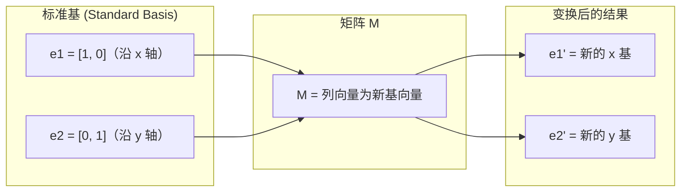
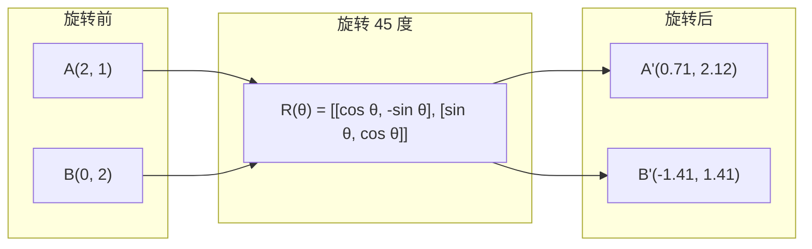
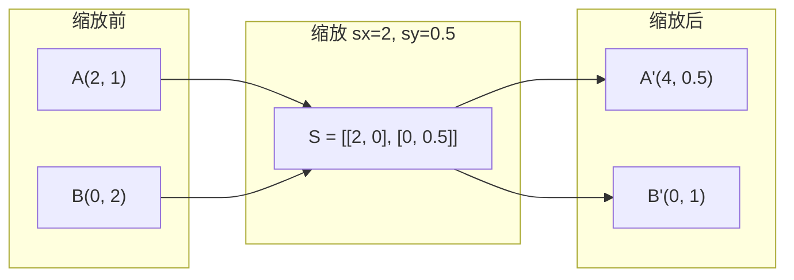
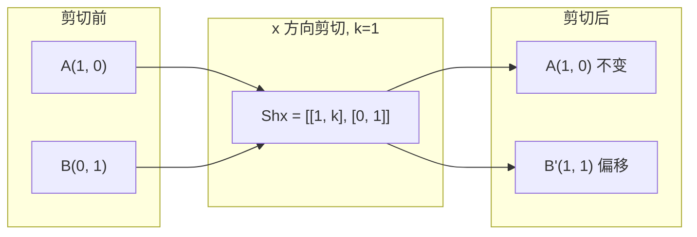
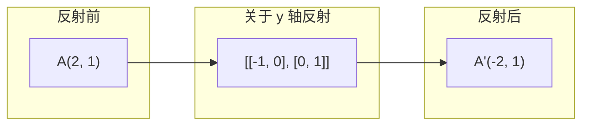
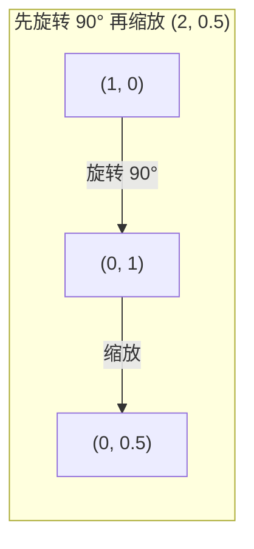
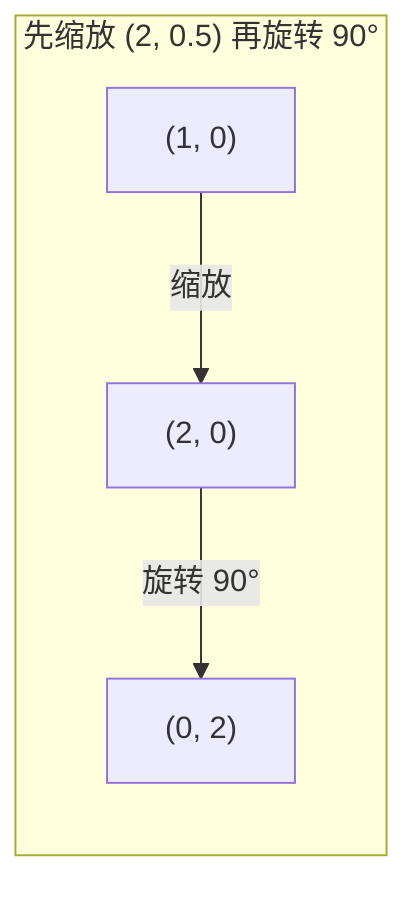

# 矩阵变换（Matrix Transformations）

> 矩阵是一台重塑空间的机器。理解它对每个点做了什么，你就理解了整个变换。

**类型：** 实践（Build）
**语言：** Python, Julia
**前置知识：** 阶段 1，课程 01-02（线性代数直觉、向量与矩阵运算）
**预计时长：** ~75 分钟

## 学习目标（Learning Objectives）

- 构造旋转、缩放、剪切和反射矩阵，并应用于 2D 和 3D 点
- 通过矩阵乘法组合多个变换，验证顺序的重要性
- 通过特征方程计算 2x2 矩阵的特征值（Eigenvalue）和特征向量（Eigenvector）
- 解释特征值为何决定 PCA 方向、RNN 稳定性和谱聚类行为

## 问题（The Problem）

你读到 PCA 时看到"求协方差矩阵的特征向量"。你读到模型稳定性时看到"检查所有特征值的模是否小于 1"。你读到数据增强时看到"施加随机旋转"。如果不理解矩阵对空间的几何作用，这些概念都难以真正理解。

矩阵不是数字的网格。它们是空间机器。旋转矩阵旋转点。缩放矩阵拉伸点。剪切矩阵倾斜点。神经网络（Neural Network）对数据施加的每个变换都是这些操作之一或它们的组合。本课将把这些操作变得具体可感。

## 概念（The Concept）

### 变换即矩阵（Transformations as matrices）

2D 中的每个线性变换都可以写成一个 2x2 矩阵。矩阵精确告诉你基向量 $[1, 0]$ 和 $[0, 1]$ 的最终位置，其余的一切由此推得。



**计算示例：** 考虑矩阵 $M = \begin{bmatrix} 2 & 3 \\ 1 & 4 \end{bmatrix}$，看它对基向量做了什么：

$e_1 = (1, 0)$ 变换后：

$$
M \cdot \begin{bmatrix} 1 \\ 0 \end{bmatrix} = \begin{bmatrix} 2 \cdot 1 + 3 \cdot 0 \\ 1 \cdot 1 + 4 \cdot 0 \end{bmatrix} = \begin{bmatrix} 2 \\ 1 \end{bmatrix}
$$

$e_2 = (0, 1)$ 变换后：
$$
M \cdot \begin{bmatrix} 0 \\ 1 \end{bmatrix} = \begin{bmatrix} 2 \cdot 0 + 3 \cdot 1 \\ 1 \cdot 0 + 4 \cdot 1 \end{bmatrix} = \begin{bmatrix} 3 \\ 4 \end{bmatrix}
$$

任意点 $(x, y)$ 变换后：
$$
M \cdot \begin{bmatrix} x \\ y \end{bmatrix} = x \begin{bmatrix} 2 \\ 1 \end{bmatrix} + y \begin{bmatrix} 3 \\ 4 \end{bmatrix} = \begin{bmatrix} 2x + 3y \\ x + 4y \end{bmatrix}
$$

例如点 $(1, 2)$：
$$
M \cdot \begin{bmatrix} 1 \\ 2 \end{bmatrix} = 1 \begin{bmatrix} 2 \\ 1 \end{bmatrix} + 2 \begin{bmatrix} 3 \\ 4 \end{bmatrix} = \begin{bmatrix} 2 \\ 1 \end{bmatrix} + \begin{bmatrix} 6 \\ 8 \end{bmatrix} = \begin{bmatrix} 8 \\ 9 \end{bmatrix}
$$

### 旋转（Rotation）

角度为 $\theta$ 的 2D 旋转保持距离和角度不变，将每个点沿圆弧移动。



**计算示例：** 旋转 45°（$\theta = 45° = \frac{\pi}{4}$），$\cos 45° = \sin 45° = \frac{\sqrt{2}}{2} \approx 0.707$：

$$
R(45°) = \begin{bmatrix} 0.707 & -0.707 \\ 0.707 & 0.707 \end{bmatrix}
$$

将点 $A(2, 1)$ 旋转 45°：

$$
A' = R(45°) \cdot \begin{bmatrix} 2 \\ 1 \end{bmatrix} = \begin{bmatrix} 0.707 & -0.707 \\ 0.707 & 0.707 \end{bmatrix} \begin{bmatrix} 2 \\ 1 \end{bmatrix} = \begin{bmatrix} 0.707 \times 2 + (-0.707) \times 1 \\ 0.707 \times 2 + 0.707 \times 1 \end{bmatrix} = \begin{bmatrix} 1.414 - 0.707 \\ 1.414 + 0.707 \end{bmatrix} = \begin{bmatrix} 0.71 \\ 2.12 \end{bmatrix}
$$

将点 $B(0, 2)$ 旋转 45°：

$$
B' = R(45°) \cdot \begin{bmatrix} 0 \\ 2 \end{bmatrix} = \begin{bmatrix} 0.707 & -0.707 \\ 0.707 & 0.707 \end{bmatrix} \begin{bmatrix} 0 \\ 2 \end{bmatrix} = \begin{bmatrix} 0 - 1.414 \\ 0 + 1.414 \end{bmatrix} = \begin{bmatrix} -1.41 \\ 1.41 \end{bmatrix}
$$

在 3D 中，绕一个轴旋转。每个轴有自己的旋转矩阵：

$$
\begin{aligned}
R_z(\theta) &= \begin{bmatrix}
\cos\theta & -\sin\theta & 0 \\
\sin\theta & \cos\theta & 0 \\
0 & 0 & 1
\end{bmatrix} \quad \text{绕 z 轴旋转（x-y 平面旋转，z 不变）} \\[15pt]
R_x(\theta) &= \begin{bmatrix}
1 & 0 & 0 \\
0 & \cos\theta & -\sin\theta \\
0 & \sin\theta & \cos\theta
\end{bmatrix} \quad \text{绕 x 轴旋转（y-z 平面旋转，x 不变）} \\[15pt]
R_y(\theta) &= \begin{bmatrix}
\cos\theta & 0 & \sin\theta \\
0 & 1 & 0 \\
-\sin\theta & 0 & \cos\theta
\end{bmatrix} \quad \text{绕 y 轴旋转（x-z 平面旋转，y 不变）}
\end{aligned}
$$

**计算示例：** 将点 $(1, 0, 0)$ 绕 z 轴旋转 90°（$\theta = 90° = \frac{\pi}{2}$，$\cos 90° = 0$，$\sin 90° = 1$）：

$$
R_z(90°) = \begin{bmatrix} 0 & -1 & 0 \\ 1 & 0 & 0 \\ 0 & 0 & 1 \end{bmatrix}
$$
$$
R_z(90°) \cdot \begin{bmatrix} 1 \\ 0 \\ 0 \end{bmatrix} = \begin{bmatrix} 0 \times 1 + (-1) \times 0 + 0 \times 0 \\ 1 \times 1 + 0 \times 0 + 0 \times 0 \\ 0 \times 1 + 0 \times 0 + 1 \times 0 \end{bmatrix} = \begin{bmatrix} 0 \\ 1 \\ 0 \end{bmatrix}
$$
点 $(1, 0, 0)$ 旋转到了 $(0, 1, 0)$，在 x-y 平面内转了 90°，z 坐标保持为 0 不变。

### 缩放（Scaling）

缩放沿每个轴独立拉伸或压缩。



**计算示例：** 缩放矩阵 $S = \begin{bmatrix} 2 & 0 \\ 0 & 0.5 \end{bmatrix}$（x 方向拉长 2 倍，y 方向压缩到一半）：

将点 $A(2, 1)$ 缩放：

$$A' = S \cdot \begin{bmatrix} 2 \\ 1 \end{bmatrix} = \begin{bmatrix} 2 & 0 \\ 0 & 0.5 \end{bmatrix} \begin{bmatrix} 2 \\ 1 \end{bmatrix} = \begin{bmatrix} 2 \times 2 + 0 \times 1 \\ 0 \times 2 + 0.5 \times 1 \end{bmatrix} = \begin{bmatrix} 4 \\ 0.5 \end{bmatrix}$$

将点 $B(0, 2)$ 缩放：

$$B' = S \cdot \begin{bmatrix} 0 \\ 2 \end{bmatrix} = \begin{bmatrix} 2 & 0 \\ 0 & 0.5 \end{bmatrix} \begin{bmatrix} 0 \\ 2 \end{bmatrix} = \begin{bmatrix} 0 + 0 \\ 0 + 1 \end{bmatrix} = \begin{bmatrix} 0 \\ 1 \end{bmatrix}$$

注意：对角矩阵的每一行只影响对应的坐标——第一行只影响 x，第二行只影响 y。这就是为什么缩放矩阵总是对角矩阵。

### 剪切（Shearing）

剪切倾斜一个轴，同时保持另一个轴固定。它将矩形变为平行四边形。



剪切矩阵：
- `Shx = [[1, k], [0, 1]]` — x 方向偏移 $k \cdot y$
- `Shy = [[1, 0], [k, 1]]` — y 方向偏移 $k \cdot x$

**计算示例：** x 方向剪切，$k = 1$，矩阵 $Sh_x = \begin{bmatrix} 1 & 1 \\ 0 & 1 \end{bmatrix}$：

将点 $A(1, 0)$ 剪切：

$$A' = Sh_x \cdot \begin{bmatrix} 1 \\ 0 \end{bmatrix} = \begin{bmatrix} 1 & 1 \\ 0 & 1 \end{bmatrix} \begin{bmatrix} 1 \\ 0 \end{bmatrix} = \begin{bmatrix} 1 \times 1 + 1 \times 0 \\ 0 \times 1 + 1 \times 0 \end{bmatrix} = \begin{bmatrix} 1 \\ 0 \end{bmatrix}$$

将点 $B(0, 1)$ 剪切：

$$B' = Sh_x \cdot \begin{bmatrix} 0 \\ 1 \end{bmatrix} = \begin{bmatrix} 1 & 1 \\ 0 & 1 \end{bmatrix} \begin{bmatrix} 0 \\ 1 \end{bmatrix} = \begin{bmatrix} 1 \times 0 + 1 \times 1 \\ 0 \times 0 + 1 \times 1 \end{bmatrix} = \begin{bmatrix} 1 \\ 1 \end{bmatrix}$$

$A(1, 0)$ 在 x 轴上不受影响（因为 y=0 时偏移量为 0）；$B(0, 1)$ 的 x 坐标被偏移了 $k \times y = 1 \times 1 = 1$，从 0 移到了 1。这就是"剪切"的效果——y 越大，x 被推得越远。

### 反射（Reflection）

反射将点关于某条轴或直线做镜像。



反射矩阵：
- 关于 y 轴反射：`[[-1, 0], [0, 1]]`
- 关于 x 轴反射：`[[1, 0], [0, -1]]`

**计算示例：** 关于 y 轴反射，矩阵 $R_y = \begin{bmatrix} -1 & 0 \\ 0 & 1 \end{bmatrix}$：

将点 $A(2, 1)$ 反射：

$$A' = R_y \cdot \begin{bmatrix} 2 \\ 1 \end{bmatrix} = \begin{bmatrix} -1 & 0 \\ 0 & 1 \end{bmatrix} \begin{bmatrix} 2 \\ 1 \end{bmatrix} = \begin{bmatrix} -1 \times 2 + 0 \times 1 \\ 0 \times 2 + 1 \times 1 \end{bmatrix} = \begin{bmatrix} -2 \\ 1 \end{bmatrix}$$

x 坐标变成了相反数（翻到了 y 轴的另一侧），y 坐标保持不变。这就是关于 y 轴的镜像。

关于 x 轴反射，矩阵 $R_x = \begin{bmatrix} 1 & 0 \\ 0 & -1 \end{bmatrix}$：

$$R_x \cdot \begin{bmatrix} 2 \\ 1 \end{bmatrix} = \begin{bmatrix} 1 & 0 \\ 0 & -1 \end{bmatrix} \begin{bmatrix} 2 \\ 1 \end{bmatrix} = \begin{bmatrix} 1 \times 2 + 0 \times 1 \\ 0 \times 2 + (-1) \times 1 \end{bmatrix} = \begin{bmatrix} 2 \\ -1 \end{bmatrix}$$

y 坐标变成了相反数，x 坐标不变。关于 x 轴的镜像。

### 组合：变换的链式应用（Composition: chaining transformations）

先应用变换 A 再应用 B，等价于矩阵乘法：`result = B @ A @ point`。顺序至关重要。先旋转再缩放与先缩放再旋转的结果完全不同。



**计算示例 —— 先旋转再缩放：**

旋转 90° 矩阵 $R = \begin{bmatrix} 0 & -1 \\ 1 & 0 \end{bmatrix}$，缩放矩阵 $S = \begin{bmatrix} 2 & 0 \\ 0 & 0.5 \end{bmatrix}$

合成矩阵 $S \cdot R$（从右往左读：先 R 后 S）：

$$S \cdot R = \begin{bmatrix} 2 & 0 \\ 0 & 0.5 \end{bmatrix} \begin{bmatrix} 0 & -1 \\ 1 & 0 \end{bmatrix} = \begin{bmatrix} 2 \times 0 + 0 \times 1 & 2 \times (-1) + 0 \times 0 \\ 0 \times 0 + 0.5 \times 1 & 0 \times (-1) + 0.5 \times 0 \end{bmatrix} = \begin{bmatrix} 0 & -2 \\ 0.5 & 0 \end{bmatrix}$$

对点 $(1, 0)$ 应用：

$$\begin{bmatrix} 0 & -2 \\ 0.5 & 0 \end{bmatrix} \begin{bmatrix} 1 \\ 0 \end{bmatrix} = \begin{bmatrix} 0 \\ 0.5 \end{bmatrix}$$



**计算示例 —— 先缩放再旋转：**

合成矩阵 $R \cdot S$（先 S 后 R）：

$$R \cdot S = \begin{bmatrix} 0 & -1 \\ 1 & 0 \end{bmatrix} \begin{bmatrix} 2 & 0 \\ 0 & 0.5 \end{bmatrix} = \begin{bmatrix} 0 \times 2 + (-1) \times 0 & 0 \times 0 + (-1) \times 0.5 \\ 1 \times 2 + 0 \times 0 & 1 \times 0 + 0 \times 0.5 \end{bmatrix} = \begin{bmatrix} 0 & -0.5 \\ 2 & 0 \end{bmatrix}$$

对点 $(1, 0)$ 应用：

$$\begin{bmatrix} 0 & -0.5 \\ 2 & 0 \end{bmatrix} \begin{bmatrix} 1 \\ 0 \end{bmatrix} = \begin{bmatrix} 0 \\ 2 \end{bmatrix}$$

结果 $(0, 0.5) \neq (0, 2)$，矩阵乘法不满足交换律。

### 特征值与特征向量（Eigenvalues and eigenvectors）

大多数向量在被矩阵作用后会改变方向。特征向量是特殊的：矩阵只能缩放它，永远不会旋转它。缩放倍数就是特征值。
$$
\begin{aligned}
A @ v &= \lambda \cdot v \\[15pt]
v &\text{ 是特征向量（不被改变方向的方向）} \\
\lambda &\text{ 是特征值（拉伸的倍数）}
\end{aligned}
$$
例如，矩阵 $A$：
$$
A = \begin{bmatrix} 2 & 1 \\ 1 & 2 \end{bmatrix}
$$
特征向量 $[1, 1]$ 对应的特征值为 $3$：
$$
A \cdot \begin{bmatrix} 1 \\ 1 \end{bmatrix} = \begin{bmatrix} 3 \\ 3 \end{bmatrix} = 3 \cdot \begin{bmatrix} 1 \\ 1 \end{bmatrix} \quad (\text{方向不变，缩放 3 倍})
$$
特征向量 $[1, -1]$ 对应的特征值为 $1$：
$$
A \cdot \begin{bmatrix} 1 \\ -1 \end{bmatrix} = \begin{bmatrix} 1 \\ -1 \end{bmatrix} = 1 \cdot \begin{bmatrix} 1 \\ -1 \end{bmatrix} \quad (\text{方向不变，长度不变})
$$
该矩阵使空间沿 $[1, 1]$ 方向拉伸 3 倍，而沿 $[1, -1]$ 方向保持不变。其他所有方向都是这两个方向的混合。

**如何手算特征值：** 对于 $A = \begin{bmatrix} 2 & 1 \\ 1 & 2 \end{bmatrix}$，解特征方程 $\det(A - \lambda I) = 0$：

$$A - \lambda I = \begin{bmatrix} 2 - \lambda & 1 \\ 1 & 2 - \lambda \end{bmatrix}$$

$$\det(A - \lambda I) = (2 - \lambda)(2 - \lambda) - 1 \times 1 = \lambda^2 - 4\lambda + 3 = 0$$

解二次方程：$(\lambda - 1)(\lambda - 3) = 0$，得 $\lambda_1 = 3$，$\lambda_2 = 1$。

代入 $\lambda_1 = 3$ 求特征向量，解 $(A - 3I)v = 0$：

$$\begin{bmatrix} -1 & 1 \\ 1 & -1 \end{bmatrix} \begin{bmatrix} x \\ y \end{bmatrix} = \begin{bmatrix} 0 \\ 0 \end{bmatrix} \;\Rightarrow\; -x + y = 0 \;\Rightarrow\; y = x \;\Rightarrow\; v_1 = \begin{bmatrix} 1 \\ 1 \end{bmatrix}$$

代入 $\lambda_2 = 1$ 求特征向量，解 $(A - 1I)v = 0$：

$$\begin{bmatrix} 1 & 1 \\ 1 & 1 \end{bmatrix} \begin{bmatrix} x \\ y \end{bmatrix} = \begin{bmatrix} 0 \\ 0 \end{bmatrix} \;\Rightarrow\; x + y = 0 \;\Rightarrow\; y = -x \;\Rightarrow\; v_2 = \begin{bmatrix} 1 \\ -1 \end{bmatrix}$$

### 特征分解（Eigendecomposition）

如果一个矩阵有 $n$ 个线性无关的特征向量，它可以被分解为：
$$
\begin{aligned}
A &= V @ D @ V^{-1} \\[15pt]
V &= \text{以特征向量为列的矩阵} \\
D &= \text{特征值构成的对角矩阵} \\
V^{-1} &= \text{V 的逆矩阵（Inverse）}
\end{aligned}
$$
这意味着：先旋转到特征向量坐标系，再沿各轴缩放，最后旋转回去。

### 特征值为何重要

**PCA。** 协方差矩阵的特征向量就是主成分。特征值告诉你每个成分捕获了多少方差。按特征值排序，保留前 k 个，就实现了降维（Dimension Reduction）。

**稳定性。** 在循环神经网络和动力系统中，模大于 1 的特征值会导致输出爆炸，模小于 1 则会导致消失。这就是梯度（Gradient）消失/爆炸问题的一句话总结。

**谱方法。** 图神经网络使用邻接矩阵的特征值。谱聚类使用拉普拉斯矩阵的特征值。特征向量揭示了图的结构。

### 行列式作为体积缩放因子（Determinant as volume scaling factor）

变换矩阵的行列式（Determinant），记作 $\det(M)$ 或 $|M|$，告诉你在 2D 中面积如何缩放，在 3D 中体积如何缩放。
$$
\begin{aligned}
\det(M) = |M| = \begin{vmatrix} a & b \\ c & d \end{vmatrix} = ad - bc
\end{aligned}
$$

$$
\begin{aligned}
\det &= 1: \quad \text{面积不变（旋转）} \\[5pt]
\det &= 2: \quad \text{面积加倍} \\[5pt]
\det &= 0: \quad \text{空间被压缩到更低维度（奇异矩阵）} \\[5pt]
\det &= -1: \quad \text{面积不变但朝向翻转（反射）}
\end{aligned}
$$
常见变换的行列式：
$$
\begin{aligned}
|\det(\text{旋转})| &= 1 \quad \text{（始终）} \\[5pt]
|\det(\text{缩放 } s_x, s_y)| &= s_x \cdot s_y \\[5pt]
|\det(\text{剪切})| &= 1 \quad \text{（面积不变）} \\[5pt]
|\det(\text{反射})| &= -1 \quad \text{（朝向翻转）}
\end{aligned}
$$
**计算示例：** 对于 2×2 矩阵 $M = \begin{bmatrix} a & b \\ c & d \end{bmatrix}$，行列式记作 $\det(M)$ 或 $|M|$，计算公式为 $\det(M) = ad - bc$。

也可以用竖线写法：
$$
\det(M) = |M| = \begin{vmatrix} a & b \\ c & d \end{vmatrix} = ad - bc
$$

旋转矩阵 $R(45°) = \begin{bmatrix} 0.707 & -0.707 \\ 0.707 & 0.707 \end{bmatrix}$：

$$\det(R) = 0.707 \times 0.707 - (-0.707) \times 0.707 = 0.5 + 0.5 = 1.0$$

缩放矩阵 $S(2, 0.5) = \begin{bmatrix} 2 & 0 \\ 0 & 0.5 \end{bmatrix}$：

$$\det(S) = 2 \times 0.5 - 0 \times 0 = 1.0$$

剪切矩阵 $Sh_x = \begin{bmatrix} 1 & 1 \\ 0 & 1 \end{bmatrix}$：

$$\det(Sh_x) = 1 \times 1 - 1 \times 0 = 1$$

反射矩阵 $R_y = \begin{bmatrix} -1 & 0 \\ 0 & 1 \end{bmatrix}$：

$$\det(R_y) = (-1) \times 1 - 0 \times 0 = -1$$

奇异矩阵 $\begin{bmatrix} 1 & 2 \\ 2 & 4 \end{bmatrix}$（第二列是第一列的 2 倍）：

$$\det = 1 \times 4 - 2 \times 2 = 4 - 4 = 0$$

行列式为 0 意味着该矩阵将 2D 空间压缩到了一条直线上（维度降低），变换不可逆。

## 动手实现（Build It）

### 第 1 步：从零实现变换矩阵（Python）

```python
import math

# 2D 旋转矩阵：绕原点逆时针旋转 theta 弧度。
# 矩阵的列分别是旋转后的 x 基向量和 y 基向量。
def rotation_2d(theta):
    c, s = math.cos(theta), math.sin(theta)
    return [[c, -s], [s, c]]

def scaling_2d(sx, sy):
    """2D 缩放矩阵：沿 x 轴缩放 sx 倍，沿 y 轴缩放 sy 倍。
    对角线元素决定各轴的缩放倍数，非对角线为 0 表示各轴独立缩放。"""
    return [[sx, 0], [0, sy]]

def shearing_2d(kx, ky):
    """2D 剪切矩阵：kx 控制 x 随 y 偏移的量，ky 控制 y 随 x 偏移的量。
    对角线为 1 表示该轴长度不变。"""
    return [[1, kx], [ky, 1]]

def reflection_x():
    """关于 x 轴反射：y 坐标取反，x 坐标不变。"""
    return [[1, 0], [0, -1]]

def reflection_y():
    """关于 y 轴反射：x 坐标取反，y 坐标不变。"""
    return [[-1, 0], [0, 1]]

# 矩阵乘向量：result[i] = sum(matrix[i][j] * vector[j] for all j)
# 这是线性变换作用于点的核心计算，本质上是基向量的线性组合。
def mat_vec_mul(matrix, vector):
    return [
        sum(matrix[i][j] * vector[j] for j in range(len(vector)))
        for i in range(len(matrix))
    ]

# 矩阵乘法：C[i][j] = sum(A[i][k] * B[k][j] for all k)
# 行数必须等于左矩阵的行数，列数必须等于右矩阵的列数。
def mat_mul(a, b):
    rows_a, cols_b = len(a), len(b[0])
    cols_a = len(a[0])
    return [
        [sum(a[i][k] * b[k][j] for k in range(cols_a)) for j in range(cols_b)]
        for i in range(rows_a)
    ]

point = [1.0, 0.0]
angle = math.pi / 4

rotated = mat_vec_mul(rotation_2d(angle), point)
print(f"将 (1,0) 旋转 45 度: ({rotated[0]:.4f}, {rotated[1]:.4f})")

scaled = mat_vec_mul(scaling_2d(2, 3), [1.0, 1.0])
print(f"将 (1,1) 缩放 (2,3) 倍: ({scaled[0]:.1f}, {scaled[1]:.1f})")

sheared = mat_vec_mul(shearing_2d(1, 0), [1.0, 1.0])
print(f"将 (1,1) 剪切 kx=1: ({sheared[0]:.1f}, {sheared[1]:.1f})")

reflected = mat_vec_mul(reflection_y(), [2.0, 1.0])
print(f"将 (2,1) 关于 y 轴反射: ({reflected[0]:.1f}, {reflected[1]:.1f})")
```

### 第 2 步：变换的组合（Composition of transformations）

```python
R = rotation_2d(math.pi / 2)  # 旋转矩阵：逆时针 90 度
S = scaling_2d(2, 0.5)        # 缩放矩阵：x 方向 2 倍，y 方向 0.5 倍

# 注意乘法顺序：mat_mul(S, R) 表示先旋转再缩放（矩阵从右向左作用）
rotate_then_scale = mat_mul(S, R)
scale_then_rotate = mat_mul(R, S)

point = [1.0, 0.0]
result1 = mat_vec_mul(rotate_then_scale, point)
result2 = mat_vec_mul(scale_then_rotate, point)

print(f"先旋转 90° 再缩放: ({result1[0]:.2f}, {result1[1]:.2f})")
print(f"先缩放再旋转 90°: ({result2[0]:.2f}, {result2[1]:.2f})")
print(f"结果相同? {result1 == result2}")
# 输出结果不同，说明矩阵乘法不满足交换律——变换顺序不可交换。
```

### 第 3 步：从零计算 2x2 矩阵的特征值

对于 2x2 矩阵 `[[a, b], [c, d]]`，特征值满足特征方程（Characteristic Equation）：$\lambda^2 - (a+d)\lambda + (ad - bc) = 0$，其中 $a+d$ 是迹（Trace），$ad - bc$ 是行列式。

```python
def eigenvalues_2x2(matrix):
    """计算 2x2 矩阵的特征值。
    
    策略：通过求根公式解特征方程 λ² - trace·λ + det = 0。
    判别式 < 0 时得到共轭复特征值（对应旋转变换）；
    判别式 >= 0 时得到实特征值（对应纯缩放变换）。"""
    a, b = matrix[0]
    c, d = matrix[1]
    trace = a + d       # 迹 = 特征值之和
    det = a * d - b * c  # 行列式 = 特征值之积
    discriminant = trace ** 2 - 4 * det
    if discriminant < 0:
        # 复特征值：实部为 trace/2，虚部由判别式的绝对值决定
        real = trace / 2
        imag = (-discriminant) ** 0.5 / 2
        return (complex(real, imag), complex(real, -imag))
    sqrt_disc = discriminant ** 0.5
    return ((trace + sqrt_disc) / 2, (trace - sqrt_disc) / 2)

def eigenvector_2x2(matrix, eigenvalue):
    """计算 2x2 矩阵的归一化特征向量。
    
    思路：解齐次方程 (A - λI)v = 0，找非零解。
    根据矩阵元素特征选择合适的求解分支，防止除零错误。
    最后归一化到单位长度，使特征向量具有唯一表示。"""
    a, b = matrix[0]
    c, d = matrix[1]
    # 根据非对角元是否为零选择求解分支，避免除零
    if abs(b) > 1e-10:
        v = [b, eigenvalue - a]
    elif abs(c) > 1e-10:
        v = [eigenvalue - d, c]
    else:
        # 对角矩阵：特征向量为标准基
        if abs(a - eigenvalue) < 1e-10:
            v = [1, 0]
        else:
            v = [0, 1]
    # 归一化：使特征向量长度为 1，方便比较和可视化
    mag = (v[0] ** 2 + v[1] ** 2) ** 0.5
    return [v[0] / mag, v[1] / mag]

A = [[2, 1], [1, 2]]
vals = eigenvalues_2x2(A)
print(f"矩阵: {A}")
print(f"特征值: {vals[0]:.4f}, {vals[1]:.4f}")

for val in vals:
    vec = eigenvector_2x2(A, val)
    result = mat_vec_mul(A, vec)
    scaled = [val * vec[0], val * vec[1]]
    print(f"  lambda={val:.1f}, v={[round(x,4) for x in vec]}")
    print(f"    A@v = {[round(x,4) for x in result]}")
    print(f"    l*v = {[round(x,4) for x in scaled]}")
    # A@v 与 λ·v 应相等，验证了特征方程 A@v = λ·v
```

### 第 4 步：行列式作为体积缩放因子

行列式衡量变换对面积（2D）或体积（3D）的缩放倍数。零行列式意味着变换不可逆。

```python
def det_2x2(matrix):
    """计算 2x2 矩阵的行列式：ad - bc。
    几何意义：矩阵列向量张成的平行四边形的有向面积。"""
    return matrix[0][0] * matrix[1][1] - matrix[0][1] * matrix[1][0]

print(f"det(旋转 45°) = {det_2x2(rotation_2d(math.pi/4)):.4f}")  # 应为 1.0
print(f"det(缩放 2,3)   = {det_2x2(scaling_2d(2, 3)):.1f}")     # 应为 6.0 = 2*3
print(f"det(剪切 kx=1)  = {det_2x2(shearing_2d(1, 0)):.1f}")    # 面积为 1
print(f"det(反射 y轴)   = {det_2x2(reflection_y()):.1f}")       # 应为 -1.0

# 奇异矩阵示例：第二列是第一列的 2 倍，两个列向量共线 -> 面积为 0
singular = [[1, 2], [2, 4]]
print(f"det(奇异矩阵)     = {det_2x2(singular):.1f}")
print("奇异矩阵：列向量成比例，空间被压缩到一条直线。")
```

## 使用现成库（Use It）

NumPy 通过优化后的例程处理所有这些操作。

```python
import numpy as np

theta = np.pi / 4
# 使用 NumPy 构建旋转矩阵，底层调用高效 C 实现而非纯 Python 循环
R = np.array([[np.cos(theta), -np.sin(theta)],
              [np.sin(theta),  np.cos(theta)]])

point = np.array([1.0, 0.0])
print(f"将 (1,0) 旋转 45 度: {R @ point}")

# np.diag 快速构建对角缩放矩阵，比手动编写 scaling_2d 更简洁
S = np.diag([2.0, 3.0])
# @ 运算符直接做矩阵乘法，无需手动实现 mat_mul
composed = S @ R
print(f"先旋转 45° 再缩放 (2,3): {composed @ point}")

A = np.array([[2, 1], [1, 2]], dtype=float)
# NumPy 的线性代数模块，底层调用 LAPACK 库求解特征值问题
eigenvalues, eigenvectors = np.linalg.eig(A)
print(f"\n特征值: {eigenvalues}")
print(f"特征向量（列向量）:\n{eigenvectors}")

for i in range(len(eigenvalues)):
    v = eigenvectors[:, i]
    lam = eigenvalues[i]
    print(f"  A @ v{i} = {A @ v}, lambda * v{i} = {lam * v}")

print(f"\ndet(R) = {np.linalg.det(R):.4f}")
print(f"det(S) = {np.linalg.det(S):.1f}")

# 特征分解验证：A = V @ D @ V^{-1}
# D 是特征值对角矩阵，V 是特征向量矩阵，V^{-1} 将结果变换回原始坐标系
B = np.array([[3, 1], [0, 2]], dtype=float)
vals, vecs = np.linalg.eig(B)
D = np.diag(vals)
V = vecs
reconstructed = V @ D @ np.linalg.inv(V)
print(f"\n特征分解 A = V @ D @ V^-1:")
print(f"原始矩阵:\n{B}")
print(f"重构矩阵:\n{reconstructed}")
```

### 使用 NumPy 实现 3D 旋转

```python
def rotation_3d_z(theta):
    """绕 z 轴旋转矩阵：z 坐标不变，x-y 平面旋转 theta 角度。"""
    c, s = np.cos(theta), np.sin(theta)
    return np.array([[c, -s, 0], [s, c, 0], [0, 0, 1]])

def rotation_3d_x(theta):
    """绕 x 轴旋转矩阵：x 坐标不变，y-z 平面旋转 theta 角度。"""
    c, s = np.cos(theta), np.sin(theta)
    return np.array([[1, 0, 0], [0, c, -s], [0, s, c]])

point_3d = np.array([1.0, 0.0, 0.0])
rotated_z = rotation_3d_z(np.pi / 2) @ point_3d
rotated_x = rotation_3d_x(np.pi / 2) @ point_3d

print(f"\n3D 点: {point_3d}")
print(f"绕 z 轴旋转 90°: {np.round(rotated_z, 4)}")
print(f"绕 x 轴旋转 90°: {np.round(rotated_x, 4)}")
```

## 融会贯通（Ship It）

本节课建立了 PCA（阶段 2）和神经网络权重（Weight）分析所需的几何基础。这里亲手实现的特征值/特征向量代码，与驱动生产级 ML 系统中的降维、谱聚类和稳定性分析的是同一套算法。

## 练习（Exercises）

1. 对单位正方形（顶点为 [0,0]、[1,0]、[1,1]、[0,1]）分别施加旋转、缩放和剪切变换，打印每个顶点变换后的坐标。验证旋转是否保持顶点间的距离不变。

2. 用手算方式通过特征方程求矩阵 `[[4, 2], [1, 3]]` 的特征值，再用自己实现的函数和 NumPy 验证结果。

3. 创建三个变换的组合（旋转 30 度、缩放 [1.5, 0.8]、剪切 kx=0.3），将其应用于分布在圆上的 8 个点，打印变换前后的坐标。计算组合矩阵的行列式，验证它等于各矩阵行列式的乘积。

## 关键术语（Key Terms）

| 术语 | 人们的说法 | 实际含义 |
|------|-----------|---------|
| 旋转矩阵（Rotation matrix） | "旋转东西" | 一种正交（Orthogonal）矩阵，沿圆弧移动点，保持距离和角度不变，行列式恒为 1。 |
| 缩放矩阵（Scaling matrix） | "放大东西" | 一种对角矩阵，沿各轴独立拉伸或压缩，行列式为各缩放因子的乘积。 |
| 剪切矩阵（Shearing matrix） | "倾斜东西" | 一种矩阵，将一个坐标按比例偏移到另一个坐标，将矩形变为平行四边形，行列式为 1。 |
| 反射（Reflection） | "镜像东西" | 一种矩阵，将空间关于某轴或平面翻转，行列式为 -1。 |
| 组合（Composition） | "做两件事" | 通过矩阵乘法链式应用多个变换。顺序重要：B @ A 表示先应用 A 再应用 B。 |
| 特征向量（Eigenvector） | "特殊方向" | 矩阵只会缩放、不会旋转的方向——变换的"指纹"。 |
| 特征值（Eigenvalue） | "拉伸多少" | 矩阵缩放其特征向量的标量（Scalar）倍数。可为负值（翻转）或复数（旋转）。 |
| 特征分解（Eigendecomposition） | "分解矩阵" | 将矩阵写为 V @ D @ V^(-1)，分解为基本的缩放方向和缩放倍数。 |
| 行列式（Determinant） | "矩阵算出的一个数" | 变换缩放面积（2D）或体积（3D）的倍数。零表示变换不可逆。 |
| 特征方程（Characteristic equation） | "特征值的来源" | det(A - λI) = 0。以特征值为根的（特征）多项式。 |

## 拓展阅读（Further Reading）

- [3Blue1Brown: 线性变换](https://www.3blue1brown.com/lessons/linear-transformations) —— 矩阵如何重塑空间的视觉直觉
- [3Blue1Brown: 特征向量与特征值](https://www.3blue1brown.com/lessons/eigenvalues) —— 特征值几何含义的最佳视觉解释
- [MIT 18.06 第 21 讲：特征值与特征向量](https://ocw.mit.edu/courses/18-06-linear-algebra-spring-2010/) —— Gilbert Strang 的经典教程
