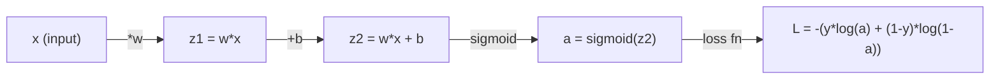
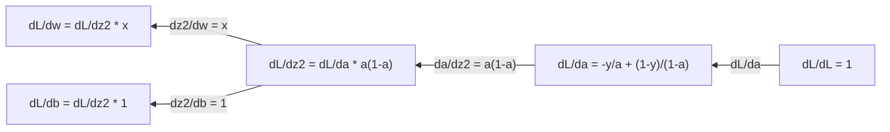
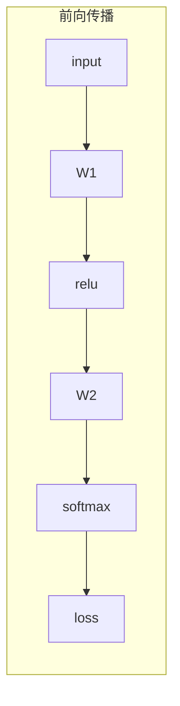
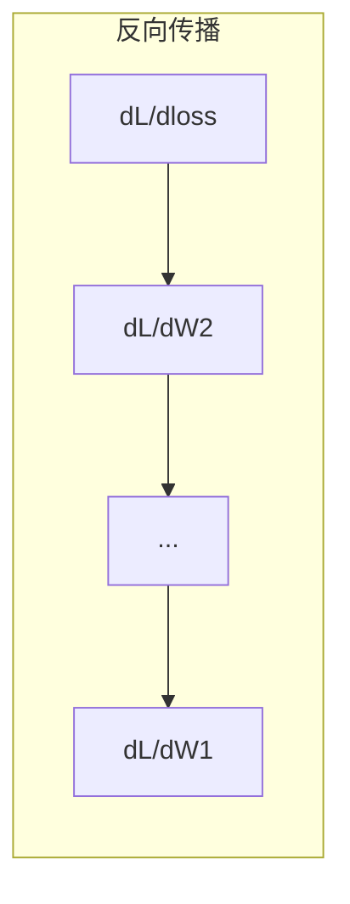

# 机器学习中的微积分（Calculus for Machine Learning）

> 导数告诉你哪个方向是下坡。这就是神经网络学习所需的全部。

**类型：** 学习
**语言：** Python
**前置知识：** 阶段 1，课程 01-03
**时间：** ~60 分钟

## 学习目标（Learning Objectives）

- 计算常见机器学习函数（$x^2$、sigmoid、交叉熵）的数值导数和解析导数
- 从头实现梯度下降（gradient descent），在 1D 和 2D 中最小化损失函数
- 推导线性回归模型的梯度（gradient），并通过手动更新权重进行训练
- 解释海森矩阵（Hessian matrix）、泰勒级数（Taylor series）近似及其与优化方法的联系

## 问题（The Problem）

你有一个包含数百万个权重的神经网络。每个权重都是一个旋钮。你需要弄清楚，每个旋钮应该往哪个方向拧，才能让模型的错误略微减少。微积分（calculus）为你提供了这个方向。

没有微积分，训练神经网络就像尝试随机调整并祈祷好运。有了导数（derivative），你就精确知道每个权重对误差的影响。每次都能以正确的方式拧动每个旋钮。

## 概念（The Concept）

### 什么是导数？

导数衡量变化率。对于函数 $y = f(x)$，导数 $f'(x)$ 告诉你：如果你将 $x$ 微微移动一小点，$y$ 会变化多少？

几何意义上，导数是函数在某一点处切线的斜率。

**$f(x) = x^2$：**

| $x$ | $f(x)$ | $f'(x)$（斜率） |
|-----|--------|----------------|
| 0   | 0      | 0（平坦，在底部） |
| 1   | 1      | 2 |
| 2   | 4      | 4（该点切线斜率） |
| 3   | 9      | 6 |

在 $x=2$ 处，斜率是 4。如果你将 $x$ 向右微微移动，$y$ 增加约 4 倍于移动量。在 $x=0$ 处，斜率为 0。你正处于碗的底部。

正式定义：

$$
f'(x) = \lim_{h \to 0} \frac{f(x + h) - f(x)}{h}
$$

在代码中，你跳过极限，直接使用一个非常小的 $h$。这就是数值导数（numerical derivative）。

### 偏导数：一次只变一个变量

真实函数有多个输入。神经网络的损失取决于数千个权重。偏导数（partial derivative）保持除一个变量外的所有变量不变，然后对该变量求导。

$$
\begin{aligned}
f(x, y) &= x^2 + 3xy + y^2 \\[15pt]
\frac{\partial f}{\partial x} &= 2x + 3y \quad (\text{将 } y \text{ 视为常数}) \\[15pt]
\frac{\partial f}{\partial y} &= 3x + 2y \quad (\text{将 } x \text{ 视为常数})
\end{aligned}
$$

每个偏导数回答的问题是：如果我微微调整这一个权重，损失会如何变化？

### 梯度：所有偏导数的向量

梯度（gradient）将所有偏导数收集到一个向量中。对于函数 $f(x, y, z)$，梯度为：

$$
\nabla f = \left[ \frac{\partial f}{\partial x}, \frac{\partial f}{\partial y}, \frac{\partial f}{\partial z} \right]
$$

梯度指向最陡峭上升的方向。要最小化一个函数，就朝相反方向走。

**$f(x,y) = x^2 + y^2$ 的等高线图：**

该函数呈碗状，等值线为同心圆。最小值在 $(0, 0)$ 处。

| 点 | $\nabla f$ | $-\nabla f$（下降方向） |
|-------|--------|----------------------------|
| $(1, 1)$ | $[2, 2]$（指向上坡，远离最小值） | $[-2, -2]$（指向下坡，朝向最小值） |
| $(0, 0)$ | $[0, 0]$（平坦，在最小值处） | $[0, 0]$ |

这就是一张图中的梯度下降（gradient descent）。计算梯度，取反，迈出一步。

### 与优化的联系

训练神经网络就是优化。你有一个损失函数 $L(w_1, w_2, ..., w_n)$，它衡量模型的错误程度。你想要最小化它。

$$
w_{\text{new}} = w_{\text{old}} - \text{learning\_rate} \cdot \frac{\partial L}{\partial w}
$$

对于每个权重：
1. 计算损失对该权重的偏导数
2. 从权重中减去该偏导数乘以学习率（learning rate）的积
3. 重复

学习率控制步长。太大则越过最小值。太小则缓慢爬行。

**损失景观（1D 切片）：**

损失函数 $L(w)$ 随着权重 $w$ 的变化形成一条有峰有谷的曲线。

| 特征 | 描述 |
|---------|-------------|
| 全局最小值（Global minimum） | 整条曲线的最低点——最优解 |
| 局部最小值（Local minimum） | 一个比邻近点低、但并非全局最低的谷底 |
| 斜率（Slope） | 梯度下降从任意起点沿着斜坡向下走 |

梯度下降沿着斜坡向下走。它可能会陷入局部最小值，但在高维空间（数百万个权重）中，这在实际中很少成为问题。

### 数值导数 vs 解析导数

计算导数有两种方式。

解析导数（Analytical derivative）：手动应用微积分规则。对于 $f(x) = x^2$，导数为 $f'(x) = 2x$。精确。快速。

数值导数（Numerical derivative）：使用定义进行近似。用很小的 $h$ 计算 $f(x+h)$ 和 $f(x-h)$，然后计算差值。

$$
f'(x) \approx \frac{f(x + h) - f(x - h)}{2h}
$$

其中 $h = 0.0001$ 在实践中效果良好。

数值导数较慢，但适用于任何函数。解析导数很快，但需要你推导出公式。神经网络框架使用第三种方法：自动微分（automatic differentiation），它机械地计算精确的导数。你将在阶段 3 中看到这一点。

### 简单函数的手动求导

这些是你在机器学习中会反复遇到的导数。

| 函数 | 导数 | 用途 |
|--------|----------|-------|
| $f(x) = x^2$ | $f'(x) = 2x$ | 损失函数（MSE） |
| $f(x) = wx + b$ | $f'(w) = x$ | 线性层（对权重的梯度） |
| | $f'(b) = 1$ | 线性层（对偏置的梯度） |
| | $f'(x) = w$ | 线性层（对输入的梯度） |
| $f(x) = e^x$ | $f'(x) = e^x$ | Softmax、注意力机制 |
| $f(x) = \ln(x)$ | $f'(x) = 1/x$ | 交叉熵损失 |
| $f(x) = \frac{1}{1+e^{-x}}$ | $f'(x) = f(x)(1-f(x))$ | Sigmoid 激活函数 |

对于 $f(x) = x^2$：

| $x$ | $f(x)$ | $f'(x)$ | 含义 |
|-----|--------|---------|------|
| -2  | 4      | -4      | 斜向左（递减） |
| -1  | 1      | -2      | 斜向左（递减） |
| 0   | 0      | 0       | 平坦（最小值！） |
| 1   | 1      | 2       | 斜向右（递增） |
| 2   | 4      | 4       | 斜向右（递增） |

对于 $f(w) = wx + b$，其中 $x=3$，$b=1$：

$$
f(w) = 3w + 1, \quad f'(w) = 3
$$

对 $w$ 的导数就是 $x$。如果 $x$ 很大，$w$ 的微小变化就会导致输出的巨大变化。

### 链式法则（Chain Rule）

当函数复合时，链式法则告诉你如何求导。

$$
\begin{aligned}
&\text{若 } y = f(g(x)) \text{，则 } \frac{dy}{dx} = f'(g(x)) \cdot g'(x) \\[15pt]
&\text{示例：} y = (3x + 1)^2 \\[15pt]
&\text{外层：} f(u) = u^2 \quad f'(u) = 2u \\[15pt]
&\text{内层：} g(x) = 3x + 1 \quad g'(x) = 3 \\[15pt]
&\frac{dy}{dx} = 2(3x + 1) \cdot 3 = 6(3x + 1)
\end{aligned}
$$

神经网络是函数的链条：输入 → 线性 → 激活 → 线性 → 激活 → 损失。反向传播（backpropagation）就是从输出到输入反复应用链式法则。这就是整个算法。

### 海森矩阵（Hessian Matrix）

梯度告诉你斜率。海森矩阵告诉你曲率。

海森矩阵是二阶偏导数的矩阵。对于函数 $f(x_1, x_2, ..., x_n)$，海森矩阵的第 $(i,j)$ 项为：

$$
H_{ij} = \frac{\partial^2 f}{\partial x_i \partial x_j}
$$

对于 2 变量函数 $f(x, y)$：

$$
H = \begin{bmatrix}
\frac{\partial^2 f}{\partial x^2} & \frac{\partial^2 f}{\partial x \partial y} \\[10pt]
\frac{\partial^2 f}{\partial y \partial x} & \frac{\partial^2 f}{\partial y^2}
\end{bmatrix}
$$

**海森矩阵在临界点（梯度为零处）告诉你的信息：**

| 海森矩阵性质 | 含义 | 曲面形状 |
|-----------------|---------|-----------------|
| 正定（所有特征值 > 0） | 局部最小值 | 朝上的碗 |
| 负定（所有特征值 < 0） | 局部最大值 | 朝下的碗 |
| 不定（特征值有正有负） | 鞍点 | 马鞍形状 |

**示例：** $f(x, y) = x^2 - y^2$（一个鞍形函数）

$$
\begin{aligned}
\frac{\partial f}{\partial x} &= 2x, \quad \frac{\partial f}{\partial y} = -2y \\[10pt]
\frac{\partial^2 f}{\partial x^2} &= 2, \quad \frac{\partial^2 f}{\partial y^2} = -2, \quad \frac{\partial^2 f}{\partial x \partial y} = 0 \\[15pt]
H &= \begin{bmatrix} 2 & 0 \\ 0 & -2 \end{bmatrix} \\[10pt]
\text{特征值：} & 2 \text{ 和 } -2 \text{（一正一负）} \\[10pt]
\longrightarrow & \text{在 } (0, 0) \text{ 处为鞍点}
\end{aligned}
$$

与 $f(x, y) = x^2 + y^2$（碗形）对比：

$$
\begin{aligned}
H &= \begin{bmatrix} 2 & 0 \\ 0 & 2 \end{bmatrix} \\[10pt]
\text{特征值：} & 2 \text{ 和 } 2 \text{（均为正）} \\[10pt]
\longrightarrow & \text{在 } (0, 0) \text{ 处为局部最小值}
\end{aligned}
$$

**为什么海森矩阵在机器学习中很重要：**

牛顿法（Newton's method）使用海森矩阵来采取比梯度下降更好的优化步骤。它不只是跟随坡度，还考虑了曲率：

$$
\begin{aligned}
\text{牛顿更新：} &\quad w_{\text{new}} = w_{\text{old}} - H^{-1} \nabla L \\[10pt]
\text{梯度下降：} &\quad w_{\text{new}} = w_{\text{old}} - \text{lr} \cdot \nabla L
\end{aligned}
$$

牛顿法收敛更快，因为海森矩阵"重新缩放"了梯度——陡峭的方向走更小的步，平坦的方向走更大的步。

问题在于：对于一个有 $N$ 个参数的神经网络，海森矩阵是 $N \times N$ 的。一个 100 万个参数的模型需要一个 1 万亿条目的矩阵。这就是为什么我们使用近似方法。

| 方法 | 使用什么 | 计算成本 | 收敛速度 |
|--------|-------------|------|-------------|
| 梯度下降 | 仅一阶导数 | $O(N)$ 每步 | 慢（线性） |
| 牛顿法 | 完整海森矩阵 | $O(N^3)$ 每步 | 快（二次） |
| L-BFGS | 从梯度历史近似海森矩阵 | $O(N)$ 每步 | 中（超线性） |
| Adam | 每参数自适应学习率（对角海森近似） | $O(N)$ 每步 | 中 |
| 自然梯度 | Fisher 信息矩阵（统计海森矩阵） | $O(N^2)$ 每步 | 快 |

在实践中，Adam 是深度学习的默认优化器。它通过跟踪每个参数梯度的运行均值和方差，以较低成本近似二阶信息。

### 泰勒级数近似（Taylor Series Approximation）

任何光滑函数都可以局部地用多项式近似：

$$
f(x + h) = f(x) + f'(x)h + \frac{1}{2}f''(x)h^2 + \frac{1}{6}f'''(x)h^3 + \cdots
$$

包含的项越多，近似效果越好——但仅在点 $x$ 附近成立。

**为什么泰勒级数对机器学习很重要：**

- **一阶泰勒 = 梯度下降。** 当你使用 $f(x + h) \approx f(x) + f'(x)h$ 时，你在做一个线性近似。梯度下降最小化这个线性模型来选择 $h = -\text{lr} \cdot f'(x)$。

- **二阶泰勒 = 牛顿法。** 使用 $f(x + h) \approx f(x) + f'(x)h + \frac{1}{2}f''(x)h^2$，你得到一个二次模型。最小化它得到 $h = -f'(x)/f''(x)$——这就是牛顿步。

- **损失函数设计。** MSE 和交叉熵是光滑函数，这意味着它们的泰勒展开性质良好。这并非巧合。光滑的损失函数使优化可预测。

| 近似阶数 | 捕获的信息 | 优化方法 |
|-------------------|-------------------|-------------------|
| 0 阶（常数） | 仅有值 | 随机搜索 |
| 1 阶（线性） | 斜率 | 梯度下降 |
| 2 阶（二次） | 曲率 | 牛顿法 |
| 更高阶 | 更精细的结构 | 机器学习中很少使用 |

关键洞察：所有基于梯度的优化本质上都是在局部近似损失函数，然后迈步到该近似的最小值点。

### 机器学习中的积分（Integral）

导数告诉你变化率。积分计算累积量——曲线下的面积。

在机器学习中，你很少手动计算积分，但这个概念无处不在：

**概率。** 对于密度为 $p(x)$ 的连续随机变量：

$$
P(a < X < b) = \int_a^b p(x) \, dx
$$

概率密度曲线在 $a$ 到 $b$ 之间的面积，就是落在该范围内的概率。

**期望值。** 按概率加权的平均结果：

$$
\mathbb{E}[f(X)] = \int f(x) \cdot p(x) \, dx
$$

在数据分布上的期望损失就是一个积分。训练最小化了这个期望的实证近似。

**KL 散度（KL divergence）。** 衡量两个分布的差异程度：

$$
D_{\text{KL}}(p \parallel q) = \int p(x) \cdot \log\frac{p(x)}{q(x)} \, dx
$$

用于 VAE、知识蒸馏和贝叶斯推断。

**归一化常数。** 在贝叶斯推断中：

$$
p(w \mid \text{data}) = \frac{p(\text{data} \mid w) \cdot p(w)}{\int p(\text{data} \mid w) \cdot p(w) \, dw}
$$

分母是对所有可能的参数值的积分。它通常是难解的，这就是为什么我们使用 MCMC 和变分推断等近似方法。

| 积分概念 | 在机器学习中的出现位置 |
|-----------------|----------------------|
| 曲线下面积 | 由密度函数得到概率 |
| 期望值 | 损失函数、风险最小化 |
| KL 散度 | VAE、策略优化、知识蒸馏 |
| 归一化 | 贝叶斯后验、softmax 分母 |
| 边际似然 | 模型比较、证据下界（ELBO） |

### 计算图中的多元链式法则

链式法则不仅适用于标量函数的线性链条。在神经网络中，变量会分叉和汇合。以下是一个简单前向传播中的导数流动过程：



反向传播从右到左计算梯度：



每个箭头乘以局部导数。任意参数的梯度就是沿着从损失到该参数的路径上所有局部导数的乘积。当路径分叉和汇合时，将各条支路的贡献相加（多元链式法则）。

这就是反向传播的全部：通过计算图从输出到输入系统地应用链式法则。

### 雅可比矩阵（Jacobian Matrix）

当一个函数将一个向量映射到另一个向量（比如神经网络的一个层）时，它的导数是一个矩阵。雅可比矩阵包含了每个输出对每个输入的所有偏导数。

对于函数 $f: \mathbb{R}^n \to \mathbb{R}^m$，雅可比矩阵 $J$ 是一个 $m \times n$ 矩阵：

| | $x_1$ | $x_2$ | $\cdots$ | $x_n$ |
|---|---|---|---|---|
| $f_1$ | $\partial f_1 / \partial x_1$ | $\partial f_1 / \partial x_2$ | $\cdots$ | $\partial f_1 / \partial x_n$ |
| $f_2$ | $\partial f_2 / \partial x_1$ | $\partial f_2 / \partial x_2$ | $\cdots$ | $\partial f_2 / \partial x_n$ |
| $\vdots$ | $\vdots$ | $\vdots$ | $\ddots$ | $\vdots$ |
| $f_m$ | $\partial f_m / \partial x_1$ | $\partial f_m / \partial x_2$ | $\cdots$ | $\partial f_m / \partial x_n$ |

你不需要为神经网络手动计算雅可比矩阵。PyTorch 会处理。但知道它的存在有助于你理解反向传播中的张量形状：如果一个层将 $\mathbb{R}^n$ 映射到 $\mathbb{R}^m$，它的雅可比矩阵是 $m \times n$ 的。梯度通过该矩阵的转置反向流动。

### 为什么这对神经网络重要

神经网络中的每个权重都会得到一个梯度。梯度告诉你如何调整该权重以减小损失。





每个权重更新：
- $W_1 = W_1 - \text{lr} \cdot \partial L / \partial W_1$
- $W_2 = W_2 - \text{lr} \cdot \partial L / \partial W_2$

前向传播计算预测值和损失。反向传播计算损失对每个权重的梯度。然后每个权重向下坡迈出一小步。重复数百万步。这就是深度学习。

## 动手实现（Build It）

### 步骤 1：从零实现数值导数

```python
def numerical_derivative(f, x, h=1e-7):
    """使用中心差分法计算函数 f 在点 x 处的数值导数。

    策略说明：
    中心差分法比前向差分 (f(x+h) - f(x))/h 精度更高，
    因为对称采样的误差项是 O(h²) 而非 O(h)。
    选择 h=1e-7 以平衡舍入误差和截断误差：
    h 太大则截断误差大，h 太小则浮点舍入误差占主导。
    """
    return (f(x + h) - f(x - h)) / (2 * h)

def f(x):
    return x ** 2

# 验证：对 f(x)=x² 在多个点上比较数值解与解析解，
# 确认中心差分法达到预期精度
for x in [-2, -1, 0, 1, 2]:
    numerical = numerical_derivative(f, x)
    analytical = 2 * x
    print(f"x={x:2d}  f'(x) 数值={numerical:.6f}  解析={analytical:.1f}")
```

数值导数与解析导数在小数点后多位的精度上保持一致。

### 步骤 2：偏导数与梯度

```python
def numerical_gradient(f, point, h=1e-7):
    """计算多元函数 f 在给定点处的数值梯度。

    方法：对每个维度 i，分别在该维上做 ±h 扰动，
    其他维度保持不变，用中心差分估计偏导数。
    收集所有偏导数组成梯度向量。
    """
    gradient = []
    for i in range(len(point)):
        # 分别在第 i 维上加减 h，其余维度不变
        point_plus = list(point)
        point_minus = list(point)
        point_plus[i] += h
        point_minus[i] -= h
        partial = (f(point_plus) - f(point_minus)) / (2 * h)
        gradient.append(partial)
    return gradient

def f_multi(point):
    x, y = point
    return x**2 + 3*x*y + y**2

# 验证：对 f(x,y)=x²+3xy+y² 计算 (1,2) 处的梯度，
# 解析解为 [2*1+3*2, 3*1+2*2] = [8, 7]
grad = numerical_gradient(f_multi, [1.0, 2.0])
print(f"(1,2) 处数值梯度: {[f'{g:.4f}' for g in grad]}")
print(f"(1,2) 处解析梯度: [2*1+3*2, 3*1+2*2] = [{2*1+3*2}, {3*1+2*2}]")
```

### 步骤 3：用梯度下降求 $f(x) = x^2$ 的最小值

```python
# 梯度下降：从初始点 x=5 出发，沿负梯度方向迭代，
# 逐步逼近函数的最小值点 x=0
x = 5.0
lr = 0.1
for step in range(20):
    grad = 2 * x           # f'(x) = 2x
    x = x - lr * grad      # 沿负梯度方向更新：新位置 = 旧位置 - 学习率 × 梯度
    print(f"step {step:2d}  x={x:8.4f}  f(x)={x**2:10.6f}")
```

从 $x=5$ 开始，每一步都向 $x=0$（最小值）靠近。

### 步骤 4：在 2D 函数上做梯度下降

```python
def f_2d(point):
    x, y = point
    return x**2 + y**2

# 从 (4, 3) 出发，在二维碗形函数上做梯度下降
point = [4.0, 3.0]
lr = 0.1
for step in range(30):
    grad = numerical_gradient(f_2d, point)
    # 沿负梯度方向同时更新两个维度
    point = [p - lr * g for p, g in zip(point, grad)]
    loss = f_2d(point)
    if step % 5 == 0 or step == 29:
        print(f"step {step:2d}  point=({point[0]:7.4f}, {point[1]:7.4f})  f={loss:.6f}")
```

### 步骤 5：比较数值导数和解析导数

```python
import math

# 测试多种常见函数的导数精度，
# 验证数值微分方法在各类函数上的通用性
test_functions = [
    ("x^2",      lambda x: x**2,          lambda x: 2*x),
    ("x^3",      lambda x: x**3,          lambda x: 3*x**2),
    ("sin(x)",   lambda x: math.sin(x),   lambda x: math.cos(x)),
    ("e^x",      lambda x: math.exp(x),   lambda x: math.exp(x)),
    ("1/x",      lambda x: 1/x,           lambda x: -1/x**2),
]

x = 2.0
print(f"{'函数':<12} {'数值结果':>12} {'解析结果':>12} {'误差':>12}")
print("-" * 50)
for name, f, df in test_functions:
    num = numerical_derivative(f, x)
    ana = df(x)
    err = abs(num - ana)
    print(f"{name:<12} {num:12.6f} {ana:12.6f} {err:12.2e}")
```

### 步骤 6：数值计算海森矩阵

```python
def hessian_2d(f, x, y, h=1e-5):
    """用有限差分法计算二元函数的海森矩阵。

    策略说明：
    - fxx 和 fyy 使用二阶中心差分公式：f''(x) ≈ (f(x+h) - 2f(x) + f(x-h)) / h²
    - fxy 使用混合偏导数的中心差分公式，
      同时对两个维度做 ±h 扰动，精度为 O(h²)
    - h 选择 1e-5 以在浮点误差和截断误差间取得平衡
    """
    fxx = (f(x + h, y) - 2 * f(x, y) + f(x - h, y)) / (h ** 2)
    fyy = (f(x, y + h) - 2 * f(x, y) + f(x, y - h)) / (h ** 2)
    fxy = (f(x + h, y + h) - f(x + h, y - h) - f(x - h, y + h) + f(x - h, y - h)) / (4 * h ** 2)
    return [[fxx, fxy], [fxy, fyy]]

def saddle(x, y):
    """鞍形函数 f(x,y)=x²-y²，在 (0,0) 处有一正一负特征值"""
    return x ** 2 - y ** 2

def bowl(x, y):
    """碗形函数 f(x,y)=x²+y²，在 (0,0) 处有两个正特征值"""
    return x ** 2 + y ** 2

# 数值验证：鞍形函数的海森矩阵特征值一正一负 → 鞍点；
# 碗形函数的海森矩阵特征值均为正 → 局部最小值
H_saddle = hessian_2d(saddle, 0.0, 0.0)
H_bowl = hessian_2d(bowl, 0.0, 0.0)
print(f"鞍形函数海森矩阵: {H_saddle}")  # [[2, 0], [0, -2]] -- 特征值异号
print(f"碗形函数海森矩阵: {H_bowl}")    # [[2, 0], [0, 2]]  -- 特征值同号
```

鞍形函数的海森矩阵特征值为 2 和 -2（正负异号，确认是鞍点）。碗形的特征值为 2 和 2（均为正，确认是最小值）。

### 步骤 7：泰勒近似的实际演示

```python
import math

def taylor_approx(f, f_prime, f_double_prime, x0, h, order=2):
    """计算函数 f 在点 x0 附近 h 处的泰勒展开近似值。

    参数说明：
    - order=1：线性近似，用于梯度下降
    - order=2：二次近似，用于牛顿法
    """
    result = f(x0)
    if order >= 1:
        result += f_prime(x0) * h
    if order >= 2:
        result += 0.5 * f_double_prime(x0) * h ** 2
    return result

# 以 sin(x) 在 x0=0 处展开为例：
# sin(0)=0, sin'(0)=cos(0)=1, sin''(0)=-sin(0)=0
# 因此一阶近似退化为 h，二阶近似同样是 h（二阶项系数为 0）
x0 = 0.0
for h in [0.1, 0.5, 1.0, 2.0]:
    true_val = math.sin(h)
    t1 = taylor_approx(math.sin, math.cos, lambda x: -math.sin(x), x0, h, order=1)
    t2 = taylor_approx(math.sin, math.cos, lambda x: -math.sin(x), x0, h, order=2)
    print(f"h={h:.1f}  sin(h)={true_val:.4f}  一阶={t1:.4f}  二阶={t2:.4f}")
```

在 $x_0=0$ 附近，$\sin(x) \approx x$（一阶泰勒近似）。小 $h$ 时近似极好，但大 $h$ 时严重偏离。这就是为什么梯度下降需要小学习率——每一步都假设线性近似是精确的。

### 步骤 8：为什么这对神经网络重要

```python
import random

random.seed(42)

# 用随机初始化的线性模型 y = wx + b 拟合数据集 y = 2x + 1，
# 通过梯度下降从零训练，不使用任何自动微分框架
w = random.gauss(0, 1)
b = random.gauss(0, 1)
lr = 0.01

# 已知数据来自 y = 2x + 1（无噪声，用于验证梯度下降是否能学到正确参数）
xs = [1.0, 2.0, 3.0, 4.0, 5.0]
ys = [3.0, 5.0, 7.0, 9.0, 11.0]

for epoch in range(200):
    total_loss = 0
    dw = 0
    db = 0
    for x, y in zip(xs, ys):
        # 【前向传播】计算预测值和误差
        pred = w * x + b
        error = pred - y
        total_loss += error ** 2
        # 【梯度计算】手动推导 MSE 对 w 和 b 的偏导：
        # L(w,b) = (wx + b - y)²
        # dL/dw = 2(wx + b - y) · x = 2 · error · x
        # dL/db = 2(wx + b - y) = 2 · error
        dw += 2 * error * x
        db += 2 * error
    # 取所有样本的平均梯度，得到全批量梯度下降（batch GD）
    dw /= len(xs)
    db /= len(xs)
    total_loss /= len(xs)
    # 【参数更新】沿负梯度方向更新权重，学习率控制步长
    w -= lr * dw
    b -= lr * db
    if epoch % 40 == 0 or epoch == 199:
        print(f"epoch {epoch:3d}  w={w:.4f}  b={b:.4f}  loss={total_loss:.6f}")

print(f"\n学习结果: y = {w:.2f}x + {b:.2f}")
print(f"真实函数: y = 2x + 1")
```

每个基于梯度的训练循环都遵循这个模式：预测 → 计算损失 → 计算梯度 → 更新权重。

## 使用工具（Use It）

使用 NumPy，相同操作更快速、更简洁：

```python
import numpy as np

x = np.array([1, 2, 3, 4, 5], dtype=float)
y = np.array([3, 5, 7, 9, 11], dtype=float)

# 随机初始化参数，使用向量化计算加速训练
w, b = np.random.randn(), np.random.randn()
lr = 0.01

for epoch in range(200):
    # 向量化操作：一次计算所有样本的预测值，无需逐样本循环
    pred = w * x + b
    error = pred - y
    loss = np.mean(error ** 2)
    # 向量化梯度计算：ndarray 广播机制使梯度计算简洁高效
    dw = np.mean(2 * error * x)
    db = np.mean(2 * error)
    w -= lr * dw
    b -= lr * db

print(f"学习结果: y = {w:.2f}x + {b:.2f}")
```

你刚刚从零构建了梯度下降。PyTorch 自动计算梯度，但更新循环完全相同。

## 练习（Exercises）

1. 实现 `numerical_second_derivative(f, x)`，通过调用两次 `numerical_derivative` 实现。验证 $x^3$ 在 $x=2$ 处的二阶导数为 12。
2. 使用梯度下降求 $f(x, y) = (x - 3)^2 + (y + 1)^2$ 的最小值。从 $(0, 0)$ 出发。结果应收敛到 $(3, -1)$。
3. 在梯度下降循环中加入动量（momentum）：维护一个累积过去梯度的速度向量。在 $f(x) = x^4 - 3x^2$ 上比较有动量和无动量的收敛速度。

## 关键术语（Key Terms）

| Term | 通俗解释 | 真正含义 |
|------|----------------|----------------------|
| Derivative | "斜率" | 函数在某一点的变化率。告诉你输入每变化一单位，输出变化多少。 |
| Partial derivative | "对单个变量的导数" | 保持所有其他变量不变时，对某个变量求导。 |
| Gradient | "最陡上升方向" | 所有偏导数组成的向量。指向函数增长最快的方向。 |
| Gradient descent | "走下坡" | 从参数中减去梯度（乘以学习率）以减小损失。神经网络训练的核心。 |
| Learning rate | "步长" | 控制每次梯度下降步长大的标量。太大：发散。太小：收敛慢。 |
| Chain rule | "链式求导" | 复合函数求导法则：df/dx = df/dg · dg/dx。反向传播的数学基础。 |
| Jacobian | "导数矩阵" | 当函数将向量映射到向量时，雅可比矩阵是输出对输入的所有偏导数组成的矩阵。 |
| Numerical derivative | "有限差分" | 通过在两个邻近点计算函数值并求斜率来近似导数。 |
| Backpropagation | "反向模式自动微分" | 从输出到输入逐层使用链式法则计算梯度。神经网络的学习方式。 |
| Hessian | "二阶导数矩阵" | 所有二阶偏导数组成的矩阵。描述函数的曲率。临界点处正定的海森矩阵意味着局部最小值。 |
| Taylor series | "多项式近似" | 用导数在一点附近近似函数：f(x+h) ≈ f(x) + f'(x)h + (1/2)f''(x)h² + ...。解释梯度下降和牛顿法为什么有效的基础。 |
| Integral | "曲线下面积" | 一个量在某个范围内的累积。在机器学习中，积分定义了概率、期望值和 KL 散度。 |

## 延伸阅读（Further Reading）

- [3Blue1Brown：微积分的本质](https://www.3blue1brown.com/topics/calculus) —— 导数、积分和链式法则的可视化直观理解
- [斯坦福 CS231n：反向传播](https://cs231n.github.io/optimization-2/) —— 梯度如何流经神经网络各层
