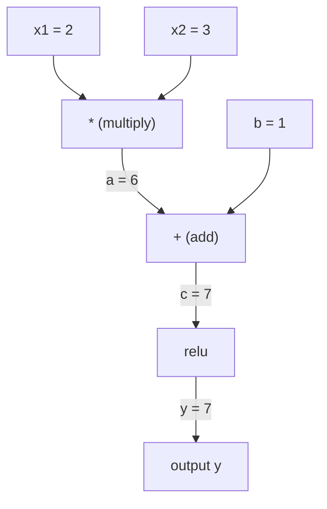
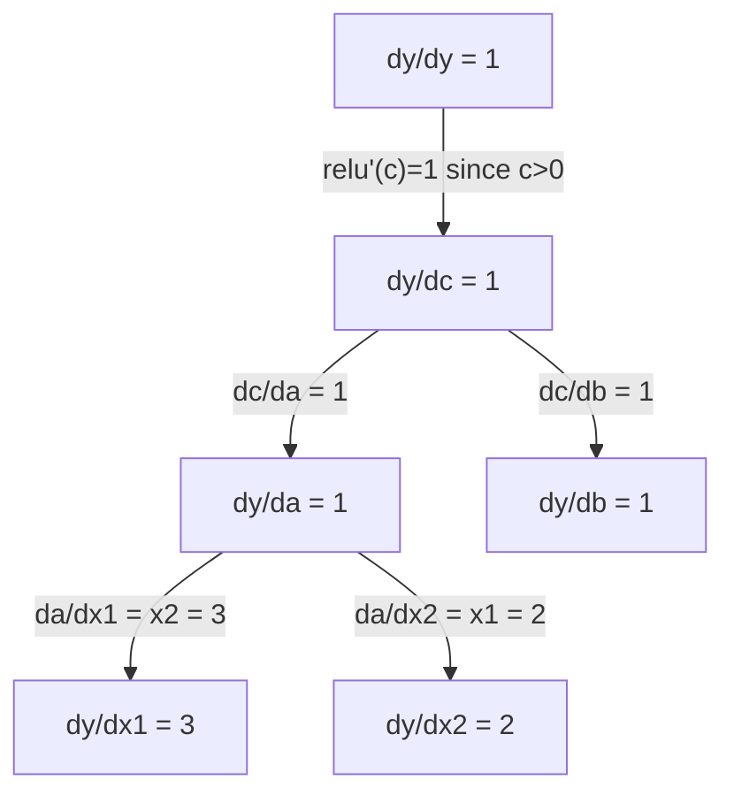

# 链式法则与自动微分

> 链式法则是每个神经网络学习背后的引擎。

**类型：** 构建
**语言：** Python
**前置知识：** 阶段 1，第 04 课（导数与梯度）
**时长：** 约 90 分钟

## 学习目标

- 构建一个微型自动梯度引擎（`Value` 类），记录运算并通过反向模式自动微分计算梯度
- 基于拓扑排序实现计算图的前向传播和反向传播
- 仅使用从零构建的自动梯度引擎，构造并训练一个在异或（XOR）数据集上的多层感知机
- 通过数值有限差分进行梯度检查，验证自动微分的正确性

## 问题

你可以计算简单函数的导数。但神经网络不是简单函数——它是数百个函数的复合：矩阵乘法、加偏置、应用激活函数、矩阵乘法、Softmax、交叉熵损失。输出是一个函数的函数的函数……

要训练网络，需要损失函数对**每一个**权重的梯度做处理。对百万级别的参数手工计算是不可能的；用数值方法（有限差分）又太慢。

链式法则提供了数学基础，自动微分则给出了算法实现。两者结合，你可以用与一次前向传播相当的时间，计算出任意函数组合的精确梯度。

这正是 PyTorch、TensorFlow 和 JAX 的工作原理。你将从头构建一个微型版本。

## 概念

### 链式法则

如果 $y = f(g(x))$，那么 $y$ 关于 $x$ 的导数为：

$$
\frac{dy}{dx} = \frac{dy}{dg} \cdot \frac{dg}{dx} = f'(g(x)) \cdot g'(x)
$$

沿链将导数相乘。每个环节贡献其局部导数。

示例：$y = \sin(x^2)$

$$
\begin{aligned}
g(x) &= x^2, \quad g'(x) = 2x \\[5pt]
f(g) &= \sin(g), \quad f'(g) = \cos(g) \\[15pt]
\frac{dy}{dx} &= \cos(x^2) \cdot 2x
\end{aligned}
$$

对于更深的复合结构，链式法则继续扩展：

$$
\begin{aligned}
y &= f(g(h(x))) \\[15pt]
\frac{dy}{dx} &= f'(g(h(x))) \cdot g'(h(x)) \cdot h'(x)
\end{aligned}
$$

神经网络中的每一层，都是这条链上的一环。

### 计算图

计算图让链式法则可视化。每个操作成为一个节点。数据沿图向前流动，梯度沿图反向传播。

**前向传播（计算值）：**



**反向传播（计算梯度）：**



反向传播在每个节点应用链式法则，将梯度从输出传播到输入。

### 前向模式与反向模式

通过计算图应用链式法则有两种方式。

**前向模式**从输入开始，将导数向前传递。它计算 $dx/dx = 1$ 并通过每个运算传播。适用于输入少、输出多的场景。

前向模式：从 $dx/dx = 1$ 开始，向前传播：

$$
\begin{aligned}
x &= 2, \quad (dx/dx = 1) \\[5pt]
a &= x^2, \quad (da/dx = 2x = 4) \\[5pt]
y &= \sin(a), \quad (dy/dx = \cos(a) \cdot da/dx = \cos(4) \cdot 4 = -2.615)
\end{aligned}
$$

**反向模式**从输出开始，将梯度向后拉取。它计算 $dy/dy = 1$ 并反向通过每个运算传播。适用于输入多、输出少的场景。

反向模式：从 $dy/dy = 1$ 开始，反向传播：

$$
\begin{aligned}
y &= \sin(a), \quad (dy/dy = 1) \\[5pt]
a &= x^2, \quad (dy/da = \cos(a) = \cos(4) = -0.654) \\[5pt]
x &= 2, \quad (dy/dx = dy/da \cdot da/dx = -0.654 \times 4 = -2.615)
\end{aligned}
$$

神经网络有数百万个输入（权重）和一个输出（损失）。反向模式只需一次反向传播就能计算所有梯度。这就是反向传播采用反向模式的原因。

| 模式 | 种子值 | 方向 | 最佳场景 |
|------|--------|------|----------|
| 前向 | $dx_i/dx_i = 1$ | 从输入到输出 | 输入少、输出多 |
| 反向 | $dy/dy = 1$ | 从输出到输入 | 输入多、输出少（神经网络） |

### 前向模式的二元数

前向模式可以用二元数优雅地实现。二元数的形式为 $a + b\epsilon$，其中 $\epsilon^2 = 0$。

二元数形式为（值，导数）：

$$
(\text{value}, \text{derivative})
$$

$(2, 1)$ 表示：值为 2，关于 $x$ 的导数为 1。

算术规则：

$$
\begin{aligned}
(a, a') + (b, b') &= (a + b,\ a' + b') \\[5pt]
(a, a') \times (b, b') &= (a \times b,\ a' \times b + a \times b') \\[5pt]
\sin(a, a') &= (\sin(a),\ \cos(a) \cdot a')
\end{aligned}
$$

将输入变量的导数种子设为 1，导数就会自动通过每个运算传播。

### 构建一个自动梯度引擎

一个自动梯度引擎需要三样东西：

1. **值包装。** 将每个数值包装在一个同时存储值和梯度的对象中。
2. **图记录。** 每个运算记录其输入和局部梯度函数。
3. **反向传播。** 对计算图进行拓扑排序，然后反向遍历，在每${}$个节点应用链式法则。

这正是 PyTorch 的 `autograd` 所做的。`torch.Tensor` 类包装数值，在 `requires_grad=True` 时记录运算，并在调用 `.backward()` 时计算梯度。

### PyTorch Autograd 的工作原理

当你编写 PyTorch 代码时：

```python
x = torch.tensor(2.0, requires_grad=True)
y = x ** 2 + 3 * x + 1
y.backward()
print(x.grad)  # 7.0 = 2*x + 3 = 2*2 + 3
```

PyTorch 内部：

1. 为 `x` 创建一个 `requires_grad=True` 的 `Tensor` 节点
2. 每个运算（`**`、`*`、`+`）都会创建一个新节点并记录反向函数
3. `y.backward()` 触发通过已记录计算图的反向模式自动微分
4. 每个节点的 `grad_fn` 计算局部梯度并将其传递给父节点
5. 梯度通过加法（而非替换）累积在 `.grad` 属性中

计算图是动态的（define-by-run）。每次前向传播都会构建一个新的计算图。这就是为什么 PyTorch 支持在模型内部控制流（if/else、循环）。

## 动手构建

### 步骤 1：Value 类

```python
class Value:
    def __init__(self, data, children=(), op=''):
        self.data = data          # 存储的数值
        self.grad = 0.0           # 梯度，初始化为 0
        # _backward: 局部反向传播函数，计算当前节点对子节点的梯度贡献
        # 每个运算（+、*、relu 等）会替换这个默认的空函数
        self._backward = lambda: None
        self._prev = set(children)  # 产生当前节点的子节点集合，构成计算图的有向边
        self._op = op               # 产生当前节点的运算类型（用于调试/可视化）

    def __repr__(self):
        return f"Value(data={self.data:.4f}, grad={self.grad:.4f})"
```

每个 `Value` 存储其数值数据、梯度（初始为零）、一个反向传播函数，以及产生它的子节点指针。

### 步骤 2：带梯度追踪的算术运算

```python
    def __add__(self, other):
        # 自动将标量包装为 Value 对象，统一处理
        other = other if isinstance(other, Value) else Value(other)
        out = Value(self.data + other.data, (self, other), '+')

        # 【反向传播逻辑】加法的局部梯度：
        # c = a + b → dc/da = 1, dc/db = 1
        # 因此上游梯度直接等分传递到两个输入
        def _backward():
            # 使用 += 而非 =：当一个值被多个运算共享时，梯度需要累加
            self.grad += out.grad
            other.grad += out.grad
        out._backward = _backward
        return out

    def __mul__(self, other):
        other = other if isinstance(other, Value) else Value(other)
        out = Value(self.data * other.data, (self, other), '*')

        # 【反向传播逻辑】乘法的局部梯度：
        # c = a * b → dc/da = b, dc/db = a
        # 用对方的数值乘以上游梯度
        def _backward():
            self.grad += other.data * out.grad
            other.grad += self.data * out.grad
        out._backward = _backward
        return out

    def relu(self):
        # ReLU 激活函数：f(x) = max(0, x)
        # 当 x > 0 时梯度为 1，否则为 0（不可导点取 1）
        out = Value(max(0, self.data), (self,), 'relu')

        def _backward():
            self.grad += (1.0 if out.data > 0 else 0.0) * out.grad
        out._backward = _backward
        return out
```

每个运算创建一个闭包，它知道如何计算局部梯度并乘以上游梯度（`out.grad`）。使用 `+=` 处理一个值被多个运算使用的情况（梯度累积）。

### 步骤 3：反向传播

```python
    def backward(self):
        # 【策略说明】拓扑排序确保梯度按依赖关系反向传播：
        # 一个节点只有在其所有子节点的梯度都计算完成后，才能将自己的梯度继续前传。
        # 这是保证链式法则正确应用的关键。

        # 第一步：对计算图进行拓扑排序
        topo = []
        visited = set()

        def build_topo(v):
            """深度优先遍历，按后序将节点加入列表"""
            if v not in visited:
                visited.add(v)
                for child in v._prev:     # 先递归处理所有子节点（依赖）
                    build_topo(child)
                topo.append(v)            # 当前节点在子节点之后入列

        build_topo(self)

        # 第二步：设置输出节点的种子梯度 dy/dy = 1
        self.grad = 1.0

        # 第三步：逆拓扑序逐节点应用链式法则
        # 逆序保证每个节点处理时，它的上游梯度（out.grad）已经计算完毕
        for v in reversed(topo):
            v._backward()
```

拓扑排序确保每个节点的梯度在传播到其子节点之前已完全计算。种子梯度为 1.0（$dy/dy = 1$）。

### 步骤 4：完整的引擎——更多运算

基础的 `Value` 类处理加法、乘法和 ReLU。一个真正的自动梯度引擎需要更多运算。以下是构建神经网络所需的运算：

```python
    def __neg__(self):
        return self * -1

    def __sub__(self, other):
        # 减法复用加法和负数：a - b = a + (-b)
        # 因为加法已有梯度定义，减法自动获得正确的梯度，无需重新实现
        return self + (-other)

    def __radd__(self, other):
        # 处理 int/float + Value 的情况，右加委托给左加
        return self + other

    def __rmul__(self, other):
        return self * other

    def __rsub__(self, other):
        return other + (-self)

    def __pow__(self, n):
        # 计算 self.data 的 n 次幂，n 是标量（非 Value）
        # 用于 MSE 损失中的平方运算：(pred - target)^2
        out = Value(self.data ** n, (self,), f'**{n}')

        # 【反向传播】幂函数的导数：d/dx (x^n) = n * x^(n-1)
        def _backward():
            self.grad += n * (self.data ** (n - 1)) * out.grad
        out._backward = _backward
        return out

    def __truediv__(self, other):
        # 除法复用乘法和负指数：a / b = a * b^(-1)
        # 由于乘法已有梯度定义，除法自动获得正确的梯度
        return self * (other ** -1) if isinstance(other, Value) else self * (Value(other) ** -1)

    def exp(self):
        # 自然指数 e^x，用于 Softmax 和对数似然
        import math
        e = math.exp(self.data)
        out = Value(e, (self,), 'exp')

        # 【反向传播】指数函数的导数：d/dx e^x = e^x
        # 微积分中优美的性质：指数函数的导数就是它自身
        def _backward():
            self.grad += e * out.grad
        out._backward = _backward
        return out

    def log(self):
        # 自然对数 ln(x)，用于交叉熵损失和对数概率
        import math
        out = Value(math.log(self.data), (self,), 'log')

        # 【反向传播】对数函数的导数：d/dx ln(x) = 1/x
        def _backward():
            self.grad += (1.0 / self.data) * out.grad
        out._backward = _backward
        return out

    def tanh(self):
        # 双曲正切激活函数，将输出映射到 (-1, 1) 区间
        # 相比 sigmoid 梯度更大，缓解梯度消失问题
        import math
        t = math.tanh(self.data)
        out = Value(t, (self,), 'tanh')

        # 【反向传播】tanh 的导数：1 - tanh^2
        # 计算简单且 tanh 输出已在手，无需重新计算
        def _backward():
            self.grad += (1 - t ** 2) * out.grad
        out._backward = _backward
        return out
```

**每个运算的重要性：**

| 运算 | 反向传播规则 | 应用场景 |
|------|-------------|---------|
| `__sub__` | 复用加法+负数 | 损失计算（预测值 - 目标值） |
| `__pow__` | $n \cdot x^{n-1}$ | 多项式激活函数、均方误差（误差平方） |
| `__truediv__` | 复用乘法+幂次 $(-1)$ | 归一化、学习率缩放 |
| `exp` | $e^x \cdot$ 上游梯度 | Softmax、对数似然 |
| `log` | $\frac{1}{x} \cdot$ 上游梯度 | 交叉熵损失、对数概率 |
| `tanh` | $1 - \tanh^2 \cdot$ 上游梯度 | 经典激活函数 |

巧妙之处在于：`__sub__` 和 `__truediv__` 基于已有运算定义。由于链式法则通过底层的加法/乘法/幂运算复合，它们自动获得正确的梯度。

### 步骤 5：从零构建微型多层感知机

有了完整的 `Value` 类，你就可以构建神经网络了。不需要 PyTorch，不需要 NumPy——只需要 `Value` 和链式法则。

```python
import random

class Neuron:
    """单个神经元：计算 tanh(w1*x1 + w2*x2 + ... + b)"""
    def __init__(self, n_inputs):
        # 权重初始化为 [-1, 1] 的均匀分布，打破对称性
        self.w = [Value(random.uniform(-1, 1)) for _ in range(n_inputs)]
        self.b = Value(0.0)  # 偏置初始化为 0

    def __call__(self, x):
        # 加权求和后经过 tanh 激活函数
        # sum() 的初始值设为 self.b，相当于先加偏置再累加乘积
        act = sum((wi * xi for wi, xi in zip(self.w, x)), self.b)
        return act.tanh()

    def parameters(self):
        # 返回该神经元所有可训练参数（权重 + 偏置）
        return self.w + [self.b]

class Layer:
    """全连接层：包含 n_outputs 个神经元，每个连接所有输入"""
    def __init__(self, n_inputs, n_outputs):
        self.neurons = [Neuron(n_inputs) for _ in range(n_outputs)]

    def __call__(self, x):
        # 依次通过每个神经元，返回输出列表
        return [n(x) for n in self.neurons]

    def parameters(self):
        # 展平本层所有神经元的参数
        return [p for n in self.neurons for p in n.parameters()]

class MLP:
    """多层感知机：堆叠多个全连接层"""
    def __init__(self, sizes):
        # sizes: [输入维度, 隐藏层1维度, ..., 输出维度]
        # 相邻两个尺寸之间创建一个全连接层
        self.layers = [Layer(sizes[i], sizes[i+1]) for i in range(len(sizes)-1)]

    def __call__(self, x):
        # 逐层前向传播
        for layer in self.layers:
            x = layer(x)
        # 单输出时直接返回标量 Value，方便后续计算
        return x[0] if len(x) == 1 else x

    def parameters(self):
        # 展平所有层的所有参数
        return [p for layer in self.layers for p in layer.parameters()]
```

一个 `Neuron` 计算 $\tanh(w_1 x_1 + w_2 x_2 + \cdots + b)$。`Layer` 是神经元的列表。`MLP` 堆叠多个层。每个权重都是一个 `Value`，因此调用 `loss.backward()` 会将梯度传播到所有参数。

**在异或数据集上训练：**

```python
random.seed(42)
model = MLP([2, 4, 1])  # 2 个输入，4 个隐藏神经元，1 个输出

xs = [[0, 0], [0, 1], [1, 0], [1, 1]]
ys = [-1, 1, 1, -1]  # XOR 模式（使用 -1/1 适配 tanh 输出范围）

for step in range(100):
    # 前向传播：计算所有样本的预测值
    preds = [model(x) for x in xs]
    # 均方误差损失：累加所有样本的 (预测值 - 目标值)^2
    loss = sum((p - y) ** 2 for p, y in zip(preds, ys))

    # 【关键】每次更新前将梯度归零，防止前一步的梯度累积导致错误更新
    for p in model.parameters():
        p.grad = 0.0
    # 反向传播：自动计算损失对所有参数的梯度
    loss.backward()

    # 梯度下降更新：沿梯度反方向调整参数，步长为学习率
    # 选择 lr=0.05 的经验：太大（如 1.0）会导致震荡不收敛，
    # 太小（如 0.001）则收敛过慢，100 步达不到理想效果
    lr = 0.05
    for p in model.parameters():
        p.data -= lr * p.grad

    if step % 20 == 0:
        print(f"step {step:3d}  loss = {loss.data:.4f}")

print("\n训练后预测结果：")
for x, y in zip(xs, ys):
    print(f"  input={x}  target={y:2d}  pred={model(x).data:6.3f}")
```

这就是 micrograd——一个完全在纯 Python 中实现、带有自动微分的完整神经网络训练循环。每一个商业深度学习框架都在大规模地做同样的事情。

### 步骤 6：梯度检查

如何知道你的自动微分是正确的？将其与数值导数比较。这就是梯度检查。

```python
def gradient_check(build_expr, x_val, h=1e-7):
    """梯度检查：比较自动微分梯度与数值梯度

    使用中心差分公式：(f(x+h) - f(x-h)) / (2h) 计算数值梯度，
    精度为 O(h^2)，比单侧差分更准确。

    参数:
        build_expr: 接受 Value 返回 Value 的表达式函数
        x_val:      x 的数值
        h:          差分步长，取 1e-7 平衡截断误差和舍入误差
    """
    # 自动微分梯度
    x = Value(x_val)
    y = build_expr(x)
    y.backward()
    autodiff_grad = x.grad

    # 数值梯度（中心差分）
    y_plus = build_expr(Value(x_val + h)).data
    y_minus = build_expr(Value(x_val - h)).data
    numerical_grad = (y_plus - y_minus) / (2 * h)

    diff = abs(autodiff_grad - numerical_grad)
    return autodiff_grad, numerical_grad, diff
```

用复杂表达式测试：

```python
def expr(x):
    # 复合函数：tanh(x^3 + 2x + 1)，包含幂、乘、加和 tanh
    return (x ** 3 + x * 2 + 1).tanh()

ad, num, diff = gradient_check(expr, 0.5)
print(f"自动微分梯度:  {ad:.8f}")
print(f"数值梯度:      {num:.8f}")
print(f"差异:           {diff:.2e}")
# 差异应 < 1e-5，否则反向传播实现有误
```

梯度检查在实现新运算时至关重要。如果反向传播有 bug，数值检查会立刻发现。每个严肃的深度学习实现都会在开发过程中运行梯度检查。

**何时使用梯度检查：**

| 场景 | 需要梯度检查吗？ |
|------|-----------------|
| 为自动梯度引擎添加新运算 | 是，一定需要 |
| 调试不收敛的训练循环 | 是，先检查梯度 |
| 生产训练 | 否，太慢（每个参数需要 2 次前向传播） |
| 自动梯度代码的单元测试 | 是，将其自动化 |

### 步骤 7：与手动计算对照验证

```python
x1 = Value(2.0)
x2 = Value(3.0)
a = x1 * x2          # a = 6.0
b = a + Value(1.0)    # b = 7.0
y = b.relu()          # y = 7.0

y.backward()

print(f"y = {y.data}")          # 7.0
print(f"dy/dx1 = {x1.grad}")   # 3.0 (= x2)
print(f"dy/dx2 = {x2.grad}")   # 2.0 (= x1)
```

手动验证：$y = \text{relu}(x_1 \cdot x_2 + 1)$。由于 $x_1 \cdot x_2 + 1 = 7 > 0$，ReLU 退化为恒等映射。
$dy/dx_1 = x_2 = 3$，$dy/dx_2 = x_1 = 2$。引擎计算结果与手动计算一致。

## 应用

### 与 PyTorch 对照验证

```python
import torch

x1 = torch.tensor(2.0, requires_grad=True)
x2 = torch.tensor(3.0, requires_grad=True)
a = x1 * x2
b = a + 1.0
y = torch.relu(b)
y.backward()

print(f"PyTorch dy/dx1 = {x1.grad.item()}")  # 3.0
print(f"PyTorch dy/dx2 = {x2.grad.item()}")  # 2.0
```

梯度相同。你的引擎与 PyTorch 计算结果一致，因为数学原理相同：通过链式法则进行反向模式自动微分。

### 更复杂的表达式

```python
a = Value(2.0)
b = Value(-3.0)
c = Value(10.0)
f = (a * b + c).relu()  # relu(2*(-3) + 10) = relu(4) = 4

f.backward()
print(f"df/da = {a.grad}")  # -3.0 (= b)
print(f"df/db = {b.grad}")  #  2.0 (= a)
print(f"df/dc = {c.grad}")  #  1.0
```

## 交付成果

本课程产出：
- `outputs/skill-autodiff.md` —— 构建和调试自动梯度系统的指南
- `code/autodiff.py` —— 一个可扩展的微型自动梯度引擎

此处构建的 `Value` 类是阶段 3 神经网络训练循环的基础。

## 练习

1. 为 `Value` 类添加 `__pow__` 方法，使其支持 $x^n$ 运算。验证 $d/dx (x^3)$ 在 $x=2$ 处的值为 $12.0$。

2. 添加 `tanh` 激活函数。验证 $\tanh'(0) = 1$ 且 $\tanh'(2) \approx 0.0707$。

3. 构建单个神经元的计算图：$y = \text{relu}(w_1 x_1 + w_2 x_2 + b)$。计算全部五个梯度并与 PyTorch 结果对比验证。

4. 使用二元数实现前向模式自动微分。创建一个 `Dual` 类，验证其与反向模式引擎给出相同的导数结果。

## 关键术语

| 术语 | 通俗解释 | 实际含义 |
|------|---------|---------|
| Chain rule（链式法则） | "把导数乘起来" | 复合函数的导数等于每个函数的局部导数在正确位置求值后的乘积 |
| Computational graph（计算图） | "网络结构图" | 一个有向无环图，节点为运算，边传递值（前向）或梯度（反向） |
| Forward mode（前向模式） | "向前推导数" | 从输入到输出传播导数的自动微分。每个输入变量需一次前向传播。 |
| Reverse mode（反向模式） | "反向传播" | 从输出到输入传播梯度的自动微分。每个输出变量需一次反向传播。 |
| Autograd（自动梯度） | "自动求梯度" | 记录数值上的运算，构建计算图，并通过链式法则计算精确梯度的系统 |
| Dual numbers（二元数） | "值加导数" | 形如 $a + b\epsilon$（其中 $\epsilon^2 = 0$）的数，通过算术运算法则携带导数信息 |
| Topological sort（拓扑排序） | "依赖顺序" | 对计算图节点排序，使每个节点排在所有依赖它的节点之前。梯度正确传播的前提。 |
| Gradient accumulation（梯度累积） | "相加，不替换" | 当一个值参与多个运算时，其梯度等于所有传入梯度贡献的总和 |
| Dynamic graph（动态图） | "运行时定义" | 每次前向传播重新构建的计算图，允许在模型内部使用 Python 控制流（PyTorch 风格） |
| Gradient checking（梯度检查） | "数值验证" | 将自动微分梯度与数值有限差分梯度对比，验证正确性。调试时不可或缺。 |
| MLP（多层感知机） | "多层神经网络" | 含一个或多个隐藏层的前馈神经网络。每个神经元计算加权和加偏置，再应用激活函数。 |
| Neuron（神经元） | "加权和 + 激活" | 基本单元：输出 = 激活函数($w_1 x_1 + w_2 x_2 + \cdots + b$)。权重和偏置是可学习参数。 |

## 拓展阅读

- [3Blue1Brown：反向传播的微积分原理](https://www.youtube.com/watch?v=tIeHLnjs5U8) —— 链式法则在神经网络中的可视化讲解
- [PyTorch Autograd 机制文档](https://pytorch.org/docs/stable/notes/autograd.html) —— 实际系统的工作原理
- [Baydin 等，机器学习中的自动微分：综述](https://arxiv.org/abs/1502.05767) —— 综合性参考文献
