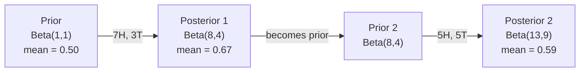

# 贝叶斯定理

> 概率论是关于你所期望的。贝叶斯定理是关于你所学习的。

**类型：** 构建
**语言：** Python
**前置要求：** 阶段 1，第 06 课（概率论基础）
**时间：** ~75 分钟

## 学习目标

- 应用贝叶斯定理，从先验概率（Prior）、似然（Likelihood）和证据（Evidence）计算后验概率（Posterior）
- 从头构建一个带拉普拉斯平滑（Laplace smoothing）和对数空间计算的朴素贝叶斯（Naive Bayes）文本分类器
- 比较最大似然估计（MLE）和最大后验估计（MAP），解释 MAP 如何对应 L2 正则化
- 使用 Beta-二项共轭先验（Beta-Binomial conjugate priors）实现顺序贝叶斯更新，用于 A/B 测试

## 问题

一项医学检测准确率 99%。你检测结果为阳性。你实际患病的概率是多少？

大多数人会说 99%。实际答案取决于该疾病的罕见程度。如果 10,000 人中只有 1 人患病，那么阳性结果只给你大约 1% 的患病概率。另外 99% 的阳性结果来自健康人的假警报。

这不是脑筋急转弯。这就是贝叶斯定理。每个垃圾邮件过滤器、每个医学诊断、每个量化不确定性的机器学习模型都使用相同的推理方式。你从一个信念开始。你看到证据。你更新信念。

如果你在理解这一点的情况下构建 ML 系统，你将误解模型输出、设定糟糕的阈值，并发布过度自信的预测。

## 核心概念

### 从联合概率到贝叶斯

你在第 06 课已经知道条件概率是：

$$
P(A|B) = \frac{P(A \cap B)}{P(B)}
$$

对称地：

$$
P(B|A) = \frac{P(A \cap B)}{P(A)}
$$

两个表达式共享同一个分子 $P(A \cap B)$。令它们相等并重排：

$$
P(A \cap B) = P(A|B) \cdot P(B) = P(B|A) \cdot P(A)
$$

因此：

$$
P(A|B) = \frac{P(B|A) \cdot P(A)}{P(B)}
$$

这就是贝叶斯定理。四个量，一个方程。

### 四个组成部分

| 部分 | 名称 | 含义 |
|------|------|------|
| P(A\|B) | 后验概率（Posterior） | 看到证据 B 后，你对 A 的更新信念 |
| P(B\|A) | 似然（Likelihood） | 如果 A 为真，看到证据 B 的可能性 |
| P(A) | 先验概率（Prior） | 看到任何证据前你对 A 的信念 |
| P(B) | 证据（Evidence） | 在所有可能性下看到 B 的总概率 |

证据项 $P(B)$ 充当归一化因子。你可以用全概率公式展开它：

$$
P(B) = P(B|A) \cdot P(A) + P(B|\neg A) \cdot P(\neg A)
$$

### 医学检测示例

一种疾病影响 10,000 人中的 1 人。检测准确率 99%（检出 99% 的患者，假阳性率 1%）。

先验：疾病罕见，$P(\text{sick}) = 0.0001$。

似然：检测能检出患者，$P(\text{positive}|\text{sick}) = 0.99$。

假阳性率：$P(\text{positive}|\text{healthy}) = 0.01$。

证据——全概率公式展开：

$$
\begin{aligned}
P(\text{positive}) &= P(\text{positive}|\text{sick}) \cdot P(\text{sick}) + P(\text{positive}|\text{healthy}) \cdot P(\text{healthy}) \\[15pt]
&= 0.99 \times 0.0001 + 0.01 \times 0.9999 \\[15pt]
&= 0.000099 + 0.009999 \\[15pt]
&= 0.010098
\end{aligned}
$$

后验：

$$
\begin{aligned}
P(\text{sick}|\text{positive}) &= \frac{P(\text{positive}|\text{sick}) \cdot P(\text{sick})}{P(\text{positive})} \\[15pt]
&= \frac{0.99 \times 0.0001}{0.010098} \\[15pt]
&= 0.0098 \\[15pt]
&= 0.98\%
\end{aligned}
$$

不到 1%。先验占主导。当一种病症罕见时，即使是准确的检测也会产生大部分假阳性。这就是为什么医生会要求确认检测。

### 垃圾邮件过滤器示例

你收到一封包含"lottery"这个词的邮件。它是垃圾邮件吗？

先验：30% 的邮件是垃圾邮件，$P(\text{spam}) = 0.3$。

似然：5% 的垃圾邮件包含"lottery"，$P(\text{"lottery"}|\text{spam}) = 0.05$。

$0.1\%$ 的正常邮件包含"lottery"，$P(\text{"lottery"}|\text{not spam}) = 0.001$。

证据：

$$
\begin{aligned}
P(\text{"lottery"}) &= 0.05 \times 0.3 + 0.001 \times 0.7 \\[15pt]
&= 0.015 + 0.0007 \\[15pt]
&= 0.0157
\end{aligned}
$$

后验：

$$
\begin{aligned}
P(\text{spam}|\text{"lottery"}) &= \frac{0.05 \times 0.3}{0.0157} \\[15pt]
&= 0.955 \\[15pt]
&= 95.5\%
\end{aligned}
$$

一个词将概率从 30% 提升到 95.5%。真正的垃圾邮件过滤器同时将贝叶斯应用于数百个词。

### 朴素贝叶斯：独立性假设

朴素贝叶斯将其扩展到多个特征，假设所有特征在给定类别下条件独立：

$$
P(\text{class} | \text{feature}_1, \text{feature}_2, \ldots, \text{feature}_n)
= \frac{P(\text{class}) \cdot P(\text{feature}_1|\text{class}) \cdot P(\text{feature}_2|\text{class}) \cdot \ldots \cdot P(\text{feature}_n|\text{class})}{P(\text{feature}_1, \text{feature}_2, \ldots, \text{feature}_n)}
$$

"朴素"的部分就是独立性假设。在文本中，单词的出现并不是独立的（"New"和"York"是相关的）。但这个假设在实践中出奇地好用，因为分类器只需要对类别进行排序，而不是产生校准过的概率。

由于分母对所有类别相同，你可以跳过它，只比较分子：

$$
\text{score}(\text{class}) = P(\text{class}) \cdot \prod_i P(\text{feature}_i | \text{class})
$$

选择得分最高的类别。

### 最大似然估计（MLE）

如何从训练数据中得到 $P(\text{feature}|\text{class})$？计数。

$$
P(\text{"free"}|\text{spam}) = \frac{\text{包含 "free" 的垃圾邮件数}}{\text{垃圾邮件总数}}
$$

这就是 MLE：选择使观测数据最可能的参数值。你在最大化似然函数，对于离散计数来说，它简化为相对频率。

问题：如果一个词在训练期间从未出现在垃圾邮件中，MLE 赋予它零概率。一个未见过的词就会杀死整个乘积。用拉普拉斯平滑修复：

$$
P(\text{word}|\text{class}) = \frac{\text{count}(\text{word}, \text{class}) + 1}{\text{total\_words\_in\_class} + \text{vocabulary\_size}}
$$

给每个计数加 1，确保没有概率为零。

### 最大后验估计（MAP）

MLE 问：什么参数能最大化 $P(\text{data}|\text{parameters})$？

MAP 问：什么参数能最大化 $P(\text{parameters}|\text{data})$？

由贝叶斯定理：

$$
P(\text{parameters}|\text{data}) \propto P(\text{data}|\text{parameters}) \cdot P(\text{parameters})
$$

MAP 在参数本身上加了一个先验。如果你认为参数应该很小，你就将其编码为一个惩罚大值的先验。这在机器学习中与 L2 正则化完全相同。岭回归中的"岭"惩罚本质上就是权重的正态先验。

| 估计方法 | 优化目标 | 机器学习等价 |
|----------|---------|-------------|
| MLE | $P(\text{data}|\text{params})$ | 无正则化训练 |
| MAP | $P(\text{data}|\text{params}) \times P(\text{params})$ | L2 / L1 正则化 |

### 贝叶斯学派 vs 频率学派：实际差异

频率学派将参数视为固定的未知量。他们问："如果我将这个实验重复很多次，会发生什么？"

贝叶斯学派将参数视为分布。他们问："根据我观察到的，我对参数有什么信念？"

对于构建 ML 系统，实际差异如下：

| 方面 | 频率学派 | 贝叶斯学派 |
|------|---------|----------|
| 输出 | 点估计 | 值的分布 |
| 不确定性 | 置信区间（关于过程） | 可信区间（关于参数） |
| 小数据 | 可能过拟合 | 先验充当正则化 |
| 计算 | 通常更快 | 通常需要采样（MCMC） |

大多数生产环境中的 ML 是频率学派（SGD、点估计）。贝叶斯方法在需要校准的不确定性时大放异彩（医疗决策、安全关键系统），或者数据稀缺时（少样本学习、冷启动）。

### 为什么贝叶斯思维对 ML 很重要

联系比类比更深：

**先验就是正则化。** 权重的正态先验是 L2 正则化。拉普拉斯先验是 L1。每次你添加正则化项时，你都在做一个关于你期望什么参数值的贝叶斯陈述。

**后验就是不确定性。** 单个预测概率并不能告诉你模型对该估计有多自信。贝叶斯方法给你一个分布："我认为 P(spam) 在 0.8 到 0.95 之间。"

**贝叶斯更新就是在在线学习。** 今天的后验成为明天的先验。当你的模型看到新数据时，它逐步更新信念，而不是从头重新训练。

**模型比较是贝叶斯的。** 贝叶斯信息准则（BIC）、边际似然和贝叶斯因子都使用贝叶斯推理在不同模型之间做选择，而不会过拟合。

## 动手构建

### 第 1 步：贝叶斯定理函数

```python
def bayes(prior, likelihood, false_positive_rate):
    # 使用全概率公式计算证据因子 P(positive)
    # evidence = P(positive|sick) * P(sick) + P(positive|healthy) * P(healthy)
    evidence = likelihood * prior + false_positive_rate * (1 - prior)
    # 贝叶斯公式：P(sick|positive) = P(positive|sick) * P(sick) / P(positive)
    posterior = likelihood * prior / evidence
    return posterior

result = bayes(prior=0.0001, likelihood=0.99, false_positive_rate=0.01)
print(f"P(sick|positive) = {result:.4f}")
```

### 第 2 步：朴素贝叶斯分类器

以下实现了一个完整的朴素贝叶斯分类器。核心思路：对每个类别计算"先验概率 × 各词的条件概率"，选择乘积最大的类别。为避免浮点下溢，在对数空间中完成所有计算。

```python
import math
from collections import defaultdict

class NaiveBayes:
    def __init__(self, smoothing=1.0):
        # 拉普拉斯平滑参数 α：为每个词在计数上加 α，
        # 防止训练集未出现过的词导致整个概率乘积为零
        self.smoothing = smoothing
        # 每个类别的文档计数，用于计算 P(class)
        self.class_counts = defaultdict(int)
        # 每个类别中每个词的计数，用于计算 P(word|class)
        self.word_counts = defaultdict(lambda: defaultdict(int))
        # 每个类别的总词数，用作条件概率的分母
        self.class_word_totals = defaultdict(int)
        # 整个词表集合，用于平滑时的归一化
        self.vocab = set()

    def train(self, documents, labels):
        """训练分类器：统计每个类别中每个词的出现频次和文档数"""
        for doc, label in zip(documents, labels):
            self.class_counts[label] += 1
            words = doc.lower().split()
            for word in words:
                self.word_counts[label][word] += 1
                self.class_word_totals[label] += 1
                self.vocab.add(word)

    def predict(self, document):
        """预测文档类别：在对数空间中计算每个类别的得分，选最高分"""
        words = document.lower().split()
        total_docs = sum(self.class_counts.values())
        vocab_size = len(self.vocab)
        best_class = None
        best_score = float("-inf")
        for cls in self.class_counts:
            # P(class) 的对数——类别先验
            score = math.log(self.class_counts[cls] / total_docs)
            for word in words:
                count = self.word_counts[cls].get(word, 0)
                total = self.class_word_totals[cls]
                # P(word|class) 的对数，使用拉普拉斯平滑：
                # (count + α) / (total + α * vocab_size)
                # 加 α * vocab_size 确保所有词的条件概率之和为 1
                score += math.log((count + self.smoothing) / (total + self.smoothing * vocab_size))
            if score > best_score:
                best_score = score
                best_class = cls
        return best_class
```

使用对数概率防止下溢。连乘许多小概率会产生浮点数无法表示的极小数字。而对数概率求和是数值稳定的，数学上等价。

### 第 3 步：在垃圾邮件数据上训练

```python
# 训练数据：5 条垃圾邮件 (spam) + 7 条正常邮件 (ham)
# 小数据集便于观察每个词对分类决策的影响
train_docs = [
    "win free money now",
    "free lottery ticket winner",
    "claim your prize today free",
    "urgent offer free cash",
    "congratulations you won free",
    "meeting tomorrow at noon",
    "project update attached",
    "can we schedule a call",
    "quarterly report review",
    "lunch on thursday sounds good",
    "team standup notes attached",
    "please review the pull request",
]

train_labels = [
    "spam", "spam", "spam", "spam", "spam",
    "ham", "ham", "ham", "ham", "ham", "ham", "ham",
]

classifier = NaiveBayes()
classifier.train(train_docs, train_labels)

# 测试消息：混合了垃圾和正常词汇
test_messages = [
    "free money waiting for you",
    "meeting rescheduled to friday",
    "you won a free prize",
    "please review the attached report",
]

for msg in test_messages:
    print(f"  '{msg}' -> {classifier.predict(msg)}")
```

### 第 4 步：查看学习到的概率

```python
def show_top_words(classifier, cls, n=5):
    """展示某个类别中条件概率最高的 n 个词，帮助理解分类器的决策依据"""
    vocab_size = len(classifier.vocab)
    total = classifier.class_word_totals[cls]
    probs = {}
    for word in classifier.vocab:
        count = classifier.word_counts[cls].get(word, 0)
        # 使用与 predict 相同的平滑公式，确保概率一致
        probs[word] = (count + classifier.smoothing) / (total + classifier.smoothing * vocab_size)
    sorted_words = sorted(probs.items(), key=lambda x: x[1], reverse=True)
    for word, prob in sorted_words[:n]:
        print(f"    {word}: {prob:.4f}")

print("\nTop spam words:")
show_top_words(classifier, "spam")
print("\nTop ham words:")
show_top_words(classifier, "ham")
```

## 使用现成工具

Scikit-learn 提供了可直接用于生产的朴素贝叶斯实现：

```python
from sklearn.feature_extraction.text import CountVectorizer
from sklearn.naive_bayes import MultinomialNB
from sklearn.metrics import classification_report

# CountVectorizer：将文本转为词频矩阵，自动处理分词、转小写和词表构建
vectorizer = CountVectorizer()
X_train = vectorizer.fit_transform(train_docs)
# MultinomialNB：多项分布朴素贝叶斯，内部实现拉普拉斯平滑和对数概率
clf = MultinomialNB()
clf.fit(X_train, train_labels)

X_test = vectorizer.transform(test_messages)
predictions = clf.predict(X_test)
for msg, pred in zip(test_messages, predictions):
    print(f"  '{msg}' -> {pred}")
```

相同的算法。CountVectorizer 处理分词和词表构建。MultinomialNB 内部处理平滑和对数概率。你从头实现的版本用 40 行代码做同样的事情。

## 进阶应用

这里构建的 NaiveBayes 类展示了完整的流程：分词、带拉普拉斯平滑的概率估计、对数空间预测。`code/bayes.py` 中的代码无需标准库以外的依赖即可端到端运行。

### 共轭先验

当先验和后验属于同一分布族时，该先验被称为"共轭"的。这使得贝叶斯更新在代数上非常简洁——你无需数值积分即可得到闭式后验。

| 似然分布 | 共轭先验 | 后验 | 示例 |
|---------|-----------|---------|---------|
| 伯努利分布（Bernoulli） | $\text{Beta}(a, b)$ | $\text{Beta}(a + s, b + f)$ | 硬币偏置估计 |
| 正态分布（已知方差） | $\text{Normal}(\mu_0, \sigma_0)$ | $\text{Normal}(\text{加权均值}, \text{更小方差})$ | 传感器校准 |
| 泊松分布（Poisson） | $\text{Gamma}(a, b)$ | $\text{Gamma}(a + \sum x_i, b + n)$ | 到达率建模 |
| 多项分布（Multinomial） | $\text{Dirichlet}(\alpha)$ | $\text{Dirichlet}(\alpha + \text{计数})$ | 主题建模、语言模型 |

为什么这很重要：没有共轭先验，你需要蒙特卡洛采样或变分推断来近似后验。有了共轭先验，你只需要更新两个数字。

Beta 分布是实践中使用最广泛的共轭先验。$\text{Beta}(a, b)$ 表示你对一个概率参数的信念。其均值为 $a/(a+b)$。$a+b$ 越大，分布越集中（越有信心）。

Beta 先验的特殊情况：
- $\text{Beta}(1, 1)$ = 均匀分布。你对参数没有偏好。
- $\text{Beta}(10, 10)$ = 在 0.5 处尖峰。你强烈认为参数接近 0.5。
- $\text{Beta}(1, 10)$ = 偏向 0。你认为参数很小。

更新规则极其简单：

$$
\begin{aligned}
\text{Prior:} &\quad \text{Beta}(a, b) \\[15pt]
\text{Data:} &\quad s \text{ 次成功}, f \text{ 次失败} \\[15pt]
\text{Posterior:} &\quad \text{Beta}(a + s, b + f)
\end{aligned}
$$

无需积分。无需采样。只需加法。

### 顺序贝叶斯更新

贝叶斯推理天然是顺序性的。今天的后验成为明天的先验。这就是真实系统如何增量学习，而无需重新处理所有历史数据。

具体示例：估计一个硬币是否公平。

**第 1 天：还没有数据。**
从 $\text{Beta}(1, 1)$ 开始——均匀先验。你没有偏好。
- 先验均值：0.5
- 先验在 $[0, 1]$ 区间平坦

**第 2 天：观察到 7 次正面，3 次反面。**
后验 = $\text{Beta}(1 + 7, 1 + 3) = \text{Beta}(8, 4)$
- 后验均值：$8/12 = 0.667$
- 证据表明硬币偏向正面

**第 3 天：又观察到 5 次正面，5 次反面。**
使用昨天的后验作为今天的先验。
后验 = $\text{Beta}(8 + 5, 4 + 5) = \text{Beta}(13, 9)$
- 后验均值：$13/22 = 0.591$
- 平衡的新数据将估计值拉回 0.5



观测顺序并不重要。用所有 12 次正面和 8 次反面一次性更新 $\text{Beta}(1,1)$ 得到 $\text{Beta}(13, 9)$——相同的结果。顺序更新和批量更新在数学上是等价的。但顺序更新让你可以在每一步做出决策，而无需存储原始数据。

这是生产环境中 ML 系统在线学习的基础。汤普森采样（Thompson sampling）用于 Bandit 问题、增量推荐系统和流式异常检测器都使用这种模式。

### 与 A/B 测试的联系

A/B 测试实际上是贝叶斯推理的变体。

场景：你在测试两种按钮颜色。变体 A（蓝色）和变体 B（绿色）。你想知道哪种获得更多点击。

贝叶斯 A/B 测试：

1. **先验。** 两个变体都从 $\text{Beta}(1, 1)$ 开始。没有先验偏好。
2. **数据。** 变体 A：1000 次展示中 50 次点击。变体 B：1000 次展示中 65 次点击。
3. **后验。**
   - A：$\text{Beta}(1 + 50, 1 + 950) = \text{Beta}(51, 951)$。均值 $= 0.051$
   - B：$\text{Beta}(1 + 65, 1 + 935) = \text{Beta}(66, 936)$。均值 $= 0.066$
4. **决策。** 计算 $P(B > A)$——B 的真实转化率高于 A 的概率。

解析计算 $P(B > A)$ 很困难。但蒙特卡洛使其变得简单：

1. 从 $\text{Beta}(51, 951)$ 抽取 100,000 个样本 -> samples_A
2. 从 $\text{Beta}(66, 936)$ 抽取 100,000 个样本 -> samples_B
3. $P(B > A)$ = 样本中 B > A 的比例

如果 $P(B > A) > 0.95$，你发布变体 B。如果它在 0.05 到 0.95 之间，你继续收集数据。如果 $P(B > A) < 0.05$，你发布变体 A。

相较于频率学派 A/B 测试的优势：

- 你得到一个直接的概率陈述："B 更好的概率是 97%"
- 没有 p 值的混淆。没有"未能拒绝原假设"的模棱两可。
- 你可以在任何时间检查结果，而不会膨胀假阳性率（没有"窥视问题"）
- 你可以纳入先验知识（例如，以前的测试表明转化率通常在 3-8%）

| 方面 | 频率学派 A/B 测试 | 贝叶斯 A/B 测试 |
|---------|----------------|--------------|
| 输出 | p 值 | $P(B > A)$ |
| 解释 | "如果 A=B，这组数据有多令人惊讶？" | "B 比 A 好的概率有多大？" |
| 提前停止 | 膨胀假阳性率 | 任何时刻都是安全的（给定合理选择的先验和正确指定的模型） |
| 先验知识 | 不使用 | 编码为 Beta 先验 |
| 决策规则 | $p < 0.05$ | $P(B > A) >$ 阈值 |

## 练习

1. **多次检测。** 一位患者两次独立的检测结果均为阳性（两次检测均 99% 准确，疾病患病率 1/10,000）。两次检测后患病的概率是多少？使用第一次检测的后验作为第二次检测的先验。

2. **平滑的影响。** 用平滑值 0.01、0.1、1.0 和 10.0 运行垃圾邮件分类器。Top 词的概率如何变化？如果 smoothing=0 且有一个词只出现在正常邮件中，会发生什么？

3. **添加特征。** 扩展 NaiveBayes 类，在词频之外也使用消息长度（短/长）作为特征。从训练数据中估计 $P(\text{short}|\text{spam})$ 和 $P(\text{short}|\text{ham})$，并将其纳入预测得分。

4. **手工计算 MAP。** 给定观测数据（10 次投掷硬币中 7 次正面），使用 $\text{Beta}(2,2)$ 先验计算偏置的 MAP 估计。与 MLE 估计（7/10）比较。

## 关键术语

| 术语（English） | 通俗说法 | 实际含义 |
|------|---------|---------|
| Prior | "我的初始猜测" | $P(\text{假设})$ 在观测到证据之前。在 ML 中：正则化项。 |
| Likelihood | "数据拟合得有多好" | $P(\text{证据}\|\text{假设})$。在特定假设下观测数据的可能性。 |
| Posterior | "我更新后的信念" | $P(\text{假设}\|\text{证据})$。先验乘以似然再归一化。 |
| Evidence | "归一化常数" | 所有假设下的 $P(\text{数据})$。确保后验之和为 1。 |
| Naive Bayes | "那个简单的文本分类器" | 一个假设给定类别下特征条件独立的分类器。尽管假设不成立但效果很好。 |
| Laplace smoothing | "加一平滑" | 给每个特征加一个小计数，防止未见过的数据产生零概率。 |
| MLE | "直接用频率" | 选择最大化 $P(\text{数据}\|\text{参数})$ 的参数。无先验，小数据可能过拟合。 |
| MAP | "带先验的 MLE" | 选择最大化 $P(\text{数据}\|\text{参数}) \times P(\text{参数})$ 的参数。等价于正则化 MLE。 |
| Log-probability | "在对数空间计算" | 使用 $\log(P)$ 代替 $P$，避免连乘许多小概率时的浮点下溢。 |
| False positive | "错误警报" | 检测说阳性但真实状态是阴性。导致基础率谬误（base rate fallacy）。 |

## 延伸阅读

- [3Blue1Brown: 贝叶斯定理](https://www.youtube.com/watch?v=HZGCoVF3YvM) - 使用医学检测示例的视觉化解释
- [斯坦福 CS229: 生成式学习算法](https://cs229.stanford.edu/notes2022fall/cs229-notes2.pdf) - 朴素贝叶斯及其与判别模型的联系
- [Think Bayes](https://greenteapress.com/wp/think-bayes/) - 免费书籍，用 Python 代码讲解贝叶斯统计学
- [scikit-learn 朴素贝叶斯](https://scikit-learn.org/stable/modules/naive_bayes.html) - 生产实现及何时使用每种变体
