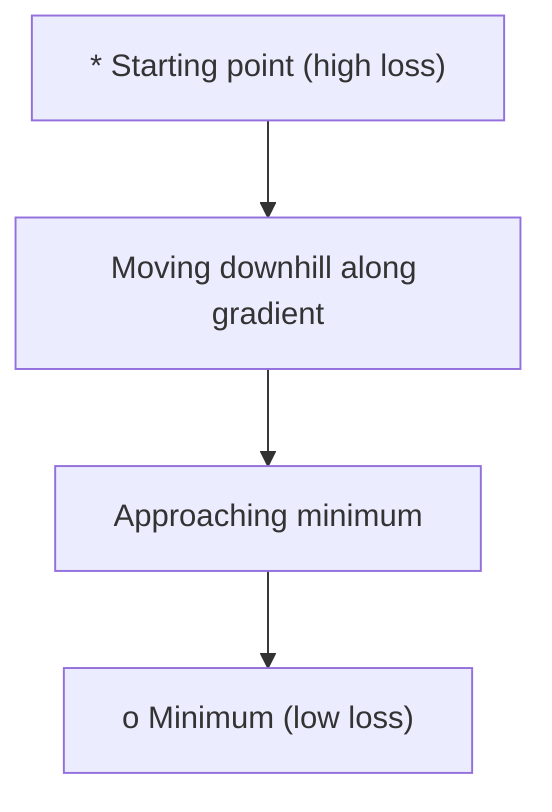
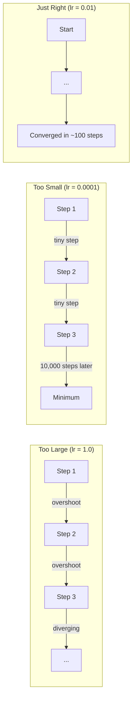
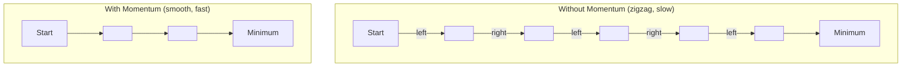
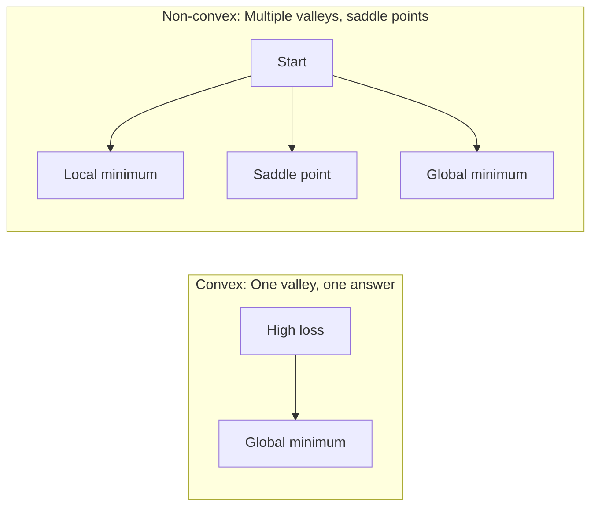
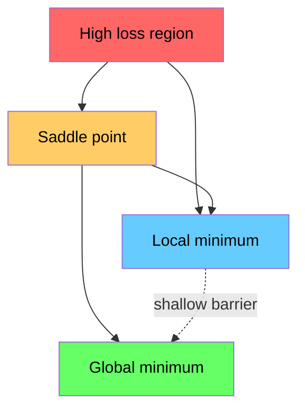

# 优化（Optimization）

> 训练神经网络不过是在寻找谷底。

**类型：** 构建（Build）
**语言：** Python
**前置条件：** 第一阶段，第04-05课（导数、梯度）
**时长：** 约 75 分钟

## 学习目标

- 从零实现普通梯度下降（vanilla gradient descent）、带动量的 SGD 和 Adam
- 在 Rosenbrock 函数上比较优化器的收敛速度，解释 Adam 为何能为每个权重自适应调整学习率
- 区分凸损失景观（convex loss landscape）与非凸损失景观，解释高维空间中鞍点（saddle point）的作用
- 配置学习率调度策略（步长衰减、余弦退火、预热）以稳定训练

## 问题

你有一个损失函数（loss function），它告诉你模型错得有多离谱。你有梯度（gradient），它们告诉你哪个方向会让损失变大。现在你需要一个下山策略。

朴素的做法很简单：沿着梯度的反方向走。用某个叫作学习率（learning rate）的数字缩放步长。重复。这就是梯度下降（gradient descent），它确实有效。但"有效"是有条件的。学习率太大，你会直接越过谷底，在两面墙之间来回弹跳。学习率太小，你会爬行数千步不必要的步数才能到达答案。遇到鞍点（saddle point）时，即使你还没有找到最小值，梯度也会消失，让你原地停滞。

深度学习中的每一个优化器（optimizer）都在回答同一个问题：如何更快、更可靠地到达谷底？

## 概念

### 优化的含义

优化（optimization）就是找到使函数值最小（或最大）的输入值。在机器学习中，这个函数就是损失函数。输入是模型的权重（weights）。训练就是优化。

```
minimize L(w) where:
  L = loss function
  w = model weights (could be millions of parameters)
```

### 普通梯度下降（Gradient Descent）

最简单的优化器。计算损失相对于每个权重的梯度。将每个权重沿其梯度的反方向移动。用学习率缩放步长。

```
w = w - lr * gradient
```

这就是整个算法。一行代码。



### 学习率：最重要的超参数

学习率控制步长大小。它决定了收敛的一切。



没有公式能算出正确的学习率。你需要通过实验来寻找。常见的起始点：Adam 用 0.001，带动量的 SGD 用 0.01。

### SGD、批量梯度下降与小批量梯度下降

普通梯度下降在走一步之前，会计算整个数据集上的梯度。这称为批量梯度下降（batch gradient descent）。它稳定但缓慢。

随机梯度下降（SGD, stochastic gradient descent）在单个随机样本上计算梯度后立即更新。它噪声大但速度快。

小批量梯度下降（mini-batch gradient descent）是两者的折中。在一个小批量（32、64、128、256个样本）上计算梯度，然后更新。这是实践中所有人都在用的方法。

| 变体 | 批量大小 | 梯度质量 | 每步速度 | 噪声 |
|---------|-----------|-----------------|---------------|-------|
| 批量梯度下降 | 整个数据集 | 精确 | 慢 | 无 |
| SGD | 1个样本 | 噪声很大 | 快 | 高 |
| 小批量梯度下降 | 32-256 | 良好估计 | 平衡 | 中等 |

SGD 和小批量中的噪声不是 bug。它有助于逃离浅层局部最小值和鞍点。

### 动量（Momentum）：滚下山的球

普通梯度下降只关注当前的梯度。如果梯度来回震荡（在狭窄的谷中很常见），进展就会很慢。动量（momentum）通过将过去的梯度累积到速度项中来解决这个问题。

```
v = beta * v + gradient
w = w - lr * v
```

打个比方：一个正在滚下山的球。它不会在每个凸起处停下重来。它在一致的方向上积累速度，并抑制振荡。



`beta`（通常为0.9）控制保留多少历史信息。beta 越大，动量越强，路径越平滑，但对方向变化的响应越慢。

### Adam：自适应学习率

不同的权重需要不同的学习率。一个很少获得大梯度的权重，在终于获得大梯度时应该迈更大的步子。一个持续获得巨大梯度的权重应该迈小步子。

Adam（Adaptive Moment Estimation，自适应矩估计）为每个权重追踪两个量：

1. 一阶矩（first moment, $m$）：梯度的滑动平均（类似动量）
2. 二阶矩（second moment, $v$）：梯度平方的滑动平均（梯度幅度）

```
m = beta1 * m + (1 - beta1) * gradient
v = beta2 * v + (1 - beta2) * gradient^2

m_hat = m / (1 - beta1^t)    bias correction
v_hat = v / (1 - beta2^t)    bias correction

w = w - lr * m_hat / (sqrt(v_hat) + epsilon)
```

除以 `sqrt(v_hat)` 是关键。梯度大的权重被一个大的数除（有效步长小）。梯度小的权重被一个小的数除（有效步长大）。每个权重都有自己的自适应学习率。

默认超参数：`lr=0.001, beta1=0.9, beta2=0.999, epsilon=1e-8`。这些默认值对大多数问题都有效。

### 学习率调度（Learning Rate Schedules）

固定的学习率是一种折中。训练早期，你需要大步子以快速前进。训练后期，你需要小步子以在最小值附近精细调整。

常见的调度策略：

| 调度策略 | 公式 | 使用场景 |
|----------|---------|----------|
| 步长衰减（Step decay） | 每 N 个 epoch 将学习率乘以衰减因子 | 简单，手动控制 |
| 指数衰减（Exponential decay） | $lr = lr_0 \cdot decay^t$ | 平滑衰减 |
| 余弦退火（Cosine annealing） | $lr = lr_{\min} + 0.5 \cdot (lr_{\max} - lr_{\min}) \cdot (1 + \cos(\pi \cdot t / T))$ | Transformer，现代训练 |
| 预热 + 衰减（Warmup + decay） | 线性上升，然后衰减 | 大模型，防止早期不稳定 |

### 凸函数与非凸函数

凸函数（convex function）只有一个最小值。梯度下降总能找到它。像 $f(x) = x^2$ 这样的二次函数就是凸的。

神经网络的损失函数是非凸的（non-convex）。它们有许多局部最小值、鞍点和平坦区域。



在实践中，高维神经网络中的局部最小值很少成为问题。大多数局部最小值的损失值接近全局最小值。鞍点（在某些方向平坦，在其他方向弯曲）才是真正的障碍。动量和来自小批量的噪声有助于逃离鞍点。

### 损失景观可视化

损失是所有权重的函数。对于一个有100万个权重的模型，损失景观存在于1,000,001维空间中。我们通过选取权重空间中的两个随机方向，并沿着这些方向绘制损失值，从而生成一个二维曲面来进行可视化。



尖锐的最小值（sharp minima）泛化能力差。平坦的最小值（flat minima）泛化能力强。这也是为什么带动量的 SGD 在最终测试准确率上往往超过 Adam 的原因之一：其噪声防止了模型落入尖锐的最小值。

## 动手实现

### 步骤 1：定义测试函数

Rosenbrock 函数是一个经典的优化基准测试。其最小值位于一个狭窄弯曲山谷中的 $(1, 1)$ 处，这个山谷容易找到但难以沿其前进。

$$
f(x, y) = (1 - x)^2 + 100 \cdot (y - x^2)^2
$$

```python
def rosenbrock(params):
    """Rosenbrock 函数：经典优化基准测试，最小值在 (1, 1)"""
    x, y = params
    return (1 - x) ** 2 + 100 * (y - x ** 2) ** 2

def rosenbrock_gradient(params):
    """Rosenbrock 函数的解析梯度"""
    x, y = params
    # 对 x 的偏导：来自 (1-x)^2 和 100*(y-x^2)^2 的链式法则
    df_dx = -2 * (1 - x) + 200 * (y - x ** 2) * (-2 * x)
    # 对 y 的偏导：仅来自 100*(y-x^2)^2
    df_dy = 200 * (y - x ** 2)
    return [df_dx, df_dy]
```

### 步骤 2：普通梯度下降

```python
class GradientDescent:
    """
    普通梯度下降：最简单的优化器。
    策略：每次沿梯度反方向迈出固定步长。
    优点：实现简单，无额外状态。
    缺点：在狭窄山谷中收敛缓慢，自适应能力差。
    """
    def __init__(self, lr=0.001):
        self.lr = lr

    def step(self, params, grads):
        # w = w - lr * grad：沿梯度反方向更新所有参数
        return [p - self.lr * g for p, g in zip(params, grads)]
```

### 步骤 3：带动量的 SGD

```python
class SGDMomentum:
    """
    带动量的 SGD：在梯度下降中引入速度累积机制。
    策略：将历史梯度累积到速度向量中，在一致方向上加速，
    在震荡方向上相互抵消，从而平滑收敛路径。
    超参数 momentum=0.9 意味着当前速度保留 90% 的历史速度
    加上 10% 的当前梯度，相当于指数加权滑动平均。
    """
    def __init__(self, lr=0.001, momentum=0.9):
        self.lr = lr
        self.momentum = momentum
        self.velocity = None

    def step(self, params, grads):
        if self.velocity is None:
            # 首次调用时初始化速度向量为零
            self.velocity = [0.0] * len(params)
        # v = momentum * v + grad：更新速度，保留历史方向信息
        self.velocity = [
            self.momentum * v + g
            for v, g in zip(self.velocity, grads)
        ]
        # w = w - lr * v：沿速度方向更新参数
        return [p - self.lr * v for p, v in zip(params, self.velocity)]
```

### 步骤 4：Adam

```python
class Adam:
    """
    Adam 优化器：结合动量（一阶矩）和自适应学习率（二阶矩）。
    策略：
    - 一阶矩 m：梯度的滑动平均，类似动量，加速收敛
    - 二阶矩 v：梯度平方的滑动平均，衡量梯度大小，分摊到各权重
    - 偏置校正：解决初始化时矩估计偏零的问题
    - epsilon：防止除以零的数值稳定性常数
    
    默认超参数来自 Adam 原始论文，对大多数问题都有效。
    """
    def __init__(self, lr=0.001, beta1=0.9, beta2=0.999, epsilon=1e-8):
        self.lr = lr
        self.beta1 = beta1  # 一阶矩的衰减率，控制历史梯度权重
        self.beta2 = beta2  # 二阶矩的衰减率，控制历史平方梯度权重
        self.epsilon = epsilon
        self.m = None
        self.v = None
        self.t = 0  # 时间步计数，用于偏置校正

    def step(self, params, grads):
        if self.m is None:
            # 首次调用时初始化一阶矩和二阶矩为零
            self.m = [0.0] * len(params)
            self.v = [0.0] * len(params)

        self.t += 1

        # 更新一阶矩：m = beta1 * m + (1 - beta1) * grad
        self.m = [
            self.beta1 * m + (1 - self.beta1) * g
            for m, g in zip(self.m, grads)
        ]
        # 更新二阶矩：v = beta2 * v + (1 - beta2) * grad^2
        self.v = [
            self.beta2 * v + (1 - self.beta2) * g ** 2
            for v, g in zip(self.v, grads)
        ]

        # 偏置校正：由于 m 和 v 初始为 0，早期估计偏小，
        # 除以 (1 - beta^t) 校正回无偏估计
        m_hat = [m / (1 - self.beta1 ** self.t) for m in self.m]
        v_hat = [v / (1 - self.beta2 ** self.t) for v in self.v]

        # 更新参数：w = w - lr * m_hat / (sqrt(v_hat) + epsilon)
        # sqrt(v_hat) 使梯度大的权重步长小，梯度小的权重大
        return [
            p - self.lr * mh / (vh ** 0.5 + self.epsilon)
            for p, mh, vh in zip(params, m_hat, v_hat)
        ]
```

### 步骤 5：运行与比较

```python
def optimize(optimizer, func, grad_func, start, steps=5000):
    """通用优化循环：给定优化器和梯度函数，迭代更新参数并记录历史轨迹"""
    params = list(start)
    history = [params[:]]
    for _ in range(steps):
        grads = grad_func(params)
        params = optimizer.step(params, grads)
        history.append(params[:])
    return history

start = [-1.0, 1.0]

# 在 Rosenbrock 函数上比较三种优化器的表现
gd_history = optimize(GradientDescent(lr=0.0005), rosenbrock, rosenbrock_gradient, start)
sgd_history = optimize(SGDMomentum(lr=0.0001, momentum=0.9), rosenbrock, rosenbrock_gradient, start)
adam_history = optimize(Adam(lr=0.01), rosenbrock, rosenbrock_gradient, start)

for name, history in [("GD", gd_history), ("SGD+M", sgd_history), ("Adam", adam_history)]:
    final = history[-1]
    loss = rosenbrock(final)
    print(f"{name:6s} -> x={final[0]:.6f}, y={final[1]:.6f}, loss={loss:.8f}")
```

预期输出：Adam 收敛最快。带动量的 SGD 路径更平滑。普通梯度下降在狭窄山谷中进展缓慢。

## 实践应用

在实践中，请使用 PyTorch 或 JAX 的优化器。它们处理参数组、权重衰减（weight decay）、梯度裁剪（gradient clipping）和 GPU 加速。

```python
import torch

model = torch.nn.Linear(784, 10)

# SGD with momentum：适合追求最佳最终精度、愿意调参的场景
sgd = torch.optim.SGD(model.parameters(), lr=0.01, momentum=0.9)
# Adam：适合大多数问题的默认选择，收敛快，调参需求低
adam = torch.optim.Adam(model.parameters(), lr=0.001)
# AdamW：Adam + 解耦权重衰减，Transformer 训练的首选
adamw = torch.optim.AdamW(model.parameters(), lr=0.001, weight_decay=0.01)

# 余弦退火学习率调度：按周期平滑降低学习率
scheduler = torch.optim.lr_scheduler.CosineAnnealingLR(adam, T_max=100)
```

经验法则：

- **从 Adam 开始**（lr=0.001）。它对大多数问题无需调参即可工作。
- **切换到带动量的 SGD**（lr=0.01, momentum=0.9）当你需要最佳最终精度且愿意多做一些调参时。
- **Transformer 使用 AdamW**（带解耦权重衰减的 Adam）。
- **训练超过几个 epoch 时始终使用学习率调度**。
- **如果训练不稳定，降低学习率**。如果训练太慢，增大学习率。

## 交付物

本课产出用于选择合适优化器的提示词。见 `outputs/prompt-optimizer-guide.md`。

这里构建的优化器类将在第三阶段从零训练神经网络时再次使用。

## 练习

1. **学习率扫描。** 在学习率 [0.0001, 0.0005, 0.001, 0.005, 0.01] 下对 Rosenbrock 函数运行普通梯度下降。绘制或打印每种学习率下 5000 步后的最终损失。找出仍能收敛的最大学习率。

2. **动量比较。** 在动量值 [0.0, 0.5, 0.9, 0.99] 下对 Rosenbrock 函数运行带动量的 SGD。追踪每一步的损失。哪个动量值收敛最快？哪个过度冲了？

3. **逃离鞍点。** 定义函数 $f(x, y) = x^2 - y^2$（原点处为鞍点）。从 $(0.01, 0.01)$ 开始。比较普通梯度下降、带动量的 SGD 和 Adam 的表现。哪个能逃离鞍点？

4. **实现学习率衰减。** 为 GradientDescent 类添加指数衰减调度：$lr = lr_0 \cdot 0.999^{step}$。在 Rosenbrock 函数上比较有无衰减的收敛情况。

## 关键术语（Key Terms）

| 术语 (Term) | 大家的说法 | 实际含义 |
|------|----------------|----------------------|
| 梯度下降 (Gradient descent) | "往下走" | 用权重减去学习率缩放的梯度来更新权重。最基本的优化器。 |
| 学习率 (Learning rate) | "步长" | 控制每次更新移动距离的标量。太大导致发散，太小浪费算力。 |
| 动量 (Momentum) | "继续滚动" | 将历史梯度累积到速度向量中。抑制振荡，加速沿一致方向的移动。 |
| SGD | "随机采样" | 随机梯度下降。在随机子集而非整个数据集上计算梯度。实践中几乎总是指小批量 SGD。 |
| 小批量 (Mini-batch) | "一块数据" | 用于估计梯度的小部分训练数据（32-256个样本）。平衡速度和梯度精度。 |
| Adam | "默认优化器" | 自适应矩估计。追踪每个权重的梯度和平方梯度的滑动平均，为每个权重提供自己的学习率。 |
| 偏置校正 (Bias correction) | "修复冷启动" | Adam 的一阶矩和二阶矩初始为零。偏置校正通过除以 $(1 - \beta^t)$ 来补偿早期步长的偏差。 |
| 学习率调度 (Learning rate schedule) | "随时间调整学习率" | 在训练过程中调整学习率的函数。早期大步，后期小步。 |
| 凸函数 (Convex function) | "一个山谷" | 任何局部最小值都是全局最小值的函数。梯度下降总能找到它。神经网络的损失不是凸的。 |
| 鞍点 (Saddle point) | "平坦但不是最小值" | 梯度为零但在某些方向是最小值、在其他方向是最大值的点。在高维空间中很常见。 |
| 损失景观 (Loss landscape) | "地形" | 在权重空间上绘制的损失函数。通过沿两个随机方向切片来可视化。 |
| 收敛 (Convergence) | "到达了" | 优化器已到达进一步步长不会显著降低损失的点。 |

## 扩展阅读

- [Sebastian Ruder: 梯度下降优化算法综述](https://ruder.io/optimizing-gradient-descent/)——所有主要优化器的全面综述
- [动量的真正原理 (Distill)](https://distill.pub/2017/momentum/)——动量动力学的交互式可视化
- [Adam: 一种随机优化方法 (Kingma & Ba, 2014)](https://arxiv.org/abs/1412.6980)——Adam 原始论文，可读性强且篇幅短
- [可视化神经网络的损失景观 (Li et al., 2018)](https://arxiv.org/abs/1712.09913)——展示尖锐与平坦最小值的论文