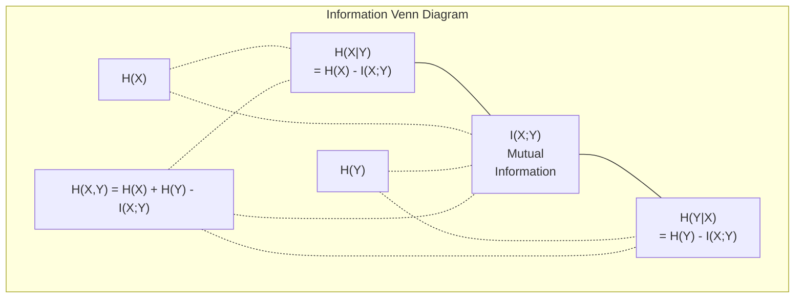

# 信息论（Information Theory）

> 信息论衡量惊讶程度。损失函数建立在其基础之上。

**类型：** 学习
**语言：** Python
**前置知识：** 阶段一，第 06 课（概率论）
**时间：** ~60 分钟

## 学习目标（Learning Objectives）

- 从零计算熵（entropy）、交叉熵（cross-entropy）和 KL 散度（KL divergence），并解释它们之间的关系
- 推导为什么最小化交叉熵损失等价于最大化对数似然（log-likelihood）
- 计算特征与目标之间的互信息（mutual information），用于特征重要性排序
- 将困惑度（perplexity）解释为语言模型选择下一个词时的有效词表大小

## 问题（The Problem）

你在每个分类模型训练中都会调用 `CrossEntropyLoss()`。你在每篇语言模型论文中都会看到"困惑度"。你读到关于 VAE、知识蒸馏（distillation）和 RLHF 中的 KL 散度。这些并非互不相关的概念——它们是同一个想法穿了不同的外衣。

信息论为你提供了推理不确定性、压缩和预测的语言。克劳德·香农（Claude Shannon）在 1948 年为了解决通信问题而发明了它。事实证明，训练神经网络就是一个通信问题：模型试图通过一个有噪声的权重通道传输正确的标签。

本课程将从零构建每一个公式，让你看到它们的来源以及为什么有效。

## 概念（The Concept）

### 信息量（Information Content / Surprise）

当不太可能的事情发生时，它携带了更多信息。硬币正面朝上？并不令人惊讶。中彩票？非常令人惊讶。

一个概率为 $p$ 的事件的信息量为：

$$
I(x) = -\log(p(x))
$$

以 2 为底的对数得到比特（bits），以自然对数为底得到奈特（nats）。同一个想法，不同单位。

| 事件 | 概率 | 惊讶程度（比特） |
|------|------|----------------|
| 公平硬币正面 | 0.5 | 1.0 |
| 掷出 6 点 | 0.167 | 2.58 |
| 千分之一事件 | 0.001 | 9.97 |
| 必然事件 | 1.0 | 0.0 |

必然事件携带零信息——你早已知道它会发生。

### 熵（Entropy / 平均惊讶程度）

熵是分布中所有可能结果的期望惊讶程度。

$$
H(P) = -\sum p(x) \cdot \log(p(x)) \quad \text{对所有 }x
$$

对于二值变量，公平硬币具有最大熵：1 比特。有偏硬币（99% 正面）熵很低：0.08 比特。你早已知道会发生什么，因此每次抛掷几乎不能告诉你任何信息。

$$
\begin{aligned}
\text{公平硬币：}\quad H &= -(0.5 \cdot \log_2(0.5) + 0.5 \cdot \log_2(0.5)) = 1.0\text{ 比特} \\[15pt]
\text{有偏硬币：}\quad H &= -(0.99 \cdot \log_2(0.99) + 0.01 \cdot \log_2(0.01)) = 0.08\text{ 比特}
\end{aligned}
$$

熵衡量分布中不可约的不确定性。你无法将其压缩到低于这个值。

### 交叉熵（Cross-Entropy / 你每天都在用的损失函数）

交叉熵衡量当你使用分布 $Q$ 来编码实际来自分布 $P$ 的事件时的平均惊讶程度。

$$
H(P, Q) = -\sum p(x) \cdot \log(q(x)) \quad \text{对所有 }x
$$

$P$ 是真分布（标签），$Q$ 是你的模型预测。如果 $Q$ 与 $P$ 完全匹配，交叉熵等于熵。任何不匹配都会使其变大。

在分类任务中，$P$ 是一个独热向量（one-hot vector，真实类概率为 1，其余为 0）。这使交叉熵简化为：

$$
H(P, Q) = -\log(q(\text{true\_class}))
$$

这就是分类的完整交叉熵损失公式：最大化正确类的预测概率。

### KL 散度（KL Divergence / 分布之间的距离）

KL 散度衡量由于使用 $Q$ 而非 $P$ 所带来的额外惊讶程度。

$$
\begin{aligned}
D_{KL}(P \parallel Q) &= \sum p(x) \cdot \log\left(\frac{p(x)}{q(x)}\right) \quad \text{对所有 }x \\[15pt]
&= H(P, Q) - H(P)
\end{aligned}
$$

交叉熵等于熵加 KL 散度。由于训练过程中真分布的熵是常数，最小化交叉熵等价于最小化 KL 散度——你正在将模型的分布推向真分布。

KL 散度不对称：$D_{KL}(P \parallel Q) \neq D_{KL}(Q \parallel P)$。它不是真正的距离度量。

### 互信息（Mutual Information）

互信息衡量知道一个变量能告诉你多少关于另一个变量的信息。

$$
I(X; Y) = H(X) - H(X|Y) = H(X) + H(Y) - H(X, Y)
$$

如果 $X$ 和 $Y$ 独立，互信息为零——知道一个变量对另一个变量毫无帮助。如果它们完全相关，互信息等于任一变量的熵。

在特征选择中，特征与目标之间的高互信息意味着该特征有用；低互信息意味着它是噪声。

### 条件熵（Conditional Entropy）

$H(Y|X)$ 衡量在观察到 $X$ 之后，关于 $Y$ 的不确定性还剩多少。

$$
H(Y|X) = H(X,Y) - H(X)
$$

两个极端情况：
- 如果 $X$ 完全决定 $Y$，则 $H(Y|X) = 0$。知道 $X$ 消除了关于 $Y$ 的所有不确定性。示例：$X$ = 摄氏温度，$Y$ = 华氏温度。
- 如果 $X$ 对 $Y$ 毫无信息，则 $H(Y|X) = H(Y)$。知道 $X$ 完全不降低你的不确定性。示例：$X$ = 抛硬币，$Y$ = 明天的天气。

条件熵始终非负，且不超过 $H(Y)$：

$$
0 \le H(Y|X) \le H(Y)
$$

在机器学习中，条件熵出现在决策树（decision tree）中。在每次分裂时，算法选择最小化 $H(Y|X)$ 的特征——即消除关于标签 $Y$ 最多不确定性的特征。

### 联合熵（Joint Entropy）

$H(X,Y)$ 是 $X$ 和 $Y$ 联合分布的熵。

$$
H(X,Y) = -\sum_x \sum_y p(x,y) \cdot \log(p(x,y))
$$

关键性质：

$$
H(X,Y) \le H(X) + H(Y)
$$

当 $X$ 和 $Y$ 独立时等号成立。如果它们共享信息，联合熵小于各自熵之和。"缺失"的熵正是互信息。



关系式：
- $H(X,Y) = H(X) + H(Y|X) = H(Y) + H(X|Y)$
- $I(X;Y) = H(X) - H(X|Y) = H(Y) - H(Y|X)$
- $H(X,Y) = H(X) + H(Y) - I(X;Y)$

### 互信息（深入讨论）

互信息 $I(X;Y)$ 量化知道一个变量在多大程度上减少了关于另一个变量的不确定性。

$$
\begin{aligned}
I(X;Y) &= H(X) - H(X|Y) \\[5pt]
&= H(Y) - H(Y|X) \\[5pt]
&= H(X) + H(Y) - H(X,Y) \\[5pt]
&= \sum_x \sum_y p(x,y) \cdot \log\left(\frac{p(x,y)}{p(x) \cdot p(y)}\right)
\end{aligned}
$$

性质：
- $I(X;Y) \ge 0$ 恒成立。观察某些信息永远不会让你损失信息。
- $I(X;Y) = 0$ 当且仅当 $X$ 和 $Y$ 独立。
- $I(X;Y) = I(Y;X)$。与 KL 散度不同，它是对称的。
- $I(X;X) = H(X)$。一个变量与自身完全共享其信息。

**用于特征选择的互信息。** 在机器学习中，你希望特征对目标有信息量。互信息提供了一种有原则的特征排序方法：

1. 对每个特征 $X_i$，计算 $I(X_i; Y)$，其中 $Y$ 是目标变量。
2. 按互信息得分对特征排序。
3. 保留前 $k$ 个特征。

这对特征与目标之间的任何关系都有效——线性、非线性、单调或非单调。相关性只能捕捉线性关系，而互信息能捕捉一切。

| 方法 | 能检测 | 计算成本 | 能处理分类变量？ |
|------|--------|---------|----------------|
| 皮尔逊相关系数（Pearson correlation） | 线性关系 | $O(n)$ | 否 |
| 斯皮尔曼相关系数（Spearman correlation） | 单调关系 | $O(n \log n)$ | 否 |
| 互信息 | 任意统计依赖关系 | $O(n \log n)$（分箱后） | 是 |

### 标签平滑与交叉熵（Label Smoothing and Cross-Entropy）

标准分类使用硬目标（hard target）：`[0, 0, 1, 0]`。真实类概率为 1，其余为 0。标签平滑（label smoothing）将这些替换为软目标（soft target）：

$$
\text{soft\_target} = (1 - \epsilon) \cdot \text{hard\_target} + \frac{\epsilon}{\text{num\_classes}}
$$

设 $\epsilon = 0.1$，4 个类别：
- 硬目标：`[0, 0, 1, 0]`
- 软目标：`[0.025, 0.025, 0.925, 0.025]`

从信息论角度看，标签平滑增加了目标分布的熵。硬独热目标熵为 0——不存在不确定性。软目标具有正熵。

为什么这有帮助：
- 防止模型将 logits 推向极端值（要完美匹配独热目标，交叉熵需要无穷大的 logits）
- 起到正则化作用：模型不能 100% 确信
- 改善校准性（calibration）：预测概率更好地反映真实不确定性
- 缩小训练与推理行为之间的差距

带标签平滑的交叉熵损失变为：

$$
L = (1 - \epsilon) \cdot \text{CE}(\text{hard\_target}, \text{prediction}) + \epsilon \cdot H_{\text{uniform}}(\text{prediction})
$$

第二项惩罚远离均匀分布的预测——这是一种对置信度的直接正则化。

### 为什么交叉熵是分类任务的 THE 损失函数

三种视角，同一个结论。

**信息论视角。** 交叉熵衡量你使用模型分布而非真实分布时浪费了多少比特。最小化它使你的模型成为现实最有效的编码器。

**最大似然视角。** 对于 $N$ 个训练样本，其真实类别为 $y_i$：

$$
\begin{aligned}
\text{似然} &= \prod q(y_i) \\[5pt]
\text{对数似然} &= \sum \log(q(y_i)) \\[5pt]
\text{负对数似然} &= -\sum \log(q(y_i))
\end{aligned}
$$

最后一行正是交叉熵损失。最小化交叉熵 = 在模型下最大化训练数据的似然。

**梯度视角。** 交叉熵关于 logits 的梯度就是 $(\text{predicted} - \text{true})$。干净、稳定且计算快速。这就是为什么它与 softmax 完美配合。

### 比特与奈特（Bits vs Nats）

唯一区别是对数的底。

| 对数底 | 单位 | 传统 |
|--------|------|------|
| $\log_2$ | 比特（bits） | 信息论传统 |
| $\log_e$ | 奈特（nats） | 机器学习惯例 |
| $\log_{10}$ | 哈特利（hartleys） | 很少使用 |

1 nat = $1/\ln(2)$ bits = 1.4427 bits。PyTorch 和 TensorFlow 默认使用自然对数（奈特）。

### 困惑度（Perplexity）

困惑度是交叉熵的指数形式。它告诉你模型在每一步平均在多少个等可能的选择之间感到困惑。

$$
\begin{aligned}
\text{Perplexity} &= 2^{H(P,Q)} \quad \text{（使用比特时）} \\[5pt]
\text{Perplexity} &= e^{H(P,Q)} \quad \text{（使用奈特时）}
\end{aligned}
$$

困惑度为 50 的语言模型，平均而言就像必须从 50 个可能的下一词中均匀选择一样困惑。值越低越好。

GPT-2 在常见基准上达到了约 30 的困惑度。对于良好覆盖的领域，现代模型已达到个位数。

## 动手构建（Build It）

### 第一步：信息量与熵

```python
import math

def information_content(p, base=2):
    """计算事件的信息量（惊讶程度）。

    核心公式: I(p) = -log_b(p)
    - p 接近 0 时信息量趋近无穷（几乎不可能的事件一旦发生极其令人惊讶）
    - p = 1 时信息量为 0（必然事件不传递任何新信息）
    """
    if p <= 0 or p > 1:
        return float('inf') if p <= 0 else 0.0
    return -math.log(p) / math.log(base)

def entropy(probs, base=2):
    """计算概率分布的熵，即所有可能结果的平均惊讶程度。

    H(P) = -sum(p * log(p))
    熵量化了分布中固有的不可约不确定性——它是无损压缩的理论下界。
    """
    return sum(
        p * information_content(p, base)
        for p in probs if p > 0
    )

fair_coin = [0.5, 0.5]
biased_coin = [0.99, 0.01]
fair_die = [1/6] * 6

print(f"公平硬币熵:   {entropy(fair_coin):.4f} 比特")
print(f"有偏硬币熵: {entropy(biased_coin):.4f} 比特")
print(f"公平骰子熵:    {entropy(fair_die):.4f} 比特")
```

### 第二步：交叉熵与 KL 散度

```python
def cross_entropy(p, q, base=2):
    """计算交叉熵 H(P, Q)，衡量用分布 Q 编码真实分布 P 的平均代价。

    H(P,Q) = -sum(p * log(q))
    交叉熵 = 熵 + KL 散度。
    当 Q 对 P 中高概率事件赋予低概率时，值会变得非常大（甚至无穷）。
    """
    total = 0.0
    for pi, qi in zip(p, q):
        if pi > 0:
            if qi <= 0:
                return float('inf')  # 模型对真实事件赋予零概率→损失无穷大
            total += pi * (-math.log(qi) / math.log(base))
    return total

def kl_divergence(p, q, base=2):
    """计算 KL 散度: D_KL(P||Q) = H(P,Q) - H(P)。

    衡量由于使用近似分布 Q 而非真实分布 P 所浪费的额外信息量。
    """
    return cross_entropy(p, q, base) - entropy(p, base)

true_dist = [0.7, 0.2, 0.1]
good_model = [0.6, 0.25, 0.15]
bad_model = [0.1, 0.1, 0.8]

print(f"真实分布的熵:     {entropy(true_dist):.4f} 比特")
print(f"交叉熵（好模型）： {cross_entropy(true_dist, good_model):.4f} 比特")
print(f"交叉熵（差模型）： {cross_entropy(true_dist, bad_model):.4f} 比特")
print(f"KL 散度（好模型）： {kl_divergence(true_dist, good_model):.4f} 比特")
print(f"KL 散度（差模型）： {kl_divergence(true_dist, bad_model):.4f} 比特")
```

### 第三步：交叉熵作为分类损失

```python
def softmax(logits):
    """将 logits 转换为概率分布，数值稳定性通过减去最大值保证。

    策略: Softmax 将任意实数向量映射为合法的概率分布（非负且和为 1）。
    这里减去 max_logit 防止 exp 溢出，不改变结果。
    """
    max_logit = max(logits)
    exps = [math.exp(z - max_logit) for z in logits]
    total = sum(exps)
    return [e / total for e in exps]

def cross_entropy_loss(true_class, logits):
    """计算单样本的交叉熵损失。

    对独热标签简化为 -log(softmax(true_class))。
    欲使损失归零，需要真类 logits → +∞，其余 → -∞（实践中不可能，也不需要）。
    """
    probs = softmax(logits)
    return -math.log(probs[true_class])

logits = [2.0, 1.0, 0.1]
true_class = 0

probs = softmax(logits)
loss = cross_entropy_loss(true_class, logits)

print(f"Logits:      {logits}")
print(f"Softmax:     {[f'{p:.4f}' for p in probs]}")
print(f"真实类别:  {true_class}")
print(f"损失:        {loss:.4f} 奈特")
print(f"困惑度:  {math.exp(loss):.2f}")
```

### 第四步：交叉熵等于负对数似然

```python
import random

random.seed(42)

# 模拟一个分类任务：1000 个样本，3 个类别，用随机 logits 作为"模型"输出
n_samples = 1000
n_classes = 3
true_labels = [random.randint(0, n_classes - 1) for _ in range(n_samples)]
model_logits = [[random.gauss(0, 1) for _ in range(n_classes)] for _ in range(n_samples)]

# 按交叉熵损失公式计算均值
ce_loss = sum(
    cross_entropy_loss(label, logits)
    for label, logits in zip(true_labels, model_logits)
) / n_samples

# 按负对数似然定义计算均值，二者应该完全相等
nll = -sum(
    math.log(softmax(logits)[label])
    for label, logits in zip(true_labels, model_logits)
) / n_samples

print(f"交叉熵损失:      {ce_loss:.6f}")
print(f"负对数似然: {nll:.6f}")
print(f"差值:              {abs(ce_loss - nll):.2e}")
```

### 第五步：互信息

```python
def mutual_information(joint_probs, base=2):
    """从联合概率矩阵计算互信息 I(X;Y)。

    公式: I(X;Y) = sum(p(x,y) * log(p(x,y) / (p(x)*p(y))))
    通过比较联合分布与边缘分布乘积的差异来衡量依赖性。
    """
    rows = len(joint_probs)
    cols = len(joint_probs[0])

    # 计算边缘分布：对另一个变量求和得到 P(X) 和 P(Y)
    margin_x = [sum(joint_probs[i][j] for j in range(cols)) for i in range(rows)]
    margin_y = [sum(joint_probs[i][j] for i in range(rows)) for j in range(cols)]

    mi = 0.0
    for i in range(rows):
        for j in range(cols):
            pxy = joint_probs[i][j]
            if pxy > 0:
                mi += pxy * math.log(pxy / (margin_x[i] * margin_y[j])) / math.log(base)
    return mi

# 独立分布：P(X,Y) = P(X)P(Y)，互信息应为 0
independent = [[0.25, 0.25], [0.25, 0.25]]
# 依赖分布：X 和 Y 高度关联，互信息应显著 > 0
dependent = [[0.45, 0.05], [0.05, 0.45]]

print(f"互信息（独立分布）: {mutual_information(independent):.4f} 比特")
print(f"互信息（依赖分布）:   {mutual_information(dependent):.4f} 比特")
```

## 使用它（Use It）

以下使用 NumPy 实现相同的概念，也是你在实践中的使用方式：

```python
import numpy as np

def np_entropy(p):
    """使用 NumPy 计算熵，自动处理零概率（log(0) 的情况）。"""
    p = np.asarray(p, dtype=float)
    mask = p > 0
    result = np.zeros_like(p)
    result[mask] = p[mask] * np.log(p[mask])
    return -result.sum()

def np_cross_entropy(p, q):
    """使用 NumPy 计算交叉熵，仅对真实分布中概率 > 0 的位置求和。"""
    p, q = np.asarray(p, dtype=float), np.asarray(q, dtype=float)
    mask = p > 0
    return -(p[mask] * np.log(q[mask])).sum()

def np_kl_divergence(p, q):
    """KL 散度 = 交叉熵 - 熵，与纯 Python 版本逻辑一致。"""
    return np_cross_entropy(p, q) - np_entropy(p)

true = np.array([0.7, 0.2, 0.1])
pred = np.array([0.6, 0.25, 0.15])
print(f"熵:    {np_entropy(true):.4f} 奈特")
print(f"交叉熵:  {np_cross_entropy(true, pred):.4f} 奈特")
print(f"KL 散度:     {np_kl_divergence(true, pred):.4f} 奈特")
```

你从零构建了 `torch.nn.CrossEntropyLoss()` 内部所做的工作。现在你知道了为什么训练过程中损失会下降：你的模型预测分布正在趋近真实分布，以奈特为单位衡量浪费的信息量。

## 练习（Exercises）

1. 假设英文字母均匀分布（26 个字母），计算其熵。然后用实际字母频率估算熵。哪个更高？为什么？

2. 一个模型对真实类别为 1 的样本输出了 logits `[5.0, 2.0, 0.5]`。手动计算交叉熵损失，然后用你自己的 `cross_entropy_loss` 函数验证。什么样的 logits 能使损失为零？

3. 证明 KL 散度不对称。选取两个分布 $P$ 和 $Q$，计算 $D_{KL}(P \parallel Q)$ 和 $D_{KL}(Q \parallel P)$。解释为什么它们不同。

4. 构建一个计算序列困惑度的函数。给定一个 `(true_token_index, predicted_logits)` 对列表，返回该序列的困惑度。

## 关键术语（Key Terms）

| 术语 | 人们说的 | 实际含义 |
|------|---------|---------|
| Information content | "惊讶程度" | 编码一个事件所需的比特（或奈特）数：$-\log(p)$ |
| Entropy | "随机性" | 分布中所有结果的平均惊讶程度。衡量不可约的不确定性。 |
| Cross-entropy | "那个损失函数" | 使用模型分布 $Q$ 编码来自真实分布 $P$ 的事件时的平均惊讶程度。 |
| KL divergence | "分布之间的距离" | 使用 $Q$ 代替 $P$ 浪费的额外比特。等于交叉熵减熵。不对称。 |
| Mutual information | "X 和 Y 有多相关" | 知道 $Y$ 后对 $X$ 不确定性的减少量。为零表示独立。 |
| Softmax | "将 logits 变成概率" | 指数化并归一化。将任意实数值向量映射为有效的概率分布。 |
| Perplexity | "模型有多困惑" | 交叉熵的指数。模型在每一步从中选择的等效词表大小。 |
| Bits | "香农的单位" | 以 2 为底对数度量的信息。1 比特解决一次公平抛硬币。 |
| Nats | "机器学习的单位" | 以自然对数度量的信息。PyTorch 和 TensorFlow 默认使用。 |
| Negative log-likelihood | "NLL 损失" | 对于独热标签与交叉熵损失相同。最小化它等价于最大化正确预测的概率。 |

## 延伸阅读（Further Reading）

- [Shannon 1948: A Mathematical Theory of Communication](https://people.math.harvard.edu/~ctm/home/text/others/shannon/entropy/entropy.pdf) — 原始论文，至今仍可读
- [Visual Information Theory (Chris Olah)](https://colah.github.io/posts/2015-09-Visual-Information/) — 关于熵和 KL 散度的最佳可视化解释
- [PyTorch CrossEntropyLoss docs](https://pytorch.org/docs/stable/generated/torch.nn.CrossEntropyLoss.html) — 框架如何实现你刚刚构建的内容