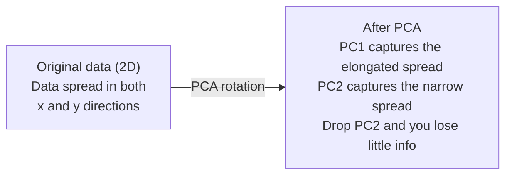

# 降维（Dimensionality Reduction）

> 高维数据有其内在结构。从正确的角度观察，你就能发现它。

**类型：** 构建（Build）
**语言：** Python
**前置知识：** 第一阶段，第 01 课（线性代数直觉）、第 02 课（向量、矩阵与运算）、第 03 课（特征值与特征向量）、第 06 课（概率与分布）
**预计用时：** ~90 分钟

## 学习目标（Learning Objectives）

- 从头实现主成分分析（Principal Component Analysis, PCA）：中心化数据、计算协方差矩阵、特征分解、投影
- 使用可解释方差比（Explained Variance Ratio）和肘部法（Elbow Method）选择主成分数量
- 比较 PCA、t-SNE 和 UMAP 在 MNIST 手写数字 2D 可视化中的表现，说明各自的权衡
- 应用带 RBF 核的核 PCA（Kernel PCA）分离标准 PCA 无法处理的非线性数据结构

## 问题（The Problem）

你有一个每个样本含 784 个特征的数据集。可能是手写数字的像素值，可能是基因表达水平，可能是用户行为信号。你无法可视化 784 维空间。你无法绘制它。你甚至无法思考它。

但大部分这 784 个特征是冗余的。真正的信息存在于一个更小的表面上。一个手写的"7"不需要 784 个独立的数值来描述它。它只需要几个：笔画的倾斜角度、横杠的长度、倾斜程度。其余都是噪声。

降维（Dimensionality Reduction）就是要找到那个更小的表面。它将你的 784 维数据压缩到 2、10 或 50 维，同时保留最重要的结构。

## 概念（The Concept）

### 维度灾难（The curse of dimensionality）

高维空间是反直觉的。随着维度增加，三件事会出问题。

**距离变得毫无意义。** 在高维空间中，任意两个随机点之间的距离收敛到相同的值。如果每个点到其他点的距离都大致相等，那么最近邻搜索就失效了。

```
维度    平均距离比（随机点间最大/最小距离）
2        ~5.0
10       ~1.8
100      ~1.2
1000     ~1.02
```

**体积集中在角落。** $d$ 维单位超立方体有 $2^d$ 个角。在 100 维中，几乎全部体积都集中在角落，远离中心。数据点向边缘扩散，而你的模型在内部分析中极度缺乏数据。

**你需要指数级增长的数据量。** 要在空间中维持相同的样本密度，从 2D 到 20D 意味着你需要 $10^{18}$ 倍的数据量。你永远不会有那么多数据。降维将数据密度带回可处理的范围。

### PCA：找到重要的方向

主成分分析（Principal Component Analysis, PCA）找到数据变化最大的坐标轴。它旋转你的坐标系，使得第一轴捕捉最大方差，第二轴捕捉次大方差，依此类推。

算法如下：

```
1. 中心化数据        （每个特征减去均值）
2. 计算协方差矩阵    （特征之间的协同变化）
3. 特征分解          （找到主方向）
4. 按特征值排序      （方差最大的优先）
5. 投影              （保留前 k 个特征向量，丢弃其余）
```

为什么要做特征分解？协方差矩阵是对称半正定矩阵。它的特征向量是特征空间中的正交方向。特征值告诉你每个方向捕捉了多少方差。最大特征值对应的特征向量指向最大方差的方向。



- **PCA 之前：** 数据云沿 x 和 y 两个方向对角散布
- **PCA 之后：** 坐标系被旋转，使得 PC1 对齐最大方差方向（长向散布），PC2 对齐最小方差方向（窄向散布）
- **降维：** 丢弃 PC2 将数据投影到 PC1 上，损失极少信息

### 可解释方差比（Explained variance ratio）

每个主成分捕捉总方差的一部分。可解释方差比（Explained Variance Ratio）告诉你具体是多少。

```
主成分        特征值    可解释比率    累积比率
PC1          4.73      0.473         0.473
PC2          2.51      0.251         0.724
PC3          1.12      0.112         0.836
PC4          0.89      0.089         0.925
...
```

当累积可解释方差达到 0.95 时，你就知道多少个主成分捕捉了 95% 的信息。之后的成分主要是噪声。

### 选择主成分数量（Choosing the number of components）

三种策略：

1. **阈值法。** 保留足够的主成分以解释 90-95% 的方差。
2. **肘部法。** 绘制每个主成分的可解释方差图，寻找急剧下降的点。
3. **下游性能法。** 将 PCA 作为预处理步骤，遍历 $k$ 值并测量模型准确率。最佳 $k$ 是准确率趋于平稳的点。

### t-SNE：保留邻域结构

t-分布随机邻域嵌入（t-Distributed Stochastic Neighbor Embedding, t-SNE）专为可视化设计。它将高维数据映射到 2D（或 3D），同时保留哪些点彼此靠近。

直观理解：在原始空间中，基于点之间的距离计算所有点对的概率分布。近的点概率高，远的点概率低。然后找到一个 2D 排列，使得相同的概率分布成立。在 784 维中是邻居的点，在 2D 中仍然保持邻居关系。

t-SNE 的关键属性：
- 非线性。它能展开 PCA 无法处理的复杂流形。
- 随机性。不同运行会产生不同的布局。
- 困惑度（Perplexity）参数控制考虑多少个邻居（典型范围：5-50）。
- 输出中簇之间的距离没有意义。只有簇本身是可信的。
- 在大数据集上较慢。默认是 $O(n^2)$ 复杂度。

### UMAP：更快，更好的全局结构

均匀流形逼近与投影（Uniform Manifold Approximation and Projection, UMAP）的工作原理与 t-SNE 类似，但有两个优势：
- 更快。它使用近似最近邻图，而不是计算所有成对距离。
- 更好的全局结构。输出中簇的相对位置通常比 t-SNE 更有意义。

UMAP 在高维空间中构建一个加权图（"模糊拓扑表示"），然后找到一个尽可能保留该图的低维布局。

关键参数：
- `n_neighbors`：定义局部结构的邻居数量（类似于困惑度）。值越大，保留更多全局结构。
- `min_dist`：输出中点聚集的紧密程度。值越小，簇越密集。

### 何时使用哪种方法

| 方法 | 使用场景 | 保留的信息 | 速度 |
|------|----------|------------|------|
| PCA | 训练前的预处理 | 全局方差 | 快（精确），可用于数百万样本 |
| PCA | 快速探索性可视化 | 线性结构 | 快 |
| t-SNE | 出版级 2D 图 | 局部邻域 | 慢（< 1 万样本为佳） |
| UMAP | 大规模 2D 可视化 | 局部 + 部分全局结构 | 中（可处理数百万样本） |
| PCA | 模型的特征降维 | 按方差排序的特征 | 快 |
| t-SNE / UMAP | 理解簇结构 | 簇分离度 | 中到慢 |

经验法则：PCA 用于预处理和数据压缩；t-SNE 或 UMAP 用于在 2D 中可视化结构。

### 核 PCA（Kernel PCA）

标准 PCA 寻找线性子空间。它旋转坐标系并丢弃某些维度。但如果数据位于非线性流形上呢？2D 中的一个圆无法用任何直线分割。标准 PCA 对此无能为力。

核 PCA（Kernel PCA）通过核函数在高维特征空间中应用 PCA，而无需显式计算该空间中的坐标。这就是核技巧（Kernel Trick）——与支持向量机（SVM）背后的思想相同。

算法：
```
1. 计算核矩阵 K，其中 K_ij = k(x_i, x_j)
2. 在特征空间中对核矩阵进行中心化
3. 对中心化后的核矩阵进行特征分解
4. 前几个特征向量（按 1/sqrt(eigenvalue) 缩放）即为投影结果
```

常用核函数：

| 核函数 | 公式 | 适用场景 |
|--------|------|----------|
| RBF（高斯核） | $\exp(-\gamma \cdot \|\|x - y\|\|^2)$ | 大多数非线性数据、光滑流形 |
| 多项式核 | $(x \cdot y + c)^d$ | 多项式关系 |
| Sigmoid 核 | $\tanh(\alpha \cdot x \cdot y + c)$ | 类神经网络映射 |

何时使用核 PCA vs 标准 PCA：

| 判断标准 | 标准 PCA | 核 PCA |
|----------|----------|--------|
| 数据结构 | 线性子空间 | 非线性流形 |
| 速度 | $O(\min(n^2 d, d^2 n))$ | $O(n^2 d + n^3)$ |
| 可解释性 | 主成分是特征的线性组合 | 主成分缺乏直接的特征解释 |
| 可扩展性 | 可处理数百万样本 | 核矩阵为 $n \times n$，受内存限制 |
| 重构 | 可直接进行逆变换 | 需要前映像近似（Pre-image approximation） |

经典例子：2D 中的同心圆——两层点环，一层在另一层内部。标准 PCA 将两者投影到同一线上，对分类毫无用处。带 RBF 核的核 PCA 将内环和外环映射到不同的区域，使它们线性可分。

### 重构误差（Reconstruction Error）

你的降维多好？你将 784 维压缩到 50 维。损失了什么？

度量重构误差（Reconstruction Error）：
1. 将数据投影到 $k$ 维：$X_{\text{reduced}} = X \cdot W_k$
2. 重构：$\hat{X} = X_{\text{reduced}} \cdot W_k^T$
3. 计算均方误差（MSE）：$\text{mean}((X - \hat{X})^2)$

对于 PCA，重构误差与可解释方差有清晰的关系：

$$
\begin{aligned}
\text{Reconstruction error} &= \sum \text{eigenvalues NOT included} \\[15pt]
\text{Total variance} &= \sum \text{ALL eigenvalues} \\[15pt]
\text{Fraction lost} &= \frac{\sum \text{dropped eigenvalues}}{\sum \text{all eigenvalues}}
\end{aligned}
$$

每个主成分的可解释方差比为：

$$
\text{explained\_ratio}_k = \frac{\text{eigenvalue}_k}{\sum \text{all eigenvalues}}
$$

将累积可解释方差对主成分数量作图，得到"肘部"曲线。合理的主成分数量满足以下条件之一：
- 曲线趋于平缓（收益递减）
- 累积方差超过你的阈值（通常为 0.90 或 0.95）
- 下游任务性能趋于平稳

重构误差的用途不仅限于选择 $k$。你可以将其用于异常检测：重构误差高的样本是不符合所学子空间的离群值。这是生产系统中基于 PCA 的异常检测的基础。

## 动手实现（Build It）

### 步骤 1：从零实现 PCA

```python
import numpy as np

class PCA:
    def __init__(self, n_components):
        self.n_components = n_components
        self.components = None          # 主成分方向（特征向量）
        self.mean = None                # 训练数据的均值，用于去中心化
        self.eigenvalues = None         # 特征值（方差大小）
        self.explained_variance_ratio_ = None  # 各主成分解释的方差比例

    def fit(self, X):
        # Step 1: 中心化数据——减去每个特征的均值
        # 中心化确保主成分捕捉的是数据的方差结构，而非数据的位置偏移
        self.mean = np.mean(X, axis=0)
        X_centered = X - self.mean

        # Step 2: 计算协方差矩阵
        # 协方差矩阵的 (i,j) 元素表示第 i 个和第 j 个特征如何协同变化
        # 它是对称半正定矩阵，保证特征值为实数且非负
        cov_matrix = np.cov(X_centered, rowvar=False)

        # Step 3: 特征分解——找到数据变化的主方向
        # 特征向量是协方差矩阵的正交基，特征值表示沿该方向的方差量
        # 使用 eigh 而非 eig，因为协方差矩阵是对称矩阵，eigh 更快更稳定
        eigenvalues, eigenvectors = np.linalg.eigh(cov_matrix)

        # Step 4: 按特征值降序排列——最大方差的方向排在首位
        sorted_idx = np.argsort(eigenvalues)[::-1]
        eigenvalues = eigenvalues[sorted_idx]
        eigenvectors = eigenvectors[:, sorted_idx]

        # Step 5: 保留前 k 个主成分，丢弃低方差方向以实现降维
        self.components = eigenvectors[:, :self.n_components].T
        self.eigenvalues = eigenvalues[:self.n_components]
        total_var = np.sum(eigenvalues)
        # 计算各主成分的可解释方差比，用于判断要保留多少个成分
        self.explained_variance_ratio_ = self.eigenvalues / total_var

        return self

    def transform(self, X):
        # 将数据投影到主成分空间：用前 k 个特征向量作为新基
        X_centered = X - self.mean
        return X_centered @ self.components.T

    def fit_transform(self, X):
        self.fit(X)
        return self.transform(X)
```

### 步骤 2：在合成数据上测试

```python
# 生成合成数据：一个被噪声扰动的圆形流形，映射到 3D 空间
# 前两维构成圆形，第三维是前两维的线性组合，因此有效维度为 2
np.random.seed(42)
n_samples = 500

t = np.random.uniform(0, 2 * np.pi, n_samples)
x1 = 3 * np.cos(t) + np.random.normal(0, 0.2, n_samples)
x2 = 3 * np.sin(t) + np.random.normal(0, 0.2, n_samples)
x3 = 0.5 * x1 + 0.3 * x2 + np.random.normal(0, 0.1, n_samples)

X_synthetic = np.column_stack([x1, x2, x3])

pca = PCA(n_components=2)
X_reduced = pca.fit_transform(X_synthetic)

print(f"原始形状（Original shape）: {X_synthetic.shape}")
print(f"降维后形状（Reduced shape）:  {X_reduced.shape}")
print(f"可解释方差比（Explained variance ratios）: {pca.explained_variance_ratio_}")
print(f"捕捉的总方差（Total variance captured）: {sum(pca.explained_variance_ratio_):.4f}")
```

### 步骤 3：MNIST 手写数字的 2D 可视化

```python
from sklearn.datasets import fetch_openml

# 加载 MNIST 手写数字数据集，每张图 28x28=784 维
# 仅取前 5000 个样本用于演示降维效果
mnist = fetch_openml("mnist_784", version=1, as_frame=False, parser="auto")
X_mnist = mnist.data[:5000].astype(float)
y_mnist = mnist.target[:5000].astype(int)

# 用 50 个主成分压缩 784 维数据，查看保留了多少方差
pca_mnist = PCA(n_components=50)
X_pca50 = pca_mnist.fit_transform(X_mnist)
print(f"50 个主成分捕捉了 {sum(pca_mnist.explained_variance_ratio_):.2%} 的方差")

# 用 2 个主成分直接可视化（通常只能保留 20-30% 的方差）
pca_2d = PCA(n_components=2)
X_pca2d = pca_2d.fit_transform(X_mnist)
print(f"2 个主成分捕捉了 {sum(pca_2d.explained_variance_ratio_):.2%} 的方差")
```

### 步骤 4：与 sklearn 对比

```python
from sklearn.decomposition import PCA as SklearnPCA
from sklearn.manifold import TSNE

# 与 sklearn 实现的 PCA 对比，验证自实现的正确性
# PCA 的特征向量方向可能相反（符号翻转），因此比较绝对值
sklearn_pca = SklearnPCA(n_components=2)
X_sklearn_pca = sklearn_pca.fit_transform(X_mnist)

print(f"\n自实现 PCA 可解释方差:     {pca_2d.explained_variance_ratio_}")
print(f"Sklearn PCA 可解释方差: {sklearn_pca.explained_variance_ratio_}")

diff = np.abs(np.abs(X_pca2d) - np.abs(X_sklearn_pca))
print(f"最大绝对差（Max absolute difference）: {diff.max():.10f}")

# t-SNE 可视化：非线性降维方法，保留局部邻域结构
# perplexity=30 是默认值，控制每个点考虑的邻居数
tsne = TSNE(n_components=2, perplexity=30, random_state=42)
X_tsne = tsne.fit_transform(X_mnist)
print(f"\nt-SNE 输出形状: {X_tsne.shape}")
```

### 步骤 5：UMAP 对比

```python
try:
    from umap import UMAP

    # UMAP 参数说明：
    # n_neighbors=15: 控制局部结构 vs 全局结构的平衡，值越大越关注全局
    # min_dist=0.1: 控制输出中点的聚集紧密程度，值越小簇越紧凑
    reducer = UMAP(n_components=2, n_neighbors=15, min_dist=0.1, random_state=42)
    X_umap = reducer.fit_transform(X_mnist)
    print(f"UMAP 输出形状: {X_umap.shape}")
except ImportError:
    print("请安装 umap-learn: pip install umap-learn")
```

## 应用（Use It）

PCA 作为分类器的预处理步骤：

```python
from sklearn.decomposition import PCA as SklearnPCA
from sklearn.linear_model import LogisticRegression
from sklearn.model_selection import train_test_split
from sklearn.metrics import accuracy_score

X_train, X_test, y_train, y_test = train_test_split(
    X_mnist, y_mnist, test_size=0.2, random_state=42
)

# 将 PCA 作为分类器预处理步骤：降维后训练逻辑回归
# 对比不同降维维度对分类精度的影响，找到精度饱和点
results = {}
for k in [10, 30, 50, 100, 200]:
    # 分别用 k 个主成分进行降维后训练分类器
    pca_k = SklearnPCA(n_components=k)
    X_tr = pca_k.fit_transform(X_train)
    X_te = pca_k.transform(X_test)

    clf = LogisticRegression(max_iter=1000, random_state=42)
    clf.fit(X_tr, y_train)
    acc = accuracy_score(y_test, clf.predict(X_te))
    var_captured = sum(pca_k.explained_variance_ratio_)
    results[k] = (acc, var_captured)
    print(f"k={k:>3d}  准确率（accuracy）={acc:.4f}  方差占比（variance）={var_captured:.4f}")
```

性能在远未达到 784 维之前就趋于平稳。那个平稳点就是你的操作参考值。

## 产出（Ship It）

本课程产出：
- `outputs/skill-dimensionality-reduction.md` —— 一项技能，用于为给定任务选择合适的降维技术

## 练习（Exercises）

1. 修改 PCA 类以支持 `inverse_transform`。从 10、50 和 200 个主成分重构 MNIST 数字。打印每种情况下的重构误差（与原始图像的均方误差）。

2. 在相同的 MNIST 子集上使用困惑度值为 5、30、100 运行 t-SNE。描述输出如何变化。为什么困惑度会影响簇的紧密度？

3. 选一个有 50 个特征但只有 5 个有信息量的数据集（使用 `sklearn.datasets.make_classification` 生成）。应用 PCA 并检查可解释方差曲线是否正确识别出数据的有效维度为 5。

## 关键术语（Key Terms）

| 术语 | 人们说的意思 | 实际含义 |
|------|------------|---------|
| 维度灾难（Curse of dimensionality） | "特征太多了" | 随着维度增长，距离、体积和数据密度都变得违反直觉。模型需要指数级增长的数据来补偿。 |
| PCA | "降维" | 旋转坐标系使坐标轴对齐最大方差方向，然后丢弃低方差轴。 |
| 主成分（Principal component） | "一个重要方向" | 协方差矩阵的特征向量。特征空间中数据变化最大的方向。 |
| 可解释方差比（Explained variance ratio） | "这个成分有多少信息" | 一个主成分捕捉的方差占总方差的比例。累加前 k 个比率即可知 k 个成分保留了多信息。 |
| 协方差矩阵（Covariance matrix） | "特征如何相关" | 对称矩阵，其中 (i,j) 元素度量特征 i 和特征 j 如何协同变化。对角线元素是单个方差。 |
| t-SNE | "那个聚类图" | 一种非线性方法，通过保留成对邻域概率将高维数据映射到 2D。适合可视化，不适合预处理。 |
| UMAP | "更快的 t-SNE" | 一种基于拓扑数据分析的非线性方法。保留局部和部分全局结构。可扩展性优于 t-SNE。 |
| 困惑度（Perplexity） | "t-SNE 的旋钮" | 控制每个点考虑的有效邻居数。低困惑度关注非常局部的结构，高困惑度捕捉更广泛的模式。 |
| 流形（Manifold） | "数据所在的表面" | 嵌入在高维空间中的低维曲面。一张在 3D 中被揉皱的纸就是一个 2D 流形。 |

## 延伸阅读（Further Reading）

- [A Tutorial on Principal Component Analysis](https://arxiv.org/abs/1404.1100)（Shlens）—— 从头开始的 PCA 清晰推导
- [How to Use t-SNE Effectively](https://distill.pub/2016/misread-tsne/)（Wattenberg 等）—— t-SNE 陷阱和参数选择的交互式指南
- [UMAP documentation](https://umap-learn.readthedocs.io/) —— UMAP 作者提供的理论和实践指导