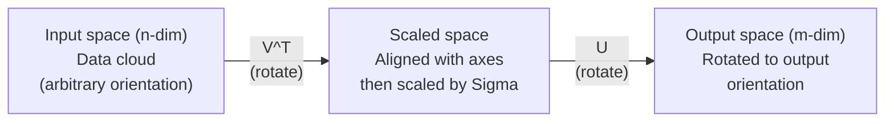
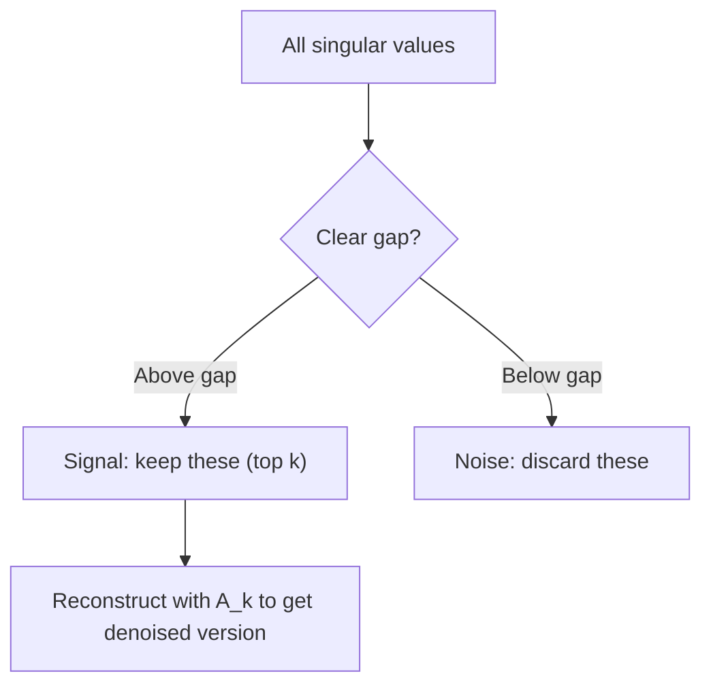

# 奇异值分解

> SVD 是线性代数中的瑞士军刀。每个矩阵都有它。每个数据科学家都需要它。

**类型：** 构建
**语言：** Python, Julia
**前置知识：** 阶段 1，课程 01（线性代数直觉），02（向量与矩阵运算），03（矩阵变换）
**时间：** ~120 分钟

## 学习目标

- 通过幂迭代实现 SVD，并解释 $U$、$\Sigma$ 和 $V^T$ 的几何含义
- 应用截断 SVD（Truncated SVD）进行图像压缩，衡量压缩率与重建误差的关系
- 通过 SVD 计算 Moore-Penrose 伪逆（Pseudoinverse），求解超定最小二乘系统
- 将 SVD 与 PCA（主成分分析）、推荐系统（潜在因子）、以及 NLP 中的潜在语义分析（Latent Semantic Analysis）建立联系

## 问题

你有一个 1000×2000 的矩阵。它可能是用户-电影评分矩阵，可能是文档-词频表，也可能是图像的像素值。你需要压缩它、去噪、发现隐藏结构，或者用它求解最小二乘系统。特征分解（Eigendecomposition）只适用于方阵，且要求矩阵有完整的线性无关特征向量集。

SVD 适用于任何矩阵。任何形状。任何秩。无条件。它将矩阵分解为三个因子，揭示了矩阵对空间所做的几何变换。它是整个线性代数中最通用、最有用的分解。

## 概念

### SVD 的几何意义

每个矩阵，无论形状如何，都依次执行三个操作：旋转、缩放、旋转。SVD 将这个分解显式地表达出来。

$$
A = U \Sigma V^T \\[10pt]
\begin{array}{cccc}
m \times n & m \times m & m \times n & n \times n \\
\text{(任意矩阵)} & \text{(旋转)} & \text{(缩放)} & \text{(旋转)}
\end{array}
$$

给定任意矩阵 $A$，SVD 将其分解为：
- $V^T$：在输入空间（$n$ 维）中旋转向量
- $\Sigma$：沿各轴缩放（拉伸或压缩）
- $U$：将结果旋转到输出空间（$m$ 维）



可以这样理解。你把一个矩阵交给 SVD，它告诉你："这个矩阵接收一个输入球体，先用 $V^T$ 旋转，然后用 $\Sigma$ 拉伸成椭球体，最后用 $U$ 旋转这个椭球体。"奇异值就是这个椭球体各轴的长度。

### 完整的分解

对于形状为 $m \times n$ 的矩阵 $A$：

$$
A = U \Sigma V^T
$$

其中：
- $U$ 是 $m \times m$ 正交矩阵（$U^T U = I$）
- $\Sigma$ 是 $m \times n$ 对角矩阵（对角线为奇异值）
- $V$ 是 $n \times n$ 正交矩阵（$V^T V = I$）

奇异值 $\sigma_1 \geq \sigma_2 \geq \cdots \geq \sigma_r > 0$，其中 $r = \operatorname{rank}(A)$。

$U$ 的列称为左奇异向量，$V$ 的列称为右奇异向量，$\Sigma$ 的对角元素称为奇异值。奇异值总是非负的，且按惯例从大到小排列。

### 左奇异向量、奇异值、右奇异向量

SVD 的每个组成部分都有独特的几何含义。

**右奇异向量（$V$ 的列）：** 构成输入空间（$\mathbb{R}^n$）的一组正交基。它们是输入空间中那些被矩阵映射到输出空间正交方向的方向。可以理解为定义域的自然坐标系。

**奇异值（$\Sigma$ 的对角线）：** 缩放因子。第 $i$ 个奇异值告诉你矩阵沿第 $i$ 个右奇异向量方向拉伸了多少。奇异值为零意味着矩阵完全压碎了该方向。

**左奇异向量（$U$ 的列）：** 构成输出空间（$\mathbb{R}^m$）的一组正交基。第 $i$ 个左奇异向量是第 $i$ 个右奇异向量经缩放后落在输出空间的方向。

它们之间的关系：

$$
A v_i = \sigma_i u_i
$$

矩阵 $A$ 将第 $i$ 个右奇异向量 $v_i$ 缩放 $\sigma_i$ 倍，映射到第 $i$ 个左奇异向量 $u_i$。

这给出了任意矩阵的坐标级几何图像。

### 外积形式

SVD 可以写为一组秩 1 矩阵的和：

$$
A = \sigma_1 u_1 v_1^T + \sigma_2 u_2 v_2^T + \cdots + \sigma_r u_r v_r^T
$$

每个项 $\sigma_i u_i v_i^T$ 是一个秩 1 矩阵（外积）。完整矩阵是 $r$ 个这样的矩阵之和，其中 $r$ 是矩阵的秩。

这种形式是低秩逼近（Low-rank Approximation）的基础。每个项添加一层结构。第一项捕获最重要的模式，第二项捕获次重要的模式，依此类推。截断这个求和序列即可得到给定秩下的最佳逼近。

$$
\begin{aligned}
A_1 &= \sigma_1 u_1 v_1^T \quad \text{(秩1近似，捕获主导模式)} \\[15pt]
A_2 &= \sigma_1 u_1 v_1^T + \sigma_2 u_2 v_2^T \quad \text{(秩2近似，捕获前两种最重要的模式)} \\[15pt]
A_k &= \sum_{i=1}^k \sigma_i u_i v_i^T \quad \text{(秩k近似，由 Eckart-Young 定理保证最优)}
\end{aligned}
$$

### 与特征分解的关系

SVD 与特征分解（Eigendecomposition）有着深刻联系。$A$ 的奇异值和奇异向量直接来自 $A^T A$ 和 $A A^T$ 的特征值和特征向量。

$$
\begin{aligned}
A^T A &= V \Sigma^T U^T U \Sigma V^T \\[5pt]
     &= V \Sigma^T \Sigma V^T \\[5pt]
     &= V D V^T
\end{aligned}
$$

其中 $D = \Sigma^T \Sigma$ 是对角矩阵，对角线元素为 $\sigma_i^2$。

所以：
- 右奇异向量（$V$）是 $A^T A$ 的特征向量
- 奇异值的平方（$\sigma_i^2$）是 $A^T A$ 的特征值

类似地：

$$
A A^T = U \Sigma V^T V \Sigma^T U^T = U \Sigma \Sigma^T U^T
$$

所以：
- 左奇异向量（$U$）是 $A A^T$ 的特征向量
- $A A^T$ 的特征值也是 $\sigma_i^2$

这个联系告诉我们三件事：
1. 奇异值总是实数且非负（它们是半正定矩阵特征值的平方根）。
2. 你可以通过对 $A^T A$ 做特征分解来计算 SVD，但这会使条件数平方，损失数值精度。专用的 SVD 算法避免了这一点。
3. 当 $A$ 是对称半正定方阵时，SVD 与特征分解相同。

### 截断 SVD：低秩逼近

Eckart-Young-Mirsky 定理指出，在 Frobenius 范数和谱范数下，对 $A$ 的最佳秩 $k$ 逼近是只保留前 $k$ 个最大的奇异值及其对应的向量：

$$
A_k = U_k \Sigma_k V_k^T
$$

其中：
- $U_k$ 是 $m \times k$（$U$ 的前 $k$ 列）
- $\Sigma_k$ 是 $k \times k$（$\Sigma$ 的左上 $k \times k$ 子块）
- $V_k$ 是 $n \times k$（$V$ 的前 $k$ 列）

近似误差：

$$
\begin{aligned}
\text{谱范数:} \quad & \sigma_{k+1} \\[15pt]
\text{Frobenius 范数:} \quad & \sqrt{\sigma_{k+1}^2 + \cdots + \sigma_r^2}
\end{aligned}
$$

这不仅是一个"不错"的近似。它被证明是秩 $k$ 下可能的最佳逼近。没有任何其他秩 $k$ 矩阵比它更接近 $A$。

| 分量 | 相对大小 | 在秩3近似中保留？ |
|-----------|-------------------|------------------------|
| $\sigma_1$ | 最大 | 是 |
| $\sigma_2$ | 大 | 是 |
| $\sigma_3$ | 中大 | 是 |
| $\sigma_4$ | 中 | 否（误差） |
| $\sigma_5$ | 中小 | 否（误差） |
| $\sigma_6$ | 小 | 否（误差） |
| $\sigma_7$ | 很小 | 否（误差） |
| $\sigma_8$ | 极小 | 否（误差） |

保留前 3 个：$A_3$ 捕获三个最大的奇异值。误差 = 剩余值（$\sigma_4$ 到 $\sigma_8$）。

如果奇异值衰减很快，较小的 $k$ 就能捕获矩阵的大部分信息。如果衰减很慢，说明矩阵没有低秩结构。

### 图像压缩与 SVD

一张灰度图像就是一个像素强度矩阵。800×600 的图像有 480,000 个值。SVD 可以用少得多的值来逼近它。

```
原始图像：800 x 600 = 480,000 个值

SVD 秩 k：
  U_k：      800 x k 个值
  Sigma_k：  k 个值
  V_k：      600 x k 个值
  总计：    k * (800 + 600 + 1) = k * 1401 个值

  k=10：   14,010 个值  （原始值的 2.9%）
  k=50：   70,050 个值  （原始值的 14.6%）
  k=100： 140,100 个值  （原始值的 29.2%）

  压缩率随 k 减小而提高，但视觉质量会下降。
```

关键洞察：自然图像的奇异值衰减很快。前几个奇异值捕获了图像的大尺度结构（形状、渐变），后面的奇异值捕获了精细细节和噪声。在秩 50 处截断产生的图像看起来几乎与原始图像无异，而存储量减少了 85%。

### SVD 与推荐系统

Netflix Prize 让这一点闻名。你有一个用户-电影评分矩阵，其中大部分条目是缺失的。

```
             Movie1  Movie2  Movie3  Movie4  Movie5
  User1      [  5      ?       3       ?       1  ]
  User2      [  ?      4       ?       2       ?  ]
  User3      [  3      ?       5       ?       ?  ]
  User4      [  ?      ?       ?       4       3  ]

  ? = 未知评分
```

核心思想：这个评分矩阵具有低秩性。用户的品味并非完全独立。存在少数几个潜在因子（动作 vs. 剧情、老片 vs. 新片、理性 vs. 感性）可以解释大多数偏好。

对（填充后的）评分矩阵做 SVD 将其分解为：
- $U$：潜在因子空间中的用户画像
- $\Sigma$：每个潜在因子的重要性
- $V^T$：潜在因子空间中的电影画像

用户对某部电影的预测评分就是该用户画像与电影画像的点积（经奇异值加权）。低秩逼近填充了缺失的评分条目。

在实践中，你使用 Simon Funk 增量式 SVD 或 ALS（交替最小二乘法）等变体，它们直接处理缺失数据。但核心思想是一样的：通过 SVD 进行潜在因子分解。

### SVD 在 NLP 中的应用：潜在语义分析

潜在语义分析（Latent Semantic Analysis, LSA），也称为潜在语义索引（Latent Semantic Indexing, LSI），将 SVD 应用于词项-文档矩阵（Term-document Matrix）。

```
             Doc1   Doc2   Doc3   Doc4
  "cat"      [  3      0      1      0  ]
  "dog"      [  2      0      0      1  ]
  "fish"     [  0      4      1      0  ]
  "pet"      [  1      1      1      1  ]
  "ocean"    [  0      3      0      0  ]

  SVD 秩 k=2 之后：

  每个文档成为二维"概念空间"中的一个点。
  每个词项成为同一二维空间中的一个点。
  相似主题的文档聚集在一起。
  含义相近的词项聚集在一起。

  "cat"和"dog"彼此靠近（陆地宠物）。
  "fish"和"ocean"彼此靠近（水生概念）。
  Doc1 和 Doc3 如果主题相似也会聚集在一起。
```

LSA 是最早从原始文本中捕获语义相似性的成功方法之一。它的工作原理是同义词往往出现在相似的文档中，因此 SVD 将它们分组到相同的潜在维度中。现代词嵌入（Word2Vec、GloVe）可以看作这一思想的继承者。

### SVD 与降噪

含噪数据的信号集中在前几个奇异值上，噪声则散布在所有奇异值中。截断可以去除噪声基底。

**干净信号的奇异值：**

| 分量 | 幅度 | 类型 |
|-----------|-----------|------|
| $\sigma_1$ | 非常大 | 信号 |
| $\sigma_2$ | 大 | 信号 |
| $\sigma_3$ | 中 | 信号 |
| $\sigma_4$ | 接近零 | 可忽略 |
| $\sigma_5$ | 接近零 | 可忽略 |

**含噪信号的奇异值（噪声叠加到所有分量上）：**

| 分量 | 幅度 | 类型 |
|-----------|-----------|------|
| $\sigma_1$ | 非常大 | 信号 |
| $\sigma_2$ | 大 | 信号 |
| $\sigma_3$ | 中 | 信号 |
| $\sigma_4$ | 小 | 噪声 |
| $\sigma_5$ | 小 | 噪声 |
| $\sigma_6$ | 小 | 噪声 |
| $\sigma_7$ | 小 | 噪声 |



这种方法广泛应用于信号处理、科学测量和数据清洗。任何被加性噪声污染的矩阵，截断 SVD 都是一种原则性的信号与噪声分离方法。

### 通过 SVD 计算伪逆

Moore-Penrose 伪逆（$A^+$）将矩阵求逆推广到非方阵和奇异矩阵。SVD 使它的计算变得简单。

如果 $A = U \Sigma V^T$，则：

$$
A^+ = V \Sigma^+ U^T
$$

其中 $\Sigma^+$ 的构造方式：
1. 转置 $\Sigma$（交换行列）
2. 将每个非零对角元素 $\sigma_i$ 替换为 $1/\sigma_i$
3. 零元素保持不变

对于 $A (m \times n)$：$A^+$ 是 $(n \times m)$
对于 $\Sigma (m \times n)$：$\Sigma^+$ 是 $(n \times m)$

伪逆用于求解最小二乘问题。如果 $Ax = b$ 没有精确解（超定方程组），那么 $x = A^+ b$ 就是最小二乘解（最小化 $||Ax - b||$）。

超定方程组（方程数多于未知数）：

$$
\begin{bmatrix} 1 & 1 \\ 2 & 1 \\ 3 & 1 \end{bmatrix} x = \begin{bmatrix} 3 \\ 5 \\ 6 \end{bmatrix} \quad \text{不存在精确解}
$$

$$
x_{\text{ls}} = A^+ b = V \Sigma^+ U^T b
$$

这给出了最小化残差平方和的 $x$。结果与正规方程 $(A^T A)^{-1} A^T b$ 相同，但在数值上更稳定。

### 数值稳定性优势

对 $A^T A$ 做特征分解会将奇异值平方（$A^T A$ 的特征值是 $\sigma_i^2$）。这会使条件数平方，放大数值误差。

**示例：**

$$
\begin{aligned}
A \text{ 的奇异值: } & [1000, 1, 0.001] \\[5pt]
A \text{ 的条件数: } & 1000 / 0.001 = 10^6 \\[10pt]
A^T A \text{ 的特征值: } & [10^6, 1, 10^{-6}] \\[5pt]
A^T A \text{ 的条件数: } & 10^6 / 10^{-6} = 10^{12} \\[10pt]
\text{直接计算 SVD: } & \text{处理条件数 } 10^6 \\[5pt]
\text{通过 } A^T A \text{ 计算: } & \text{处理条件数 } 10^{12} \\
& \text{（损失 6 位额外精度）}
\end{aligned}
$$

现代 SVD 算法（Golub-Kahan 双对角化）直接在 $A$ 上操作，从不构造 $A^T A$。这就是为什么你应该始终首选 `np.linalg.svd(A)` 而不是 `np.linalg.eig(A.T @ A)`。

### 与 PCA 的联系

PCA 就是对中心化数据做 SVD。这不是类比，它们在计算上完全相同。

给定数据矩阵 $X$（$n_{\text{samples}} \times n_{\text{features}}$，已减去均值中心化）：

协方差矩阵：$C = \frac{1}{n-1} X^T X$

PCA 寻找 $C$ 的特征向量。但是：

$$
\begin{aligned}
X &= U \Sigma V^T \quad \text{(X 的 SVD)} \\[5pt]
X^T X &= V \Sigma^2 V^T \\[5pt]
C &= \frac{1}{n-1} V \Sigma^2 V^T
\end{aligned}
$$

所以主成分正好是右奇异向量 $V$。每个成分的解释方差是 $\sigma_i^2 / (n-1)$。

在 sklearn 中，PCA 是用 SVD 实现的，而不是特征分解。它更快，数值稳定性更好。

这意味着你在上一课（降维）中学到的所有内容，底层都是在做 SVD。PCA 是机器学习中最常见的 SVD 应用。

## 动手实现

### 步骤 1：从零实现 SVD（幂迭代法）

```python
import numpy as np

# 【策略说明】幂迭代法：通过反复将矩阵作用于随机向量并归一化，
# 逐步收敛到最大特征值对应的特征向量。收敛速度取决于最大与次大
# 特征值之比，比值越大收敛越快。
def power_iteration(M, num_iters=100):
    """幂迭代：求矩阵 M 的最大特征值及对应特征向量

    原理：随机初始化向量 v，不断执行 v = Mv / ||Mv||，
    向量 v 会收敛到 M 的最大特征值对应的特征向量。
    """
    n = M.shape[1]
    # 随机初始化，打破对称性，确保不收敛到零向量
    v = np.random.randn(n)
    v = v / np.linalg.norm(v)

    for _ in range(num_iters):
        Mv = M @ v
        v = Mv / np.linalg.norm(Mv)

    # Rayleigh 商：v^T M v 给出特征值的最优估计
    eigenvalue = v @ M @ v
    return eigenvalue, v

# 【策略说明】通过"收缩法"依次计算各奇异值：
# 1. 对 A^T A 做幂迭代，求出最大特征值 -> 最大奇异值
# 2. 找到对应的左/右奇异向量
# 3. 从残差矩阵中减去当前分量（外积），再对残差重复步骤1
# 这等价于顺序提取每个秩1分量。
def svd_from_scratch(A, k=None):
    m, n = A.shape
    if k is None:
        k = min(m, n)

    sigmas = []
    us = []
    vs = []

    # 初始化残差矩阵，后续每一步从中减去已提取的分量
    A_residual = A.copy().astype(float)

    for _ in range(k):
        # 对 A^T A 做幂迭代，求最大特征值
        # A^T A 的特征值 = sigma^2，特征向量 = 右奇异向量
        AtA = A_residual.T @ A_residual
        eigenvalue, v = power_iteration(AtA, num_iters=200)

        # 特征值接近零意味着秩已耗尽，提前终止
        if eigenvalue < 1e-10:
            break

        sigma = np.sqrt(eigenvalue)
        # 已知右奇异向量 v 和奇异值 sigma，计算左奇异向量 u = A v / sigma
        u = A_residual @ v / sigma

        sigmas.append(sigma)
        us.append(u)
        vs.append(v)

        # 收缩：从残差中减去当前秩1分量，保证下一步提取的是下一个最大分量
        A_residual = A_residual - sigma * np.outer(u, v)

    # 将列表堆叠为矩阵
    U = np.column_stack(us) if us else np.empty((m, 0))
    S = np.array(sigmas)
    V = np.column_stack(vs) if vs else np.empty((n, 0))

    return U, S, V
```

### 步骤 2：测试并与 NumPy 对比

```python
np.random.seed(42)
A = np.random.randn(5, 4)

# 用我们的实现和 NumPy 分别计算 SVD，验证正确性
U_ours, S_ours, V_ours = svd_from_scratch(A)
U_np, S_np, Vt_np = np.linalg.svd(A, full_matrices=False)

print("我们的奇异值:", np.round(S_ours, 4))
print("NumPy 奇异值:", np.round(S_np, 4))

# 重建矩阵并计算误差，验证分解正确
A_reconstructed = U_ours @ np.diag(S_ours) @ V_ours.T
print(f"重建误差: {np.linalg.norm(A - A_reconstructed):.8f}")
```

### 步骤 3：图像压缩演示

```python
def compress_image_svd(image_matrix, k):
    """对图像矩阵做截断 SVD 压缩：只保留前 k 个奇异值

    压缩原理：原始图像有 rows*cols 个值，压缩后只需存储
    k*(rows+cols+1) 个值（U_k 的 k*rows + 奇异值 k + V_k^T 的 k*cols）。
    """
    U, S, Vt = np.linalg.svd(image_matrix, full_matrices=False)
    # 只取前 k 个奇异值和对应的向量，重建压缩图像
    compressed = U[:, :k] @ np.diag(S[:k]) @ Vt[:k, :]
    return compressed

image = np.random.seed(42)
rows, cols = 200, 300
image = np.random.randn(rows, cols)

# 测试不同压缩级别，观察压缩率与误差的权衡
for k in [1, 5, 10, 20, 50]:
    compressed = compress_image_svd(image, k)
    # 相对误差：截断 SVD 的误差等于被丢弃的奇异值的能量
    error = np.linalg.norm(image - compressed) / np.linalg.norm(image)
    original_size = rows * cols
    compressed_size = k * (rows + cols + 1)
    ratio = compressed_size / original_size
    print(f"k={k:>3d}  误差={error:.4f}  存储占比={ratio:.1%}")
```

### 步骤 4：降噪

```python
np.random.seed(42)
# 生成一个干净的秩2信号（正弦*余弦的外积）
clean = np.outer(np.sin(np.linspace(0, 4*np.pi, 100)),
                 np.cos(np.linspace(0, 2*np.pi, 80)))
# 添加高斯噪声，噪声标准差为信号幅度的 30%
noise = 0.3 * np.random.randn(100, 80)
noisy = clean + noise

# 对含噪信号做 SVD，用前5个奇异值重建
# 因为信号集中在顶部奇异值，噪声散布在所有维上
U, S, Vt = np.linalg.svd(noisy, full_matrices=False)
denoised = U[:, :5] @ np.diag(S[:5]) @ Vt[:5, :]

print(f"含噪数据误差:    {np.linalg.norm(noisy - clean):.4f}")
print(f"去噪后误差:      {np.linalg.norm(denoised - clean):.4f}")
print(f"改善幅度:        {(1 - np.linalg.norm(denoised - clean) / np.linalg.norm(noisy - clean)):.1%}")
```

### 步骤 5：伪逆

```python
A = np.array([[1, 1], [2, 1], [3, 1]], dtype=float)
b = np.array([3, 5, 6], dtype=float)

# 通过 SVD 计算伪逆：A^+ = V * diag(1/sigma_i) * U^T
# 对非零奇异值取倒数，零奇异值保持为零
U, S, Vt = np.linalg.svd(A, full_matrices=False)
S_inv = np.diag(1.0 / S)
A_pinv = Vt.T @ S_inv @ U.T

# 三种方式求解最小二乘，结果应该一致
x_svd = A_pinv @ b
x_lstsq = np.linalg.lstsq(A, b, rcond=None)[0]
x_pinv = np.linalg.pinv(A) @ b

print(f"SVD 伪逆解:     {x_svd}")
print(f"np.linalg.lstsq: {x_lstsq}")
print(f"np.linalg.pinv:  {x_pinv}")
```

## 应用

完整的可运行演示在 `code/svd.py` 中。运行它以查看 SVD 在图像压缩、推荐系统、潜在语义分析和降噪中的应用。

```bash
python svd.py
```

Julia 版本在 `code/svd.jl` 中，使用 Julia 原生的 `svd()` 函数和 `LinearAlgebra` 包演示相同的概念。

```bash
julia svd.jl
```

## 交付物

本课程产出：
- `outputs/skill-svd.md` —— 一份技能卡片，指导何时以及如何在真实项目中应用 SVD

## 练习

1. 不使用幂迭代，从零实现完整 SVD。改为计算 $A^T A$ 的特征分解得到 $V$ 和奇异值，然后计算 $U = A V \Sigma^{-1}$。将数值精度与幂迭代版本和 NumPy 版本进行比较。

2. 加载一张真实的灰度图像（或将一张彩色图像转为灰度）。在秩 1、5、10、25、50、100 下分别压缩。对每个秩，计算压缩率和相对误差。找出图像在视觉上可接受的最小秩。

3. 构建一个微型推荐系统。创建一个 10×8 的用户-电影评分矩阵，部分条目已知。用行均值填充缺失条目。计算 SVD 并用秩 3 近似重建。使用重建矩阵预测缺失评分，验证预测的合理性。

4. 创建一个包含 3 个合成主题的 100×50 文档-词项矩阵。每个主题关联 5 个词项。添加噪声。应用 SVD 并验证前 3 个奇异值远大于其余奇异值。将文档投影到 3 维潜在空间中，检查同一主题的文档是否聚集在一起。

5. 生成一个干净的低秩矩阵（秩 3，尺寸 50×40），并在不同噪声水平（$\sigma = 0.1, 0.5, 1.0, 2.0$）下添加高斯噪声。对每个噪声水平，通过扫描 $k$ 从 1 到 40 并衡量相对于干净矩阵的重建误差，找到最优截断秩。绘制最优 $k$ 随噪声水平变化的曲线。

## 关键术语

| 术语 | 通俗解释 | 实际含义 |
|------|----------------|----------------------|
| SVD | "分解任意矩阵" | 将 $A$ 分解为 $U \Sigma V^T$，其中 $U$ 和 $V$ 正交，$\Sigma$ 对角且元素非负。适用于任意形状的任意矩阵。 |
| 奇异值 | "这个分量有多重要" | $\Sigma$ 的第 $i$ 个对角元素。衡量矩阵沿第 $i$ 个主方向拉伸的程度。总是非负，按递减顺序排列。 |
| 左奇异向量 | "输出方向" | $U$ 的列。第 $i$ 个右奇异向量经 $\sigma_i$ 缩放后映射到的输出空间方向。 |
| 右奇异向量 | "输入方向" | $V$ 的列。输入空间中被矩阵映射到第 $i$ 个左奇异向量（经 $\sigma_i$ 缩放后）的方向。 |
| 截断 SVD | "低秩逼近" | 只保留前 $k$ 个奇异值及其对应的向量。产生对原矩阵的最佳秩 $k$ 逼近（Eckart-Young 定理）。 |
| 秩 | "真正的维度" | 非零奇异值的个数。告诉你矩阵实际使用的独立方向数。 |
| 伪逆 | "广义逆" | $V \Sigma^+ U^T$。对非零奇异值取倒数，零奇异值保持为零。用于求解非方阵或奇异矩阵的最小二乘问题。 |
| 条件数 | "对误差的敏感度" | $\sigma_{\max} / \sigma_{\min}$。条件数大意味着输入的小变化会引起输出的大变化。SVD 直接揭示这一点。 |
| 潜在因子 | "隐藏变量" | SVD 发现的低秩空间中的维度。在推荐系统中，潜在因子可能对应类型偏好。在 NLP 中，可能对应某个主题。 |
| Frobenius 范数 | "矩阵的总大小" | 所有元素平方和的平方根。等于所有奇异值平方和的平方根。用于衡量近似误差。 |
| Eckart-Young 定理 | "SVD 给出最佳压缩" | 对任意目标秩 $k$，截断 SVD 在所有可能的秩 $k$ 矩阵中最小化逼近误差。 |
| 幂迭代 | "找最大的特征向量" | 用随机向量反复乘以矩阵并归一化。收敛到最大特征值对应的特征向量。许多 SVD 算法的构建基石。 |

## 延伸阅读

- [Gilbert Strang: Linear Algebra and Its Applications, Chapter 7](https://math.mit.edu/~gs/linearalgebra/) —— SVD 的深入讲解及应用
- [3Blue1Brown: But what is the SVD?](https://www.youtube.com/watch?v=vSczTbgc8Rc) —— SVD 的几何直觉
- [We Recommend a Singular Value Decomposition](https://www.ams.org/publicoutreach/feature-column/fcarc-svd) —— 美国数学会（AMS）的入门级综述
- [Netflix Prize and Matrix Factorization](https://sifter.org/~simon/journal/20061211.html) —— Simon Funk 关于 SVD 在推荐系统中应用的原始博客
- [Latent Semantic Analysis](https://en.wikipedia.org/wiki/Latent_semantic_analysis) —— SVD 在 NLP 中的经典应用
- [Numerical Linear Algebra by Trefethen and Bau](https://people.maths.ox.ac.uk/trefethen/text.html) —— 理解 SVD 算法及其数值性质的权威参考
