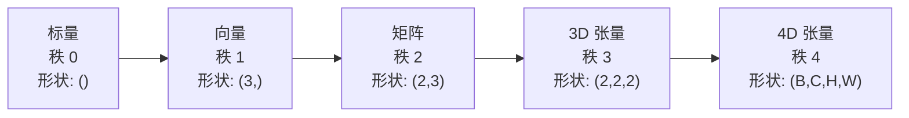
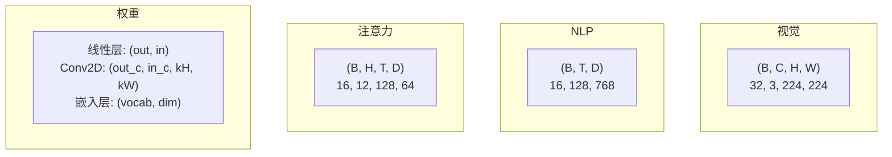
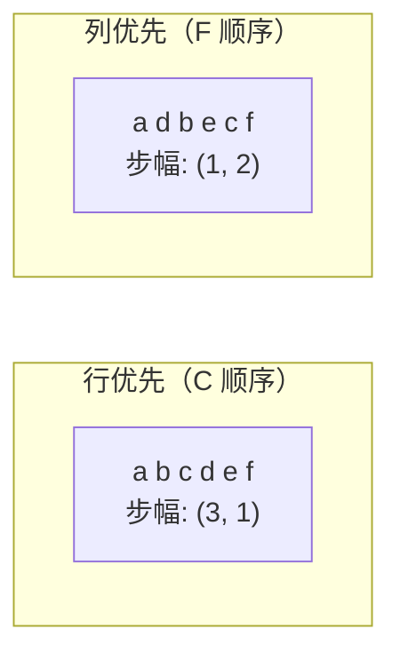
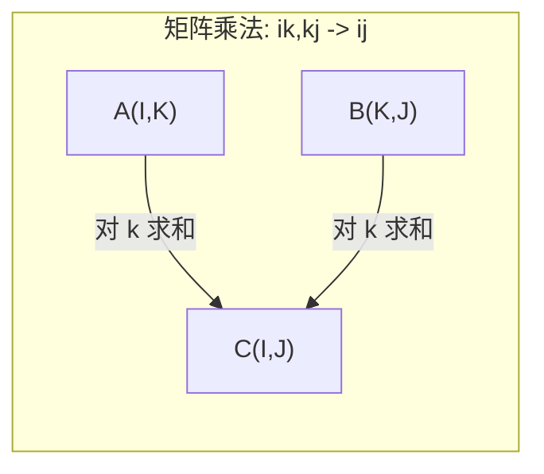

# 张量操作 (Tensor Operations)

> 张量是数据和深度学习之间的通用语言。每一张图像、每一句文本、每一个梯度都流经它们。

**类型：** 构建
**语言：** Python
**前置知识：** 阶段 1，第 01 课（线性代数直觉），第 02 课（向量、矩阵与运算）
**时间：** ~90 分钟

## 学习目标 (Learning Objectives)

- 从零实现一个张量类，包含形状、步幅、重塑、转置和逐元素操作
- 应用广播规则在不复制数据的情况下对不同形状的张量进行操作
- 为点积、矩阵乘法、外积和批量操作编写 einsum 表达式
- 追踪多头注意力每一步的精确张量形状

## 问题 (The Problem)

你构建了一个 Transformer。前向传播看起来干净整洁。运行后得到：`RuntimeError: mat1 and mat2 shapes cannot be multiplied (32x768 and 512x768)`。你盯着形状看。你尝试了转置。现在它说 `Expected 4D input (got 3D input)`。你加了一个 unsqueeze。然后别的地方又出错了。

形状错误是深度学习代码中最常见的错误。它们在概念上并不难——每个操作都有形状约定——但它们会快速蔓延。一个 Transformer 有数十个重塑、转置和广播操作串联在一起。一个轴搞错，错误就会级联传播。更糟糕的是，有些形状错误根本不会抛出错误。它们会沿着错误的维度广播或在错误的轴上求和，悄无声息地产生垃圾结果。

矩阵处理两组事物之间的两两关系。真实数据无法被两个维度容纳。一批 32 张 224x224 的 RGB 图像是一个 4D 张量：`(32, 3, 224, 224)`。12 头的自注意力也是 4D：`(batch, heads, seq_len, head_dim)`。你需要一个可以推广到任意维度数的数据结构，其操作能够在所有维度上干净地组合。这个数据结构就是**张量 (Tensor)**。掌握它的操作后，形状错误将变得非常容易调试。

## 概念 (The Concept)

### 什么是张量

张量是统一数据类型的多维数值数组。维度数称为**秩 (Rank)**（或**阶 (Order)**）。每个维度是一个**轴 (Axis)**。**形状 (Shape)** 是一个元组，列出每个轴的大小。



总元素数 = 所有大小的乘积。形状 `(2, 3, 4)` 包含 $2 \times 3 \times 4 = 24$ 个元素。

### 深度学习中的张量形状

不同类型的数据按约定映射到特定的张量形状。



PyTorch 使用 NCHW（通道优先）。TensorFlow 默认使用 NHWC（通道在最后）。布局不匹配会导致静默的性能下降或错误。

### 内存布局如何工作

内存中的二维数组实际上是一个一维字节序列。**步幅 (Strides)** 告诉你在每个轴上移动一步需要跳过多少个元素。



转置不会移动数据。它交换步幅，使张量变为**非连续 (non-contiguous)** 状态——同一行的元素在内存中不再相邻。

### 广播规则 (Broadcasting Rules)

广播让你可以在不复制数据的情况下对不同形状的张量进行操作。从右侧对齐形状。当两个维度相等或其中一个为 1 时，它们兼容。维度较少时，在左侧填充 1。

```
Tensor A:     (8, 1, 6, 1)
Tensor B:        (7, 1, 5)
Padded B:     (1, 7, 1, 5)
Result:       (8, 7, 6, 5)
```

### Einsum：通用张量操作

爱因斯坦求和约定 (Einstein summation) 用字母标记每个轴。出现在输入但不在输出中的轴会被求和。同时出现在输入和输出中的轴则保留。



关键模式：`i,i->`（点积），`i,j->ij`（外积），`ii->`（迹），`ij->ji`（转置），`bij,bjk->bik`（批量矩阵乘法），`bhtd,bhsd->bhts`（注意力分数）。

## 动手实现 (Build It)

代码位于 `code/tensors.py`。每一步都对应那里的实现。

### 步骤 1：张量存储与步幅

张量存储一个扁平的数字列表以及形状元数据。步幅告诉索引逻辑如何将多维索引映射到扁平位置。

```python
class Tensor:
    # 初始化张量：支持嵌套列表、NumPy 数组或标量作为输入
    # 核心策略：使用一维扁平数组 + 形状元数据，而非多维数组，
    # 这样 reshape/transpose 只需改变形状/步幅，不复制底层数据
    def __init__(self, data, shape=None):
        # 嵌套列表输入：递归展平为一维，同时提取推断形状
        if isinstance(data, (list, tuple)):
            self._data, self._shape = self._flatten_nested(data)
        # NumPy 数组输入：展平后转为 Python 列表，保留原始形状
        elif isinstance(data, np.ndarray):
            self._data = data.flatten().tolist()
            self._shape = tuple(data.shape)
        # 标量输入：包装为单元素列表，形状为空元组（秩为 0）
        else:
            self._data = [data]
            self._shape = ()

        # 若显式指定形状，验证元素总数是否匹配
        # 这能防止 reshape 等操作意外丢失或重复数据
        if shape is not None:
            total = reduce(lambda a, b: a * b, shape, 1)
            if total != len(self._data):
                raise ValueError(
                    f"Cannot reshape {len(self._data)} elements into shape {shape}"
                )
            self._shape = tuple(shape)

        # 根据最终形状计算步幅，供后续索引操作使用
        self._strides = self._compute_strides(self._shape)

    @staticmethod
    def _compute_strides(shape):
        # 标量张量没有步幅
        if len(shape) == 0:
            return ()
        strides = [1] * len(shape)
        # 从最后一个轴向前累乘：每个轴的步幅 = 下一个轴的步幅 × 下一个轴的大小
        # 示例：形状 (3, 4)
        # - 从右向左：strides[1] = 1, strides[0] = strides[1] * 4 = 4
        # - 最终 strides = (4, 1)：行步幅为 4（跳过一行），列步幅为 1（跳过一个元素）
        for i in range(len(shape) - 2, -1, -1):
            strides[i] = strides[i + 1] * shape[i + 1]
        return tuple(strides)
```

对于形状 `(3, 4)`，步幅为 `(4, 1)`——跳过 4 个元素前进一行，跳过 1 个元素前进一列。

### 步骤 2：Reshape、Squeeze、Unsqueeze

Reshape 改变形状而不改变元素顺序。元素总数必须保持不变。用 `-1` 表示某个维度，让程序推断其大小。

```python
# 创建形状 (2, 6) 的张量（元素 0~11），重塑为 (3, 4)
# 效果：重新排列形状元组，不改变底层数据的一维排列顺序
t = Tensor(list(range(12)), shape=(2, 6))
r = t.reshape((3, 4))
# -1 表示自动推断：总元素 12 / 指定维度 3 = 4
r = t.reshape((-1, 3))
```

Squeeze 移除大小为 1 的轴。Unsqueeze 插入一个大小为 1 的轴。Unsqueeze 对广播至关重要——一个形状为 `(D,)` 的偏置向量要与批次 `(B, T, D)` 相加，需要 unsqueeze 为 `(1, 1, D)`。

```python
# 形状 (1, 3, 1, 2) → squeeze 后为 (3, 2)，所有大小为 1 的轴被移除
t = Tensor(list(range(6)), shape=(1, 3, 1, 2))
s = t.squeeze()
# 在位置 0 插入新轴：(3,) → (1, 3)，便于与更高维张量进行广播对齐
v = Tensor([1, 2, 3])
u = v.unsqueeze(0)
```

### 步骤 3：Transpose 和 Permute

Transpose 交换两个轴。Permute 重新排列所有轴。这是你在 NCHW 和 NHWC 之间转换的方式。

```python
# 形状 (2, 3) → 转置后 (3, 2)
# 转置不复制数据，仅交换步幅元组中的对应值
mat = Tensor(list(range(6)), shape=(2, 3))
tr = mat.transpose(0, 1)

# 将 4D 张量从 NCHW 排列为 NHWC 格式：
# 原始轴顺序 (0: batch, 1: channel, 2: height, 3: width)
# 目标轴顺序 (0: batch, 2: height, 3: width, 1: channel)
t4d = Tensor(list(range(24)), shape=(1, 2, 3, 4))
perm = t4d.permute((0, 2, 3, 1))
```

转置或排列后，张量在内存中变为非连续。在 PyTorch 中，`view` 在非连续张量上会失败——此时应使用 `reshape` 或先调用 `.contiguous()`。

### 步骤 4：逐元素操作与规约

逐元素运算（加法、乘法、减法）独立应用于每个元素，保持形状不变。规约运算（求和、均值、最大值）会折叠一个或多个轴。

```python
# 逐元素加法：对应位置分别相加，形状保持不变
a = Tensor([[1, 2], [3, 4]])
b = Tensor([[10, 20], [30, 40]])
c = a + b
# 标量广播：2 被广播到所有元素，等同于逐元素乘法
d = a * 2
# 沿轴 0 求和：每一列元素相加，形状从 (2,2) 收缩为 (2,)
s = a.sum(axis=0)
```

CNN 中的全局平均池化：`(B, C, H, W).mean(axis=[2, 3])` 得到 `(B, C)`。NLP 中的序列平均池化：`(B, T, D).mean(axis=1)` 得到 `(B, D)`。

### 步骤 5：使用 NumPy 进行广播

`tensors.py` 中的 `demo_broadcasting_numpy()` 函数展示了核心模式。

```python
# 偏置广播：形状 (4, 3) 的激活值与形状 (3,) 的偏置相加
# NumPy 自动将偏置沿第 0 轴（批次轴）复制 4 次，然后逐元素相加
activations = np.random.randn(4, 3)
bias = np.array([0.1, 0.2, 0.3])
result = activations + bias

# 通道缩放：缩放因子形状为 (1, 3, 1, 1)，广播到图像批次 (2, 3, 4, 4)
# 缩放沿批次、高度、宽度三轴扩展，通道轴大小匹配（均为 3），无需复制
images = np.random.randn(2, 3, 4, 4)
scale = np.array([0.5, 1.0, 1.5]).reshape(1, 3, 1, 1)
result = images * scale

# 外积的广播实现：形状 (3, 1) 和 (1, 4) 广播为 (3, 4)
# 每个输入沿缺失的维度扩展，最终每个组合位置都参与运算
a = np.array([1, 2, 3]).reshape(-1, 1)
b = np.array([10, 20, 30, 40]).reshape(1, -1)
outer = a * b
```

通过广播计算成对距离：将形状 `(M, 2)` 重塑为 `(M, 1, 2)`，`(N, 2)` 重塑为 `(1, N, 2)`，相减，平方，沿最后一个轴求和，再取平方根。结果形状：`(M, N)`。

### 步骤 6：Einsum 操作

`demo_einsum()` 和 `demo_einsum_gallery()` 函数遍历了每一种常见模式。

```python
# 点积 "i,i->"：对两个向量对应位置相乘后沿 i 轴求和（标量输出）
a = np.array([1.0, 2.0, 3.0])
b = np.array([4.0, 5.0, 6.0])
dot = np.einsum("i,i->", a, b)

# 矩阵乘法 "ik,kj->ij"：A 的列 k 与 B 的行 k 相乘后求和，
# k 是收缩索引（不出现在输出中），i 和 j 是保留索引
A = np.array([[1, 2], [3, 4], [5, 6]], dtype=float)
B = np.array([[7, 8, 9], [10, 11, 12]], dtype=float)
matmul = np.einsum("ik,kj->ij", A, B)

# 批量矩阵乘法 "bij,bjk->bik"：保留批次轴 b，
# 对每个批次独立执行矩阵乘法，收缩共享轴 j
batch_A = np.random.randn(4, 3, 5)
batch_B = np.random.randn(4, 5, 2)
batch_mm = np.einsum("bij,bjk->bik", batch_A, batch_B)
```

一次收缩的计算代价是所有索引大小（保留的和求和的）的乘积。对于 `bij,bjk->bik`，若 B=32, I=128, J=64, K=128：$32 \times 128 \times 64 \times 128 = 33,\!554,\!432$ 次乘加运算。

### 步骤 7：通过 Einsum 实现注意力机制

`demo_attention_einsum()` 函数端到端地实现了多头注意力。

```python
B, H, T, D = 2, 4, 8, 16   # 批次大小、头数、序列长度、每头维度
E = H * D                   # 嵌入总维度 = 头数 × 每头维度

X = np.random.randn(B, T, E)                       # 输入形状：(批次, 序列长度, 嵌入维度)
W_q = np.random.randn(E, E) * 0.02                 # 查询投影矩阵，用小随机数初始化

# 步骤 1：线性投影。将输入 X 通过权重矩阵 W_q 投影到查询空间。
# einsum "bte,ek->btk"：对嵌入维度 e 求和，保留批次 b 和序列位置 t
Q = np.einsum("bte,ek->btk", X, W_q)
# 步骤 2：多头拆分。将嵌入维度 E 拆分为 H 个 D 维的头，
# 然后通过 transpose 将头维度移到第 1 位：(B,T,H,D) → (B,H,T,D)
# 布局 (B,H,T,D) 让同一头内所有位置的键值连续排列，便于计算注意力分数
Q = Q.reshape(B, T, H, D).transpose(0, 2, 1, 3)

# 步骤 3：计算注意力分数。Q 和 K 的最后一维 D 是共享的求和轴，
# "bhtd,bhsd->bhts"：对 d 轴求和，得到每个头中每个查询对所有键的注意力分数
scores = np.einsum("bhtd,bhsd->bhts", Q, K) / np.sqrt(D)
# 步骤 4：在序列轴（最后一个轴）上做 Softmax，使每个位置的注意力权重之和为 1
weights = softmax(scores, axis=-1)
# 步骤 5：加权求和。"bhts,bhsd->bhtd"：对 s 轴（序列位置）求和，
# 用注意力权重对值向量 V 做加权平均，保留头维度 h 和维度 d
attn_output = np.einsum("bhts,bhsd->bhtd", weights, V)

# 步骤 6：多头合并。将 (B,H,T,D) 转置回 (B,T,H,D)，
# 然后 reshape 将 H×D 拼接回嵌入维度 E
concat = attn_output.transpose(0, 2, 1, 3).reshape(B, T, E)
# 步骤 7：输出投影。将拼接后的多头输出通过权重矩阵 W_o 投影到目标空间
output = np.einsum("bte,ek->btk", concat, W_o)
```

每一步都是张量操作：投影（通过 einsum 做矩阵乘法）、头拆分（reshape + transpose）、注意力分数（通过 einsum 做批量矩阵乘法）、加权求和（通过 einsum 做批量矩阵乘法）、头合并（transpose + reshape）、输出投影（通过 einsum 做矩阵乘法）。

## 使用它 (Use It)

### 自实现 vs NumPy

| 操作 | 自实现（Tensor 类）| NumPy |
|---|---|---|
| 创建 | `Tensor([[1,2],[3,4]])` | `np.array([[1,2],[3,4]])` |
| 重塑 | `t.reshape((3,4))` | `a.reshape(3,4)` |
| 转置 | `t.transpose(0,1)` | `a.T` 或 `a.transpose(0,1)` |
| 压缩 | `t.squeeze(0)` | `np.squeeze(a, 0)` |
| 求和 | `t.sum(axis=0)` | `a.sum(axis=0)` |
| Einsum | 不支持 | `np.einsum("ij,jk->ik", a, b)` |

### 自实现 vs PyTorch

```python
import torch

# 创建张量并查看形状、步幅和连续性信息，这对调试形状错误至关重要
t = torch.tensor([[1, 2, 3], [4, 5, 6]], dtype=torch.float32)
t.shape            # 形状元组，查看各维度大小
t.stride()         # 步幅元组，显示各轴在内存中的跳跃步数
t.is_contiguous()  # 检查数据在内存中是否按逻辑顺序连续排列

# 重塑和扩展操作：reshape 兼容连续和非连续张量，unsqueeze 为广播对齐维度
t.reshape(3, 2)
t.unsqueeze(0)
# 转置后若需要对非连续张量执行 view，先调用 contiguous() 重新排列内存
t.transpose(0, 1)
t.transpose(0, 1).contiguous()

# PyTorch 也支持 einsum，语义与 NumPy 版本完全一致
torch.einsum("ik,kj->ij", A, B)
```

PyTorch 增加了自动求导、GPU 支持和优化的 BLAS 内核。形状语义是完全相同的。如果你理解了自实现版本，PyTorch 的形状错误就变得可读了。

### 每个神经网络层都是张量操作

| 操作 | 张量形式 | Einsum |
|---|---|---|
| 线性层 | `Y = X @ W.T + b` | `"bd,od->bo"` + 偏置 |
| 注意力 QKV | `Q = X @ W_q` | `"btd,dh->bth"` |
| 注意力分数 | `Q @ K.T / sqrt(d)` | `"bhtd,bhsd->bhts"` |
| 注意力输出 | `softmax(scores) @ V` | `"bhts,bhsd->bhtd"` |
| 批归一化 | `(X - mu) / sigma * gamma` | 逐元素 + 广播 |
| Softmax | `exp(x) / sum(exp(x))` | 逐元素 + 规约 |

## 交付成果 (Ship It)

本课程产出两个可复用的提示词：

1. **`outputs/prompt-tensor-shapes.md`** —— 一个系统化的提示词，用于调试张量形状不匹配。包含每个常见操作（矩阵乘法、广播、拼接、线性层、Conv2d、BatchNorm、Softmax）的决策表和修复查找表。

2. **`outputs/prompt-tensor-debugger.md`** —— 一个逐步调试提示词，当形状错误阻止你前进时，可直接粘贴到任何 AI 助手中。输入错误消息和张量形状，得到精确的修复方案。

## 练习 (Exercises)

1. **简单 —— 重塑往返。** 取一个形状为 `(2, 3, 4)` 的张量。依次重塑为 `(6, 4)`、`(24,)`，再回到 `(2, 3, 4)`。通过打印扁平数据验证每一步的元素顺序是否保持不变。

2. **中等 —— 实现广播。** 扩展 `Tensor` 类，添加 `broadcast_to(shape)` 方法，将大小为 1 的维度扩展到目标形状。然后修改 `_elementwise_op` 方法，使得在进行操作前自动广播。用形状 `(3, 1)` 和 `(1, 4)` 生成 `(3, 4)` 来测试。

3. **困难 —— 从零构建 Einsum。** 实现一个基础的 `einsum(subscripts, *tensors)` 函数，至少支持：点积（`i,i->`）、矩阵乘法（`ij,jk->ik`）、外积（`i,j->ij`）和转置（`ij->ji`）。解析下标字符串，识别收缩索引，遍历所有索引组合。将你的结果与 `np.einsum` 对比。

4. **困难 —— 注意力形状追踪器。** 编写一个函数，接收 `batch_size`、`seq_len`、`embed_dim` 和 `num_heads` 作为输入，打印多头注意力中每一步的精确形状：输入、Q/K/V 投影、头拆分、注意力分数、Softmax 权重、加权求和、头合并、输出投影。对照 `demo_attention_einsum()` 的输出验证。

## 关键术语 (Key Terms)

| 术语 | 通常的说法 | 实际含义 |
|---|---|---|
| Tensor | "就是维度更多的矩阵" | 具有统一类型、确定形状、步幅和操作的多维数组 |
| Rank | "维度数" | 轴的数量。矩阵的秩为 2，不等于线性代数中的矩阵秩 |
| Shape | "张量的大小" | 一个元组，列出每个轴的大小。`(2, 3)` 表示 2 行 3 列 |
| Stride | "内存排列方式" | 沿每个轴前进一个位置需要跳过的元素数 |
| Broadcasting | "形状不同时自动生效" | 一组严格的规则：从右对齐，维度必须相等或其中之一必须为 1 |
| Contiguous | "张量是正常的" | 元素在内存中按逻辑布局顺序连续存储，没有间隙或重排 |
| Einsum | "矩阵乘法的花哨写法" | 一种通用记法，在一行内表达任意张量收缩、外积、迹或转置操作 |
| View | "跟 reshape 差不多" | 共享同一内存缓冲区但具有不同形状/步幅元数据的张量。在非连续数据上会失败 |
| Contraction | "对索引求和" | 通用操作，将张量之间共享的索引相乘后求和，产生更低秩的结果 |
| NCHW / NHWC | "PyTorch vs TensorFlow 格式" | 图像张量的内存布局约定。NCHW 将通道放在空间维度之前，NHWC 放在之后 |

## 延伸阅读 (Further Reading)

- [NumPy 广播](https://numpy.org/doc/stable/user/basics.broadcasting.html)——带有可视化示例的规范规则
- [PyTorch 张量视图](https://pytorch.org/docs/stable/tensor_view.html)——视图何时工作、何时复制
- [einops](https://github.com/arogozhnikov/einops)——使张量重塑变得可读且安全的库
- [图解 Transformer](https://jalammar.github.io/illustrated-transformer/)——可视化流经注意力的张量形状
- [NumPy 中的爱因斯坦求和](https://numpy.org/doc/stable/reference/generated/numpy.einsum.html)——完整的 einsum 文档及示例
