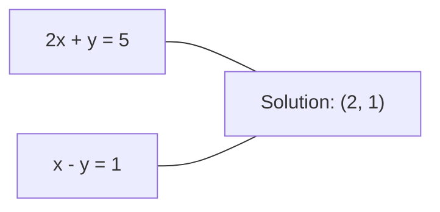
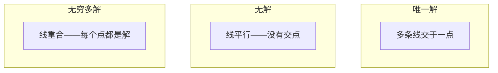

# 线性方程组（Linear Systems）

> 求解 $Ax = b$ 是数学中最古老的问题，而它至今仍在驱动你的神经网络。

**类型：** 动手构建
**语言：** Python
**前置知识：** 阶段 1，第 01 课（线性代数直觉）、第 02 课（向量与矩阵）、第 03 课（矩阵变换）
**时间：** ~120 分钟

## 学习目标（Learning Objectives）

- 使用带部分主元的高斯消元法和回代法求解 $Ax = b$
- 使用 LU、QR 和 Cholesky 分解对矩阵进行分解，并解释各自的适用场景
- 推导最小二乘的规范方程（normal equations），并将其与线性回归和 Ridge 回归联系起来
- 使用条件数（condition number）诊断病态系统，并应用正则化使其稳定

## 问题背景（The Problem）

每当你训练一次线性回归，你就在解一个线性方程组。每当你做一次最小二乘拟合，你就在解一个线性方程组。每当神经网络层计算 $y = Wx + b$ 时，它就在计算线性方程组的一侧。当你加入正则化时，你在修改这个系统。当你使用高斯过程时，你在分解一个矩阵。当你为马氏距离求逆协方差矩阵时，你在解一个线性方程组。

方程 $Ax = b$ 无处不在。$A$ 是已知系数的矩阵。$b$ 是已知输出的向量。$x$ 是你要找的未知向量。在线性回归中，$A$ 是你的数据矩阵，$b$ 是你的目标向量，$x$ 是权重向量。整个模型归结为：找到 $x$ 使得 $Ax$ 尽可能接近 $b$。

本课从头构建求解该方程的每一种主要方法。你将理解为什么有些方法快而另一些稳定，为什么有些只适用于方形系统而另一些处理超定系统，以及为什么矩阵的条件数决定了你的答案是否还有意义。

## 核心概念（The Concept）

### $Ax = b$ 的几何含义

线性方程组有几何解释。每个方程定义一个超平面。解是所有超平面相交的点（或点集）。

```
2x + y = 5          Two lines in 2D.
x - y  = 1          They intersect at x=2, y=1.
```



可能发生三种情况：



在矩阵形式中，"一个解"意味着 $A$ 可逆。"无解"意味着方程组不一致。"无穷多解"意味着 $A$ 有零空间。大多数 ML 问题属于"无精确解"的类别，因为你的方程（数据点）比未知数（参数）多。这就是最小二乘发挥作用的地方。

### 列视角与行视角

有两种理解 $Ax = b$ 的方式。

**行视角。** $A$ 的每一行定义一个方程。每个方程是一个超平面。解是它们相交的地方。

**列视角。** $A$ 的每一列是一个向量。问题变成：$A$ 的列的什么线性组合产生 $b$？

```
A = | 2  1 |    b = | 5 |
    | 1 -1 |        | 1 |

Row picture: solve 2x + y = 5 and x - y = 1 simultaneously.

Column picture: find x1, x2 such that:
  x1 * [2, 1] + x2 * [1, -1] = [5, 1]
  2 * [2, 1] + 1 * [1, -1] = [4+1, 2-1] = [5, 1]   check.
```

列视角更基础。如果 $b$ 位于 $A$ 的列空间中，系统有解。如果不在，你在列空间中找最近的点。那个最近的点就是最小二乘解。

### 高斯消元法

高斯消元法将 $Ax = b$ 转化为上三角系统 $Ux = c$，然后通过回代求解。它是最直接的方法。

算法：

```
1. For each column k (the pivot column):
   a. Find the largest entry in column k at or below row k (partial pivoting).
   b. Swap that row with row k.
   c. For each row i below k:
      - Compute multiplier m = A[i][k] / A[k][k]
      - Subtract m times row k from row i.
2. Back substitute: solve from the last equation upward.
```

示例：

```
Original:
| 2  1  1 | 8 |       R2 = R2 - (2)R1     | 2  1   1 |  8 |
| 4  3  3 |20 |  -->  R3 = R3 - (1)R1 --> | 0  1   1 |  4 |
| 2  3  1 |12 |                            | 0  2   0 |  4 |

                       R3 = R3 - (2)R2     | 2  1   1 |  8 |
                                       --> | 0  1   1 |  4 |
                                           | 0  0  -2 | -4 |

Back substitute:
  -2 * x3 = -4    -->  x3 = 2
  x2 + 2  = 4     -->  x2 = 2
  2*x1 + 2 + 2 = 8 --> x1 = 2
```

高斯消元法的计算量为 $O(n^3)$。对于一个 $1000 \times 1000$ 的系统，大约需要十亿次浮点运算。很快，但如果需要解多个具有相同 $A$ 的系统，还有更好的方法。

### 部分主元法：为什么重要

没有主元法，高斯消元法可能失败或产生垃圾结果。如果主元是零，你会除以零。如果它很小，你会放大舍入误差。

```
Bad pivot:                       With partial pivoting:
| 0.001  1 | 1.001 |            Swap rows first:
| 1      1 | 2     |            | 1      1 | 2     |
                                 | 0.001  1 | 1.001 |
m = 1/0.001 = 1000              m = 0.001/1 = 0.001
R2 = R2 - 1000*R1               R2 = R2 - 0.001*R1
| 0.001  1     | 1.001   |      | 1      1     | 2     |
| 0     -999   | -999.0  |      | 0      0.999 | 0.999 |

x2 = 1.000 (correct)            x2 = 1.000 (correct)
x1 = (1.001 - 1)/0.001          x1 = (2 - 1)/1 = 1.000 (correct)
   = 0.001/0.001 = 1.000        Stable because the multiplier is small.
```

在精度有限的浮点运算中，未使用主元法的版本会丢失有效数字。部分主元法始终选择最大的可用主元，以最小化误差放大。

### LU 分解

LU 分解将 $A$ 分解为一个下三角矩阵 $L$ 和一个上三角矩阵 $U$：$A = LU$。$L$ 矩阵存储高斯消元法中的乘子。$U$ 矩阵是消元的结果。

$$
A = L \cdot U
$$

```
| 2  1  1 |   | 1  0  0 |   | 2  1   1 |
| 4  3  3 | = | 2  1  0 | @ | 0  1   1 |
| 2  3  1 |   | 1  2  1 |   | 0  0  -2 |
```

为什么不直接消元而要分解？因为一旦有了 $L$ 和 $U$，对任何新的 $b$ 求解 $Ax = b$ 只需 $O(n^2)$：

$$
\begin{aligned}
Ax &= b \\
LUx &= b \\
\text{令 } y &= Ux: \\
Ly &= b \quad (\text{前代，} O(n^2)) \\
Ux &= y \quad (\text{回代，} O(n^2))
\end{aligned}
$$

$O(n^3)$ 的代价在分解时只付出一次。之后的每次求解都是 $O(n^2)$。如果你需要用相同的 $A$ 但不同的 $b$ 求解 1000 个系统，LU 可将总工作量减少约 1000/3 倍。

带部分主元法时，你得到 $PA = LU$，其中 $P$ 是记录行交换的置换矩阵。

### QR 分解

QR 分解将 $A$ 分解为一个正交矩阵 $Q$ 和一个上三角矩阵 $R$：$A = QR$。

正交矩阵具有性质 $Q^T Q = I$。它的列是标准正交向量。乘以 $Q$ 会保持长度和角度。

```
A = Q @ R

Q has orthonormal columns: Q^T Q = I
R is upper triangular

To solve Ax = b:
  QRx = b
  Rx = Q^T b    (just multiply by Q^T, no inversion needed)
  Back substitute to get x.
```

QR 在求解最小二乘问题时在数值上比 LU 更稳定。Gram-Schmidt 过程逐列构建 $Q$：

```
Given columns a1, a2, ... of A:

q1 = a1 / ||a1||

q2 = a2 - (a2 . q1) * q1        (subtract projection onto q1)
q2 = q2 / ||q2||                (normalize)

q3 = a3 - (a3 . q1) * q1 - (a3 . q2) * q2
q3 = q3 / ||q3||

R[i][j] = qi . aj    for i <= j
```

每一步都移除沿所有之前 $q$ 向量的分量，只留下新的正交方向。

### Cholesky 分解

当 $A$ 对称（$A = A^T$）且正定（所有特征值为正）时，你可以将其分解为 $A = LL^T$，其中 $L$ 是下三角矩阵。这就是 Cholesky 分解。

```
A = L @ L^T

| 4  2 |   | 2  0 |   | 2  1 |
| 2  5 | = | 1  2 | @ | 0  2 |

L[i][i] = sqrt(A[i][i] - sum(L[i][k]^2 for k < i))
L[i][j] = (A[i][j] - sum(L[i][k]*L[j][k] for k < j)) / L[j][j]    for i > j
```

Cholesky 比 LU 快一倍，只需一半的存储空间。它只适用于对称正定矩阵，但这些矩阵频繁出现：

- 协方差矩阵是对称半正定的（加正则化后变为正定）。
- 高斯过程中的核矩阵是对称正定的。
- 凸函数在最小值处的 Hessian 矩阵是对称正定的。
- $A^T A$ 总是对称半正定的。

在高斯过程中，你用 Cholesky 分解核矩阵 $K$，然后解 $K\alpha = y$ 得到预测均值。Cholesky 因子还给出了边际似然的对数行列式：$\log \det(K) = 2 \sum \log(\text{diag}(L))$。

### 最小二乘：当 $Ax = b$ 无精确解时

如果 $A$ 是 $m \times n$ 且 $m > n$（方程多于未知数），系统是超定的。没有精确解。取而代之的是最小化平方误差：

$$
\minimize ||Ax - b||^2
$$

这是残差平方和：

$$
\sum_{i=1}^{m} (A[i,:] \cdot x - b[i])^2
$$

最小化器满足规范方程（normal equations）：

$$
A^T A x = A^T b
$$

推导：展开 $||Ax - b||^2 = (Ax - b)^T (Ax - b) = x^T A^T A x - 2 x^T A^T b + b^T b$。对 $x$ 求梯度并设为零：$2 A^T A x - 2 A^T b = 0$。

```
Original system (overdetermined, 4 equations, 2 unknowns):
| 1  1 |         | 3 |
| 1  2 | x     = | 5 |       No exact x satisfies all 4 equations.
| 1  3 |         | 6 |
| 1  4 |         | 8 |

Normal equations:
A^T A = | 4  10 |    A^T b = | 22 |
        | 10 30 |            | 63 |

Solve: x = [1.5, 1.7]

This is linear regression. x[0] is the intercept, x[1] is the slope.
```

### 规范方程 = 线性回归

这个联系是精确的。在线性回归中，数据矩阵 $X$ 每行对应一个样本，每列对应一个特征。目标向量 $y$ 每个样本一个条目。权重向量 $w$ 满足：

$$
X^T X w = X^T y
$$

$$
w = (X^T X)^{-1} X^T y
$$

这就是线性回归的闭式解。每次调用 `sklearn.linear_model.LinearRegression.fit()` 都在计算这个（或通过 QR 或 SVD 的等价形式）。

在矩阵中加入正则化项 $\lambda I$，就得到 Ridge 回归：

$$
(X^T X + \lambda I) w = X^T y
$$

$$
w = (X^T X + \lambda I)^{-1} X^T y
$$

正则化使矩阵的条件更好（更易于精确求逆），并通过将权重向零收缩来防止过拟合。当 $\lambda > 0$ 时，矩阵 $X^T X + \lambda I$ 总是对称正定的，因此你可以用 Cholesky 求解。

### 伪逆（Moore-Penrose）

伪逆 $A^+$ 将矩阵求逆推广到非方形和奇异矩阵。对于任意矩阵 $A$：

$$
x = A^+ b
$$

其中 $A^+ = V \Sigma^+ U^T$（通过 SVD 计算）。

$\Sigma^+$ 通过取每个非零奇异值的倒数并对结果转置来形成。如果 $A = U \Sigma V^T$，那么 $A^+ = V \Sigma^+ U^T$。

```
A = U Sigma V^T        (SVD)

Sigma = | 5  0 |       Sigma+ = | 1/5  0  0 |
        | 0  2 |                | 0  1/2  0 |
        | 0  0 |

A+ = V Sigma+ U^T
```

伪逆给出最小范数的最小二乘解。如果系统有：
- 一个解：$A^+ b$ 给出这个解。
- 无解：$A^+ b$ 给出最小二乘解。
- 无穷多解：$A^+ b$ 给出 $||x||$ 最小的那个。

NumPy 的 `np.linalg.lstsq` 和 `np.linalg.pinv` 都在内部使用 SVD。

### 条件数

条件数衡量解对输入微小变化的敏感程度。对于矩阵 $A$，条件数为：

$$
\kappa(A) = ||A|| \cdot ||A^{-1}|| = \frac{\sigma_{\max}}{\sigma_{\min}}
$$

其中 $\sigma_{\max}$ 和 $\sigma_{\min}$ 是最大和最小的奇异值。

```
Well-conditioned (kappa ~ 1):        Ill-conditioned (kappa ~ 10^15):
Small change in b -->                Small change in b -->
small change in x                    huge change in x

| 2  0 |   kappa = 2/1 = 2          | 1   1          |   kappa ~ 10^15
| 0  1 |   safe to solve            | 1   1+10^(-15) |   solution is garbage
```

经验法则：
- $\kappa < 100$：安全，解是精确的。
- $\kappa \sim 10^k$：你从浮点运算中损失大约 $k$ 位精度。
- $\kappa \sim 10^{16}$（对于 float64）：解是无意义的。矩阵实际上是奇异的。

在 ML 中，病态发生在特征近乎共线时。正则化（加入 $\lambda I$）将条件数从 $\sigma_{\max} / \sigma_{\min}$ 改善为 $(\sigma_{\max} + \lambda) / (\sigma_{\min} + \lambda)$。

### 迭代方法：共轭梯度法

对于非常大的稀疏系统（数百万个未知数），LU 或 Cholesky 等直接方法太昂贵。迭代方法通过在多次迭代中改进猜测来逼近解。

共轭梯度法（CG）在 $A$ 对称正定时求解 $Ax = b$。它在精确算术中最多 $n$ 次迭代就能找到精确解，但如果 $A$ 的特征值聚集在一起，通常收敛得更快。

```
Algorithm sketch:
  x0 = initial guess (often zero)
  r0 = b - A x0           (residual)
  p0 = r0                 (search direction)

  For k = 0, 1, 2, ...:
    alpha = (rk . rk) / (pk . A pk)
    x_{k+1} = xk + alpha * pk
    r_{k+1} = rk - alpha * A pk
    beta = (r_{k+1} . r_{k+1}) / (rk . rk)
    p_{k+1} = r_{k+1} + beta * pk
    if ||r_{k+1}|| < tolerance: stop
```

CG 用于：
- 大规模优化（Newton-CG 方法）
- 求解 PDE 离散化
- 核方法（核矩阵太大而无法分解时）
- 其他迭代求解器的预处理

收敛速度取决于条件数。条件更好的系统收敛更快，这也是正则化有帮助的另一个原因。

### 全景图：何时使用哪种方法

| 方法 | 要求 | 代价 | 使用场景 |
|--------|-------------|------|----------|
| 高斯消元法 | 方阵、非奇异 $A$ | $O(n^3)$ | 方阵系统的一次性求解 |
| LU 分解 | 方阵、非奇异 $A$ | $O(n^3)$ 分解 + $O(n^2)$ 求解 | 相同 $A$ 的多次求解 |
| QR 分解 | 任意 $A$（$m \ge n$） | $O(mn^2)$ | 最小二乘，数值稳定 |
| Cholesky | 对称正定 $A$ | $O(n^3/3)$ | 协方差矩阵、高斯过程、Ridge 回归 |
| 规范方程 | 超定（$m > n$） | $O(mn^2 + n^3)$ | 线性回归（小 $n$） |
| SVD / 伪逆 | 任意 $A$ | $O(mn^2)$ | 秩亏系统、最小范数解 |
| 共轭梯度法 | 对称正定、稀疏 $A$ | $O(n \cdot k \cdot nnz)$ | 大型稀疏系统，$k$ = 迭代次数 |

### 与 ML 的联系

本课中的每种方法都出现在生产级 ML 中：

**线性回归。** 闭式解法求解规范方程 $X^T X w = X^T y$。通过 Cholesky（如果 $n$ 小）、QR（如果数值稳定性重要）或 SVD（如果矩阵可能秩亏）实现。

**Ridge 回归。** 在 $X^T X$ 中加入 $\lambda I$。正则化后的系统 $(X^T X + \lambda I) w = X^T y$ 总能用 Cholesky 求解，因为当 $\lambda > 0$ 时 $X^T X + \lambda I$ 是对称正定的。

**高斯过程。** 预测均值需要求解 $K\alpha = y$，其中 $K$ 是核矩阵。Cholesky 分解 $K$ 是标准方法。对数边际似然使用 $\log \det(K) = 2 \sum \log(\text{diag}(L))$。

**神经网络初始化。** 正交初始化使用 QR 分解来创建列标准正交的权重矩阵。这防止了深层网络中的信号坍塌。

**预处理。** 大规模优化器使用不完全 Cholesky 或不完全 LU 作为共轭梯度求解器的预处理子。

**特征工程。** $X^T X$ 的条件数告诉你特征是否共线。如果 $\kappa$ 很大，删除特征或加入正则化。

## 动手实现（Build It）

### 步骤 1：带部分主元的高斯消元法

```python
import numpy as np

# 带部分主元的高斯消元法求解 Ax = b
# 部分主元：在每列中选择绝对值最大的元素作为主元，提高数值稳定性
def gaussian_elimination(A, b):
    n = len(b)
    # 构建增广矩阵 [A | b]
    Ab = np.hstack([A.astype(float), b.reshape(-1, 1).astype(float)])

    for k in range(n):
        # 部分主元：找到第 k 列中从第 k 行开始的最大元所在行
        max_row = k + np.argmax(np.abs(Ab[k:, k]))
        Ab[[k, max_row]] = Ab[[max_row, k]]

        # 检查矩阵是否奇异：主元过小说明矩阵接近奇异
        if abs(Ab[k, k]) < 1e-12:
            raise ValueError(f"Matrix is singular or nearly singular at pivot {k}")

        # 消元：对主元下方的每一行减去主元行的倍数
        for i in range(k + 1, n):
            m = Ab[i, k] / Ab[k, k]
            Ab[i, k:] -= m * Ab[k, k:]

    # 回代：从最后一行开始逐步求解
    x = np.zeros(n)
    for i in range(n - 1, -1, -1):
        x[i] = (Ab[i, -1] - Ab[i, i+1:n] @ x[i+1:n]) / Ab[i, i]

    return x
```

### 步骤 2：LU 分解

```python
# LU 分解：将 A 分解为 PA = LU
# P：置换矩阵（记录行交换），L：下三角（存储消元乘子），U：上三角（消元结果）
# 优势：一次分解后可对多个不同的 b 快速求解
def lu_decompose(A):
    n = A.shape[0]
    L = np.eye(n)
    U = A.astype(float).copy()
    P = np.eye(n)

    for k in range(n):
        # 部分主元：选择第 k 列中最大的元素
        max_row = k + np.argmax(np.abs(U[k:, k]))
        if max_row != k:
            U[[k, max_row]] = U[[max_row, k]]
            P[[k, max_row]] = P[[max_row, k]]
            if k > 0:
                L[[k, max_row], :k] = L[[max_row, k], :k]

        # 计算 L 的列和消元
        for i in range(k + 1, n):
            L[i, k] = U[i, k] / U[k, k]
            U[i, k:] -= L[i, k] * U[k, k:]

    return P, L, U

# 使用 LU 分解求解 Ax = b：先代 Ly = Pb，然后回代 Ux = y
def lu_solve(P, L, U, b):
    n = len(b)
    Pb = P @ b.astype(float)

    # 前代（forward substitution）求解 Ly = Pb
    y = np.zeros(n)
    for i in range(n):
        y[i] = Pb[i] - L[i, :i] @ y[:i]

    # 回代求解 Ux = y
    x = np.zeros(n)
    for i in range(n - 1, -1, -1):
        x[i] = (y[i] - U[i, i+1:] @ x[i+1:]) / U[i, i]

    return x
```

### 步骤 3：Cholesky 分解

```python
# Cholesky 分解：A = L @ L^T，其中 L 是下三角矩阵
# 要求 A 对称正定，常用于协方差矩阵和 Ridge 回归
# 比 LU 快约 2 倍，存储减半
def cholesky(A):
    n = A.shape[0]
    L = np.zeros_like(A, dtype=float)

    for i in range(n):
        for j in range(i + 1):
            # 计算 L[i][j]，减去已经确定的行的贡献
            s = A[i, j] - L[i, :j] @ L[j, :j]
            if i == j:
                # 对角元素必须为正，否则矩阵不正定
                if s <= 0:
                    raise ValueError("Matrix is not positive definite")
                L[i, j] = np.sqrt(s)
            else:
                L[i, j] = s / L[j, j]

    return L
```

### 步骤 4：通过规范方程实现最小二乘

```python
# 最小二乘：最小化 ||Ax - b||²，通过规范方程 A^T A x = A^T b
# 这是线性回归的闭式解
def least_squares_normal(A, b):
    AtA = A.T @ A
    Atb = A.T @ b
    return gaussian_elimination(AtA, Atb)

# Ridge 回归：在 A^T A 中加入 lambda * I
# 正则化改善条件数，防止过拟合
# X^T X + lambda*I 总是对称正定的，因此可用 Cholesky
def ridge_regression(A, b, lam):
    n = A.shape[1]
    AtA = A.T @ A + lam * np.eye(n)
    Atb = A.T @ b
    L = cholesky(AtA)
    # 前代 Ly = Atb
    y = np.zeros(n)
    for i in range(n):
        y[i] = (Atb[i] - L[i, :i] @ y[:i]) / L[i, i]
    # 回代 L^T x = y
    x = np.zeros(n)
    for i in range(n - 1, -1, -1):
        x[i] = (y[i] - L.T[i, i+1:] @ x[i+1:]) / L.T[i, i]
    return x
```

### 步骤 5：条件数

```python
# 条件数 kappa = sigma_max / sigma_min
# 衡量解对输入误差的敏感程度
# kappa ~ 10^k 意味着损失约 k 位精度
def condition_number(A):
    U, S, Vt = np.linalg.svd(A)
    return S[0] / S[-1]
```

## 实际应用（Use It）

将各个部分整合起来，在真实数据上做线性回归和 Ridge 回归：

```python
np.random.seed(42)
# 生成模拟数据：100 个样本，3 个特征
X_raw = np.random.randn(100, 3)
w_true = np.array([2.0, -1.0, 0.5])
# 目标值 = 真实权重 @ 特征 + 噪声
y = X_raw @ w_true + np.random.randn(100) * 0.1

# 添加截距项（全 1 列）
X = np.column_stack([np.ones(100), X_raw])

# 使用自己实现的最小二乘法
w_ols = least_squares_normal(X, y)
print(f"OLS weights (ours):    {w_ols}")

# 与 NumPy 结果对比验证正确性
w_np = np.linalg.lstsq(X, y, rcond=None)[0]
print(f"OLS weights (numpy):   {w_np}")
print(f"Max difference: {np.max(np.abs(w_ols - w_np)):.2e}")

# Ridge 回归（lambda=1.0），对比 sklearn
w_ridge = ridge_regression(X, y, lam=1.0)
print(f"Ridge weights (ours):  {w_ridge}")

from sklearn.linear_model import Ridge
ridge_sk = Ridge(alpha=1.0, fit_intercept=False)
ridge_sk.fit(X, y)
print(f"Ridge weights (sklearn): {ridge_sk.coef_}")
```

## 交付物（Ship It）

本课产出：
- `code/linear_systems.py`：包含高斯消元法、LU 分解、Cholesky 分解、最小二乘和 Ridge 回归的从头实现
- 一个工作演示，展示规范方程和 sklearn 的 LinearRegression 产生相同权重

## 练习题（Exercises）

1. 用你的高斯消元法、你的 LU 求解器和 `np.linalg.solve` 分别求解 `[[1,2,3],[4,5,6],[7,8,10]] x = [6, 15, 27]`。验证三个结果在浮点容忍度内相同。

2. 生成一个 $50 \times 5$ 的随机矩阵 $X$ 和目标值 $y = X w_{\text{true}} + \text{noise}$。分别用规范方程、QR（通过 `np.linalg.qr`）、SVD（通过 `np.linalg.svd`）和 `np.linalg.lstsq` 求解 $w$。比较四个解。测量 $X^T X$ 的条件数，并解释它如何影响你信任哪种方法。

3. 通过使两列几乎相同（如列 2 = 列 1 + 1e-10 * 噪声）创建一个近乎奇异的矩阵。计算其条件数。有无正则化（加 0.01 * I）分别求解 $Ax = b$。比较解和残差。解释为什么正则化有帮助。

4. 对一个 $100 \times 100$ 的随机对称正定矩阵实现共轭梯度算法。统计收敛到 $10^{-8}$ 容忍度所需的迭代次数。与理论最大值 $n$ 次迭代比较。

5. 在大小分别为 10、50、200、500 的对称正定矩阵上测试你的 Cholesky 求解器、LU 求解器和 `np.linalg.solve` 的运行时间。绘制结果图。验证 Cholesky 大约比 LU 快 2 倍。

## 关键术语（Key Terms）

| 术语（English） | 通俗说法 | 实际含义 |
|------|----------------|----------------------|
| Linear system | "解方程求 x" | 一组线性方程 $Ax = b$。求 $x$ 意味着在变换 $A$ 下找到产生输出 $b$ 的输入。 |
| Gaussian elimination | "行化简" | 使用行操作系统地将对角线以下的条目清零，产生可通过回代求解的上三角系统。$O(n^3)$。 |
| Partial pivoting | "换行以保证稳定" | 在消去第 $k$ 列之前，将该列绝对值最大的行交换到主元位置。防止除以小数。 |
| LU decomposition | "分解为三角矩阵" | 将 $A$ 写为 $A = LU$，$L$ 为下三角（存储乘子），$U$ 为上三角（消元结果）。将 $O(n^3)$ 代价分摊到多次求解中。 |
| QR decomposition | "正交分解" | 将 $A$ 写为 $A = QR$，$Q$ 有标准正交列，$R$ 为上三角。最小二乘中比 LU 更稳定。 |
| Cholesky decomposition | "矩阵的平方根" | 对于对称正定 $A$，写为 $A = LL^T$。代价为 LU 的一半。用于协方差矩阵、核矩阵和 Ridge 回归。 |
| Least squares | "无法精确时的最佳拟合" | 当系统超定时最小化残差平方和 $||Ax - b||^2$（方程多于未知数）。 |
| Normal equations | "微积分捷径" | $A^T A x = A^T b$。令 $||Ax - b||^2$ 的梯度为零得到。这就是线性回归的闭式解。 |
| Pseudoinverse | "非方形矩阵的求逆" | $A^+ = V \Sigma^+ U^T$ 通过 SVD 计算。对于任意矩阵（方或矩、奇异或非奇异）给出最小范数最小二乘解。 |
| Condition number | "这个答案有多可信" | $\kappa = \sigma_{\max} / \sigma_{\min}$。衡量对输入扰动的敏感度。损失约 $\log_{10}(\kappa)$ 位精度。 |
| Ridge regression | "正则化最小二乘" | 求解 $(X^T X + \lambda I) w = X^T y$。加 $\lambda I$ 可改善条件数并将权重向零收缩。防止过拟合。 |
| Conjugate gradient | "大矩阵的迭代 $Ax = b$" | 对称正定系统的迭代求解器。最多 $n$ 步收敛。适用于分解代价过高的大型稀疏系统。 |
| Overdetermined system | "数据多于参数" | $m \times n$ 系统中 $m > n$。无精确解。最小二乘寻找最佳近似。这就是每个回归问题。 |
| Back substitution | "从下往上解" | 给定上三角系统，先解最后一行方程，然后向前代入。$O(n^2)$。 |
| Forward substitution | "从上往下解" | 给定下三角系统，先解第一行方程，然后向后代入。$O(n^2)$。用于 LU 求解的 $L$ 步。 |

## 延伸阅读（Further Reading）

- [MIT 18.06：线性代数](https://ocw.mit.edu/courses/18-06-linear-algebra-spring-2010/)（Gilbert Strang）——关于线性方程组和矩阵分解的权威课程
- [数值线性代数](https://people.maths.ox.ac.uk/trefethen/text.html)（Trefethen & Bau）——理解数值稳定性、条件性和算法失效原因的标准参考
- [矩阵计算](https://www.cs.cornell.edu/cv/GolubVanLoan4/golubandvanloan.htm)（Golub & Van Loan）——每个矩阵算法的百科全书式参考
- [3Blue1Brown：逆矩阵](https://www.3blue1brown.com/lessons/inverse-matrices)——$Ax = b$ 几何含义的视觉直觉
