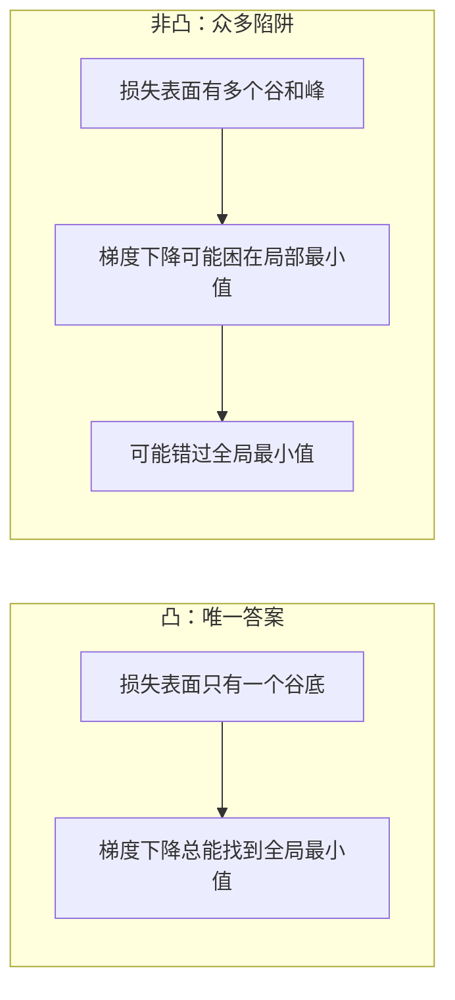
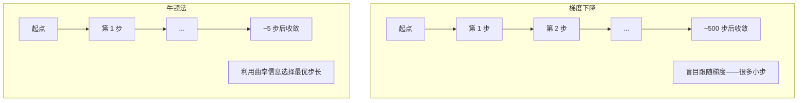
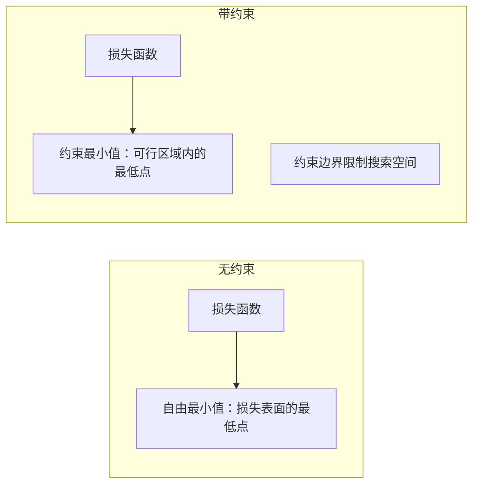
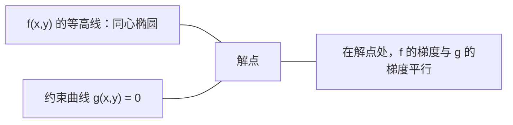

# 凸优化（Convex Optimization）

> 凸问题只有一个谷底。神经网络有数百万个。理解这个区别至关重要。

**类型：** 动手构建
**语言：** Python
**前置知识：** 阶段 1，第 04 课（机器学习微积分）、第 08 课（优化）
**时间：** ~90 分钟

## 学习目标（Learning Objectives）

- 使用定义、二阶导数和 Hessian 矩阵判据判断函数是否为凸函数
- 实现牛顿法并将其二次收敛与梯度下降进行比较
- 使用拉格朗日乘子法求解带约束优化问题，并解读 KKT 条件
- 解释为什么神经网络损失函数是非凸的，而 SGD 仍能找到好的解

## 问题背景（The Problem）

第 08 课教了你梯度下降、动量和 Adam。那些优化器在任何表面上都能沿下坡走。但它们没有提供任何保证。在非凸表面上的梯度下降可能陷入坏的局部最小值、卡在鞍点或无限振荡。你还是用了它们，因为神经网络是非凸的，没有替代方案。

但机器学习中的许多问题是凸的：线性回归、逻辑回归、SVM、LASSO、Ridge 回归。对于这些问题，存在更强的东西：带有数学保证的优化。凸问题只有一个谷底。任何沿下坡走的算法都会达到全局最小值。不需要重新启动，不需要学习率调度，不需要祈祷。

理解凸性有三方面的作用。首先，它告诉你你的问题是容易的（凸）还是困难的（非凸）。其次，它为你提供了凸问题的更快工具，如牛顿法。第三，它解释了 ML 中的各种概念：作为约束的正则化、SVM 中的对偶性，以及深度学习在违反凸性给与的所有优良性质时为何仍然有效。

## 核心概念（The Concept）

### 凸集

集合 $S$ 是凸的，如果 $S$ 中任意两点之间的线段也完全位于 $S$ 中。

| 凸集 | 非凸 |
|---|---|
| **矩形**：内部任意两点之间的线段保持在内 | **星形/月牙形**：两个内部点之间的线可能穿出集合 |
| **三角形**：对所有内部点都满足同样性质 | **甜甜圈/环形**：空洞导致某些线段离开集合 |
| 任意两点之间的线段保持在集合内 | 某些点对之间的线段会离开集合 |

形式化检验：对于 $S$ 中任意点 $x, y$ 和任意 $t \in [0, 1]$，点 $tx + (1-t)y$ 也在 $S$ 中。

凸集的例子：
- 一条线、一个平面、整个 $\mathbb{R}^n$
- 球（圆、球体、超球体）
- 半空间：$\{x : a^T x \le b\}$
- 任意多个凸集的交集

非凸集的例子：
- 甜甜圈（环形）
- 两个不相交的圆的并集
- 任何有"凹痕"或"空洞"的集合

### 凸函数

函数 $f$ 是凸的，若其定义域是凸集，且对定义域中任意两点 $x, y$ 和任意 $t \in [0, 1]$：

$$
f(tx + (1-t)y) \le t f(x) + (1-t) f(y)
$$

几何上：图像上任意两点之间的线段位于图像之上或与其重合。

| 性质 | 凸函数 | 非凸函数 |
|---|---|---|
| **线段测试** | 任意两点之间的线段位于曲线上方或与其重合 | 某些点之间的线段会穿到曲线下方 |
| **形状** | 向上弯曲的单一"碗/谷" | 多个峰和谷，曲率混合 |
| **局部最小值** | 每个局部最小值都是全局最小值 | 可能存在多个高度不同的局部最小值 |

常见的凸函数：
- $f(x) = x^2$（抛物线）
- $f(x) = |x|$（绝对值）
- $f(x) = e^x$（指数函数）
- $f(x) = \max(0, x)$（ReLU，虽为分段线性）
- $f(x) = -\log(x)$ 对于 $x > 0$（负对数）
- 任何线性函数 $f(x) = a^T x + b$（既凸又凹）

### 凸性检验

三种实践检验方法，从最简单到最严格。

**检验 1：二阶导数检验（一维）。** 如果对所有 $x$ 有 $f''(x) \ge 0$，则 $f$ 是凸的。

- $f(x) = x^2$：$f''(x) = 2 \ge 0$。凸函数。
- $f(x) = x^3$：$f''(x) = 6x$。当 $x < 0$ 时为负。不是凸函数。
- $f(x) = e^x$：$f''(x) = e^x > 0$。凸函数。

**检验 2：Hessian 检验（多元）。** 如果对所有 $x$，Hessian 矩阵 $H(x)$ 是半正定的，则 $f$ 是凸的。Hessian 是二阶偏导数构成的矩阵。

**检验 3：定义检验。** 直接验证不等式 $f(tx + (1-t)y) \le t f(x) + (1-t) f(y)$。适用于导数难以计算的函数。

### 为什么凸性重要

凸优化的核心定理：

**对于凸函数，每个局部最小值都是全局最小值。**

这意味着梯度下降不会被困住。任何下坡路径都通向同一个答案。算法保证收敛到最优解。



推论：
- 不需要随机重启
- 不需要复杂的学习率调度
- 可以有收敛证明（速度取决于函数性质）
- 解是唯一的（除去平坦区域）

### ML 中的凸与非凸

| 问题 | 凸？ | 原因 |
|---------|---------|------|
| 线性回归（MSE） | 是 | 损失在权重上是二次的 |
| 逻辑回归 | 是 | Log-loss 在权重上是凸的 |
| SVM（hinge loss） | 是 | 线性函数的最大值 |
| LASSO（L1 回归） | 是 | 凸函数之和仍为凸 |
| Ridge 回归（L2） | 是 | 二次 + 二次 = 凸 |
| 神经网络（任意损失） | 否 | 非线性激活产生非凸表面 |
| k-means 聚类 | 否 | 离散指派步骤 |
| 矩阵分解 | 否 | 未知变量的乘积 |

带凸损失的线性模型是凸的。一旦加入带非线性激活的隐藏层，凸性就被破坏了。

### Hessian 矩阵

函数 $f: \mathbb{R}^n \to \mathbb{R}$ 的 Hessian 矩阵 $H$ 是 $n \times n$ 的二阶偏导数矩阵。

$$
H[i][j] = \frac{\partial^2 f}{\partial x_i \partial x_j}
$$

对于 $f(x, y) = x^2 + 3xy + y^2$：

```
df/dx = 2x + 3y       d^2f/dx^2 = 2      d^2f/dxdy = 3
df/dy = 3x + 2y       d^2f/dydx = 3      d^2f/dy^2 = 2

H = [ 2  3 ]
    [ 3  2 ]
```

Hessian 告诉你关于曲率的信息：
- 所有特征值为正：函数在每个方向都向上弯曲（在该点为凸）
- 所有特征值为负：函数在每个方向都向下弯曲（凹，局部最大值）
- 符号混合：鞍点（在一些方向向上弯曲，在另一些方向向下弯曲）
- 存在零特征值：在该方向平坦（退化）

对于凸性，Hessian 必须在**所有点**上半正定（所有特征值 $\ge 0$），而不仅在某一点上。

### 牛顿法

梯度下降使用一阶信息（梯度）。牛顿法使用二阶信息（Hessian）。它在当前点拟合二次近似，然后直接跳到该二次近似的最小值。

$$
\text{更新规则：} \quad x_{\text{new}} = x - H^{-1} \cdot \nabla f
$$

$$
\text{与梯度下降对比：} \quad x_{\text{new}} = x - \text{lr} \cdot \nabla f
$$

牛顿法用逆 Hessian 替代了标量学习率。这基于局部曲率自动调整步长和方向。



优点：
- 在最小值附近二次收敛（每步误差平方）
- 不需要调节学习率
- 尺度不变（无论你如何参数化问题都能工作）

缺点：
- 计算 Hessian 需要 $O(n^2)$ 内存和 $O(n^3)$ 求逆
- 对于有 100 万个权重的神经网络，那是 $10^{12}$ 个条目和 $10^{18}$ 次运算
- 对深度学习不实用

### 带约束优化

无约束优化：在所有 $x$ 上最小化 $f(x)$。
带约束优化：在满足约束条件下最小化 $f(x)$。

真实问题有约束。你想要最小化成本但预算有限。你想要最小化误差但模型复杂度有上限。



### 拉格朗日乘子法

拉格朗日乘子法将带约束问题转化为无约束问题。

问题：在 $g(x) = 0$ 约束下最小化 $f(x)$。

解法：引入新变量（拉格朗日乘子 $\lambda$）并求解无约束问题：

$$
L(x, \lambda) = f(x) + \lambda \cdot g(x)
$$

在解处，$L$ 的梯度为零：

$$
\frac{\partial L}{\partial x} = \frac{df}{dx} + \lambda \cdot \frac{dg}{dx} = 0
$$

$$
\frac{\partial L}{\partial \lambda} = g(x) = 0
$$

几何直觉：在约束最小值处，$f$ 的梯度必须与约束 $g$ 的梯度平行。如果它们不平行，你可以沿着约束表面移动并进一步减小 $f$。



示例：在 $x + y = 1$ 约束下最小化 $f(x, y) = x^2 + y^2$。

$$
L = x^2 + y^2 + \lambda(x + y - 1)
$$

$$
\frac{\partial L}{\partial x} = 2x + \lambda = 0 \implies x = -\lambda/2
$$

$$
\frac{\partial L}{\partial y} = 2y + \lambda = 0 \implies y = -\lambda/2
$$

$$
\frac{\partial L}{\partial \lambda} = x + y - 1 = 0
$$

由前两个方程得 $x = y$。代入：$2x = 1$，所以 $x = y = 0.5$，$\lambda = -1$。

直线 $x + y = 1$ 上离原点最近的点是 $(0.5, 0.5)$。

### KKT 条件

Karush-Kuhn-Tucker 条件将拉格朗日乘子法扩展到不等式约束。

问题：在 $g_i(x) \le 0$（$i = 1, \dots, m$）约束下最小化 $f(x)$。

KKT 条件（最优性的必要条件）：

```
1. Stationarity:    df/dx + sum(lambda_i * dg_i/dx) = 0
2. Primal feasibility:  g_i(x) <= 0  for all i
3. Dual feasibility:    lambda_i >= 0  for all i
4. Complementary slackness:  lambda_i * g_i(x) = 0  for all i
```

互补松弛性是关键洞察：要么约束是活动的（$g_i = 0$，解在边界上），要么乘子为零（该约束无关紧要）。不影响解的约束对应的 $\lambda = 0$。

KKT 条件是 SVM 的核心。支持向量是那些约束处于活动状态的数据点（$\lambda > 0$）。所有其他数据点 $\lambda = 0$，不影响决策边界。

### 正则化作为带约束优化

L1 和 L2 正则化不是随意的技巧。它们本质上是带约束优化问题。

**L2 正则化（Ridge）：**

$$
\minimize \; \text{Loss}(w) \quad \text{subject to} \quad ||w||^2 \le t
$$

等价的无约束形式：

$$
\minimize \; \text{Loss}(w) + \lambda \cdot ||w||^2
$$

约束 $||w||^2 \le t$ 定义了一个球（二维中为圆，三维中为球体）。解是损失等高线首次触碰到这个球的位置。

**L1 正则化（LASSO）：**

$$
\minimize \; \text{Loss}(w) \quad \text{subject to} \quad ||w||_1 \le t
$$

等价的无约束形式：

$$
\minimize \; \text{Loss}(w) + \lambda \cdot ||w||_1
$$

约束 $||w||_1 \le t$ 定义了一个菱形（二维中为旋转正方形）。

| 性质 | L2 约束（圆形） | L1 约束（菱形） |
|---|---|---|
| **约束形状** | 圆（高维中的球体） | 菱形（二维中的旋转正方形） |
| **损失等高线触碰点** | 光滑边界——圆上任意点 | 角落——与坐标轴对齐 |
| **解的行为** | 权重小但不为零 | 某些权重的精确为零（稀疏） |
| **结果** | 权重收缩 | 特征选择 |

这就解释了为什么 L1 产生稀疏模型（特征选择）而 L2 只收缩权重。菱形的角落在坐标轴上。损失等高线更可能在角落处触碰到，将一个或多个权重设为精确为零。

### 对偶性

每个带约束优化问题（原问题）都有一个伴随问题（对偶问题）。对于凸问题，原问题和对偶问题具有相同的最优值。这就是强对偶性。

拉格朗日对偶函数：

```
Primal: minimize f(x) subject to g(x) <= 0
Lagrangian: L(x, lambda) = f(x) + lambda * g(x)
Dual function: d(lambda) = min_x L(x, lambda)
Dual problem: maximize d(lambda) subject to lambda >= 0
```

对偶性为什么重要：
- 对偶问题有时比原问题更容易求解
- SVM 通过其对偶形式求解，其中问题依赖于数据点之间的点积（开启核技巧）
- 对偶提供了原问题最优值的下界，有助于检查解的质量

对于 SVM 具体来说：

```
Primal: find w, b that maximize the margin 2/||w|| subject to
        y_i(w^T x_i + b) >= 1 for all i

Dual:   maximize sum(alpha_i) - 0.5 * sum_ij(alpha_i * alpha_j * y_i * y_j * x_i^T x_j)
        subject to alpha_i >= 0 and sum(alpha_i * y_i) = 0

The dual only involves dot products x_i^T x_j.
Replace x_i^T x_j with K(x_i, x_j) to get the kernel trick.
```

### 深度学习在非凸条件下为何有效

神经网络损失函数是极度非凸的。按所有经典标准，优化它们应该是失败的。但随机梯度下降却能可靠地找到好的解。有几个因素可以解释这一点。

**大多数局部最小值已经够好。** 在高维空间中，随机的临界点（梯度为零的点）绝大多数是鞍点，而非局部最小值。那些少数存在的局部最小值往往具有接近全局最小值的损失值。当参数空间有数百万个维度时，陷入糟糕的局部最小值是极不可能的。

**鞍点（而非局部最小值）才是真正的障碍。** 在一个有 $n$ 个参数的函数中，鞍点具有正负曲率方向的混合。对于高维中的随机临界点，所有 $n$ 个特征值均为正（局部最小值）的概率约为 $2^{-n}$。几乎所有临界点都是鞍点。SGD 的噪声帮助逃离它们。

**过参数化使表面变平滑。** 参数多于训练样本的网络具有更平滑、连接更紧密的损失表面。更宽的网络有更少的坏局部最小值。这反直觉但在经验上是一致的。

**损失表面结构：**

| 性质 | 低维空间 | 高维空间 |
|---|---|---|
| **表面** | 许多孤立的峰和谷 | 平滑连接的谷 |
| **最小值** | 许多孤立的局部最小值 | 很少有坏的局部最小值；大多数接近最优 |
| **导航** | 难以找到全局最小值 | 许多路径通往好的解 |
| **临界点** | 局部最小值和鞍点的混合 | 绝大多数是鞍点，而非局部最小值 |

**随机噪声作为隐式正则化。** 小批量 SGD 添加的噪声阻止了收敛到尖锐的最小值。尖锐的最小值会过拟合；平坦的最小值泛化更好。噪声将优化偏向于损失表面的平坦区域。

### 实践中的二阶方法

纯牛顿法对大型模型不实用。几种近似方法使二阶信息可用。

**L-BFGS：** 使用最近 $m$ 个梯度差来近似逆 Hessian。需要 $O(mn)$ 内存而非 $O(n^2)$。适用于最多约 10,000 个参数的问题。用于经典 ML（逻辑回归、CRF），但不适用于深度学习。

**自然梯度：** 使用 Fisher 信息矩阵（对数似然的期望 Hessian）替代标准 Hessian。这考虑了概率分布的几何结构。K-FAC 将 Fisher 矩阵近似为 Kronecker 积，使其对神经网络实用。

**无 Hessian 优化：** 使用共轭梯度法求解 $Hx = g$，从不显式构造 $H$。只需要 Hessian-向量积，可以通过自动微分在 $O(n)$ 时间内计算。

**对角近似：** Adam 的二阶矩是 Hessian 对角线的对角近似。AdaHessian 通过使用 Hutchinson 估计器利用真实 Hessian 对角线元素来扩展这一方法。

| 方法 | 内存 | 每步代价 | 使用场景 |
|--------|--------|--------------|-------------|
| 梯度下降 | $O(n)$ | $O(n)$ | 基线，大型模型 |
| 牛顿法 | $O(n^2)$ | $O(n^3)$ | 小型凸问题 |
| L-BFGS | $O(mn)$ | $O(mn)$ | 中型凸问题 |
| Adam | $O(n)$ | $O(n)$ | 深度学习默认 |
| K-FAC | $O(n)$ | $O(n)$ 每层 | 研究，大批量训练 |

## 动手实现（Build It）

### 步骤 1：凸性检查器

构建一个通过采样点并检验定义来经验地测试凸性的函数。

```python
import random
import math

# 通过随机采样检验凸性定义：f(tx + (1-t)y) <= t*f(x) + (1-t)*f(y)
# 如果发现违反则该函数很可能不是凸的
def check_convexity(f, dim, bounds=(-5, 5), samples=1000):
    violations = 0
    for _ in range(samples):
        x = [random.uniform(*bounds) for _ in range(dim)]
        y = [random.uniform(*bounds) for _ in range(dim)]
        t = random.uniform(0, 1)
        # 凸组合点
        mid = [t * xi + (1 - t) * yi for xi, yi in zip(x, y)]
        lhs = f(mid)
        rhs = t * f(x) + (1 - t) * f(y)
        if lhs > rhs + 1e-10:
            violations += 1
    return violations == 0, violations
```

### 步骤 2：二维牛顿法

使用显式 Hessian 实现牛顿法。与梯度下降对比收敛速度。

```python
# 牛顿法：利用二阶曲率信息，比梯度下降收敛更快
# 对二次函数精确一步收敛
def newtons_method(f, grad_f, hessian_f, x0, steps=50, tol=1e-12):
    x = list(x0)
    history = [x[:]]
    for _ in range(steps):
        g = grad_f(x)
        H = hessian_f(x)
        # 计算 2x2 矩阵的行列式和逆矩阵
        det = H[0][0] * H[1][1] - H[0][1] * H[1][0]
        if abs(det) < 1e-15:
            break
        H_inv = [
            [H[1][1] / det, -H[0][1] / det],
            [-H[1][0] / det, H[0][0] / det],
        ]
        # 牛顿步：delta = H^(-1) * gradient
        dx = [
            H_inv[0][0] * g[0] + H_inv[0][1] * g[1],
            H_inv[1][0] * g[0] + H_inv[1][1] * g[1],
        ]
        x = [x[0] - dx[0], x[1] - dx[1]]
        history.append(x[:])
        if sum(gi ** 2 for gi in g) < tol:
            break
    return history
```

### 步骤 3：拉格朗日乘子求解器

通过在拉格朗日函数上使用梯度下降求解带约束优化。

```python
# 拉格朗日乘子法：在约束 g(x) = 0 下最小化 f(x)
# 在 Lagrangian L = f(x) + lambda * g(x) 上交替梯度更新
# x 沿损失减小的方向，lambda 沿减小约束违反的方向
def lagrange_solve(f_grad, g_val, g_grad, x0, lr=0.01,
                   lr_lambda=0.01, steps=5000):
    x = list(x0)
    lam = 0.0
    history = []
    for _ in range(steps):
        fg = f_grad(x)
        gv = g_val(x)
        gg = g_grad(x)
        # x 的更新：沿 f 的梯度方向减去 lambda * g 的梯度
        x = [
            xi - lr * (fgi + lam * ggi)
            for xi, fgi, ggi in zip(x, fg, gg)
        ]
        # lambda 的更新：g(x) > 0 时增大惩罚，< 0 时减小惩罚
        lam = lam + lr_lambda * gv
        history.append((x[:], lam, gv))
    return history
```

### 步骤 4：比较一阶与二阶方法

在同一个二次函数上运行梯度下降和牛顿法。统计收敛步数。

```python
# 测试函数：f(x,y) = 5x² + y²
# Hessian 特征值为 10 和 2，条件数 = 5，产生狭长谷地
def quadratic(x):
    return 5 * x[0] ** 2 + x[1] ** 2

def quadratic_grad(x):
    return [10 * x[0], 2 * x[1]]

def quadratic_hessian(x):
    return [[10, 0], [0, 2]]
```

牛顿法将在 1 步内收敛（对二次函数来说是精确的）。梯度下降需要数百步，因为 Hessian 的特征值相差 5 倍，产生了一个狭长的谷地。

## 实际应用（Use It）

凸性分析直接适用于选择 ML 模型和求解器。

对于凸问题（逻辑回归、SVM、LASSO）：
- 使用专用求解器（liblinear、CVXPY、scipy.optimize.minimize 的 method='L-BFGS-B'）
- 预期唯一的全局解
- 二阶方法实用且快速

对于非凸问题（神经网络）：
- 使用一阶方法（SGD、Adam）
- 接受解取决于初始化和随机性
- 利用过参数化、噪声和学习率调度作为隐式正则化
- 不要浪费时间搜索全局最小值。一个好的局部最小值就足够了。

```python
from scipy.optimize import minimize

# Ridge 回归的 L-BFGS-B 求解器
# 仅需梯度信息即可近似二阶曲率
result = minimize(
    fun=lambda w: sum((y - X @ w) ** 2) + 0.1 * sum(w ** 2),
    x0=np.zeros(d),
    method='L-BFGS-B',
    jac=lambda w: -2 * X.T @ (y - X @ w) + 0.2 * w,
)
```

对于 SVM，对偶形式让你可以使用核技巧：

```python
from sklearn.svm import SVC

# RBF 核将数据映射到无限维特征空间
# C 控制正则化强度（C 越大，边界越窄）
svm = SVC(kernel='rbf', C=1.0)
svm.fit(X_train, y_train)
print(f"Support vectors: {svm.n_support_}")
```

## 练习题（Exercises）

1. **凸性画廊。** 用检查器测试以下函数的凸性：$f(x) = x^4$，$f(x) = \sin(x)$，$f(x,y) = x^2 + y^2$，$f(x,y) = x \cdot y$，$f(x) = \max(x, 0)$。解释每个结果的合理性。

2. **牛顿法与梯度下降赛跑。** 从起点 $(10, 10)$ 开始，两种方法分别运行在 $f(x,y) = 50x^2 + y^2$ 上。各需要多少步达到损失 $< 10^{-10}$？当条件数（Hessian 最大与最小特征值之比）增大时，梯度下降会发生什么？

3. **拉格朗日乘子几何。** 在 $x + 2y = 4$ 约束下最小化 $f(x,y) = (x-3)^2 + (y-3)^2$。通过检查解处 $f$ 的梯度与 $g$ 的梯度平行来验证解。

4. **正则化约束。** 实现 L1 约束优化：在 $|x| + |y| \le 1$ 约束下最小化 $(x-3)^2 + (y-2)^2$。展示解中有一个坐标为零（菱形约束带来的稀疏性）。

5. **Hessian 特征值分析。** 计算 Rosenbrock 函数在 $(1,1)$ 和 $(-1,1)$ 处的 Hessian。计算两点的特征值。特征值告诉你关于最小值处和远离最小值处曲率的什么信息？

## 关键术语（Key Terms）

| 术语（English） | 含义 |
|------|---------------|
| Convex set | 集合中任意两点之间的线段仍然在集合内的集合 |
| Convex function | 图像上任意两点之间的线段位于图像之上或重合的函数。等价地，Hessian 处处半正定 |
| Local minimum | 比所有附近点都低的点。对于凸函数，每个局部最小值都是全局最小值 |
| Global minimum | 函数在整个定义域上的最低点 |
| Hessian matrix | 所有二阶偏导数构成的矩阵。编码曲率信息 |
| Positive semidefinite | 所有特征值非负的矩阵。"二阶导数 $\ge 0$"的多维类比 |
| Condition number | Hessian 最大与最小特征值之比。高条件数意味着狭长谷地和慢速梯度下降 |
| Newton's method | 使用逆 Hessian 确定步长和方向的二阶优化器。最小值附近二次收敛 |
| Lagrange multiplier | 引入的变量，将带约束优化问题转化为无约束问题 |
| KKT conditions | 带不等式约束的最优性必要条件。推广了拉格朗日乘子法 |
| Complementary slackness | 在解处，要么约束活动，要么其乘子为零。不会两者同时非零 |
| Duality | 每个带约束问题都有一个伴随的对偶问题。对于凸问题，两者最优值相同 |
| Strong duality | 原问题和对偶问题的最优值相等。对满足 Slater 条件的凸问题成立 |
| L-BFGS | 存储最近 $m$ 个梯度差而非完整 Hessian 的近似二阶方法 |
| Saddle point | 梯度为零但某些方向为最小值、某些方向为最大值的点 |
| Overparameterization | 使用比训练样本更多的参数。使损失表面变平滑，减少坏的局部最小值 |

## 延伸阅读（Further Reading）

- [Boyd & Vandenberghe：凸优化](https://web.stanford.edu/~boyd/cvxbook/)——标准教材，免费在线获取
- [Bottou, Curtis, Nocedal：大规模机器学习的优化方法（2018）](https://arxiv.org/abs/1606.04838)——连接凸优化理论与深度学习实践
- [Choromanska et al.：多层网络的损失表面（2015）](https://arxiv.org/abs/1412.0233)——为什么非凸的神经网络表面并不像看起来那么糟糕
- [Nocedal & Wright：数值优化](https://link.springer.com/book/10.1007/978-0-387-40065-5)——牛顿法、L-BFGS 和带约束优化的综合参考
