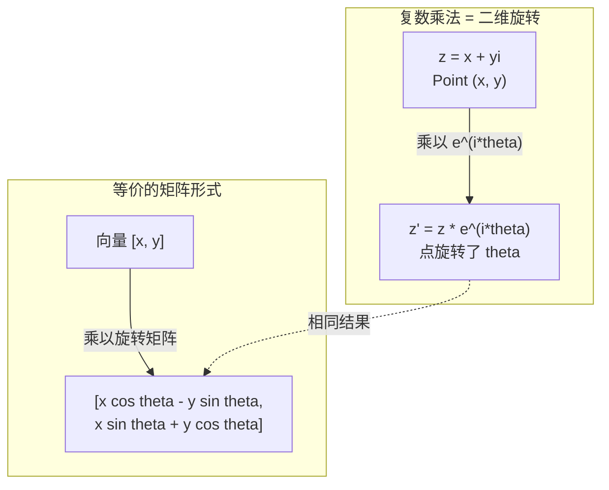
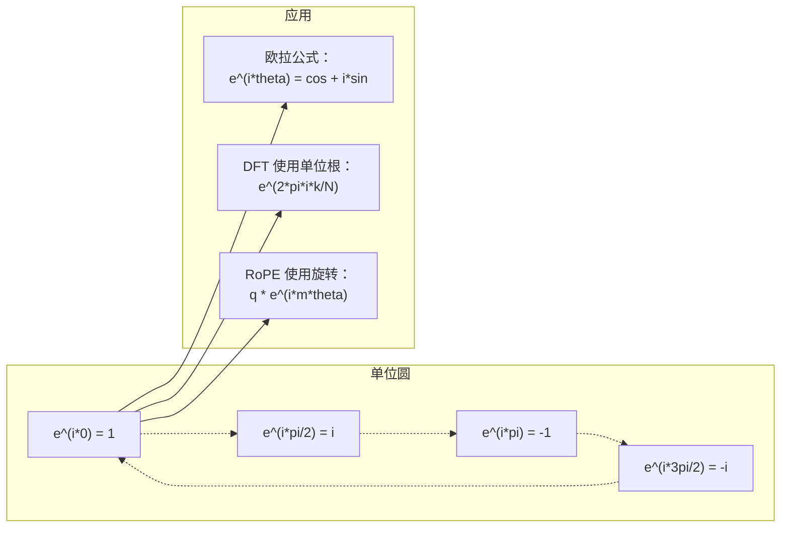

# AI 中的复数（Complex Numbers for AI）

> -1 的平方根不是"虚"的。它是理解旋转、频率和一半信号处理知识的关键。

**类型：** 学习
**语言：** Python
**前置知识：** 阶段 1，第 01-04 课（线性代数、微积分）
**时间：** ~60 分钟

## 学习目标（Learning Objectives）

- 在直角坐标和极坐标形式下进行复数运算（加法、乘法、除法、共轭）
- 应用欧拉公式在复指数与三角函数之间相互转换
- 使用复数单位根实现离散傅里叶变换
- 解释复数旋转如何构成 Transformer 中 RoPE 和正弦位置编码的基础

## 问题背景（The Problem）

你打开一篇关于傅里叶变换的论文，发现到处都是 $i$。你看 Transformer 的位置编码，看到不同频率的 `sin` 和 `cos`——它们是复指数的实部和虚部。你阅读量子计算，发现一切都在复数向量空间中表达。

复数看起来很抽象。一个建立在 -1 平方根之上的数系像是数学把戏。但它不是把戏。它是旋转和振荡的天然语言。每当有什么东西旋转、振动或振荡时，复数就是正确的工具。

不理解复数，你就无法理解离散傅里叶变换。你无法理解 FFT。你无法理解现代语言模型中的 RoPE（旋转位置嵌入）是如何工作的。你无法理解原始 Transformer 论文中的正弦位置编码为什么使用那些特定的频率。

本课从头构建复数运算，将其与几何联系起来，并精确展示复数在机器学习中的出现位置。

## 核心概念（The Concept）

### 什么是复数？

复数有两个部分：实部（real part）和虚部（imaginary part）。

```
z = a + bi

where:
  a is the real part
  b is the imaginary part
  i is the imaginary unit, defined by i^2 = -1
```

就是这样。你将数轴扩展为一个平面。实数在一条轴上。虚数在另一条轴上。每个复数都是这个平面上的一个点。

### 复数运算

**加法。** 实部相加，虚部相加。

$$
(a + bi) + (c + di) = (a + c) + (b + d)i
$$

示例：$(3 + 2i) + (1 + 4i) = 4 + 6i$

**乘法。** 使用分配律，记得 $i^2 = -1$。

$$
(a + bi)(c + di) = ac + adi + bci + bdi^2 = (ac - bd) + (ad + bc)i
$$

示例：$(3 + 2i)(1 + 4i) = 3 + 12i + 2i + 8i^2 = 3 + 14i - 8 = -5 + 14i$

**共轭。** 翻转虚部的符号。

$$
\overline{a + bi} = a - bi
$$

复数与其共轭的乘积始终是实数：

$$
(a + bi)(a - bi) = a^2 + b^2
$$

**除法。** 分子和分母同时乘以分母的共轭。

$$
\frac{a + bi}{c + di} = \frac{(a + bi)(c - di)}{c^2 + d^2}
$$

这消除了分母中的虚部，得到一个简洁的复数。

### 复平面

复平面将每个复数映射到一个二维点。水平轴是实轴，垂直轴是虚轴。

```
z = 3 + 2i  corresponds to the point (3, 2)
z = -1 + 0i corresponds to the point (-1, 0) on the real axis
z = 0 + 4i  corresponds to the point (0, 4) on the imaginary axis
```

一个复数同时是一个点和一条从原点出发的向量。这种双重解释使复数对几何非常有用。

### 极坐标形式

平面中的任意点可以通过其与原点的距离和与正实轴的夹角来描述。

$$
z = r \cdot (\cos\theta + i\sin\theta)
$$

其中：
- $r = |z| = \sqrt{a^2 + b^2}$（模长，magnitude / modulus）
- $\theta = \text{atan2}(b, a)$（相位，phase / argument）

直角坐标形式 $(a + bi)$ 适合加法。极坐标形式 $(r, \theta)$ 适合乘法。

**极坐标下的乘法。** 模长相乘，角度相加。

$$
z_1 = r_1 \cdot e^{i\theta_1}, \quad z_2 = r_2 \cdot e^{i\theta_2}
$$

$$
z_1 \cdot z_2 = (r_1 \cdot r_2) \cdot e^{i(\theta_1 + \theta_2)}
$$

这就是为什么复数非常适合旋转。乘以一个模长为 1 的复数是纯粹的旋转。

### 欧拉公式

复指数与三角函数之间的桥梁：

$$
e^{i\theta} = \cos\theta + i\sin\theta
$$

这是本课最重要的公式。当 $\theta = \pi$ 时：

$$
e^{i\pi} = \cos\pi + i\sin\pi = -1 + 0i = -1
$$

因此：

$$
e^{i\pi} + 1 = 0
$$

五个基本常数（$e$、$i$、$\pi$、$1$、$0$）被一个方程连接起来。

### 为什么欧拉公式对 ML 重要

欧拉公式告诉我们，当 $\theta$ 变化时，$e^{i\theta}$ 在单位圆上移动。在 $\theta = 0$ 时，你在 $(1, 0)$ 处。在 $\theta = \pi/2$ 时，你在 $(0, 1)$ 处。在 $\theta = \pi$ 时，你在 $(-1, 0)$ 处。在 $\theta = 3\pi/2$ 时，你在 $(0, -1)$ 处。一整圈是 $\theta = 2\pi$。

这意味着复指数就是旋转。而旋转在信号处理和 ML 中无处不在。

### 与二维旋转的联系

将复数 $(x + yi)$ 乘以 $e^{i\theta}$ 将点 $(x, y)$ 绕原点旋转 $\theta$ 角度。

```
Rotation via complex multiplication:
  (x + yi) * (cos(theta) + i*sin(theta))
  = (x*cos(theta) - y*sin(theta)) + (x*sin(theta) + y*cos(theta))i

Rotation via matrix multiplication:
  [cos(theta)  -sin(theta)] [x]   [x*cos(theta) - y*sin(theta)]
  [sin(theta)   cos(theta)] [y] = [x*sin(theta) + y*cos(theta)]
```

它们产生完全相同的结果。复数乘法**就是**二维旋转。旋转矩阵只是用矩阵记号写出的复数乘法。



### 相量和旋转信号

复指数 $e^{i\omega t}$ 是一个以角频率 $\omega$ 在单位圆上旋转的点。随着 $t$ 增大，该点在圆上运动。

这个旋转点的实部是 $\cos(\omega t)$。虚部是 $\sin(\omega t)$。一个正弦信号是旋转复数的影子。

```
e^(i*omega*t) = cos(omega*t) + i*sin(omega*t)

Real part:      cos(omega*t)    -- a cosine wave
Imaginary part: sin(omega*t)    -- a sine wave
```

这就是相量表示法（phasor representation）。你不再追踪扭动的正弦波，而是追踪平滑旋转的箭头。相移变成角度偏移。幅度变化变成模长变化。信号的加法变成向量的加法。

### 单位根

$N$ 次单位根是单位圆上等间距的 $N$ 个点：

$$
w_k = e^{2\pi i k / N} \quad \text{对于 } k = 0, 1, 2, \dots, N-1
$$

对于 $N = 4$，根是：$1$、$i$、$-1$、$-i$（四个罗盘点）。
对于 $N = 8$，你得到四个罗盘点加上四个对角线方向。

单位根是离散傅里叶变换的基础。DFT 将信号分解为这 $N$ 个等间距频率上的分量。

### 与 DFT 的联系

信号 $x[0], x[1], \dots, x[N-1]$ 的离散傅里叶变换是：

$$
X[k] = \sum_{n=0}^{N-1} x[n] \cdot e^{-2\pi i k n / N}
$$

每个 $X[k]$ 衡量信号与第 $k$ 个单位根——频率为 $k$ 的复正弦——的相关程度。DFT 将一个信号分解为 $N$ 个旋转的相量，并告诉你每个相量的幅度和相位。

### 为什么 $i$ 并不"虚"

"虚数"这个词是历史的偶然。笛卡尔带着轻蔑使用了这个词。但 $i$ 并不比负数在人们最初拒绝它们时更"虚"。负数回答了"3 减去 5 等于几？"的问题。虚数单位回答了"什么东西平方等于 -1？"的问题。

更有用的是：$i$ 是一个 90 度旋转算子。将实数乘以 $i$ 一次，你旋转 90 度到虚轴。再乘以 $i$（$i^2$），你又旋转 90 度——现在你指向负实轴方向。这就是为什么 $i^2 = -1$。它并不神秘。它是两个四分之一转组成的半圈。

这就是复数在工程中无处不在的原因。任何旋转的东西——电磁波、量子态、信号振荡、位置编码——都由复数自然地描述。

### 复指数与三角函数

在欧拉公式之前，工程师将信号写为 $A \cdot \cos(\omega t + \phi)$——幅度 $A$，频率 $\omega$，相位 $\phi$。这能用，但使运算变得麻烦。将两个不同相位的余弦相加需要使用三角恒等式。

使用复指数时，相同的信号是 $A \cdot e^{i(\omega t + \phi)}$。加两个信号就是加两个复数。相乘（调制）就是模长相乘、角度相加。相移变成角度加法。频率偏移变成相量乘法。

整个信号处理领域都转向了复指数记法，因为数学更简洁。"真实信号"始终只是复数表示的实部。虚部作为账本被携带，使所有代数运算自然地进行。

### 与 Transformer 的联系

**正弦位置编码**（原始 Transformer 论文）：

$$
\begin{aligned}
\text{PE}(pos, 2i) &= \sin(pos / 10000^{2i/d}) \\
\text{PE}(pos, 2i+1) &= \cos(pos / 10000^{2i/d})
\end{aligned}
$$

$\sin$ 和 $\cos$ 对是不同频率复指数的实部和虚部。每个频率提供编码位置的不同"分辨率"。低频变化缓慢（粗略位置）。高频变化快速（精细位置）。它们共同给每个位置一个独特的频率指纹。

**RoPE（旋转位置嵌入）** 更进一步。它显式地将 query 和 key 向量乘以复数旋转矩阵。两个 token 之间的相对位置变成一个旋转角度。注意力使用这些旋转后的向量计算，使模型通过复数乘法对相对位置敏感。

| 运算 | 代数形式 | 几何含义 |
|-----------|---------------|-------------------|
| 加法 | $(a+c) + (b+d)i$ | 平面向量加法 |
| 乘法 | $(ac-bd) + (ad+bc)i$ | 旋转和缩放 |
| 共轭 | $a - bi$ | 关于实轴反射 |
| 模长 | $\sqrt{a^2 + b^2}$ | 到原点的距离 |
| 相位 | $\text{atan2}(b, a)$ | 与正实轴的夹角 |
| 除法 | 乘以共轭 | 反向旋转和重缩放 |
| 幂 | $r^n \cdot e^{i n\theta}$ | 旋转 $n$ 次，按 $r^n$ 缩放 |



## 动手实现（Build It）

### 步骤 1：复数类

构建一个支持运算、模长、相位和直角坐标/极坐标转换的复数类。

```python
import math

# 复数类：支持加减乘除、共轭、模长和相位计算
# 每个复数在几何上对应二维平面中的一个点/向量
class Complex:
    def __init__(self, real, imag=0.0):
        self.real = real
        self.imag = imag

    # 加法：实部和虚部分别相加，对应向量加法
    def __add__(self, other):
        return Complex(self.real + other.real, self.imag + other.imag)

    # 乘法：利用 i^2 = -1，等价于旋转和缩放操作
    def __mul__(self, other):
        r = self.real * other.real - self.imag * other.imag
        i = self.real * other.imag + self.imag * other.real
        return Complex(r, i)

    # 除法：乘以分母的共轭以消除虚部
    def __truediv__(self, other):
        denom = other.real ** 2 + other.imag ** 2
        r = (self.real * other.real + self.imag * other.imag) / denom
        i = (self.imag * other.real - self.real * other.imag) / denom
        return Complex(r, i)

    # 模长：到原点的距离
    def magnitude(self):
        return math.sqrt(self.real ** 2 + self.imag ** 2)

    # 相位：与正实轴的夹角
    def phase(self):
        return math.atan2(self.imag, self.real)

    # 共轭：关于实轴翻转
    def conjugate(self):
        return Complex(self.real, -self.imag)
```

### 步骤 2：极坐标转换和欧拉公式

```python
# 直角坐标转极坐标
def to_polar(z):
    return z.magnitude(), z.phase()

# 极坐标转直角坐标
def from_polar(r, theta):
    return Complex(r * math.cos(theta), r * math.sin(theta))

# 欧拉公式：e^(i*theta) = cos(theta) + i*sin(theta)
def euler(theta):
    return Complex(math.cos(theta), math.sin(theta))
```

验证：`euler(theta).magnitude()` 应始终为 1.0。`euler(0)` 应得到 $(1, 0)$。`euler(pi)` 应得到 $(-1, 0)$。

### 步骤 3：旋转

将点 $(x, y)$ 旋转 $\theta$ 角是一次复数乘法：

```python
point = Complex(3, 4)
# 将点旋转 45 度（pi/4），模长保持不变
rotated = point * euler(math.pi / 4)
```

模长保持不变。只有角度发生变化。

### 步骤 4：从复数运算构建 DFT

```python
# 离散傅里叶变换：将信号分解为不同频率的复分量
# X[k] 表示信号与第 k 个频率分量的相关性
# 使用复数乘法实现核心运算：乘以单位根（旋转）
def dft(signal):
    N = len(signal)
    result = []
    for k in range(N):
        total = Complex(0, 0)
        for n in range(N):
            angle = -2 * math.pi * k * n / N
            total = total + Complex(signal[n], 0) * euler(angle)
        result.append(total)
    return result
```

这是 $O(N^2)$ 的 DFT。每个输出 $X[k]$ 是信号样本乘以单位根后的和。

### 步骤 5：逆 DFT

逆 DFT 从频谱重建原始信号。与前向 DFT 唯一的变化：翻转指数符号并除以 $N$。

```python
# 逆 DFT：从频谱恢复原始信号
# 前向 DFT 使用 -2*pi，逆 DFT 使用 +2*pi，然后除以 N
# 正逆变换的组合产生精确重建，信息无损失
def idft(spectrum):
    N = len(spectrum)
    result = []
    for n in range(N):
        total = Complex(0, 0)
        for k in range(N):
            angle = 2 * math.pi * k * n / N
            total = total + spectrum[k] * euler(angle)
        result.append(Complex(total.real / N, total.imag / N))
    return result
```

这给你完美的重建。应用 DFT，然后 IDFT，你得到与原始信号一致的精度（机器精度内）。没有信息丢失。

### 步骤 6：单位根

```python
# N 次单位根：单位圆上等间距的 N 个点
# 它们是 DFT 的频率基，构成一组正交基
def roots_of_unity(N):
    return [euler(2 * math.pi * k / N) for k in range(N)]
```

验证两个性质：
- 每个根的模长恰好为 1。
- 所有 $N$ 个根之和为零（它们因对称性相互抵消）。

这些性质使 DFT 可逆。单位根构成频域的正交基。

## 实际应用（Use It）

Python 内置了复数支持。字面量 `j` 表示虚数单位。

```python
z = 3 + 2j
w = 1 + 4j

print(z + w)
print(z * w)
print(abs(z))

import cmath
print(cmath.phase(z))
print(cmath.exp(1j * cmath.pi))
```

对于数组，numpy 原生支持复数：

```python
import numpy as np

z = np.array([1+2j, 3+4j, 5+6j])
print(np.abs(z))
print(np.angle(z))
print(np.conj(z))
print(np.real(z))
print(np.imag(z))

# 生成 5Hz 正弦信号，FFT 分析其频谱
signal = np.sin(2 * np.pi * 5 * np.linspace(0, 1, 128))
spectrum = np.fft.fft(signal)
freqs = np.fft.fftfreq(128, d=1/128)
```

## 交付物（Ship It）

运行 `code/complex_numbers.py` 生成 `outputs/skill-complex-arithmetic.md`。

## 练习题（Exercises）

1. **手算复数运算。** 计算 $(2 + 3i) \cdot (4 - i)$ 并用代码验证。然后计算 $(5 + 2i) / (1 - 3i)$。在复平面上画出两个结果，检查乘法是否对第一个数做了旋转和缩放。

2. **旋转序列。** 从点 $(1, 0)$ 开始。乘以 $e^{i\pi/6}$ 十二次。验证 12 次乘法后回到 $(1, 0)$。打印每一步的坐标并确认它们描绘了一个正十二边形。

3. **已知信号的 DFT。** 创建一个由 $\sin(2\pi \cdot 3 \cdot t) + 0.5 \cdot \sin(2\pi \cdot 7 \cdot t)$ 组成、在 32 个点采样的信号。运行你的 DFT。验证幅度谱在频率 3 和 7 处有峰值，且频率 7 处的峰值为频率 3 处的一半。

4. **单位根可视化。** 计算 8 次单位根。验证它们之和为零。验证用原始根 $e^{2\pi i/8}$ 乘以任意根得到下一个根。

5. **旋转矩阵等价性。** 对 10 个随机角度和 10 个随机点，验证复数乘法与使用 $2 \times 2$ 旋转矩阵的矩阵-向量乘法给出相同结果。打印最大数值差异。

## 关键术语（Key Terms）

| 术语（English） | 含义 |
|------|---------------|
| Complex number | 形如 $a + bi$ 的数，$a$ 为实部，$b$ 为虚部，$i^2 = -1$ |
| Imaginary unit | 数 $i$，定义 $i^2 = -1$。不是哲学意义上的"虚"——它是一个旋转算子 |
| Complex plane | 以 $x$ 轴为实轴、$y$ 轴为虚轴的二维平面。也称为 Argand 平面 |
| Magnitude (modulus) | 到原点的距离：$\sqrt{a^2 + b^2}$。记作 $|z|$ |
| Phase (argument) | 与正实轴的夹角：$\text{atan2}(b, a)$。记作 $\arg(z)$ |
| Conjugate | 关于实轴的镜像：$a + bi$ 的共轭是 $a - bi$ |
| Polar form | 将 $z$ 表示为 $r \cdot e^{i\theta}$ 而非 $a + bi$。使乘法变得简单 |
| Euler's formula | $e^{i\theta} = \cos\theta + i\sin\theta$。连接指数与三角函数 |
| Phasor | 代表正弦信号的旋转复数 $e^{i\omega t}$ |
| Roots of unity | $e^{2\pi i k / N}$（$k = 0$ 到 $N-1$）这 $N$ 个复数。单位圆上 $N$ 个等间距点 |
| DFT | 离散傅里叶变换。使用单位根将信号分解为复正弦分量 |
| RoPE | 旋转位置嵌入。使用复数乘法在 Transformer 注意力中编码相对位置 |

## 延伸阅读（Further Reading）

- [欧拉公式的直观介绍](https://betterexplained.com/articles/intuitive-understanding-of-eulers-formula/)——不用繁重记号构建几何直觉
- [Su et al.：RoFormer（2021）](https://arxiv.org/abs/2104.09864)——使用复数旋转引入旋转位置嵌入的论文
- [Vaswani et al.：Attention Is All You Need（2017）](https://arxiv.org/abs/1706.03762)——带有正弦位置编码的原始 Transformer 论文
- [3Blue1Brown：用群论入门介绍欧拉公式](https://www.youtube.com/watch?v=mvmuCPvRoWQ)——为什么 $e^{i\pi} = -1$ 的视觉解释
- [Needham：视觉复分析](https://global.oup.com/academic/product/visual-complex-analysis-9780198534464)——最好的复数视觉处理教材，充满几何洞察
- [Strang：线性代数导论，第 10 章](https://math.mit.edu/~gs/linearalgebra/)——线性代数和特征值背景下的复数
