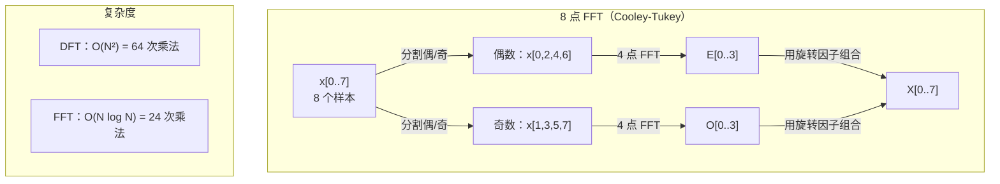
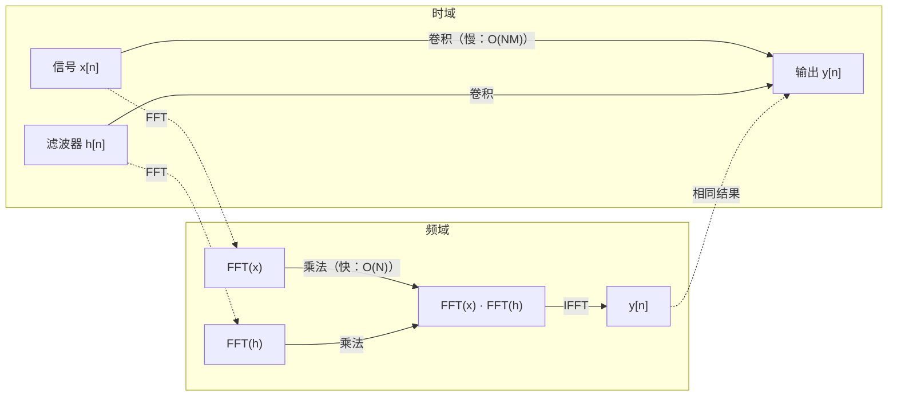

# 傅里叶变换（The Fourier Transform）

> 每个信号都是一组正弦波的和。傅里叶变换告诉你具体是哪些。

**类型：** 动手构建
**语言：** Python
**前置知识：** 阶段 1，第 01-04 课、第 19 课（复数）
**时间：** ~90 分钟

## 学习目标（Learning Objectives）

- 从头实现 DFT，并验证其与 $O(N \log N)$ 的 Cooley-Tukey FFT 结果一致
- 解读频率系数：从信号中提取幅度、相位和功率谱
- 应用卷积定理，通过 FFT 乘法实现卷积操作
- 将傅里叶频率分解与 Transformer 位置编码和 CNN 卷积层联系起来

## 问题背景（The Problem）

一段音频录制是随时间变化的压力测量值序列。股票价格是随时间变化的值序列。图像是空间上的像素强度网格。所有这些都是时域（或空域）数据。你看到的值在某个索引上变化。

但许多模式在时域中是看不见的。这段音频是纯音还是和弦？这只股票价格有周周期吗？这张图像有重复纹理吗？这些问题涉及的是**频率**内容，而时域将其隐藏了。

傅里叶变换将数据从时域转换到频域。它获取一个信号并将其分解为不同频率的正弦波。每个正弦波有幅度（多强）和相位（从何处开始）。傅里叶变换同时告诉你这两者。

这对 ML 很重要，因为频域思维无处不在。卷积神经网络执行卷积操作，而卷积在频域中就是乘法。Transformer 位置编码使用频率分解来表示位置。音频模型（语音识别、音乐生成）在频谱图（声音的频率表示）上操作。时间序列模型寻找周期模式。理解傅里叶变换为你提供了处理所有这些问题的词汇。

## 核心概念（The Concept）

### DFT 定义

给定 $N$ 个样本 $x[0], x[1], \dots, x[N-1]$，离散傅里叶变换产生 $N$ 个频率系数 $X[0], X[1], \dots, X[N-1]$：

$$
X[k] = \sum_{n=0}^{N-1} x[n] \cdot e^{-2\pi i k n / N}, \quad k = 0, 1, \dots, N-1
$$

每个 $X[k]$ 是一个复数。其模 $|X[k]|$ 告诉你频率 $k$ 的幅度。其相位 $\angle X[k]$ 告诉你该频率的相位偏移。

关键洞察：$e^{-2\pi i k n / N}$ 是频率为 $k$ 的旋转相量。DFT 计算信号与 $N$ 个等间距频率中每一个的相关性。如果信号在频率 $k$ 处有能量，相关性就大；否则，接近零。

### 每个系数的含义

**$X[0]$：直流分量。** 这是所有样本的和——与均值成正比。它表示信号的恒定（零频）偏移。

$$
X[0] = \sum_{n=0}^{N-1} x[n] \cdot e^0 = \text{所有样本之和}
$$

**$X[k]$ 对于 $1 \le k \le N/2$：正频率。** $X[k]$ 表示每 $N$ 个样本 $k$ 个周期的频率。$k$ 越大意味着频率越高（振荡越快）。

**$X[N/2]$：奈奎斯特频率。** 用 $N$ 个样本能表示的最高频率。超过这个频率就会出现混叠（aliasing）——高频伪装成低频。

**$X[k]$ 对于 $N/2 < k < N$：负频率。** 对于实值信号，$X[N-k] = \overline{X[k]}$。负频率是正频率的镜像。这就是为什么有用信息在前 $N/2 + 1$ 个系数中。

### 逆 DFT

逆 DFT 从频率系数重建原始信号：

$$
x[n] = \frac{1}{N} \sum_{k=0}^{N-1} X[k] \cdot e^{2\pi i k n / N}, \quad n = 0, 1, \dots, N-1
$$

与前向 DFT 的唯一区别：指数符号为正（而非负），以及有一个 $1/N$ 归一化因子。

逆 DFT 是完美重建。没有信息丢失。你可以从时域到频域再回来而不产生任何误差。DFT 是一个基变换——它在不同坐标系中重新表达相同的信息。

### FFT：让它变快

如上定义的 DFT 是 $O(N^2)$ 的：对于 $N$ 个输出系数中的每一个，你都要对 $N$ 个输入样本求和。对于 $N = 1,000,000$，就是 $10^{12}$ 次运算。

快速傅里叶变换（FFT）在 $O(N \log N)$ 时间内计算出相同的结果。对于 $N = 1,000,000$，大约需要 2000 万次操作而不是一万亿次。这就是频率分析变得实用的原因。

Cooley-Tukey 算法（最常见的 FFT）通过分治法工作：

1. 将信号分为偶数索引和奇数索引样本。
2. 递归计算每个半部分的 DFT。
3. 使用"旋转因子"（twiddle factors）$e^{-2\pi i k / N}$ 组合两个半尺寸 DFT。

$$
\begin{aligned}
X[k] &= E[k] + e^{-2\pi i k / N} \cdot O[k] \quad \text{对于 } k = 0, \dots, N/2 - 1 \\
X[k + N/2] &= E[k] - e^{-2\pi i k / N} \cdot O[k] \quad \text{对于 } k = 0, \dots, N/2 - 1
\end{aligned}
$$

其中 $E$ = 偶数索引样本的 DFT，$O$ = 奇数索引样本的 DFT。

对称性意味着递归的每一层做 $O(N)$ 工作，共有 $\log_2(N)$ 层。总计：$O(N \log N)$。



FFT 要求信号长度为 2 的幂。实践中，信号会被零填充到下一个 2 的幂。

### 频谱分析

**功率谱（power spectrum）** 是 $|X[k]|^2$——每个频率系数模的平方。它显示每个频率处有多少能量。

**相位谱（phase spectrum）** 是 $\angle X[k]$——每个频率的相位偏移。对于大多数分析任务，你关心功率谱而忽略相位。

$$
\text{频率 } k \text{ 的功率：} \quad P[k] = |X[k]|^2 = \text{Re}(X[k])^2 + \text{Im}(X[k])^2
$$

$$
\text{频率 } k \text{ 的相位：} \quad \phi[k] = \text{atan2}(\text{Im}(X[k]), \text{Re}(X[k]))
$$

### 频率分辨率

DFT 的频率分辨率取决于样本数 $N$ 和采样率 $f_s$。

$$
\text{频段 } k \text{ 的频率：} \quad f_k = k \cdot \frac{f_s}{N}
$$

$$
\text{频率分辨率：} \quad \Delta f = \frac{f_s}{N}
$$

$$
\text{最高频率：} \quad f_{\max} = \frac{f_s}{2} \quad (\text{奈奎斯特})
$$

要分辨两个很接近的频率，你需要更多样本。要捕捉高频，你需要更高的采样率。

### 卷积定理

这是信号处理中最重要的结论之一，与 CNN 直接相关。

**时域中的卷积等于频域中的逐点乘法。**

$$
x * h = \text{IFFT}(\text{FFT}(x) \cdot \text{FFT}(h))
$$

其中 $*$ 是卷积，$\cdot$ 是逐元素乘法。

为什么重要：

- 长度为 $N$ 和 $M$ 的两个信号的直接卷积需要 $O(N \cdot M)$ 次操作。
- 基于 FFT 的卷积需要 $O(N \log N)$：变换两者、相乘、逆变换。
- 对于大卷积核，FFT 卷积要快得多。
- 这正是在卷积层中发生的事情（大感受野情况下）。

注意：DFT 计算的是**循环卷积**（信号会绕回）。对于线性卷积（无绕回），在计算前将两个信号零填充到长度 $N + M - 1$。



### 加窗

DFT 假设信号是周期的——它将 $N$ 个样本视为一个无限重复信号的周期。如果信号的起始值和结束值不同，这会在边界产生不连续性，表现为虚假的高频内容。这称为**频谱泄漏**（spectral leakage）。

加窗通过在计算 DFT 之前将信号两端渐变为零来减少泄漏。

常见窗函数：

| 窗类型 | 形状 | 主瓣宽度 | 旁瓣电平 | 使用场景 |
|--------|-------|----------------|-----------------|----------|
| 矩形窗 | 平坦（无窗） | 最窄 | 最高（-13 dB） | 信号在 $N$ 个样本中恰好周期时 |
| Hann 窗 | 升余弦 | 中等 | 低（-31 dB） | 通用频谱分析 |
| Hamming 窗 | 修正余弦 | 中等 | 更低（-42 dB） | 音频处理、语音分析 |
| Blackman 窗 | 三余弦 | 宽 | 非常低（-58 dB） | 旁瓣抑制至关重要时 |

$$
\text{Hann 窗：} \quad w[n] = 0.5 \cdot \left(1 - \cos\left(\frac{2\pi n}{N-1}\right)\right)
$$

$$
\text{Hamming 窗：} \quad w[n] = 0.54 - 0.46 \cdot \cos\left(\frac{2\pi n}{N-1}\right)
$$

通过在 DFT 之前将窗函数与信号逐元素相乘来应用窗：$X = \text{DFT}(x \cdot w)$。

### DFT 的性质

| 性质 | 时域 | 频域 |
|----------|-------------|-----------------|
| 线性 | $a \cdot x + b \cdot y$ | $a \cdot X + b \cdot Y$ |
| 时移 | $x[n - k]$ | $X[f] \cdot e^{-2\pi i f k / N}$ |
| 频移 | $x[n] \cdot e^{2\pi i f_0 n / N}$ | $X[f - f_0]$ |
| 卷积 | $x * h$ | $X \cdot H$（逐点） |
| 乘法 | $x \cdot h$（逐点） | $X * H$（循环卷积，缩放 1/N） |
| Parseval 定理 | $\sum |x[n]|^2$ | $(1/N) \cdot \sum |X[k]|^2$ |
| 共轭对称（实输入） | $x[n]$ 为实数 | $X[k] = \overline{X[N-k]}$ |

Parseval 定理指出总能量在两个域中是相同的。能量在变换中守恒。

### 与位置编码的联系

原始 Transformer 使用正弦位置编码：

$$
\begin{aligned}
\text{PE}(pos, 2i) &= \sin(pos / 10000^{2i/d_{\text{model}}}) \\
\text{PE}(pos, 2i+1) &= \cos(pos / 10000^{2i/d_{\text{model}}})
\end{aligned}
$$

每个维度对 $(2i, 2i+1)$ 以不同频率振荡。频率从高（维度 0,1）到低（最后维度）呈几何级数分布。这给每个位置在所有频带上赋予了一个独特的模式——类似于傅里叶系数唯一地标识信号。

这提供的关键性质：

- **唯一性：** 没有两个位置具有相同的编码。
- **有界值：** $\sin$ 和 $\cos$ 始终在 $[-1, 1]$ 范围内。
- **相对位置：** 位置 $p+k$ 的编码可以表示为位置 $p$ 处编码的线性函数。模型可以学习关注相对位置。

### 与 CNN 的联系

卷积层通过在信号或图像上滑动一个学习到的滤波器（卷积核）来应用于输入。数学上，这就是卷积操作。

由卷积定理，这等价于：
1. 对输入做 FFT
2. 对卷积核做 FFT
3. 在频域中相乘
4. 对结果做 IFFT

标准 CNN 实现使用直接卷积（对于小的 3x3 卷积核更快）。但对于大卷积核或全局卷积，基于 FFT 的方法明显更快。一些架构（如 FNet）用 FFT 完全替换了注意力机制，以 $O(N \log N)$ 而非 $O(N^2)$ 的复杂度实现了有竞争力的准确率。

### 频谱图和短时傅里叶变换

单次 FFT 给你整个信号的频率内容，但无法告诉你这些频率何时出现。一个啁啾（频率随时间增加的信号）和一个和弦（所有频率同时存在）可以有相同的幅度谱。

短时傅里叶变换（STFT）通过在信号的重叠窗口上计算 FFT 解决了这个问题。结果是一个**频谱图**（spectrogram）：二维表示，时间在一轴上，频率在另一轴上。每个点的强度显示该时刻该频率的能量。

```
STFT 过程：
1. 选择窗口大小（如 1024 个样本）
2. 选择跳跃大小（如 256 个样本——75% 重叠）
3. 对每个窗口位置：
   a. 提取窗口段
   b. 应用 Hann/Hamming 窗
   c. 计算 FFT
   d. 将幅度谱存储为频谱图的一列
```

频谱图是音频 ML 模型的标准输入表示。语音识别模型（Whisper、DeepSpeech）在 mel-频谱图上操作——其频率映射到 mel 尺度，更符合人类音高感知。

### 混叠

如果一个信号包含高于 $f_s/2$（奈奎斯特频率）的频率，以采样率 $f_s$ 采样会产生混叠副本。以 100 Hz 采样的 90 Hz 信号看起来与 10 Hz 信号完全相同。仅从样本中无法区分它们。

```
示例：
  真实信号：90 Hz 正弦波
  采样率：100 Hz
  表现频率：100 - 90 = 10 Hz

  以 100 Hz 采样的 90 Hz 信号的样本
  与 10 Hz 信号的样本完全相同。
  没有任何数学方法能恢复原始的 90 Hz。
```

这就是模数转换器在采样前包含抗混叠滤波器以去除奈奎斯特以上频率的原因。在 ML 中，混叠出现在下采样特征图时没有适当的低通滤波——一些架构通过抗混叠池化层来解决这个问题。

### 零填充不会提高分辨率

一个常见的误解：在 FFT 前对信号做零填充可以提高频率分辨率。事实并非如此。零填充在现有频率频段之间做插值，给你一个看起来更平滑的频谱。但它不能揭示原始样本中没有的频率细节。

真正的频率分辨率只取决于观测时间 $T = N / f_s$。要分辨相隔 $\Delta f$ 的两个频率，你至少需要 $T = 1 / \Delta f$ 秒的数据。零填充再多也不能改变这个基本限制。

## 动手实现（Build It）

### 步骤 1：从头实现 DFT

$O(N^2)$ 的 DFT 直接来自定义。

```python
import math

class Complex:
    # 复用第 19 课的复数类实现
    ...

# 朴素离散傅里叶变换：O(N²)
# 每个输出系数 X[k] 是信号与频率 k 的复正弦的相关性
def dft(x):
    N = len(x)
    result = []
    for k in range(N):
        total = Complex(0, 0)
        for n in range(N):
            # 旋转因子：e^(-2*pi*i*k*n/N)
            angle = -2 * math.pi * k * n / N
            w = Complex(math.cos(angle), math.sin(angle))
            xn = x[n] if isinstance(x[n], Complex) else Complex(x[n])
            total = total + xn * w
        result.append(total)
    return result
```

### 步骤 2：逆 DFT

相同结构，指数为正，除以 $N$。

```python
# 逆 DFT：从频率系数恢复时域信号
# 指数符号与正向相反（+2pi 而非 -2pi），结果除以 N
def idft(X):
    N = len(X)
    result = []
    for n in range(N):
        total = Complex(0, 0)
        for k in range(N):
            angle = 2 * math.pi * k * n / N
            w = Complex(math.cos(angle), math.sin(angle))
            total = total + X[k] * w
        result.append(Complex(total.real / N, total.imag / N))
    return result
```

### 步骤 3：FFT（Cooley-Tukey）

递归 FFT 要求长度为 2 的幂。分成偶数和奇数，递归，用旋转因子组合。

```python
# Cooley-Tukey FFT：O(N log N) 分治法
# 将信号分为偶/奇索引，递归计算半尺寸 DFT，用旋转因子组合
# 需要信号长度为 2 的幂
def fft(x):
    N = len(x)
    if N <= 1:
        return [x[0] if isinstance(x[0], Complex) else Complex(x[0])]
    if N % 2 != 0:
        return dft(x)  # 非 2 的幂回退到朴素 DFT

    # 分治：分别计算偶/奇索引的 FFT
    even = fft([x[i] for i in range(0, N, 2)])
    odd = fft([x[i] for i in range(1, N, 2)])

    # 用旋转因子组合两个半尺寸结果
    # X[k] = E[k] + W^k * O[k]
    # X[k + N/2] = E[k] - W^k * O[k]
    result = [Complex(0)] * N
    for k in range(N // 2):
        angle = -2 * math.pi * k / N
        twiddle = Complex(math.cos(angle), math.sin(angle))
        t = twiddle * odd[k]
        result[k] = even[k] + t
        result[k + N // 2] = even[k] - t
    return result
```

### 步骤 4：频谱分析辅助函数

```python
# 功率谱：|X[k]|^2，显示各频率的能量分布
def power_spectrum(X):
    return [xk.real ** 2 + xk.imag ** 2 for xk in X]

# 通过 FFT 实现卷积（利用卷积定理）
# 时域卷积 = 频域逐点乘法，再逆变换
# 需零填充避免循环卷积的绕回效应
def convolve_fft(x, h):
    N = len(x) + len(h) - 1
    # 找下一个 2 的幂，满足 FFT 要求
    padded_N = 1
    while padded_N < N:
        padded_N *= 2

    # 零填充到相同长度
    x_padded = x + [0.0] * (padded_N - len(x))
    h_padded = h + [0.0] * (padded_N - len(h))

    # FFT -> 逐点相乘 -> IFFT
    X = fft(x_padded)
    H = fft(h_padded)
    Y = [xk * hk for xk, hk in zip(X, H)]
    y = idft(Y)
    return [y[n].real for n in range(N)]
```

## 实际应用（Use It）

实际工作中使用 numpy 的 FFT，它底层由高度优化的 C 库支持。

```python
import numpy as np

# 生成 5Hz 正弦信号，做 FFT 分析
signal = np.sin(2 * np.pi * 5 * np.arange(256) / 256)
spectrum = np.fft.fft(signal)
freqs = np.fft.fftfreq(256, d=1/256)

power = np.abs(spectrum) ** 2

# 实值信号只需看正频率部分（负频率对称）
positive_freqs = freqs[:len(freqs)//2]
positive_power = power[:len(power)//2]
```

加窗和更高级的频谱分析：

```python
from scipy.signal import windows, stft

# 应用 Hann 窗减少频谱泄漏
window = windows.hann(256)
windowed = signal * window
spectrum = np.fft.fft(windowed)
```

卷积：

```python
from scipy.signal import fftconvolve

result = fftconvolve(signal, kernel, mode='full')
```

频谱图：

```python
from scipy.signal import stft

# 计算短时傅里叶变换，得到时频表示
frequencies, times, Zxx = stft(signal, fs=sample_rate, nperseg=256)
spectrogram = np.abs(Zxx) ** 2
```

频谱矩阵的形状为 (频率数, 时间帧数)。每列是一个时间窗口的功率谱。这就是音频 ML 模型作为输入消费的内容。

## 交付物（Ship It）

运行 `code/fourier.py` 生成 `outputs/prompt-spectral-analyzer.md`。

## 练习题（Exercises）

1. **纯音识别。** 创建一个未知频率（1 到 50 Hz 之间）的正弦波信号，以 128 Hz 采样 1 秒。使用你的 DFT 识别该频率。验证答案匹配。然后加入标准差为 0.5 的高斯噪声并重复。噪声如何影响频谱？

2. **FFT vs DFT 验证。** 生成长度为 64 的随机信号。分别计算 DFT（$O(N^2)$）和 FFT。验证所有系数在 $10^{-10}$ 精度内匹配。对长度 256、512、1024 和 2048 的信号计时两个函数。绘制 DFT 时间与 FFT 时间的比率图。

3. **用实例验证卷积定理。** 创建信号 $x = [1, 2, 3, 4, 0, 0, 0, 0]$ 和滤波器 $h = [1, 1, 1, 0, 0, 0, 0, 0]$。用直接方法（嵌套循环）计算它们的循环卷积。然后通过 FFT（变换、相乘、逆变换）计算。验证结果匹配。再通过适当零填充来做线性卷积。

4. **加窗效果。** 创建由 10 Hz 和 12 Hz 的正弦波组成的信号（非常接近）。以 128 Hz 采样 1 秒。分别用无窗、Hann 窗和 Hamming 窗计算功率谱。哪个窗使得区分两个峰值最容易？为什么？

5. **位置编码分析。** 为 $d_{\text{model}} = 128$ 和 $\max\_pos = 512$ 生成正弦位置编码。对每一对位置 $(p_1, p_2)$，计算它们编码的点积。展示点积只取决于 $|p_1 - p_2|$，而非绝对位置。随着距离增大，点积如何变化？

## 关键术语（Key Terms）

| 术语（English） | 含义 |
|------|---------------|
| DFT（离散傅里叶变换） | 将 $N$ 个时域样本转换为 $N$ 个频域系数。每个系数是该频率处复正弦与信号的相关性 |
| FFT（快速傅里叶变换） | 计算 DFT 的 $O(N \log N)$ 算法。Cooley-Tukey 算法递归地按偶/奇索引分割 |
| Inverse DFT | 从频率系数重建时域信号。公式与 DFT 相同，但指数符号翻转并乘以 $1/N$ |
| Frequency bin | DFT 输出中的每个索引 $k$ 代表频率 $k \cdot f_s / N$ Hz。"bin"是离散的频率槽 |
| DC component | $X[0]$，零频系数。与信号均值成正比 |
| Nyquist frequency | $f_s / 2$，采样率 $f_s$ 下可表示的最高频率。高于此频率会混叠 |
| Power spectrum | $|X[k]|^2$，每个频率系数模的平方。显示能量在各频率上的分布 |
| Phase spectrum | $\angle X[k]$，每个频率分量的相位偏移。分析中常被忽略 |
| Spectral leakage | 将非周期信号当作周期信号处理引起的虚假频率内容。加窗可减少 |
| Window function | DFT 前应用的渐变函数（Hann、Hamming、Blackman），减少频谱泄漏 |
| Twiddle factor | 用于 FFT 蝶形运算中组合子 DFT 的复指数 $e^{-2\pi i k / N}$ |
| Convolution theorem | 时域卷积等于频域逐点乘法。信号处理和 CNN 的基础 |
| Circular convolution | 信号绕回的卷积。DFT 自然计算的就是这种卷积 |
| Linear convolution | 无绕回的标准卷积。通过在 DFT 前零填充实现 |
| Parseval's theorem | 总能量在傅里叶变换中守恒。$\sum |x[n]|^2 = (1/N) \sum |X[k]|^2$ |
| Aliasing | 当奈奎斯特以上的频率因采样率不足而呈现为低频时发生 |

## 延伸阅读（Further Reading）

- [Cooley & Tukey：复数傅里叶级数机器计算的算法（1965）](https://www.ams.org/journals/mcom/1965-19-090/S0025-5718-1965-0178586-1/)——改变了计算的原始 FFT 论文
- [3Blue1Brown：傅里叶变换究竟是什么？](https://www.youtube.com/watch?v=spUNpyF58BY)——最好的傅里叶变换视觉导论
- [Lee-Thorp et al.：FNet：用傅里叶变换混合 Token（2021）](https://arxiv.org/abs/2105.03824)——在 Transformer 中用 FFT 替代自注意力
- [Smith：科学家和工程师的数字信号处理指南](http://www.dspguide.com/)——免费在线教材，深入覆盖 FFT、加窗和频谱分析
- [Vaswani et al.：Attention Is All You Need（2017）](https://arxiv.org/abs/1706.03762)——源自傅里叶频率分解的正弦位置编码
- [Radford et al.：Whisper（2022）](https://arxiv.org/abs/2212.04356)——使用 mel-频谱图作为输入表示的语音识别
