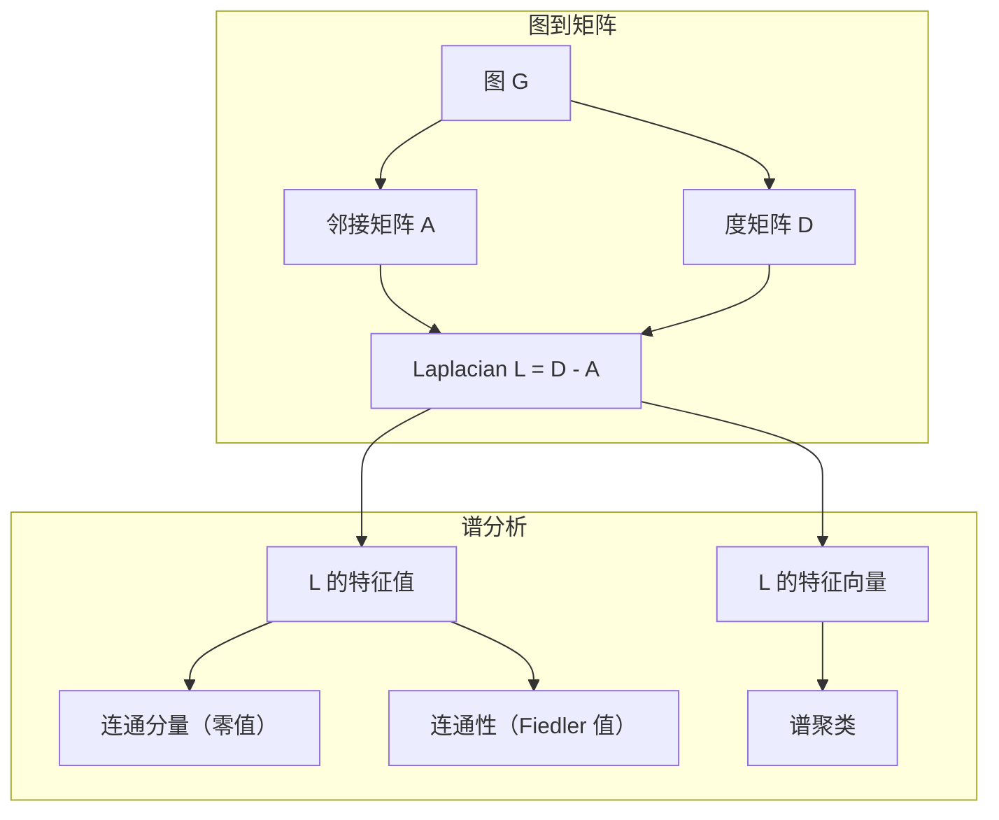
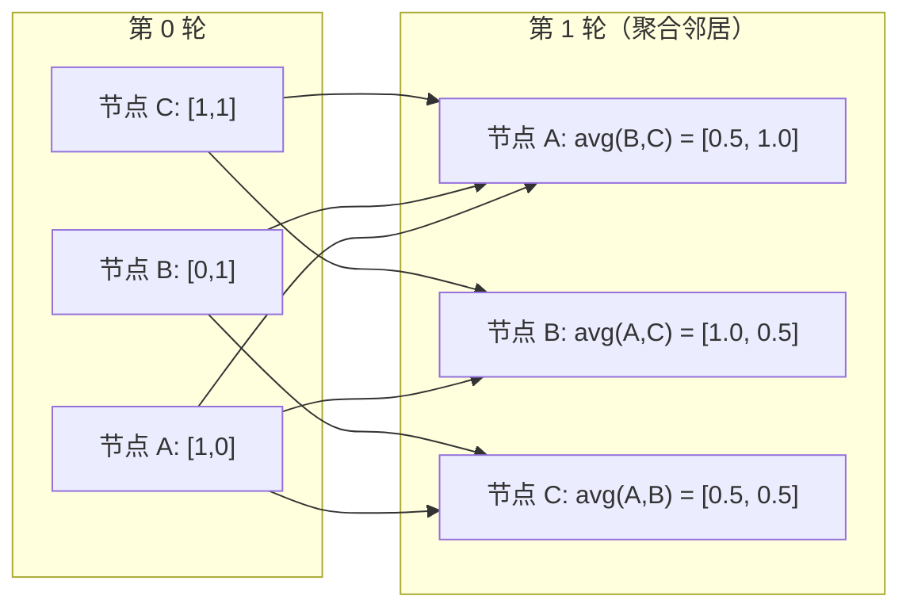

# 机器学习图论（Graph Theory for Machine Learning）

> 图是关系的数据结构。如果你的数据有连接关系，你就需要图论。

**类型：** 动手构建
**语言：** Python
**前置知识：** 阶段 1，第 01-03 课（线性代数、矩阵）
**时间：** ~90 分钟

## 学习目标（Learning Objectives）

- 用邻接矩阵/邻接表构建图类，实现 BFS 和 DFS 遍历
- 计算图 Laplacian 矩阵，利用其特征值检测连通分量和聚类节点
- 将一轮 GNN 风格的消息传递实现为归一化邻接矩阵乘法
- 使用 Fiedler 向量对图进行谱聚类

## 问题背景（The Problem）

社交网络、分子、知识库、引文网络、道路地图——这些都是图。传统 ML 将数据视为扁平表格。每行独立。每个特征是一列。但当连接的结构至关重要时，表格就失效了。

考虑一个社交网络。你想预测用户会购买什么产品。他们的购买历史很重要。但他们的朋友的购买历史更重要。连接携带了信号。

或者考虑一个分子。你想预测它是否与蛋白质结合。原子很重要，但真正重要的是原子如何相互键合。结构本身就是数据。

图神经网络（GNN）是深度学习中增长最快的领域。它们驱动着药物发现、社交推荐、欺诈检测和知识图谱推理。每个 GNN 都建立在相同的基础之上：基本图论。

你需要四样东西：
1. 一种将图表示为矩阵的方法（这样你才能做乘法）
2. 探索图结构的遍历算法
3. Laplacian——谱图理论中最重要的矩阵
4. 消息传递——使 GNN 工作的操作

## 核心概念（The Concept）

### 图：节点和边

图 $G = (V, E)$ 由顶点（节点）$V$ 和边 $E$ 组成。每条边连接两个节点。

**有向 vs 无向。** 在无向图中，边 $(u, v)$ 意味着 $u$ 连接 $v$ 且 $v$ 连接 $u$。在有向图中，边 $(u, v)$ 意味着 $u$ 指向 $v$，但不一定反向。

**加权 vs 无加权。** 在无加权图中，边要么存在要么不存在。在加权图中，每条边有一个数值权重——距离、成本、强度。

| 图类型 | 示例 |
|-----------|---------|
| 无向、无加权 | Facebook 好友网络 |
| 有向、无加权 | Twitter 关注网络 |
| 无向、加权 | 道路地图（距离） |
| 有向、加权 | 网页链接（PageRank 分数） |

### 邻接矩阵

邻接矩阵 $A$ 是核心表示。对于有 $n$ 个节点的图：

$$
A[i][j] = \begin{cases}
1 & \text{如果从节点 } i \text{ 到节点 } j \text{ 有边} \\
0 & \text{否则}
\end{cases}
$$

对于无向图，$A$ 是对称的：$A[i][j] = A[j][i]$。对于加权图，$A[i][j] = \text{边 } (i, j) \text{ 的权重}$。

**示例——一个三角形：**

```
Nodes: 0, 1, 2
Edges: (0,1), (1,2), (0,2)

A = [[0, 1, 1],
     [1, 0, 1],
     [1, 1, 0]]
```

邻接矩阵是每个 GNN 的输入。对 $A$ 的矩阵运算对应着对图的运算。

### 度

节点的度是连接到它的边的数量。对于有向图，有入度（指向的边）和出度（指出的边）。

度矩阵 $D$ 是对角矩阵：

$$
D[i][i] = \text{节点 } i \text{ 的度}, \quad D[i][j] = 0 \text{ （对于 } i \neq j \text{）}
$$

对于三角形示例：$D = \text{diag}(2, 2, 2)$，因为每个节点连接两个其他节点。

度告诉你节点的重要性。高度 = 枢纽节点。网络的度分布揭示了其结构。社交网络遵循幂律（少数枢纽，许多叶节点）。随机图具有泊松分布的度。

### BFS 和 DFS

两种基本的图遍历算法。你两者都需要。

**广度优先搜索（BFS）：** 先探索所有邻居，然后邻居的邻居。使用队列（FIFO）。

```
BFS from node 0:
  Visit 0
  Queue: [1, 2]        (neighbors of 0)
  Visit 1
  Queue: [2, 3]        (add neighbors of 1)
  Visit 2
  Queue: [3]           (neighbors of 2 already visited)
  Visit 3
  Queue: []            (done)
```

BFS 在无加权图中找到最短路径。从起点到任意节点的距离等于该节点首次被发现的 BFS 层级。这就是为什么 BFS 用于社交网络中的跳数距离。

**深度优先搜索（DFS）：** 在回溯之前尽可能深入。使用栈（LIFO）或递归。

```
DFS from node 0:
  Visit 0
  Stack: [1, 2]        (neighbors of 0)
  Visit 2               (pop from stack)
  Stack: [1, 3]         (add neighbors of 2)
  Visit 3               (pop from stack)
  Stack: [1]
  Visit 1               (pop from stack)
  Stack: []             (done)
```

DFS 的用途：
- 查找连通分量（从未访问过的节点运行 DFS）
- 环检测（DFS 树中的反向边）
- 拓扑排序（反转 DFS 完成顺序）

| 算法 | 数据结构 | 寻找目标 | 使用场景 |
|-----------|---------------|-------|----------|
| BFS | 队列 | 最短路径 | 社交网络距离、知识图谱遍历 |
| DFS | 栈 | 连通分量、环 | 连通性、拓扑排序 |

### 图 Laplacian

$L = D - A$。谱图理论中最重要的矩阵。

对于三角形：

```
D = [[2, 0, 0],    A = [[0, 1, 1],    L = [[2, -1, -1],
     [0, 2, 0],         [1, 0, 1],         [-1, 2, -1],
     [0, 0, 2]]         [1, 1, 0]]         [-1, -1,  2]]
```

Laplacian 具有显著的性质：

1. **$L$ 是半正定的。** 所有特征值 $\ge 0$。

2. **零特征值的数量等于连通分量的数量。** 连通图恰好有一个零特征值。有 3 个不连通分量的图有三个零特征值。

3. **最小的非零特征值（Fiedler 值）衡量连通性。** 大的 Fiedler 值意味着图是良好连通的。小的 Fiedler 值意味着图有一个薄弱点——瓶颈。

4. **Fiedler 值的特征向量（Fiedler 向量）揭示最佳分割。** 值为正的节点分在一组，值为负的节点分在另一组。这就是谱聚类。



### 谱性质

邻接矩阵和 Laplacian 的特征值无需任何遍历就能揭示结构性质。

**谱聚类**的工作方式如下：
1. 计算 Laplacian $L$
2. 找到 $L$ 最小的 $k$ 个特征向量（跳过第一个——对于连通图是全 1 向量）
3. 用这些特征向量作为每个节点的新坐标
4. 在这些坐标上运行 k-means

为什么有效？$L$ 的特征向量编码了图上"最平滑"的函数。连接良好的节点得到相似的特征向量值。被瓶颈隔开的节点得到不同的值。特征向量自然地分离出聚类。

**随机游走联系。** 归一化 Laplacian 与图上的随机游走有关。随机游走的平稳分布与节点度成正比。混合时间（游走收敛的速度）取决于谱间隙。

### 消息传递

图神经网络的核心操作。每个节点从邻居收集消息，聚合它们，并更新自己的状态。

$$
h_v^{(k+1)} = \text{UPDATE}(h_v^{(k)}, \text{AGGREGATE}(\{h_u^{(k)} : u \in \text{neighbors}(v)\}))
$$

在最简单的形式中，$\text{AGGREGATE} = \text{mean}$，且 $\text{UPDATE} = \text{线性变换} + \text{激活}$：

$$
h_v^{(k+1)} = \sigma(W \cdot \text{mean}(\{h_u^{(k)} : u \in \text{neighbors}(v)\}))
$$

这实际上是矩阵乘法。如果 $H$ 是所有节点特征的矩阵，$A$ 是邻接矩阵：

$$
H^{(k+1)} = \sigma(A_{\text{norm}} \cdot H^{(k)} \cdot W)
$$

其中 $A_{\text{norm}}$ 是归一化邻接矩阵（每行和为 1）。

一轮消息传递让每个节点"看到"它的直接邻居。两轮让它看到邻居的邻居。$K$ 轮为每个节点提供其 $K$ 跳邻域的信息。



### 概念与 ML 应用

| 概念 | ML 应用 |
|---------|---------------|
| 邻接矩阵 | GNN 输入表示 |
| 图 Laplacian | 谱聚类、社区检测 |
| BFS/DFS | 知识图谱遍历、路径查找 |
| 度分布 | 节点重要性、特征工程 |
| 消息传递 | GNN 层（GCN、GAT、GraphSAGE） |
| $L$ 的特征值 | 社区检测、图划分 |
| 谱聚类 | 无监督节点分组 |
| PageRank | 节点重要性、网页搜索 |

## 动手实现（Build It）

### 步骤 1：从头构建图类

```python
# 通用的图类：支持无向/有向、加权/无加权
# 使用邻接表存储（{node: {neighbor: weight}}），空间效率高
class Graph:
    def __init__(self, n_nodes, directed=False):
        self.n = n_nodes
        self.directed = directed
        self.adj = {i: {} for i in range(n_nodes)}

    def add_edge(self, u, v, weight=1.0):
        self.adj[u][v] = weight
        if not self.directed:
            self.adj[v][u] = weight

    def neighbors(self, node):
        return list(self.adj[node].keys())

    def degree(self, node):
        return len(self.adj[node])

    # 转换为 numpy 邻接矩阵（谱操作需要矩阵形式）
    def adjacency_matrix(self):
        import numpy as np
        A = np.zeros((self.n, self.n))
        for u in range(self.n):
            for v, w in self.adj[u].items():
                A[u][v] = w
        return A

    def degree_matrix(self):
        import numpy as np
        D = np.zeros((self.n, self.n))
        for i in range(self.n):
            D[i][i] = self.degree(i)
        return D

    # Laplacian = D - A，谱图理论的核心矩阵
    def laplacian(self):
        return self.degree_matrix() - self.adjacency_matrix()
```

邻接表（`self.adj`）高效存储邻居。邻接矩阵转换使用 numpy，因为所有谱操作需要它。

### 步骤 2：BFS 和 DFS

```python
from collections import deque

# BFS：按层级探索，使用队列（先进先出）
# 返回遍历顺序和到起点的最短距离
# 适用于无加权图的最短路径和社交网络距离
def bfs(graph, start):
    visited = set()
    order = []
    distances = {}
    queue = deque([(start, 0)])
    visited.add(start)
    while queue:
        node, dist = queue.popleft()
        order.append(node)
        distances[node] = dist
        for neighbor in graph.neighbors(node):
            if neighbor not in visited:
                visited.add(neighbor)
                queue.append((neighbor, dist + 1))
    return order, distances

# DFS：深入后回溯，使用栈（后进先出）
# 适用于连通分量检测和环检测
def dfs(graph, start):
    visited = set()
    order = []
    stack = [start]
    while stack:
        node = stack.pop()
        if node in visited:
            continue
        visited.add(node)
        order.append(node)
        # 反转邻居顺序以模拟递归 DFS 的典型行为
        for neighbor in reversed(graph.neighbors(node)):
            if neighbor not in visited:
                stack.append(neighbor)
    return order
```

BFS 使用双端队列实现 $O(1)$ 的左端弹出。DFS 使用列表作为栈。两者恰好访问每个节点一次——$O(V + E)$ 时间。

### 步骤 3：连通分量和 Laplacian 特征值

```python
# 通过从未访问节点反复运行 BFS 来查找连通分量
def connected_components(graph):
    visited = set()
    components = []
    for node in range(graph.n):
        if node not in visited:
            order, _ = bfs(graph, node)
            visited.update(order)
            components.append(order)
    return components

# 计算 Laplacian 特征值（升序排列）
# 零特征值数量 = 连通分量数
# 最小非零特征值（Fiedler 值）= 图的代数连通度
def laplacian_eigenvalues(graph):
    import numpy as np
    L = graph.laplacian()
    eigenvalues = np.linalg.eigvalsh(L)
    return eigenvalues
```

`eigvalsh` 用于对称矩阵——无向图的 Laplacian 总是对称的。它返回升序排列的特征值。统计零值数量以找到连通分量数。

### 步骤 4：谱聚类

```python
# 谱聚类：使用 Laplacian 特征向量对图进行分割
# 对 k=2，直接用 Fiedler 向量的正负号分组
# 对 k>2，需对前 k 个特征向量运行 k-means
def spectral_clustering(graph, k=2):
    import numpy as np
    L = graph.laplacian()
    eigenvalues, eigenvectors = np.linalg.eigh(L)
    # 跳过第一个特征向量（全 1 向量，无信息）
    features = eigenvectors[:, 1:k+1]

    # k=2 时用 Fiedler 向量符号做简单二分类
    labels = np.zeros(graph.n, dtype=int)
    for i in range(graph.n):
        if features[i, 0] >= 0:
            labels[i] = 0
        else:
            labels[i] = 1
    return labels
```

对于 $k=2$，Fiedler 向量的符号将图分为两个聚类。对于 $k>2$，在前 $k$ 个特征向量（排除平凡的全 1 特征向量）上运行 k-means。

### 步骤 5：消息传递

```python
# 一轮 GNN 消息传递：
# 1. 归一化邻接矩阵（每行和为 1）
# 2. 聚合邻居特征：A_norm @ features
# 3. 线性变换：aggregated @ weight_matrix
# 堆叠多层可将信息传播到更远邻域
def message_passing(graph, features, weight_matrix):
    import numpy as np
    A = graph.adjacency_matrix()
    # 行归一化：每个节点的特征取邻居特征的平均
    row_sums = A.sum(axis=1, keepdims=True)
    row_sums[row_sums == 0] = 1
    A_norm = A / row_sums
    # 聚合邻居特征 -> 线性变换
    aggregated = A_norm @ features
    output = aggregated @ weight_matrix
    return output
```

这是一轮 GNN 消息传递。每个节点的新特征是邻居特征的加权平均，经权重矩阵变换。堆叠多轮可将信息传播得更远。

## 实际应用（Use It）

使用 networkx 和 numpy，相同操作只需一行代码：

```python
import networkx as nx
import numpy as np

# 使用经典的 Zachary 空手道俱乐部图（34 个节点，78 条边）
G = nx.karate_club_graph()

A = nx.adjacency_matrix(G).toarray()
L = nx.laplacian_matrix(G).toarray()

# 特征值升序排列，零值个数 = 连通分量数
eigenvalues = np.linalg.eigvalsh(L.astype(float))
print(f"Smallest eigenvalues: {eigenvalues[:5]}")
print(f"Connected components: {nx.number_connected_components(G)}")

# 贪心模块度最大化社区检测
communities = nx.community.greedy_modularity_communities(G)
print(f"Communities found: {len(communities)}")

# PageRank 节点重要性排序
pr = nx.pagerank(G)
top_nodes = sorted(pr.items(), key=lambda x: x[1], reverse=True)[:5]
print(f"Top 5 PageRank nodes: {top_nodes}")
```

networkx 使用优化的 C 后端处理任意规模的图。生产环境中使用它。使用你的手写实现来理解它在做什么。

### numpy 谱分析

```python
import numpy as np

# 示例图：5 个节点，路径结构，中间通过节点 2 连接
A = np.array([
    [0, 1, 1, 0, 0],
    [1, 0, 1, 0, 0],
    [1, 1, 0, 1, 0],
    [0, 0, 1, 0, 1],
    [0, 0, 0, 1, 0]
])

D = np.diag(A.sum(axis=1))
L = D - A

eigenvalues, eigenvectors = np.linalg.eigh(L)
print(f"Eigenvalues: {np.round(eigenvalues, 4)}")
print(f"Fiedler value: {eigenvalues[1]:.4f}")
print(f"Fiedler vector: {np.round(eigenvectors[:, 1], 4)}")

# 用 Fiedler 向量符号做谱二分
fiedler = eigenvectors[:, 1]
group_a = np.where(fiedler >= 0)[0]
group_b = np.where(fiedler < 0)[0]
print(f"Cluster A: {group_a}")
print(f"Cluster B: {group_b}")
```

Fiedler 向量完成了核心工作。正值在一个聚类中，负值在另一个中。不需要迭代优化——只需一次特征分解。

## 交付物（Ship It）

本课产出：
- `outputs/skill-graph-analysis.md`——分析图结构数据的技能参考

## 联系与扩展（Connections）

| 概念 | 出现位置 |
|---------|------------------|
| 邻接矩阵 | GCN、GAT、GraphSAGE 输入 |
| Laplacian | 谱聚类、ChebNet 滤波器 |
| BFS | 知识图谱遍历、最短路径查询 |
| 消息传递 | 每个 GNN 层、神经消息传递 |
| 谱间隙 | 图连通性、随机游走的混合时间 |
| 度分布 | 幂律网络、节点特征工程 |
| 连通分量 | 预处理、处理不连通图 |
| PageRank | 节点重要性排序、注意力初始化 |

GNN 值得特别提及。GCN（Kipf & Welling, 2017）中的图卷积使用带自环的邻接矩阵 $\hat{A} = A + I$：

$$
H^{(l+1)} = \sigma\left(\hat{D}^{-1/2} \cdot \hat{A} \cdot \hat{D}^{-1/2} \cdot H^{(l)} \cdot W^{(l)}\right)
$$

其中 $\hat{A} = A + I$（邻接加自环），$\hat{D}$ 是 $\hat{A}$ 的度矩阵。自环确保每个节点在聚合时包含自己的特征。这正是带对称归一化的消息传递。$\hat{D}^{-1/2} \cdot \hat{A} \cdot \hat{D}^{-1/2}$ 是归一化邻接矩阵。Laplacian 出现在这里，因为这种归一化与 $L_{\text{sym}} = I - D^{-1/2} A D^{-1/2}$ 相关。理解 Laplacian 意味着理解 GCN 为什么有效。

## 练习题（Exercises）

1. **从头实现 PageRank。** 从均匀分数开始。每步：$\text{score}(v) = (1-d)/n + d \cdot \sum \text{score}(u)/\text{out\_degree}(u)$（对所有指向 $v$ 的 $u$）。使用 $d=0.85$。运行至收敛（变化 $< 10^{-6}$）。在小型网页图上测试。

2. **用谱聚类找社区。** 创建两个明显分隔的聚类图（如两个团由单条边连接）。运行谱聚类并验证它找到正确的分割。随着你添加更多跨聚类边，结果如何变化？

3. **实现 Dijkstra 算法**用于加权图中的最短路径。在相同图上将结果与使用均匀权重的 BFS 比较。

4. **构建一个 2 层消息传递网络。** 用不同的权重矩阵应用两次消息传递。展示经过 2 轮后，每个节点具有其 2 跳邻域的信息。

5. **分析真实世界图。** 使用空手道俱乐部图（34 个节点，78 条边）。计算度分布、Laplacian 特征值和谱聚类。将谱聚类结果与已知的真实分割对比。

## 关键术语（Key Terms）

| 术语（English） | 通俗说法 | 实际含义 |
|------|----------------|----------------------|
| Graph | "节点和边" | 编码成对关系的数学结构 $G=(V,E)$ |
| Adjacency matrix | "连接表" | $n \times n$ 矩阵，$A[i][j] = 1$ 如果节点 $i$ 和 $j$ 相连 |
| Degree | "节点的连接程度" | 触及一个节点的边的数量 |
| Laplacian | "D 减 A" | $L = D - A$，特征值揭示图结构的矩阵 |
| Fiedler value | "代数连通度" | $L$ 的最小非零特征值，衡量图的连通程度 |
| BFS | "逐层搜索" | 先访问所有邻居再深入的遍历，寻找最短路径 |
| DFS | "先深入" | 沿一条路径走到底再回溯的遍历 |
| Message passing | "节点与邻居通信" | 每个节点从邻居聚合信息，GNN 的核心操作 |
| Spectral clustering | "用特征向量聚类" | 使用 Laplacian 特征向量对图进行划分 |
| Connected component | "一个独立片段" | 每个节点都能到达其他所有节点的最大子图 |

## 延伸阅读（Further Reading）

- **Kipf & Welling（2017）**——"基于图卷积网络的半监督分类。"开启了现代 GNN 的论文。展示了谱图卷积简化为消息传递。
- **Spielman（2012）**——"谱图理论"讲义。Laplacian、谱间隙和图划分的权威导论。
- **Hamilton（2020）**——"图表示学习。"从基础到应用全面覆盖 GNN 的书籍。
- **Bronstein et al.（2021）**——"几何深度学习：网格、群、图、测地线和规范。"统一框架论文。
- **Veličković et al.（2018）**——"图注意力网络。"用注意力机制扩展消息传递。
