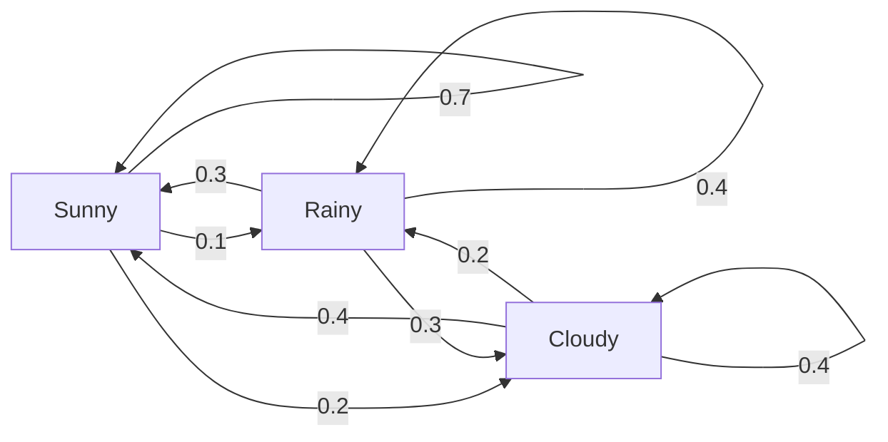
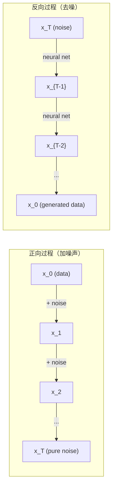

# 随机过程（Stochastic Processes）

> 有结构的随机性。随机游走、马尔可夫链和扩散模型背后的数学基础。

**类型：** 学习
**语言：** Python
**前置知识：** 阶段 1，第 06-07 课（概率、贝叶斯）
**时间：** ~75 分钟

## 学习目标（Learning Objectives）

- 模拟一维和二维随机游走，验证位移的 $\sqrt{n}$ 缩放规律
- 构建马尔可夫链模拟器，通过特征分解计算其平稳分布
- 实现 Metropolis-Hastings MCMC 和 Langevin 动力学以从目标分布中采样
- 将正向扩散过程与布朗运动联系起来，并解释反向过程如何生成数据

## 问题背景（The Problem）

许多 AI 系统涉及随时间演化的随机性。不是静态的随机性——而是有结构的、序列化的随机性，其中每一步都依赖于之前的内容。

语言模型逐个生成 token。每个 token 依赖于之前的上下文。模型输出一个概率分布，从中采样，然后继续。这就是一个随机过程。

扩散模型逐步向图像添加噪声，直到其变成纯静态。然后它们反转这个过程，逐步去噪直到新的图像出现。正向过程是一个马尔可夫链。反向过程是一个学习的、反向运行的马尔可夫链。

强化学习代理在环境中采取行动。每个行动以一定概率导致一个新的状态。代理在随机世界中遵循随机策略。整个就是一个马尔可夫决策过程。

MCMC 采样——贝叶斯推断的支柱——构建一个马尔可夫链，其平稳分布是你要采样的后验分布。

所有这些都建立在四个基础思想之上：
1. 随机游走——最简单的随机过程
2. 马尔可夫链——带有转移矩阵的结构化随机性
3. Langevin 动力学——带噪声的梯度下降
4. Metropolis-Hastings——从任意分布中采样

## 核心概念（The Concept）

### 随机游走（Random Walks）

从位置 0 开始。每一步，抛一枚公平硬币。正面：向右移动（+1）。反面：向左移动（-1）。

经过 $n$ 步后，你的位置是 $n$ 个随机 $\pm 1$ 值的和。期望位置是 0（游走是无偏的）。但离原点的期望距离以 $\sqrt{n}$ 增长。

这违反直觉。游走是公平的——任一方向都没有漂移。但随时间推移，它越走越远。$n$ 步后的标准差是 $\sqrt{n}$。

```
Step 0:  Position = 0
Step 1:  Position = +1 or -1
Step 2:  Position = +2, 0, or -2
...
Step 100: Expected distance from origin ~ 10 (sqrt(100))
Step 10000: Expected distance from origin ~ 100 (sqrt(10000))
```

**二维中**，游走以等概率向上、下、左、右移动。同样的 $\sqrt{n}$ 缩放适用于离原点的距离。路径勾勒出类似分形的图案。

**为什么是 $\sqrt{n}$？** 每一步是 +1 或 -1，概率相等。经过 $n$ 步后，位置 $S_n = X_1 + X_2 + \dots + X_n$，其中每个 $X_i$ 是 $\pm 1$。每一步的方差是 1，且步长独立，所以 $\text{Var}(S_n) = n$。标准差 $= \sqrt{n}$。由中心极限定理，$S_n / \sqrt{n}$ 收敛到标准正态分布。

这个 $\sqrt{n}$ 缩放规律在 ML 中随处可见。SGD 噪声与 $1/\sqrt{\text{batch\_size}}$ 成比例。嵌入维度与 $\sqrt{d}$ 成比例。平方根是独立随机加法的标志性特征。

**与布朗运动的联系。** 取步长为 $1/\sqrt{n}$、单位时间 $n$ 步的随机游走。当 $n$ 趋于无穷时，游走收敛到布朗运动 $B(t)$——一个连续时间过程，$B(t)$ 服从均值为 0、方差为 $t$ 的正态分布。

布朗运动是扩散的数学基础。它模拟了粒子在流体中的随机抖动、股票价格的波动以及——关键的是——扩散模型中的噪声过程。

**赌徒破产。** 一个从位置 $k$ 开始的随机游走者，在 0 和 $N$ 处有吸收壁。在到达 0 之前到达 $N$ 的概率是多少？对于公平游走：$P(\text{到达 } N) = k/N$。这个结果出奇地简单而优美。它与鞅的理论相联系——公平随机游走是一个鞅（期望未来值 = 当前值）。

### 马尔可夫链（Markov Chains）

马尔可夫链是一个系统，它按照固定的概率在状态之间转移。关键性质：下一个状态只依赖于当前状态，而不依赖于历史。

$$
P(X_{t+1} = j | X_t = i, X_{t-1} = \dots) = P(X_{t+1} = j | X_t = i)
$$

这就是马尔可夫性质。它意味着你可以用转移矩阵 $P$ 描述整个动力学：

$$
P[i][j] = \text{从状态 } i \text{ 到状态 } j \text{ 的概率}
$$

$P$ 的每一行和为 1（你总得去某个地方）。

**示例——天气：**

```
States: Sunny (0), Rainy (1), Cloudy (2)

P = [[0.7, 0.1, 0.2],    (if sunny: 70% sunny, 10% rainy, 20% cloudy)
     [0.3, 0.4, 0.3],    (if rainy: 30% sunny, 40% rainy, 30% cloudy)
     [0.4, 0.2, 0.4]]    (if cloudy: 40% sunny, 20% rainy, 40% cloudy)
```

从任意状态开始。经过多次转移后，状态的分布收敛到平稳分布 $\pi$，其中 $\pi \cdot P = \pi$。这是 $P$ 对应于特征值 1 的左特征向量。

对于天气链，平稳分布可能是 $[0.53, 0.18, 0.29]$——长期来看，无论起始状态如何，晴天占 53%。



**计算平稳分布。** 有两种方法：

1. **幂法（Power method）：** 将任意初始分布反复乘以 $P$。经过足够多次迭代后收敛。
2. **特征值法：** 找到 $P$ 对应于特征值 1 的左特征向量。即 $P^T$ 对应于特征值 1 的特征向量。

两种方法都需要链满足收敛条件。

**收敛条件。** 马尔可夫链收敛到唯一的平稳分布，如果它是：
- **不可约（Irreducible）：** 每个状态都可以从其他状态到达
- **非周期（Aperiodic）：** 链不以固定周期循环

你在 ML 中遇到的大多数链都满足这两个条件。

**吸收状态。** 一旦进入某个状态就永远不会离开的状态（$P[i][i] = 1$）。吸收马尔可夫链模拟具有终止状态的过程——结束的游戏、流失的客户、到达文本结束 token 的 token 序列。

**混合时间（Mixing time）。** 需要多少步链才"接近"平稳分布？形式化地说，步数使平稳化总变差距离降到某一阈值以下。快速混合 = 所需步数少。$P$ 的谱间隙（1 减去第二大特征值）控制混合时间。更大的间隙 = 更快的混合。

### 与语言模型的联系

语言模型中的 token 生成近似是一个马尔可夫过程。给定当前上下文，模型输出下一个 token 上的分布。温度控制锐利程度：

$$
P(\text{token}_i) = \frac{\exp(\text{logit}_i / T)}{\sum \exp(\text{logit}_j / T)}
$$

- 温度 $= 1.0$：标准分布
- 温度 $< 1.0$：更锐利（更确定性）
- 温度 $> 1.0$：更平坦（更随机）
- 温度 $\to 0$：argmax（贪心）

Top-k 采样截断到概率最高的 $k$ 个 token。Top-p（核）采样截断到累积概率超过 $p$ 的最小 token 集。两者都修改了马尔可夫转移概率。

### 布朗运动（Brownian Motion）

随机游走的连续时间极限。位置 $B(t)$ 有三个性质：
1. $B(0) = 0$
2. $B(t) - B(s)$ 服从均值为 0、方差为 $t - s$ 的正态分布（对于 $t > s$）
3. 不重叠区间上的增量是独立的

布朗运动是连续的但无处可微——它在所有尺度上抖动。路径在平面中有分形维度 2。

在离散模拟中，你近似布朗运动的方式：

$$
B(t + dt) = B(t) + \sqrt{dt} \cdot z, \quad \text{其中 } z \sim \mathcal{N}(0, 1)
$$

$\sqrt{dt}$ 的缩放很重要。它来自应用于随机游走的中心极限定理。

### Langevin 动力学

梯度下降找到函数的最小值。Langevin 动力学找到与 $\exp(-U(x)/T)$ 成正比的概率分布，其中 $U$ 是能量函数，$T$ 是温度。

$$
x_{t+1} = x_t - dt \cdot \nabla U(x_t) + \sqrt{2 \cdot T \cdot dt} \cdot z_t
$$

两个力作用于粒子：
1. **梯度力**（$-dt \cdot \nabla U$）：推向低能量（如梯度下降）
2. **随机力**（$\sqrt{2 \cdot T \cdot dt} \cdot z$）：推向随机方向（探索）

在温度 $T = 0$ 时，这是纯梯度下降。在高温下，它几乎是一个随机游走。在合适的温度下，粒子探索能量景观，在低能量区域花更多时间。

**与扩散模型的联系。** 扩散模型的正向过程是：

$$
x_t = \sqrt{\alpha_t} \cdot x_{t-1} + \sqrt{1 - \alpha_t} \cdot \text{noise}
$$

这是一个马尔可夫链，逐步将数据与噪声混合。经过足够多步后，$x_T$ 是纯高斯噪声。

反向过程——从噪声回到数据——也是一个马尔可夫链，但其转移概率由神经网络学习。网络学习预测每一步添加的噪声，然后将其减去。



### MCMC：马尔可夫链蒙特卡洛

有时你需要从分布 $p(x)$ 中采样——你能计算它（最多差一个常数）但不能直接从中采样。贝叶斯后验是典型例子——你知道似然乘以先验，但归一化常数不可处理。

**Metropolis-Hastings** 构建一个以 $p(x)$ 为平稳分布的马尔可夫链：

1. 从某个位置 $x$ 开始
2. 从提议分布 $Q(x'|x)$ 中提议新位置 $x'$
3. 计算接受比：$a = p(x') \cdot Q(x|x') / (p(x) \cdot Q(x'|x))$
4. 以概率 $\min(1, a)$ 接受 $x'$，否则保持在 $x$
5. 重复。

如果 $Q$ 是对称的（如 $Q(x'|x) = Q(x|x') = \mathcal{N}(x, \sigma^2)$），比率简化为 $a = p(x') / p(x)$。你只需要概率的比值——归一化常数相互抵消了。

该链在温和条件下保证收敛到 $p(x)$。但如果提议太小（随机游走）或太大（高拒绝率），收敛可能很慢。调节提议是 MCMC 的艺术。

**为什么有效。** 接受率确保了细致平衡（detailed balance）：处于 $x$ 并移动到 $x'$ 的概率等于处于 $x'$ 并移动到 $x$ 的概率。细致平衡意味着 $p(x)$ 是链的平稳分布。因此在足够多步后，样本来自 $p(x)$。

**实际考虑：**
- **Burn-in（预热）：** 丢弃前 $N$ 个样本。链需要时间从其起点到达平稳分布。
- **Thinning（稀疏化）：** 每 $k$ 个样本保留一个以减少自相关。
- **多链：** 从不同起点运行若干条链。如果它们收敛到相同分布，你就有了收敛的证据。
- **接受率：** 对于 $d$ 维的高斯提议，最优接受率约为 23%（Roberts & Rosenthal, 2001）。太高意味着链几乎不动。太低意味着链拒绝了一切。

### AI 中的随机过程

| 过程 | AI 应用 |
|---------|---------------|
| 随机游走 | RL 中的探索、Node2Vec 嵌入 |
| 马尔可夫链 | 文本生成、MCMC 采样 |
| 布朗运动 | 扩散模型（正向过程） |
| Langevin 动力学 | 基于分数的生成模型、SGLD |
| 马尔可夫决策过程 | 强化学习 |
| Metropolis-Hastings | 贝叶斯推断、后验采样 |

## 动手实现（Build It）

### 步骤 1：随机游走模拟器

```python
import numpy as np

# 一维随机游走：每步 +1 或 -1，位置为累积和
# 验证：n 步后，标准差 = sqrt(n)，与中心极限定理一致
def random_walk_1d(n_steps, seed=None):
    rng = np.random.RandomState(seed)
    steps = rng.choice([-1, 1], size=n_steps)
    positions = np.concatenate([[0], np.cumsum(steps)])
    return positions

# 二维随机游走：等概率上下左右，路径类似分形
def random_walk_2d(n_steps, seed=None):
    rng = np.random.RandomState(seed)
    directions = rng.choice(4, size=n_steps)
    dx = np.zeros(n_steps)
    dy = np.zeros(n_steps)
    dx[directions == 0] = 1   # right
    dx[directions == 1] = -1  # left
    dy[directions == 2] = 1   # up
    dy[directions == 3] = -1  # down
    x = np.concatenate([[0], np.cumsum(dx)])
    y = np.concatenate([[0], np.cumsum(dy)])
    return x, y
```

一维游走存储累积和。每步是 +1 或 -1。经过 $n$ 步后，位置是和。方差随 $n$ 线性增长，因此标准差以 $\sqrt{n}$ 增长。

### 步骤 2：马尔可夫链

```python
# 马尔可夫链类：由转移矩阵驱动，下一个状态仅取决于当前状态
# 支持模拟、平稳分布计算（通过特征分解）
class MarkovChain:
    def __init__(self, transition_matrix, state_names=None):
        self.P = np.array(transition_matrix, dtype=float)
        self.n_states = len(self.P)
        self.state_names = state_names or [str(i) for i in range(self.n_states)]

    # 一步转移：从 current_state 按概率采样下一个状态
    def step(self, current_state, rng=None):
        if rng is None:
            rng = np.random.RandomState()
        probs = self.P[current_state]
        return rng.choice(self.n_states, p=probs)

    # 模拟多步转移，返回状态序列
    def simulate(self, start_state, n_steps, seed=None):
        rng = np.random.RandomState(seed)
        states = [start_state]
        current = start_state
        for _ in range(n_steps):
            current = self.step(current, rng)
            states.append(current)
        return states

    # 计算平稳分布：求 P^T 对应于特征值 1 的特征向量
    # 平稳分布满足 pi * P = pi，即 P^T * pi = pi
    def stationary_distribution(self):
        eigenvalues, eigenvectors = np.linalg.eig(self.P.T)
        idx = np.argmin(np.abs(eigenvalues - 1.0))
        stationary = np.real(eigenvectors[:, idx])
        stationary = stationary / stationary.sum()
        return np.abs(stationary)
```

平稳分布是 $P$ 对应于特征值 1 的左特征向量。我们通过计算 $P^T$ 的特征向量来找到它（转置将左特征向量变为右特征向量）。

### 步骤 3：Langevin 动力学

```python
# Langevin 动力学：梯度下降 + 噪声的组合
# grad_U：能量函数的梯度，dt：步长，temperature：温度控制探索程度
# 梯度将 x 推向低能量区，噪声防止卡在局部极小点
# 平衡时，样本分布与 exp(-U(x)/temperature) 成正比
def langevin_dynamics(grad_U, x0, dt, temperature, n_steps, seed=None):
    rng = np.random.RandomState(seed)
    x = np.array(x0, dtype=float)
    trajectory = [x.copy()]
    for _ in range(n_steps):
        noise = rng.randn(*x.shape)
        x = x - dt * grad_U(x) + np.sqrt(2 * temperature * dt) * noise
        trajectory.append(x.copy())
    return np.array(trajectory)
```

### 步骤 4：Metropolis-Hastings

```python
# Metropolis-Hastings MCMC：构建以目标分布为平稳分布的马尔可夫链
# target_log_prob：目标分布的对数概率（不需要归一化常数）
# proposal_std：提议分布的标准差，影响混合速度
# 在高维中，最优接受率约为 23%
def metropolis_hastings(target_log_prob, proposal_std, x0, n_samples, seed=None):
    rng = np.random.RandomState(seed)
    x = np.array(x0, dtype=float)
    samples = [x.copy()]
    accepted = 0
    for _ in range(n_samples - 1):
        # 从对称高斯提议分布中提出新位置
        x_proposed = x + rng.randn(*x.shape) * proposal_std
        # 接受比：新位置概率 / 当前位置概率（对称提议下简化）
        log_ratio = target_log_prob(x_proposed) - target_log_prob(x)
        if np.log(rng.rand()) < log_ratio:
            x = x_proposed
            accepted += 1
        samples.append(x.copy())
    acceptance_rate = accepted / (n_samples - 1)
    return np.array(samples), acceptance_rate
```

该算法提出一个新点，检查它是否有更高的概率（或以与概率比成比例的概率接受），然后重复。接受率应在约 23-50% 以保持良好的混合。

## 实际应用（Use It）

实践中，你使用已建立的库实现这些算法。但理解机制对调试和调优至关重要。

```python
import numpy as np

rng = np.random.RandomState(42)
walk = np.cumsum(rng.choice([-1, 1], size=10000))
print(f"Final position: {walk[-1]}")
print(f"Expected distance: {np.sqrt(10000):.1f}")
print(f"Actual distance: {abs(walk[-1])}")
```

### numpy 用于转移矩阵

```python
import numpy as np

# 天气链的转移矩阵
P = np.array([[0.7, 0.1, 0.2],
              [0.3, 0.4, 0.3],
              [0.4, 0.2, 0.4]])

# 幂法：反复乘以 P，逐步逼近平稳分布
distribution = np.array([1.0, 0.0, 0.0])  # 从晴天开始
for _ in range(100):
    distribution = distribution @ P

print(f"Stationary distribution: {np.round(distribution, 4)}")
```

将初始分布反复乘以 $P$。经过足够多次迭代后，无论从哪里开始，它都会收敛到平稳分布。这就是幂法寻找主导左特征向量。

### 与实际框架的联系

- **PyTorch 扩散：** Hugging Face `diffusers` 中的 `DDPMScheduler` 实现了正向和反向马尔可夫链
- **NumPyro / PyMC：** 使用 MCMC（NUTS 采样器，改进了 Metropolis-Hastings）进行贝叶斯推断
- **Gymnasium（RL）：** 环境 step 函数定义了一个马尔可夫决策过程

### 验证马尔可夫链收敛

```python
import numpy as np

P = np.array([[0.9, 0.1], [0.3, 0.7]])

# 谱间隙 = 1 - 第二大特征值，控制混合速度
# 更大间隙 = 更快遗忘初始状态
eigenvalues = np.linalg.eigvals(P)
spectral_gap = 1 - sorted(np.abs(eigenvalues))[-2]
print(f"Eigenvalues: {eigenvalues}")
print(f"Spectral gap: {spectral_gap:.4f}")
print(f"Approximate mixing time: {1/spectral_gap:.1f} steps")
```

谱间隙告诉你链遗忘初始状态的速度。间隙为 0.2 意味着大约 5 步混合。间隙为 0.01 意味着大约 100 步。在运行长模拟前始终检查这个——混合缓慢的链会浪费计算资源。

## 交付物（Ship It）

本课产出：
- `outputs/prompt-stochastic-process-advisor.md`——帮助识别哪个随机过程框架适用于给定问题的提示

## 联系与扩展（Connections）

| 概念 | 出现位置 |
|---------|------------------|
| 随机游走 | Node2Vec 图嵌入、RL 中的探索 |
| 马尔可夫链 | LLM 中的 token 生成、MCMC 采样 |
| 布朗运动 | DDPM 中的正向扩散过程、基于 SDE 的模型 |
| Langevin 动力学 | 基于分数的生成模型、随机梯度 Langevin 动力学（SGLD） |
| 平稳分布 | MCMC 收敛目标、PageRank |
| Metropolis-Hastings | 贝叶斯后验采样、模拟退火 |
| 温度 | LLM 采样、RL 中的 Boltzmann 探索、模拟退火 |
| 混合时间 | MCMC 收敛速度、谱间隙分析 |
| 吸收状态 | 文本结束 token、RL 中的终止状态 |
| 细致平衡 | MCMC 采样器的正确性保证 |

扩散模型值得特别关注。DDPM（Ho et al., 2020）定义了一个正向马尔可夫链：

$$
q(x_t | x_{t-1}) = \mathcal{N}(x_t; \sqrt{1 - \beta_t} \cdot x_{t-1}, \beta_t \cdot I)
$$

其中 $\beta_t$ 是一个噪声调度。经过 $T$ 步后，$x_T$ 近似为 $\mathcal{N}(0, I)$。反向过程由一个预测噪声的神经网络参数化：

$$
p_\theta(x_{t-1} | x_t) = \mathcal{N}(x_{t-1}; \mu_\theta(x_t, t), \sigma_t^2 \cdot I)
$$

生成的每一步都是已学习马尔可夫链中的一步。理解马尔可夫链意味着理解扩散模型如何以及为什么生成数据。

SGLD（随机梯度 Langevin 动力学）结合了小批量梯度下降和 Langevin 噪声。它不使用完整梯度，而是使用随机估计并加入校准后的噪声。随着学习率衰减，SGLD 从优化过渡到采样——你免费得到了近似的贝叶斯后验样本。这是从神经网络获得不确定性估计的最简单方法之一。

所有这些联系的核心洞察：随机过程不仅仅是理论工具。它们是现代 AI 系统内部的计算机制。当你调节 LLM 的温度时，你正在调整一个马尔可夫链。当你训练扩散模型时，你正在学习逆转一个类似布朗运动的过程。当你运行贝叶斯推断时，你正在构建一个收敛到后验的链。

## 练习题（Exercises）

1. **模拟 1000 个 10000 步的随机游走。** 绘制最终位置的分布。验证其近似为均值为 0、标准差为 $\sqrt{10000} = 100$ 的高斯分布。

2. **使用马尔可夫链构建文本生成器。** 在小语料库上训练：对每个词，统计到下一个词的转移次数。构建转移矩阵。通过从链中采样生成新句子。

3. **使用 Metropolis-Hastings 实现模拟退火。** 从高温开始（几乎接受一切）并逐渐冷却（只接受改进）。用它找到具有许多局部极小值的函数的最小值。

4. **比较不同温度下的 Langevin 动力学。** 从双阱势垒 $U(x) = (x^2 - 1)^2$ 中采样。低温下，样本聚集在一个阱中。高温下，它们分布在两个阱中。找到链在两个阱之间混合的临界温度。

5. **实现正向扩散过程。** 从一个一维信号（如正弦波）开始。用线性噪声调度在 100 步内逐步添加噪声。展示信号如何退化为纯噪声。然后实现一个简单的去噪器来逆转这个过程（即使是只减去估计噪声的朴素版本）。

## 关键术语（Key Terms）

| 术语（English） | 通俗说法 | 实际含义 |
|------|----------------|----------------------|
| Random walk | "抛硬币式移动" | 每一步位置按随机增量变化的过程 |
| Markov property | "无记忆性" | 未来只取决于当前状态，而不取决于历史 |
| Transition matrix | "概率表" | $P[i][j] = $ 从状态 $i$ 移动到状态 $j$ 的概率 |
| Stationary distribution | "长期平均" | 满足 $\pi \cdot P = \pi$ 的分布 $\pi$——链的均衡态 |
| Brownian motion | "随机抖动" | 随机游走的连续时间极限，$B(t) \sim \mathcal{N}(0, t)$ |
| Langevin dynamics | "带噪声的梯度下降" | 结合确定性梯度和随机扰动的更新规则 |
| MCMC | "走向目标" | 构建平稳分布为目标分布的马尔可夫链 |
| Metropolis-Hastings | "提议后接受/拒绝" | 使用接受率确保收敛的 MCMC 算法 |
| Temperature | "随机性旋钮" | 控制探索与利用权衡的参数 |
| Diffusion process | "噪声进，噪声出" | 正向：逐步加噪声。反向：逐步去除。生成数据。 |

## 延伸阅读（Further Reading）

- **Ho, Jain, Abbeel（2020）**——"去噪扩散概率模型。"发起扩散模型革命的 DDPM 论文。正向和反向马尔可夫链的清晰推导。
- **Song & Ermon（2019）**——"通过估计数据分布的梯度进行生成建模。"使用 Langevin 动力学采样的基于分数的方法。
- **Roberts & Rosenthal（2004）**——"一般状态空间马尔可夫链和 MCMC 算法。"MCMC 何时以及为何有效的理论。
- **Norris（1997）**——"马尔可夫链。"标准教材。涵盖收敛、平稳分布和击中时间。
- **Welling & Teh（2011）**——"通过随机梯度 Langevin 动力学的贝叶斯学习。"将 SGD 与 Langevin 动力学结合以实现可扩展的贝叶斯推断。
