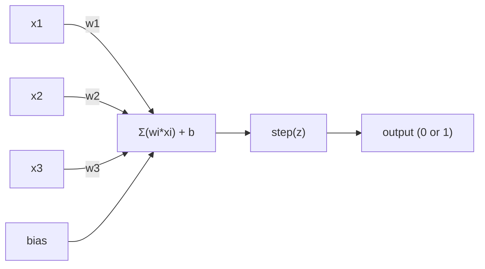
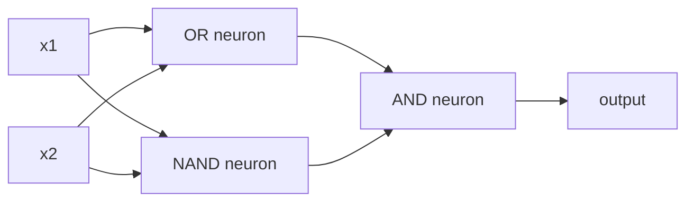

# 感知机（The Perceptron）

> 感知机是神经网络的原子。拆开它，你会发现权重、偏置和一个决策。

**类型：** 动手实践
**语言：** Python
**前置知识：** 阶段 1（线性代数直觉）
**预计时间：** ~60 分钟

## 学习目标（Learning Objectives）

- 用 Python 从头实现感知机，包括权重更新规则和阶跃激活函数
- 解释为什么单个感知机只能解决线性可分问题，并演示 XOR 失败案例
- 通过组合 OR、NAND 和 AND 门构建多层感知机来解决 XOR 问题
- 使用 Sigmoid 激活和反向传播训练一个两层网络，自动学习 XOR

## 问题（The Problem）

你已经知道了向量和点积。你知道矩阵将输入变换为输出。但机器究竟是如何*学习*使用哪种变换的呢？

感知机回答了这个问题。它是最简单的学习机器：接收一些输入，乘以权重，加上偏置，做出一个二值决策。然后调整。仅此而已。每一个曾经构建过的神经网络都是这个思想层层堆叠而成的。

理解感知机意味着理解"学习"在代码中到底意味着什么：调整数字直到输出与真实值匹配。

## 概念（The Concept）

### 一个神经元，一个决策

感知机接收 $n$ 个输入，每个乘以一个权重，求和，加上偏置，然后将结果通过激活函数。



阶跃函数（step function）是残酷的：如果加权和加上偏置 $\geq 0$，输出 1；否则输出 0。

$$
\text{step}(z) = \begin{cases} 
1 & \text{if } z \geq 0 \\
0 & \text{if } z < 0
\end{cases}
$$

这是一个线性分类器。权重和偏置定义了一条直线（或在更高维度中的超平面），将输入空间分割为两个区域。

### 决策边界（The Decision Boundary）

对于两个输入，感知机在二维空间中画出一条直线：

```
  x2
  ┤
  │  Class 1         /
  │    (0)          /
  │                /
  │               / w1·x1 + w2·x2 + b = 0
  │              /
  │             /     Class 2
  │            /        (1)
  ┼───────────/──────────── x1
```

直线一侧的所有内容输出 0。另一侧的所有内容输出 1。训练过程移动这条直线，直到它正确分离各个类别。

### 学习规则（The Learning Rule）

感知机学习规则很简单：

```
对于每个训练样本 (x, y_true)：
    y_pred = predict(x)
    error = y_true - y_pred

    对于每个权重：
        w_i = w_i + learning_rate * error * x_i
    	bias = bias + learning_rate * error
```

如果预测正确，误差为 0，什么都不变。如果预测为 0 但应该是 1，权重增加。如果预测为 1 但应该是 0，权重减小。学习率控制每次调整的幅度。

### XOR 问题（The XOR Problem）

问题就在这里。看看这些逻辑门：

```
AND 门：          OR 门：           XOR 门：
x1  x2  out       x1  x2  out      x1  x2  out
0   0   0         0   0   0        0   0   0
0   1   0         0   1   1        0   1   1
1   0   0         1   0   1        1   0   1
1   1   1         1   1   1        1   1   0
```

AND 和 OR 是线性可分的：你可以画一条直线来分离 0 和 1。XOR 则不是。没有一条直线能够将 $[0,1]$ 和 $[1,0]$ 与 $[0,0]$ 和 $[1,1]$ 分开。

```
AND（可分离）：        XOR（不可分离）：

  x2                      x2
  1 ┤  0     1            1 ┤  1     0
    │     /                 │
  0 ┤  0 / 0              0 ┤  0     1
    ┼───/──────── x1        ┼──────────── x1
       直线有效！            没有单条直线有效！
```

这是一个根本性局限。单个感知机只能解决线性可分问题。Minsky 和 Papert 在 1969 年证明了这一点，这几乎扼杀了神经网络研究长达十年之久。

解决办法：将感知机堆叠成层。多层感知机通过将两个线性决策组合成一个非线性决策来解决 XOR 问题。

## 动手构建（Build It）

### 第 1 步：感知机类（The Perceptron class）

```python
class Perceptron:
    def __init__(self, n_inputs, learning_rate=0.1):
        self.weights = [0.0] * n_inputs  # 初始化权重为 0
        self.bias = 0.0                   # 偏置初始为 0
        self.lr = learning_rate           # 学习率

    def predict(self, inputs):
        # 加权求和：w1*x1 + w2*x2 + ... + wn*xn
        total = sum(w * x for w, x in zip(self.weights, inputs))
        total += self.bias                # 加上偏置
        return 1 if total >= 0 else 0     # 阶跃函数：>=0 输出 1，否则 0

    def train(self, training_data, epochs=100):
        # 策略：对所有样本反复迭代，每次预测错误就调整权重
        # 直到所有样本都分类正确（收敛）或达到最大迭代次数
        for epoch in range(epochs):
            errors = 0
            for inputs, target in training_data:
                prediction = self.predict(inputs)
                error = target - prediction  # 误差：正数表示权重偏小，负数表示偏大
                if error != 0:
                    errors += 1
                    # 感知机学习规则：w_i += lr * error * x_i
                    # error 为正时增大权重，为负时减小权重
                    for i in range(len(self.weights)):
                        self.weights[i] += self.lr * error * inputs[i]
                    self.bias += self.lr * error  # 偏置同理（对应输入恒为 1）
            if errors == 0:
                print(f"第 {epoch + 1} 轮收敛")
                return
        print(f"经过 {epochs} 轮仍未收敛")
```

### 第 2 步：在逻辑门上训练

```python
and_data = [
    ([0, 0], 0),
    ([0, 1], 0),
    ([1, 0], 0),
    ([1, 1], 1),
]

or_data = [
    ([0, 0], 0),
    ([0, 1], 1),
    ([1, 0], 1),
    ([1, 1], 1),
]

not_data = [
    ([0], 1),
    ([1], 0),
]

print("=== AND 门 ===")
p_and = Perceptron(2)
p_and.train(and_data)
for inputs, _ in and_data:
    print(f"  {inputs} -> {p_and.predict(inputs)}")

print("\n=== OR 门 ===")
p_or = Perceptron(2)
p_or.train(or_data)
for inputs, _ in or_data:
    print(f"  {inputs} -> {p_or.predict(inputs)}")

print("\n=== NOT 门 ===")
p_not = Perceptron(1)
p_not.train(not_data)
for inputs, _ in not_data:
    print(f"  {inputs} -> {p_not.predict(inputs)}")
```

### 第 3 步：见证 XOR 的失败

```python
xor_data = [
    ([0, 0], 0),
    ([0, 1], 1),
    ([1, 0], 1),
    ([1, 1], 0),
]

print("\n=== XOR 门（单感知机）===")
p_xor = Perceptron(2)
p_xor.train(xor_data, epochs=1000)
for inputs, expected in xor_data:
    result = p_xor.predict(inputs)
    status = "✓" if result == expected else "✗"
    print(f"  {inputs} -> {result}（期望 {expected}）{status}")
```

它永远不会收敛。这就是单个感知机无法学习 XOR 的铁证。

### 第 4 步：用两层网络解决 XOR

技巧：XOR = (x1 OR x2) AND NOT (x1 AND x2)。组合三个感知机：



```python
def xor_network(x1, x2):
    # 策略：将 XOR 分解为 OR、NAND 和 AND 的组合
    # 第一层：OR 神经元和 NAND 神经元并行计算
    # 第二层：AND 神经元组合第一层的输出
    or_neuron = Perceptron(2)
    or_neuron.weights = [1.0, 1.0]   # 任一个输入为 1 时，总和 >= 0.5
    or_neuron.bias = -0.5

    nand_neuron = Perceptron(2)
    nand_neuron.weights = [-1.0, -1.0]  # 两个输入都为 1 时，总和 < 0
    nand_neuron.bias = 1.5

    and_neuron = Perceptron(2)
    and_neuron.weights = [1.0, 1.0]   # 两个输入都为 1 时输出 1
    and_neuron.bias = -1.5

    # 前向传播：先计算第一层，再将结果传给第二层
    hidden1 = or_neuron.predict([x1, x2])
    hidden2 = nand_neuron.predict([x1, x2])
    output = and_neuron.predict([hidden1, hidden2])
    return output


print("\n=== XOR 门（多层网络）===")
for inputs, expected in xor_data:
    result = xor_network(inputs[0], inputs[1])
    print(f"  {inputs} -> {result}（期望 {expected}）")
```

全部四种情况都正确。将感知机堆叠成层，就产生了单个感知机无法实现的决策边界。

### 第 5 步：训练一个两层网络

第 4 步手动设置了权重。这对 XOR 有效，但对于你不知道正确权重的真实问题则不行。解决办法：用 Sigmoid 替换阶跃函数，通过反向传播自动学习权重。

```python
class TwoLayerNetwork:
    def __init__(self, learning_rate=0.5):
        import random
        random.seed(0)  # 固定种子，确保结果可重复
        # 策略：使用随机初始化打破对称性，让隐藏层神经元学习不同的特征
        # 如果所有权重初始化为相同值，所有隐藏单元将学到相同的东西
        self.w_hidden = [[random.uniform(-1, 1), random.uniform(-1, 1)] for _ in range(2)]
        self.b_hidden = [random.uniform(-1, 1), random.uniform(-1, 1)]
        self.w_output = [random.uniform(-1, 1), random.uniform(-1, 1)]
        self.b_output = random.uniform(-1, 1)
        self.lr = learning_rate

    def sigmoid(self, x):
        # Sigmoid 函数：将任意实数压缩到 (0, 1) 区间
        # 与阶跃函数不同，它是光滑的，可求导——这是反向传播的前提
        import math
        x = max(-500, min(500, x))  # 防止 exp(-x) 溢出
        return 1.0 / (1.0 + math.exp(-x))

    def forward(self, inputs):
        # 前向传播：逐层计算，并保存中间值供反向传播使用
        self.inputs = inputs
        self.hidden_outputs = []
        for i in range(2):
            z = sum(w * x for w, x in zip(self.w_hidden[i], inputs)) + self.b_hidden[i]
            self.hidden_outputs.append(self.sigmoid(z))
        z_out = sum(w * h for w, h in zip(self.w_output, self.hidden_outputs)) + self.b_output
        self.output = self.sigmoid(z_out)
        return self.output

    def train(self, training_data, epochs=10000):
        # 策略：使用反向传播（BP 算法）自动调整所有参数
        # 关键思想：计算每个参数对最终误差的"贡献"，按比例调整
        for epoch in range(epochs):
            total_error = 0
            for inputs, target in training_data:
                output = self.forward(inputs)
                error = target - output
                total_error += error ** 2  # 均方误差，用于监控训练进度

                # 输出层的误差梯度：sigmoid 的导数 output * (1 - output)
                # 为什么：链式法则，d(error)/d(w) = d(error)/d(output) * d(output)/d(z) * d(z)/d(w)
                d_output = error * output * (1 - output)

                # 反向传播到隐藏层：将输出层的误差按权重分配回每个隐藏神经元
                saved_w_output = self.w_output[:]
                hidden_deltas = []
                for i in range(2):
                    h = self.hidden_outputs[i]
                    # 隐藏层梯度 = 输出层梯度 * 连接权重 * sigmoid 导数
                    # 为什么：隐藏层通过 output_weight 影响输出，所以误差按权重比例"回传"
                    hd = d_output * saved_w_output[i] * h * (1 - h)
                    hidden_deltas.append(hd)

                # 更新输出层权重：梯度下降法
                # Δw = lr * d_output * hidden_output
                for i in range(2):
                    self.w_output[i] += self.lr * d_output * self.hidden_outputs[i]
                self.b_output += self.lr * d_output

                # 更新隐藏层权重：同样使用梯度下降
                for i in range(2):
                    for j in range(len(inputs)):
                        self.w_hidden[i][j] += self.lr * hidden_deltas[i] * inputs[j]
                    self.b_hidden[i] += self.lr * hidden_deltas[i]
```

```python
net = TwoLayerNetwork(learning_rate=2.0)
net.train(xor_data, epochs=10000)
for inputs, expected in xor_data:
    result = net.forward(inputs)
    predicted = 1 if result >= 0.5 else 0
    print(f"  {inputs} -> {result:.4f}（取整：{predicted}，期望 {expected}）")
```

与第 4 步有两个关键区别。第一，Sigmoid 替换了阶跃函数——它是光滑的，所以存在梯度。第二，`train` 方法将误差从输出层反向传播到隐藏层，根据每个权重对误差的贡献比例进行调整。这就是 20 行代码的反向传播。

这是通往第 03 课的桥梁。`d_output` 和 `hidden_deltas` 背后的数学原理是链式法则在网络图上的应用。我们将在那里进行严格推导。

## 使用它（Use It）

你刚刚从头构建的一切，只需一次导入即可使用：

```python
from sklearn.linear_model import Perceptron as SkPerceptron
import numpy as np

X = np.array([[0,0],[0,1],[1,0],[1,1]])
y = np.array([0, 0, 0, 1])

clf = SkPerceptron(max_iter=100, tol=1e-3)
clf.fit(X, y)
print([clf.predict([x])[0] for x in X])
```

五行代码。你的 30 行 `Perceptron` 类做的事情完全一样。scikit-learn 版本增加了收敛检查、多种损失函数和稀疏输入支持——但核心循环完全相同：加权求和、阶跃函数、误差触发权重更新。

真正的差距体现在大规模应用中。生产网络的变化：

- 阶跃函数变成了 Sigmoid、ReLU 或其他光滑激活函数
- 权重通过反向传播自动学习（第 03 课）
- 层数更深：3 层、10 层、100 层以上
- 核心原理不变：每一层从前一层的输出中创造新的特征

单个感知机只能画直线。把它们堆叠起来，你可以画出任何形状。

## 产出（Ship It）

本课产出：
- `outputs/skill-perceptron.md` —— 一个 skill，涵盖何时需要单层 vs 多层架构

## 练习（Exercises）

1. 在 NAND 门上训练一个感知机（NAND 是通用门——任何逻辑电路都可以由 NAND 构建）。验证其权重和偏置构成一个有效的决策边界。
2. 修改 Perceptron 类，在每一轮训练中追踪决策边界（$w_1x_1 + w_2x_2 + b = 0$）。打印在 AND 门训练过程中直线的移动情况。
3. 构建一个 3 输入感知机，当至少 2 个输入为 1 时输出 1（多数投票函数）。这是线性可分的吗？为什么？

## 关键术语（Key Terms）

| 术语 | 大家怎么说 | 实际含义 |
|------|-----------|---------|
| 感知机（Perceptron） | "一个假的神经元" | 一个线性分类器：输入和权重的点积，加上偏置，通过阶跃函数 |
| 权重（Weight） | "输入有多重要" | 一个乘数，缩放每个输入对决策的贡献 |
| 偏置（Bias） | "阈值" | 一个常数，平移决策边界，使感知机在零输入时也能激活 |
| 激活函数（Activation function） | "挤压数值的东西" | 加权和之后应用的函数——感知机用阶跃函数，现代网络用 Sigmoid/ReLU |
| 线性可分（Linearly separable） | "你可以在它们之间画一条线" | 一个数据集，其中单个超平面可以完美分离各个类别 |
| XOR 问题（XOR problem） | "感知机做不到的事" | 证明单层网络无法学习非线性可分函数 |
| 决策边界（Decision boundary） | "分类器切换的地方" | 超平面 $w \cdot x + b = 0$，将输入空间划分为两个类别 |
| 多层感知机（Multi-layer perceptron） | "一个真正的神经网络" | 感知机按层堆叠，每一层的输出作为下一层的输入 |

## 延伸阅读（Further Reading）

- Frank Rosenblatt, "The Perceptron: A Probabilistic Model for Information Storage and Organization in the Brain" (1958) —— 开启一切的原始论文
- Minsky & Papert, "Perceptrons" (1969) —— 证明了单层网络无法解决 XOR 并扼杀了感知机研究十年的著作
- Michael Nielsen, "Neural Networks and Deep Learning", 第 1 章 (http://neuralnetworksanddeeplearning.com/) —— 免费在线资源，关于感知机如何组合成网络的最佳可视化解释
