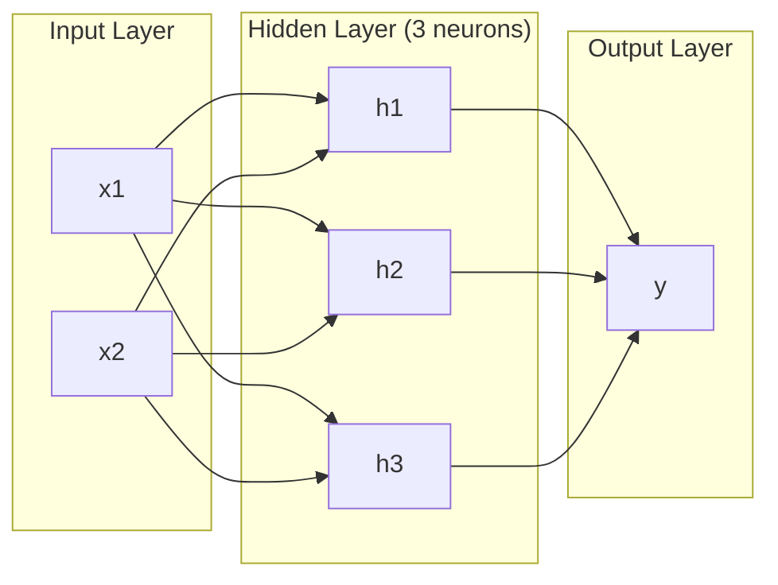
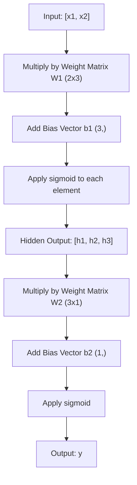
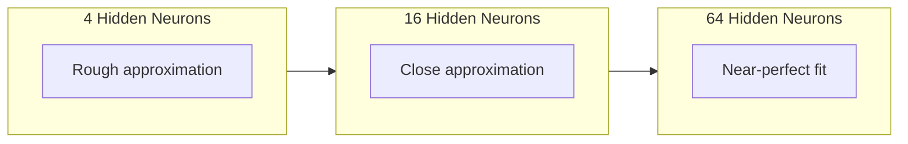

# 多层网络与前向传播（Forward Pass）

> 一个神经元画一条线。把它们堆叠起来，就能画出任何形状。

**类型：** 构建
**语言：** Python
**前置要求：** 阶段 01（数学基础），课程 03.01（感知机（Perceptron））
**时间：** 约 90 分钟

## 学习目标

- 从零构建多层网络，实现 Layer 和 Network 类，完成完整的前向传播
- 追踪网络中每层的矩阵维度（Dimension），识别形状不匹配问题
- 解释堆叠非线性激活函数如何使网络学会曲线决策边界
- 使用手工调参的 Sigmoid 权重，以 2-2-1 架构解决 XOR 问题

## 问题

单个神经元就是一个画线工具。仅此而已。一条穿过数据的直线。而人工智能中每一个真实问题——图像识别、语言理解、下围棋——都需要曲线。将神经元堆叠成层，就是你获得曲线的方式。

1969 年，Minsky 和 Papert 证明了这个限制是致命的：单层网络无法学习 XOR。不是"难以学习"——是数学上不可能。XOR 真值表将 $[0,1]$ 和 $[1,0]$ 放在一边，将 $[0,0]$ 和 $[1,1]$ 放在另一边。没有一条直线能将它们分开。

这扼杀了神经网络（Neural Network）研究资金超过十年。解决方案事后看来显而易见：不要只用一层。将神经元堆叠成层。让第一层将输入空间雕刻成新的特征，让第二层将这些特征组合成单条直线无法做出的决策。

这个堆叠结构就是多层网络。它是当今生产中每一个深度学习（Deep Learning）模型的基础。前向传播——数据从输入流经隐藏层到达输出——是你在做任何其他事情之前需要首先构建的东西。

## 概念

### 层：输入层、隐藏层、输出层

多层网络有三种类型的层：

**输入层**——其实不算真正的层。它持有你的原始数据。两个特征意味着两个输入节点。这里不进行任何计算。

**隐藏层**——真正干活的地方。每个神经元接收上一层的每一个输出，施加权重（Weight）和偏置（Bias），然后将结果通过激活函数（Activation Function）。"隐藏"是因为你在训练（Training）数据中永远不会直接看到这些值。

**输出层**——最终答案。对于二分类，一个带 Sigmoid 的神经元。对于多分类，每个类别一个神经元。



这是一个 2-3-1 网络。两个输入，三个隐藏神经元，一个输出。每条连接携带一个权重。每个神经元（输入层除外）携带一个偏置。

每一层产生一个数字向量（Vector），称为隐藏状态。对于文本，隐藏状态增加维度——将一个词编码为 768 个数字以捕获语义含义。对于图像，它们降低维度——将数百万像素压缩为可管理的表示。隐藏状态是学习发生的地方。

### 神经元与激活函数

每个神经元做三件事：

1. 将每个输入乘以其对应的权重
2. 将所有乘积求和并加上偏置
3. 将和通过激活函数

目前，激活函数使用 Sigmoid：

$$
\text{sigmoid}(z) = \frac{1}{1 + e^{-z}}
$$

Sigmoid 将任意数字压缩到 $(0, 1)$ 范围内。大的正输入推向 1。大的负输入推向 0。零映射到 0.5。这条平滑曲线使学习成为可能——与感知机的硬阶跃不同，Sigmoid 处处有梯度（Gradient）。

### 前向传播：数据如何流动

前向传播将输入数据逐层推过网络，直到到达输出。前向传播期间不发生学习。这是纯粹的计算：乘、加、激活、重复。



在每一层，三个操作按顺序发生：

$$
\begin{aligned}
z &= W \cdot \text{input} + b \\[6pt]
a &= \text{sigmoid}(z)
\end{aligned}
$$

一层的输出成为下一层的输入。这就是整个前向传播。

### 矩阵维度

追踪维度是深度学习中最重要的调试技能。以下是 2-3-1 网络：

| 步骤 | 操作 | 维度 | 结果形状 |
|------|-----------|------------|-------------|
| 输入 | $x$ | -- | $(2,)$ |
| 隐藏层线性变换 | $W_1 \cdot x + b_1$ | $W_1$: $(3, 2)$, $b_1$: $(3,)$ | $(3,)$ |
| 隐藏层激活 | $\text{sigmoid}(z_1)$ | -- | $(3,)$ |
| 输出层线性变换 | $W_2 \cdot h + b_2$ | $W_2$: $(1, 3)$, $b_2$: $(1,)$ | $(1,)$ |
| 输出层激活 | $\text{sigmoid}(z_2)$ | -- | $(1,)$ |

规则：第 $k$ 层的权重矩阵 $W$ 的形状为（第 $k$ 层神经元数, 第 $k-1$ 层神经元数）。行对应当前层，列对应前一层。如果形状对不上，你就有 bug。

**具体计算实例**：以输入 $x = [0.5, 0.8]$ 为例，追踪每一步的形状变化。

**隐藏层线性变换**：$W_1$ 形状为 $(3, 2)$，$x$ 形状为 $(2,)$，$W_1 \cdot x$ 即 $(3, 2) \times (2,) \to (3,)$。

$$
\underbrace{\begin{bmatrix}
w_{11} & w_{12} \\
w_{21} & w_{22} \\
w_{31} & w_{32}
\end{bmatrix}}_{W_1\ (3 \times 2)}
\cdot
\underbrace{\begin{bmatrix} 0.5 \\ 0.8 \end{bmatrix}}_{x\ (2 \times 1)}
=
\underbrace{\begin{bmatrix}
w_{11} \cdot 0.5 + w_{12} \cdot 0.8 \\
w_{21} \cdot 0.5 + w_{22} \cdot 0.8 \\
w_{31} \cdot 0.5 + w_{32} \cdot 0.8
\end{bmatrix}}_{z_1\ (3 \times 1)}
$$

加上偏置 $b_1 = [b_{11}, b_{12}, b_{13}]$（形状 $(3,)$）后，$z_1$ 形状仍为 $(3,)$。然后逐元素应用 Sigmoid，得到隐藏层输出 $h = [h_1, h_2, h_3]$，形状 $(3,)$。

**输出层线性变换**：$W_2$ 形状为 $(1, 3)$，$h$ 形状为 $(3,)$，$W_2 \cdot h$ 即 $(1, 3) \times (3,) \to (1,)$。

$$
\underbrace{\begin{bmatrix}
w'_{11} & w'_{12} & w'_{13}
\end{bmatrix}}_{W_2\ (1 \times 3)}
\cdot
\underbrace{\begin{bmatrix} h_1 \\ h_2 \\ h_3 \end{bmatrix}}_{h\ (3 \times 1)}
=
\underbrace{\begin{bmatrix}
w'_{11} \cdot h_1 + w'_{12} \cdot h_2 + w'_{13} \cdot h_3
\end{bmatrix}}_{z_2\ (1 \times 1)}
$$

加上偏置 $b_2$（形状 $(1,)$），再通过 Sigmoid，得到最终输出 $y$，形状 $(1,)$。

**维度匹配口诀**：矩阵乘法 $(m \times n) \cdot (n \times p) \to (m \times p)$。相邻维度 $n$ 必须相等，否则无法相乘。在神经网络中，$n$ 是前一层神经元数，$p$ 对向量而言是 $1$（单样本），对批次而言是 `batch_size`。

### 通用近似定理（Universal Approximation Theorem）

1989 年，George Cybenko 证明了一件了不起的事：具有单个隐藏层和足够多神经元的神经网络可以以任意所需精度逼近任何连续函数。

这并不意味着一个隐藏层总是最好的。它意味着这个架构在理论上是可行的。在实践中，更深的网络（更多层，每层更少神经元）比浅而宽的网络用少得多的总参数学习相同的函数。这就是深度学习奏效的原因。

直觉：隐藏层中的每个神经元学习一个"凸起"或特征。足够多的凸起放在正确的位置可以逼近任何光滑曲线。更多神经元，更多凸起，更好的逼近。



### 可组合性

神经网络是可组合的。你可以堆叠它们、串联它们、并行运行它们。Whisper 模型使用一个编码器网络处理音频，使用一个单独的解码器网络生成文本。现代大语言模型（LLM）是仅解码器架构。BERT 是仅编码器架构。T5 是编码器-解码器架构。架构选择决定了模型能做什么。

## 构建它

纯 Python。不用 NumPy。每个矩阵运算都从零编写。

### 步骤 1：Sigmoid 激活函数

```python
import math

def sigmoid(x):
    # 将 x 钳制在 [-500, 500] 范围内，防止 math.exp 溢出
    # math.exp(500) 很大但有限，math.exp(1000) 是无穷大
    x = max(-500.0, min(500.0, x))
    return 1.0 / (1.0 + math.exp(-x))
```

钳制到 $[-500, 500]$ 防止溢出。`math.exp(500)` 很大但有限。`math.exp(1000)` 是无穷大。

### 步骤 2：Layer 类

整个深度学习中最重要的操作是矩阵乘法（Matrix Multiplication）。每一层、每一个注意力头、每一次前向传播——从头到尾都是矩阵乘法。线性层接收输入向量，乘以权重矩阵，加上偏置向量：$y = Wx + b$。这一个方程占了神经网络中 90% 的计算量。

层持有权重矩阵和偏置向量。它的 forward 方法接收输入向量并返回激活后的输出。

```python
class Layer:
    def __init__(self, n_inputs, n_neurons, weights=None, biases=None):
        if weights is not None:
            self.weights = weights
        else:
            import random
            # 权重矩阵形状: (n_neurons, n_inputs)
            # 每行是一个神经元在所有输入上的权重
            # 随机初始化为 [-1, 1] 范围内的均匀分布
            self.weights = [
                [random.uniform(-1, 1) for _ in range(n_inputs)]
                for _ in range(n_neurons)
            ]
        if biases is not None:
            self.biases = biases
        else:
            # 偏置初始化为零
            self.biases = [0.0] * n_neurons

    def forward(self, inputs):
        # 保存输入和输出，供后续反向传播使用
        self.last_input = inputs
        self.last_output = []
        for neuron_idx in range(len(self.weights)):
            # 计算加权和: z = w1*x1 + w2*x2 + ... + bias
            z = sum(
                w * x for w, x in zip(self.weights[neuron_idx], inputs)
            )
            z += self.biases[neuron_idx]
            # 通过 sigmoid 激活函数，将结果压缩到 (0, 1)
            self.last_output.append(sigmoid(z))
        return self.last_output
```

权重矩阵的形状为 `(n_neurons, n_inputs)`。每行是一个神经元在所有输入上的权重。forward 方法遍历神经元，计算加权和加偏置，应用 Sigmoid，并收集结果。

### 步骤 3：Network 类

网络就是层的列表。前向传播将它们串联起来：第 $k$ 层的输出馈入第 $k+1$ 层。

```python
class Network:
    def __init__(self, layers):
        self.layers = layers

    def forward(self, inputs):
        # 数据逐层流动：每层的输出成为下一层的输入
        current = inputs
        for layer in self.layers:
            current = layer.forward(current)
        return current
```

这就是整个前向传播。四行逻辑。数据进去，流经每一层，从另一端出来。

### 步骤 4：手工调参权重解 XOR

在课程 01 中，我们通过组合 OR、NAND 和 AND 感知机解决了 XOR。现在用我们的 Layer 和 Network 类做同样的事。2-2-1 架构：两个输入，两个隐藏神经元，一个输出。

```python
# 隐藏层：第一个神经元近似 OR，第二个近似 NAND
# 大权重（20, -20）使 sigmoid 的行为接近阶跃函数
hidden = Layer(
    n_inputs=2,
    n_neurons=2,
    weights=[[20.0, 20.0], [-20.0, -20.0]],
    biases=[-10.0, 30.0],
)

# 输出层：将两个隐藏神经元的输出组合成 AND，实现 XOR
output = Layer(
    n_inputs=2,
    n_neurons=1,
    weights=[[20.0, 20.0]],
    biases=[-30.0],
)

xor_net = Network([hidden, output])

# XOR 真值表：(0,0)->0, (0,1)->1, (1,0)->1, (1,1)->0
xor_data = [
    ([0, 0], 0),
    ([0, 1], 1),
    ([1, 0], 1),
    ([1, 1], 0),
]

for inputs, expected in xor_data:
    result = xor_net.forward(inputs)
    # 以 0.5 为阈值：>=0.5 判为 1，<0.5 判为 0
    predicted = 1 if result[0] >= 0.5 else 0
    print(f"  {inputs} -> {result[0]:.6f} (rounded: {predicted}, expected: {expected})")
```

大权重（20, -20）使 Sigmoid 的行为接近阶跃函数。第一个隐藏神经元近似 OR。第二个近似 NAND。输出神经元将它们组合成 AND，即 XOR。

### 步骤 5：圆形分类

一个更难的问题：将 2D 点分类为是否在以原点为中心、半径为 0.5 的圆内。这需要曲线决策边界——单个感知机不可能做到。

```python
import random
import math

random.seed(42)

# 生成 200 个随机点，均匀分布在 [-1, 1] × [-1, 1] 正方形内
# 标签：点在半径为 0.5 的圆内为 1，否则为 0
data = []
for _ in range(200):
    x = random.uniform(-1, 1)
    y = random.uniform(-1, 1)
    label = 1 if (x * x + y * y) < 0.25 else 0
    data.append(([x, y], label))

# 2-8-1 架构：8 个隐藏神经元提供足够的"凸起"来近似圆形边界
circle_net = Network([
    Layer(n_inputs=2, n_neurons=8),
    Layer(n_inputs=8, n_neurons=1),
])
```

使用随机权重，网络无法很好地分类。但前向传播仍然能运行。这就是关键——前向传播只是计算。学习正确的权重是反向传播（Backpropagation）的工作，将在课程 03 中介绍。

```python
correct = 0
for inputs, expected in data:
    result = circle_net.forward(inputs)
    predicted = 1 if result[0] >= 0.5 else 0
    if predicted == expected:
        correct += 1

# 随机权重的准确率通常不如猜多数类
print(f"Accuracy with random weights: {correct}/{len(data)} ({100*correct/len(data):.1f}%)")
```

随机权重的准确率很差——通常比猜多数类还差。经过训练（课程 03）后，同样的 8 隐藏神经元架构将画出一条曲线边界，将内部与外部分开。

## 使用它

PyTorch 用四行代码完成上述所有工作：

```python
import torch
import torch.nn as nn

# nn.Linear(2, 8) 等价于我们的 Layer 类：权重矩阵形状 (8, 2)，偏置向量形状 (8,)
# nn.Sigmoid() 等价于我们的 sigmoid 函数，逐元素应用
# nn.Sequential 等价于我们的 Network 类：按顺序串联各层
model = nn.Sequential(
    nn.Linear(2, 8),
    nn.Sigmoid(),
    nn.Linear(8, 1),
    nn.Sigmoid(),
)

# PyTorch 原生支持批次（Batch）处理——一次前向传播处理多个样本
x = torch.tensor([[0.0, 0.0], [0.0, 1.0], [1.0, 0.0], [1.0, 1.0]])
output = model(x)
print(output)
```

`nn.Linear(2, 8)` 就是你的 Layer 类：权重矩阵形状为 `(8, 2)`，偏置向量形状为 `(8,)`。`nn.Sigmoid()` 就是你的 Sigmoid 函数，逐元素应用。`nn.Sequential` 就是你的 Network 类：按顺序串联各层。

区别在于速度和规模。PyTorch 在 GPU 上运行，处理数百万样本的批次（Batch），并自动计算反向传播的梯度。但前向传播的逻辑与你刚从头构建的完全相同。

## 交付物

本课程产出一个可复用的提示词，用于设计网络架构：

- `outputs/prompt-network-architect.md`

当你需要决定一个问题用多少层、每层多少神经元、以及使用哪些激活函数时使用它。

## 练习

1. 构建一个 2-4-2-1 网络（两个隐藏层），在 XOR 数据上用随机权重运行前向传播。打印中间隐藏层的输出，观察表示如何在每一层变换。

2. 将圆形分类器的隐藏层大小从 8 改为 2，再改为 32。每次用随机权重运行前向传播。隐藏神经元的数量是否改变了输出范围或分布？为什么？

3. 在 Network 类上实现 `count_parameters` 方法，返回可训练权重和偏置的总数。在 784-256-128-10 网络（经典 MNIST 架构）上测试。它有多少参数？

4. 为 3-4-4-2 网络构建前向传播。输入 RGB 颜色值（归一化到 0-1），观察两个输出。这是简单二分类颜色分类器的架构。

5. 将 Sigmoid 替换为"泄漏阶跃"函数：如果 $z < 0$ 则返回 $0.01 \cdot z$，否则返回 $1.0$。用步骤 4 中相同的手工调参权重在 XOR 上运行前向传播。它还能工作吗？为什么平滑的 Sigmoid 优于硬截断？

## 关键术语

| 术语 | 人们怎么说 | 实际含义 |
|------|----------------|----------------------|
| Forward pass | "运行模型" | 将输入推过每一层——乘以权重、加偏置、激活——以产生输出 |
| Hidden layer | "中间部分" | 输入和输出之间的任何层，其值不在数据中直接观察 |
| Multi-layer network | "深度神经网络" | 神经元层顺序堆叠，每层的输出馈入下一层的输入 |
| Activation function | "非线性部分" | 在线性变换后应用的函数，为决策边界引入曲线 |
| Sigmoid | "S 曲线" | $\sigma(z) = \frac{1}{1+e^{-z}}$，将任意实数压缩到 $(0,1)$，处处光滑可微 |
| Weight matrix | "参数" | 形状为（当前层神经元数, 前一层神经元数）的矩阵 $W$，包含可学习的连接强度 |
| Bias vector | "偏移量" | 在矩阵乘法后加上的向量，使神经元在所有输入为零时也能激活 |
| Universal approximation | "神经网络可以学习任何东西" | 具有足够多神经元的单个隐藏层可以逼近任何连续函数——但"足够多"可能意味着数十亿 |
| Linear transformation | "矩阵乘法步骤" | $z = W \cdot x + b$，激活之前的计算，将输入映射到新空间 |
| Decision boundary | "分类器切换的地方" | 输入空间中网络输出越过分类阈值的曲面 |

## 扩展阅读

- Michael Nielsen, "Neural Networks and Deep Learning", 第 1-2 章 (http://neuralnetworksanddeeplearning.com/) —— 关于前向传播和网络结构的最清晰的免费解释，配有交互式可视化
- Cybenko, "Approximation by Superpositions of a Sigmoidal Function" (1989) —— 原始通用近似定理论文，出人意料地可读
- 3Blue1Brown, "But what is a neural network?" (https://www.youtube.com/watch?v=aircAruvnKk) —— 20 分钟关于层、权重和前向传播的可视化讲解，建立正确的思维模型
- Goodfellow, Bengio, Courville, "Deep Learning", 第 6 章 (https://www.deeplearningbook.org/) —— 多层网络的标准参考书，免费在线获取
