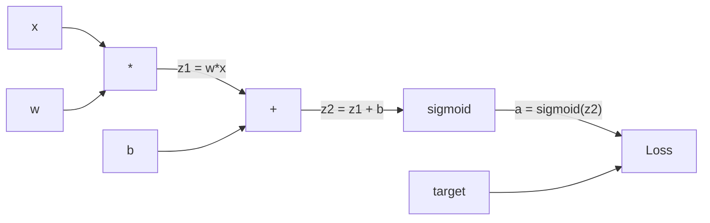
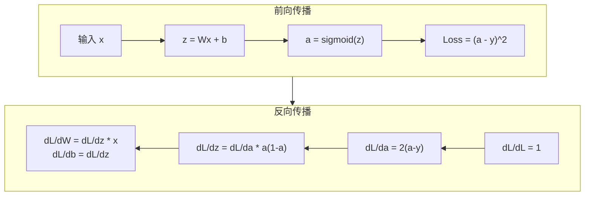
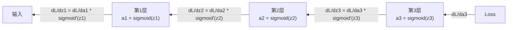

# 从零实现反向传播（Backpropagation）

> 反向传播（Backpropagation）是让学习成为可能的算法。没有它，神经网络只是昂贵的随机数生成器。

**类型：** 构建实践
**语言：** Python
**前置课程：** 第 03.02 课（多层网络）
**时间：** 约 120 分钟

## 学习目标

- 实现一个基于 Value 的自动微分引擎（Autograd Engine），通过拓扑排序构建计算图并计算梯度
- 使用链式法则（Chain Rule）推导加法、乘法和 Sigmoid 的反向传播过程
- 仅使用从零实现的反向传播引擎，在 XOR 和圆形分类问题上训练多层网络
- 识别深层 Sigmoid 网络中的梯度消失（Vanishing Gradient）问题，并解释梯度为何呈指数级衰减

## 问题

你的网络有一个隐藏层，包含 768 个输入和 3072 个输出。那就是 2,359,296 个权重。它做出了一个错误的预测。是哪些权重导致了误差？单独测试每个权重意味着 230 万次前向传播。反向传播在单次反向传递中计算出全部 230 万个梯度。这不是优化——这是可训练与不可训练之间的分水岭。

朴素方法：取一个权重，微调一个极小量，再次运行前向传播，测量损失是增加还是减少。这样你就得到了该权重的梯度。然后对网络中的每个权重重复这个过程。再乘以数千个训练步数和数百万个数据点。你需要地质时间尺度才能训练出任何有用的东西。

反向传播解决了这个问题。一次前向传播，一次反向传播，所有梯度全部计算完毕。诀窍在于来自微积分的链式法则，系统性地应用于计算图。这就是让深度学习变得实用的算法。没有它，我们至今仍被困在玩具问题上。

## 概念

### 链式法则在网络中的应用

快速回顾：如果 $y = f(g(x))$，那么 $\frac{dy}{dx} = f'(g(x)) \cdot g'(x)$。你需要沿着链条将导数相乘。

在神经网络中，"链条"是从输入到损失的操作序列。每一层先施加权重，加上偏置，然后通过激活函数。损失函数将最终输出与目标值进行比较。反向传播沿着这条链条逆向追溯，计算每个操作对误差的贡献。

### 计算图（Computational Graph）

每次前向传播都会构建一个图。每个节点是一个操作（乘法、加法、Sigmoid）。每条边在前向传递时携带值，在反向传递时携带梯度。



前向传播：值从左向右流动。$x$ 和 $w$ 产生 $z_1 = w \cdot x$。加上 $b$ 得到 $z_2$。Sigmoid 给出激活值 $a$。使用损失函数将 $a$ 与目标值 $y$ 进行比较。

反向传播：梯度从右向左流动。从 $\frac{dL}{da}$（损失随激活值的变化率）开始。乘以 $\frac{da}{dz_2}$（Sigmoid 的导数）。得到 $\frac{dL}{dz_2}$。然后拆分为 $\frac{dL}{db}$（等于 $\frac{dL}{dz_2}$，因为 $z_2 = z_1 + b$）和 $\frac{dL}{dz_1}$。接着 $\frac{dL}{dw} = \frac{dL}{dz_1} \cdot x$，$\frac{dL}{dx} = \frac{dL}{dz_1} \cdot w$。

图中的每个节点在反向传播期间只有一个任务：接收来自上游的梯度，乘以其局部导数，然后将其传递到下游。

### 前向传播 vs 反向传播



前向传播存储每个中间值：$z$、$a$ 以及每层的输入。反向传播需要这些存储的值来计算梯度。这就是反向传播核心的内存-计算权衡。你用内存（存储激活值）换取速度（一次传播替代数百万次）。

### 网络中的梯度流动

对于一个 3 层网络，梯度链式穿越每一层：



在每一层，梯度都要乘以 Sigmoid 的导数。Sigmoid 的导数是 $a \cdot (1 - a)$，最大值仅为 0.25（当 $a = 0.5$ 时）。三层深度，梯度最多被乘以 $0.25^3 = 0.0156$。十层深度：$0.25^{10} \approx 0.000001$。

### 梯度消失（Vanishing Gradients）

这就是梯度消失问题。Sigmoid 将其输出压缩在 0 到 1 之间。其导数始终小于 0.25。堆叠足够多的 Sigmoid 层后，梯度会缩小到几乎为零。浅层几乎无法学习，因为它们接收到的梯度接近零。

```
sigmoid(z):     输出范围 [0, 1]
sigmoid'(z):    最大值 0.25（当 z = 0 时）

5 层之后:   梯度 × 0.25^5 ≈ 原始值的 0.001 倍
10 层之后:  梯度 × 0.25^10 ≈ 原始值的 0.000001 倍
```

这就是为什么深层 Sigmoid 网络几乎无法训练。解决方案——ReLU 及其变体——是第 04 课的主题。现在，理解反向传播本身是完美工作的。问题在于它传播所经过的东西。

### 推导 2 层网络的梯度

以下是一个包含输入 $x$、带 Sigmoid 的隐藏层、带 Sigmoid 的输出层和 MSE 损失的网络的详细数学推导。

前向传播：

$$
\begin{aligned}
z_1 &= W_1 \cdot x + b_1 \\[15pt]
a_1 &= \text{sigmoid}(z_1) \\[15pt]
z_2 &= W_2 \cdot a_1 + b_2 \\[15pt]
a_2 &= \text{sigmoid}(z_2) \\[15pt]
L &= (a_2 - y)^2
\end{aligned}
$$

反向传播（逐步应用链式法则）：

$$
\begin{aligned}
\frac{dL}{da_2} &= 2(a_2 - y) \\[15pt]
\frac{da_2}{dz_2} &= a_2 \cdot (1 - a_2) \\[15pt]
\frac{dL}{dz_2} &= \frac{dL}{da_2} \cdot \frac{da_2}{dz_2} = 2(a_2 - y) \cdot a_2 \cdot (1 - a_2) \\[15pt]
\frac{dL}{dW_2} &= \frac{dL}{dz_2} \cdot a_1 \\[15pt]
\frac{dL}{db_2} &= \frac{dL}{dz_2} \\[15pt]
\frac{dL}{da_1} &= \frac{dL}{dz_2} \cdot W_2 \\[15pt]
\frac{da_1}{dz_1} &= a_1 \cdot (1 - a_1) \\[15pt]
\frac{dL}{dz_1} &= \frac{dL}{da_1} \cdot \frac{da_1}{dz_1} \\[15pt]
\frac{dL}{dW_1} &= \frac{dL}{dz_1} \cdot x \\[15pt]
\frac{dL}{db_1} &= \frac{dL}{dz_1}
\end{aligned}
$$

每个梯度都是从损失开始反向追溯的局部导数的乘积。反向传播的全部内容就是这些。

## 构建实践

### 第 1 步：Value 节点

计算中的每个数字都变成一个 Value。它存储其数据、梯度以及创建方式（这样它就知道如何反向计算梯度）。

```python
class Value:
    def __init__(self, data, children=(), op=''):
        self.data = data          # 该节点的数值
        self.grad = 0.0           # 损失对该节点的梯度，初始为零
        self._backward = lambda: None  # 反向传播函数，初始为空操作
        self._children = set(children) # 生成此节点的子节点集合
        self._op = op             # 产生此节点的操作类型（+, *, sigmoid 等）

    def __repr__(self):
        return f"Value(data={self.data:.4f}, grad={self.grad:.4f})"
```

尚未有梯度（0.0）。尚未有反向传播函数（空操作）。`_children` 跟踪哪些 Value 产生了这个 Value，以便后续对图进行拓扑排序。

### 第 2 步：带反向函数的操作

每个操作创建一个新的 Value，并定义梯度如何反向流经它。

```python
def __add__(self, other):
    # 确保 other 也是 Value 类型，支持与普通数字相加
    other = other if isinstance(other, Value) else Value(other)
    out = Value(self.data + other.data, (self, other), '+')

    def _backward():
        # 加法操作的局部导数均为 1，因此两个输入各获得输出梯度的全部
        # 使用 += 累加，因为一个值可能在计算图中被多次使用（多路径梯度求和）
        self.grad += out.grad
        other.grad += out.grad

    out._backward = _backward
    return out

def __mul__(self, other):
    other = other if isinstance(other, Value) else Value(other)
    out = Value(self.data * other.data, (self, other), '*')

    def _backward():
        # 乘法：d(a*b)/da = b, d(a*b)/db = a
        # 每个输入获得另一个输入的值乘以输出梯度
        self.grad += other.data * out.grad
        other.grad += self.data * out.grad

    out._backward = _backward
    return out
```

对于加法：$\frac{d(a+b)}{da} = 1$，$\frac{d(a+b)}{db} = 1$。因此两个输入直接获得输出的梯度。

对于乘法：$\frac{d(a \cdot b)}{da} = b$，$\frac{d(a \cdot b)}{db} = a$。每个输入获得另一个输入的值乘以输出梯度。

`+=` 是关键。一个 Value 可能在多个操作中被使用。其梯度是所有路径梯度的总和。

### 第 3 步：Sigmoid 和损失函数

```python
import math

def sigmoid(self):
    x = self.data
    # 数值裁剪，防止 exp(-x) 因 x 过大或过小而产生溢出
    # exp(500) 和 exp(-500) 均在浮点数可表示范围内
    x = max(-500, min(500, x))
    s = 1.0 / (1.0 + math.exp(-x))
    out = Value(s, (self,), 'sigmoid')

    def _backward():
        # Sigmoid 的导数：sigmoid(x) * (1 - sigmoid(x))
        # 直接复用前向传播中已计算的 s 值，无需重新计算
        self.grad += (s * (1 - s)) * out.grad

    out._backward = _backward
    return out
```

Sigmoid 导数：$\text{sigmoid}(x) \cdot (1 - \text{sigmoid}(x))$。我们在前向传播中已经计算了 $\text{sigmoid}(x) = s$。直接复用，无需额外计算。

```python
def mse_loss(predicted, target):
    # 将 (predicted - target)^2 表达为 (predicted + (-target))^2
    # 复用已有的乘法和加法操作的反向传播逻辑
    diff = predicted + Value(-target)
    return diff * diff
```

单输出的 MSE：$(\text{predicted} - \text{target})^2$。我们将减法表达为加上一个取反的 Value。

### 第 4 步：反向传播过程

拓扑排序确保我们按正确的顺序处理节点——一个节点的梯度在向其传播之前已经完全累加完毕。

```python
def backward(self):
    # 构建拓扑排序列表：确保每个节点在其所有子节点之后被处理
    topo = []
    visited = set()

    def build_topo(v):
        if v not in visited:
            visited.add(v)
            for child in v._children:
                build_topo(child)
            topo.append(v)  # 所有子节点处理完后才将当前节点加入列表

    build_topo(self)

    # 从损失节点开始，dL/dL = 1
    self.grad = 1.0

    # 逆序遍历拓扑排序（从损失节点反向到输入节点）
    # 每个节点的 _backward 函数将梯度推送到其子节点
    for v in reversed(topo):
        v._backward()
```

从损失开始（梯度 = 1.0，因为 $\frac{dL}{dL} = 1$）。逆序遍历排序后的图。每个节点的 `_backward` 将梯度推送到其子节点。

### 第 5 步：层和网络

```python
import random

class Neuron:
    def __init__(self, n_inputs):
        # Xavier 初始化变体：使用 sqrt(2/n_inputs) 缩放，防止深层网络中
        # Sigmoid 激活函数在初始化时就饱和（输出接近 0 或 1，梯度接近零）
        scale = (2.0 / n_inputs) ** 0.5
        self.weights = [Value(random.uniform(-scale, scale)) for _ in range(n_inputs)]
        self.bias = Value(0.0)

    def __call__(self, x):
        # 加权求和 + 偏置，然后通过 Sigmoid 激活
        act = sum((wi * xi for wi, xi in zip(self.weights, x)), self.bias)
        return act.sigmoid()

    def parameters(self):
        return self.weights + [self.bias]


class Layer:
    def __init__(self, n_inputs, n_outputs):
        # 一层由多个并行的神经元组成
        self.neurons = [Neuron(n_inputs) for _ in range(n_outputs)]

    def __call__(self, x):
        out = [n(x) for n in self.neurons]
        # 单输出时直接返回标量 Value，避免嵌套列表
        return out[0] if len(out) == 1 else out

    def parameters(self):
        params = []
        for n in self.neurons:
            params.extend(n.parameters())
        return params


class Network:
    def __init__(self, sizes):
        # sizes 列表定义每层的神经元数量，如 [2, 4, 1] 表示 2 输入、4 隐藏、1 输出
        self.layers = []
        for i in range(len(sizes) - 1):
            self.layers.append(Layer(sizes[i], sizes[i + 1]))

    def __call__(self, x):
        for layer in self.layers:
            x = layer(x)
            if not isinstance(x, list):
                x = [x]
        return x[0] if len(x) == 1 else x

    def parameters(self):
        # 收集网络中所有可学习的参数（权重和偏置），供梯度更新使用
        params = []
        for layer in self.layers:
            params.extend(layer.parameters())
        return params

    def zero_grad(self):
        # 每次反向传播前清零所有梯度，防止梯度跨批次累加
        for p in self.parameters():
            p.grad = 0.0
```

一个 Neuron（神经元）接收输入，计算加权和加偏置，然后应用 Sigmoid。权重初始化按 $\sqrt{2 / n_{\text{inputs}}}$ 缩放，以防止深层网络中的 Sigmoid 饱和。一个 Layer（层）是多个 Neuron 的列表。一个 Network（网络）是多个 Layer 的列表。`parameters()` 方法收集所有可学习的 Value，以便我们可以更新它们。

### 第 6 步：在 XOR 上训练

```python
random.seed(42)
net = Network([2, 4, 1])  # 2 输入 → 4 隐藏神经元 → 1 输出

# XOR 真值表：两个输入相同时输出 0，不同时输出 1
xor_data = [
    ([0.0, 0.0], 0.0),
    ([0.0, 1.0], 1.0),
    ([1.0, 0.0], 1.0),
    ([1.0, 1.0], 0.0),
]

learning_rate = 1.0  # 较大的学习率，因为 XOR 只有 4 个样本且网络简单

for epoch in range(1000):
    # 前向传播：累加所有样本的损失
    total_loss = Value(0.0)
    for inputs, target in xor_data:
        x = [Value(i) for i in inputs]
        pred = net(x)
        loss = mse_loss(pred, target)
        total_loss = total_loss + loss

    # 反向传播：清零旧梯度 → 计算新梯度 → 沿梯度反方向更新参数
    net.zero_grad()
    total_loss.backward()

    for p in net.parameters():
        # 梯度下降更新：w_new = w_old - learning_rate * gradient
        p.data -= learning_rate * p.grad

    if epoch % 100 == 0:
        print(f"Epoch {epoch:4d} | Loss: {total_loss.data:.6f}")

print("\nXOR Results:")
for inputs, target in xor_data:
    x = [Value(i) for i in inputs]
    pred = net(x)
    print(f"  {inputs} -> {pred.data:.4f} (expected {target})")
```

观察损失下降。从随机预测到正确的 XOR 输出，完全由反向传播计算梯度并沿正确方向微调权重来驱动。

### 第 7 步：圆形分类

在第 02 课中，你手动调整了圆形分类的权重。现在让网络自己学习它们。

```python
random.seed(7)

def generate_circle_data(n=100):
    """生成圆形分类数据集：点在单位圆内标签为 1，圆外标签为 0"""
    data = []
    for _ in range(n):
        x1 = random.uniform(-1.5, 1.5)
        x2 = random.uniform(-1.5, 1.5)
        label = 1.0 if x1 * x1 + x2 * x2 < 1.0 else 0.0
        data.append(([x1, x2], label))
    return data

circle_data = generate_circle_data(80)

circle_net = Network([2, 8, 1])  # 2 输入 → 8 隐藏神经元 → 1 输出
learning_rate = 0.5  # 比 XOR 更小的学习率，因为样本更多

for epoch in range(2000):
    # 每个 epoch 打乱数据顺序，防止网络记忆样本顺序
    random.shuffle(circle_data)
    total_loss_val = 0.0
    for inputs, target in circle_data:
        x = [Value(i) for i in inputs]
        pred = circle_net(x)
        loss = mse_loss(pred, target)

        # 在线 SGD：每个样本后立即更新权重，而非累积整个批次
        # 这样做能更快打破对称性，并避免在完整损失曲面上陷入 Sigmoid 饱和
        circle_net.zero_grad()
        loss.backward()
        for p in circle_net.parameters():
            p.data -= learning_rate * p.grad
        total_loss_val += loss.data

    if epoch % 200 == 0:
        # 评估当前模型的准确率
        correct = 0
        for inputs, target in circle_data:
            x = [Value(i) for i in inputs]
            pred = circle_net(x)
            # 以 0.5 为阈值将连续输出转为二分类结果
            predicted_class = 1.0 if pred.data > 0.5 else 0.0
            if predicted_class == target:
                correct += 1
        accuracy = correct / len(circle_data) * 100
        print(f"Epoch {epoch:4d} | Loss: {total_loss_val:.4f} | Accuracy: {accuracy:.1f}%")
```

我们在这里使用在线 SGD（Stochastic Gradient Descent，随机梯度下降）——每个样本后立即更新权重，而不是累积整个批次。这能更快打破对称性，并避免在完整损失曲面上陷入 Sigmoid 饱和。每个 epoch 打乱数据，防止网络记忆样本顺序。

无需手动调参。网络自行发现了圆形决策边界。这就是反向传播的力量：你定义架构、损失函数和数据，算法自己找出权重。

## 生产应用

PyTorch 用几行代码就完成了以上所有工作。核心思想完全相同——Autograd 在前向传播过程中构建计算图，并在反向传播中追溯它来计算梯度。

```python
import torch
import torch.nn as nn

# 定义与从零实现完全相同的网络结构
model = nn.Sequential(
    nn.Linear(2, 4),
    nn.Sigmoid(),
    nn.Linear(4, 1),
    nn.Sigmoid(),
)
# SGD 优化器：与手动实现的 p.data -= lr * p.grad 等价
optimizer = torch.optim.SGD(model.parameters(), lr=1.0)
criterion = nn.MSELoss()

X = torch.tensor([[0,0],[0,1],[1,0],[1,1]], dtype=torch.float32)
y = torch.tensor([[0],[1],[1],[0]], dtype=torch.float32)

for epoch in range(1000):
    # 前向传播
    pred = model(X)
    loss = criterion(pred, y)

    # 反向传播 + 参数更新
    optimizer.zero_grad()   # 等价于 net.zero_grad()
    loss.backward()         # 等价于 total_loss.backward()
    optimizer.step()        # 等价于手动 p.data -= lr * p.grad

print("PyTorch XOR Results:")
with torch.no_grad():  # 推理时关闭梯度计算，节省内存和计算
    for i in range(4):
        pred = model(X[i])
        print(f"  {X[i].tolist()} -> {pred.item():.4f} (expected {y[i].item()})")
```

`loss.backward()` 就是你的 `total_loss.backward()`。`optimizer.step()` 就是你手动的 `p.data -= lr * p.grad`。`optimizer.zero_grad()` 就是你的 `net.zero_grad()`。相同的算法，工业级的实现。PyTorch 还处理 GPU 加速、混合精度、梯度检查点和数百种层类型。但反向传播过程仍然是相同的链式法则应用于相同的计算图。

训练运行前向传播，然后反向传播，然后更新权重。推理只运行前向传播。没有梯度，没有更新。这个区别很重要，因为推理是在生产环境中发生的事情。当你调用像 Claude 或 GPT 这样的 API 时，你正在运行推理——你的提示词向前流经网络，Token 从另一端出来。没有任何权重发生变化。理解反向传播之所以重要，是因为它塑造了那个网络中的每一个权重。

## 交付成果

本课产出：
- `outputs/prompt-gradient-debugger.md`——一个可复用的提示词模板，用于诊断任何神经网络中的梯度问题（梯度消失、梯度爆炸、NaN）

## 练习

1. 为 Value 类添加 `__sub__` 方法（$a - b = a + (-1 \cdot b)$）。然后实现 `__neg__` 方法。通过对简单表达式（如 $(a - b)^2$）的手动计算，验证梯度是否正确。

2. 为 Value 添加 `relu` 方法（输出 $\max(0, x)$，导数为 1（当 $x > 0$）否则为 0）。在隐藏层中用 ReLU 替换 Sigmoid，再次在 XOR 上训练。比较收敛速度。你应该看到更快的训练——这预览了第 04 课的内容。

3. 在 Value 上实现整指数幂的 `__pow__` 方法。用它来以真正的 `(predicted - target) ** 2` 表达式替换 `mse_loss`。验证梯度与原实现匹配。

4. 在训练循环中添加梯度裁剪（Gradient Clipping）：在调用 `backward()` 后，将所有梯度裁剪到 $[-1, 1]$ 范围内。训练一个更深的网络（4 层以上，使用 Sigmoid），比较有无裁剪的损失曲线。这是你对抗梯度爆炸（Exploding Gradients）的第一道防线。

5. 构建可视化：在 XOR 上训练后，打印网络中每个参数的梯度。识别哪一层的梯度最小。这展示了你将在概念部分读到的梯度消失问题。

## 关键术语

| 术语 | 常见说法 | 实际含义 |
|------|---------|---------|
| Backpropagation | "网络在学习" | 一种通过链式法则沿计算图反向计算每个权重的 $\frac{dL}{dw}$ 的算法 |
| Computational graph | "网络结构" | 一个有向无环图，其中节点是操作，边在前向传递时携带值，在反向传递时携带梯度 |
| Chain rule | "把导数乘起来" | 如果 $y = f(g(x))$，则 $\frac{dy}{dx} = f'(g(x)) \cdot g'(x)$——反向传播的数学基础 |
| Gradient | "最陡上升方向" | 损失函数对某个参数的偏导数——告诉你如何改变该参数以减少损失 |
| Vanishing gradient | "深层网络不学习" | 梯度在通过饱和激活函数（如 Sigmoid）的层之间传播时呈指数级缩小 |
| Forward pass | "运行网络" | 通过顺序应用每层的操作来计算从输入到输出的过程，并存储中间值 |
| Backward pass | "计算梯度" | 反向遍历计算图，在每个节点使用链式法则累加梯度 |
| Learning rate | "学习速度" | 一个标量，控制更新权重时的步长：$w_{\text{new}} = w_{\text{old}} - \text{lr} \cdot \text{gradient}$ |
| Topological sort | "正确的顺序" | 图节点的一种排序，其中每个节点出现在它所依赖的所有节点之后——确保梯度在传播前已完全累加 |
| Autograd | "自动微分" | 在前向计算过程中构建计算图并自动计算梯度的系统——PyTorch 引擎的核心 |

## 延伸阅读

- Rumelhart, Hinton & Williams，"Learning representations by back-propagating errors"（1986）——使反向传播成为主流并解锁多层网络训练的论文
- 3Blue1Brown，"Neural Networks" 系列（https://www.youtube.com/playlist?list=PLZHQObOWTQDNU6R1_67000Dx_ZCJB-3pi）——对反向传播和网络中梯度流动的最佳可视化讲解
